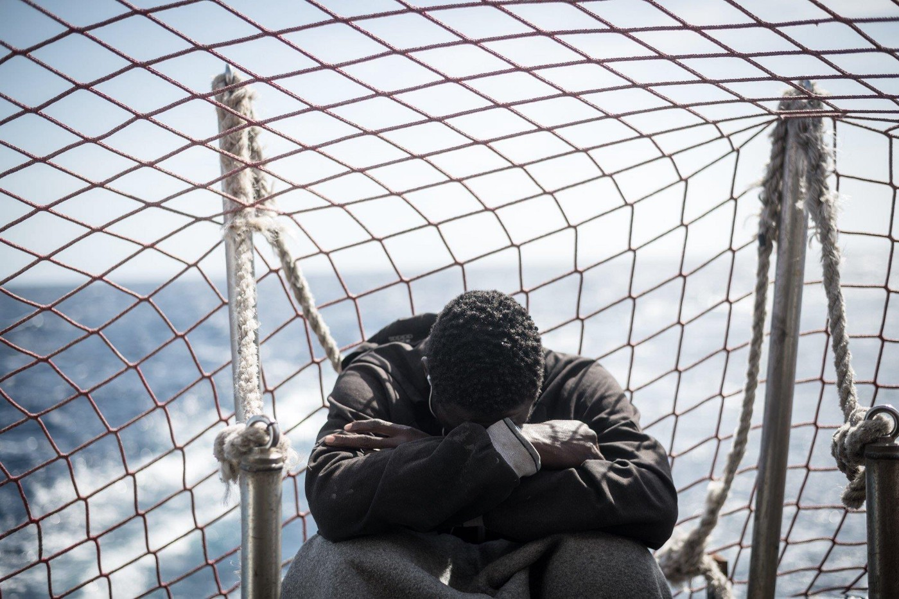
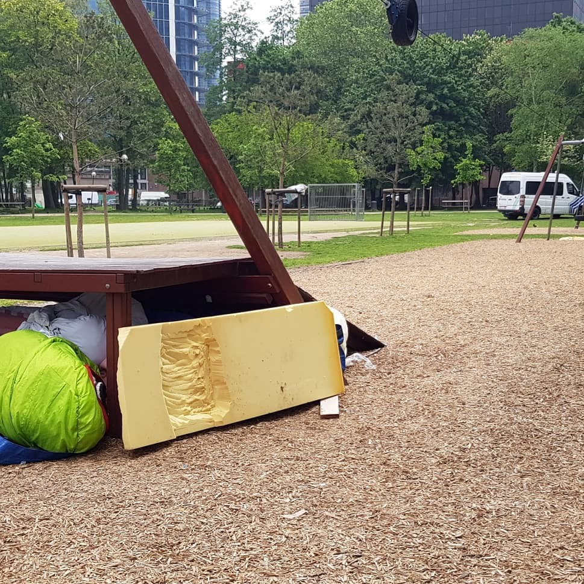
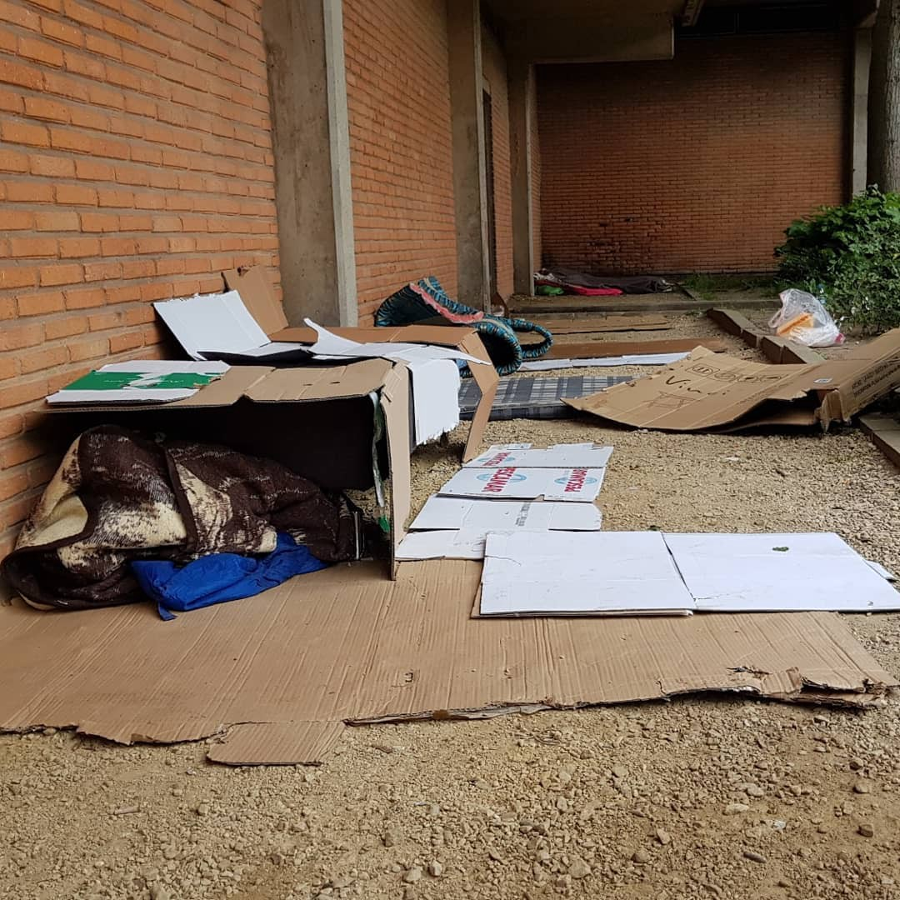
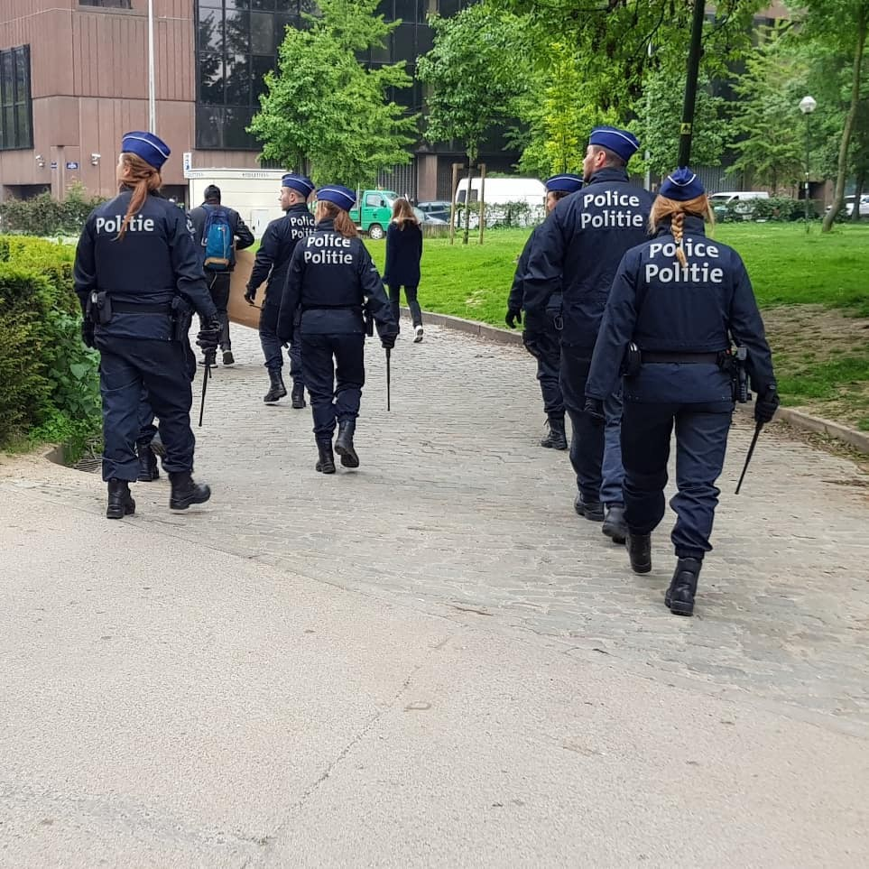
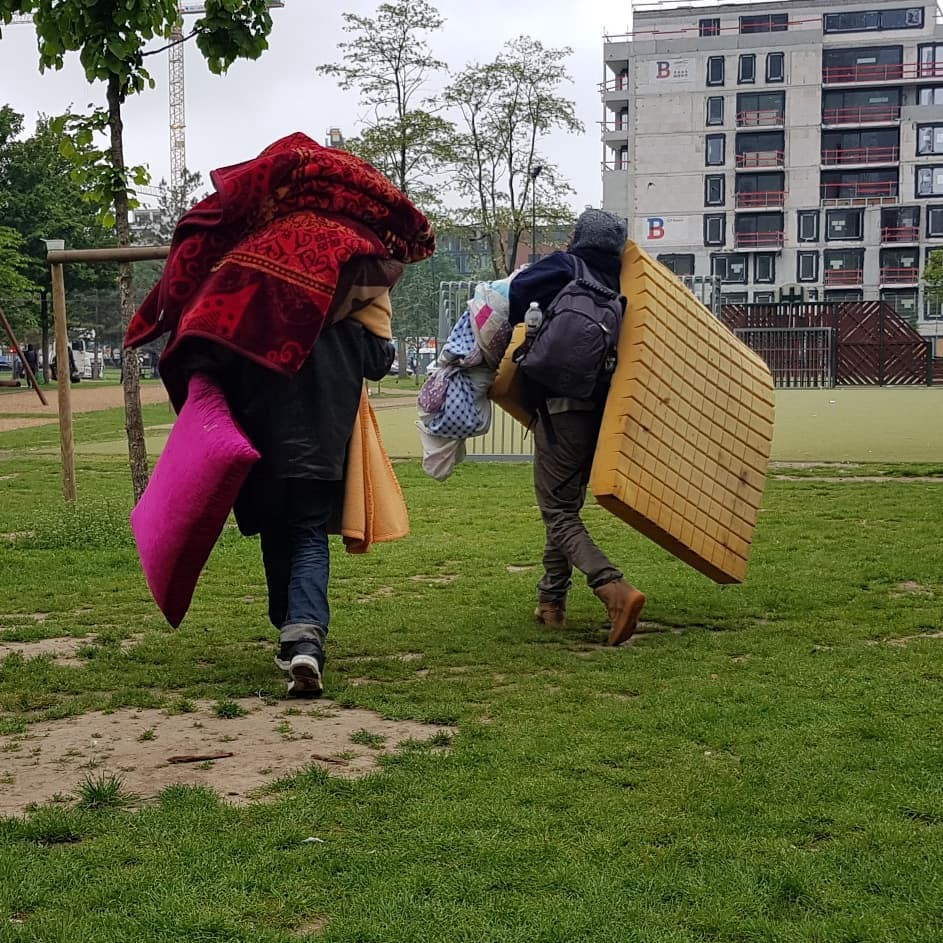
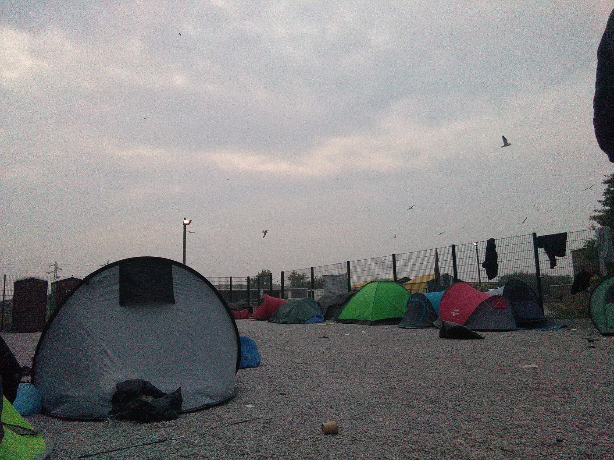
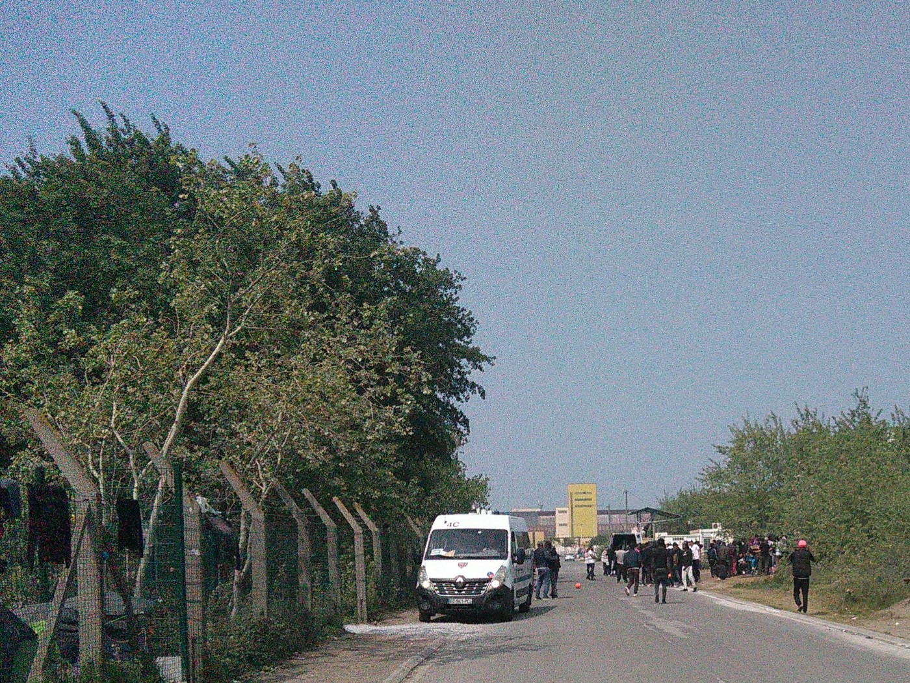

### AYS News Digest 18–19/5/19: Thanks to the political hypocrisy, 47 shipwrecked deprived of their rights
#### Malta: Tragic deaths as a consequence of indifference to political situation in Europe and dehumanisation of people // Finally, UNHCR sends out the letter everyone has been waiting for, now what? // Italy: prolonged investigation into Lampedusa case // Belgium: Police raid people sleeping in the parks // All the dangers of Calais under police pressure // & more info

Photo Credit: Nick Jaussi/Sea\-Watch
#### FEATURED
### Half\-solutions, late official reactions and a constant \(collective\) lack of political will

> Search and rescue operations aiming at saving lives at sea cannot represent a violation of national legislation on border control or irregular migration 

The UN has been doing some explaining and stating the obvious to the Italian government, as perhaps one of the last ‘big players’ in the line, demanding them to withdraw the directive by the Minister of Interior attempting to criminalize search and rescue at sea in the Central Mediterranean\.

Here is a clear and simple explanation \(read the whole thread\):

■■■■■■■■■■■■■■ 
> **[Matteo Villa](https://twitter.com/emmevilla) @ Twitter Says:** 

> > ⛔️🚢 So, @[UNHumanRights](https://twitter.com/UNHumanRights) wrote to the 🇮🇹 Italian government, asking it to *withdraw* a Directive by the Minister of Interior attempting to criminalize search and rescue at sea in the Central Mediterranean.

What’s all the fuss?

Let me tell you briefly. 1/n https://t.co/5UOqG1bZGW 

> **Tweeted at [2019-05-18 19:52:47](https://twitter.com/emmevilla/status/1129837254946500608).** 

■■■■■■■■■■■■■■ 

At the end of yet another fight to disembark people saved at sea on Sunday, the end of the day finally brought families on board the vessel to step onto safe and firm ground, in Italy\.

■■■■■■■■■■■■■■ 
> **[Sea-Watch Italy](https://twitter.com/SeaWatchItaly) @ Twitter Says:** 

> > La nostra missione umanitaria è finalmente compiuta.

Grazie al Comandante e a tutto l’equipaggio. https://t.co/lUS8Ymr5mn 

> **Tweeted at [2019-05-19 18:44:04](https://twitter.com/seawatchitaly/status/1130182348425838592).** 

■■■■■■■■■■■■■■ 

■■■■■■■■■■■■■■ 
> **[MSF Sea](https://twitter.com/MSF_Sea) @ Twitter Says:** 

> > #Italy has taken the families on board #SeaWatch 3 to safety. Yet 47 people remain behind, stuck at sea while #EU leaders debate who will take them.

European leaders must stop these ad-hoc disembarkation procedures &amp; bring all rescued people to the closest port of safety now! 

> **Tweeted at [2019-05-18 14:50:44](https://twitter.com/msf_sea/status/1129761240857886729).** 

■■■■■■■■■■■■■■ 

[Following concerns expressed](https://twitter.com/seawatch_intl/status/1129713104944848896) that those on board were at high risk of self\-harm, suicide and severe dehydration, this comes as a welcome relief\.

■■■■■■■■■■■■■■ 
> **[Sea-Watch International](https://twitter.com/seawatch_intl) @ Twitter Says:** 

> > Italian society, @[guardiacostiera](https://twitter.com/guardiacostiera) and NGOs hand in hand, to hold up human dignity and to safeguard the constitution! #DefendSolidarity #constitutionalObedience #openhearts  #openPorts https://t.co/e8nRmCPIbb 

> **Tweeted at [2019-05-19 21:32:29](https://twitter.com/seawatch_intl/status/1130224734384394241).** 

■■■■■■■■■■■■■■ 

One woman onboard Sea Watch, who travelled with her 1 year old baby talks of the conditions she faced in Libya, where she faced brutality and beatings\.

■■■■■■■■■■■■■■ 
> **[Sea-Watch International](https://twitter.com/seawatch_intl) @ Twitter Says:** 

> > Before the transfer, D. wanted to tell us about the atrocities of the prisons in #Libya, where she was captured several times with her husband and son of only 1 year.
The families were landed yesterday but on board of #SeaWatch3 47 shipwrecked remain deprived of their rights. https://t.co/HmlnYoh3JX 

> **Tweeted at [2019-05-18 09:11:16](https://twitter.com/seawatch_intl/status/1129675810854592512).** 

■■■■■■■■■■■■■■ 

A small crowd of people were there to greet them, and Sea Watch thanked those who continue to defend solidarity, expressing their relief that the constitution in Italy has the power to overturn the [violent anti\-migrant measures](ays-weekend-digest-11-12-2019-price-per-head-salvini-proposes-5-500-euro-fine-per-person-saved-6824c5e82443) Salvini has been responsible for introducing, which violate both basic rights and EU law\. However, you only have to look at the comments on many of Sea Watch’s tweets to see the hostile views too many people harbour\. It is not only Salvini who has made his position on search and rescue missions clear, with [Dutch politicians publicly stating](https://twitter.com/MSF_Sea/status/1130083003949101056?fbclid=IwAR2PLixF-rFV_Isc1urGVczWjFtRphTXfrTru7fEd-JtuhQ7J9Ekv_8foDo) their desire to see Sea Watch 3 and other NGO ships “disappear from the Mediterranean”\. It seems they also believe harsher measures should be in place for those involved in rescue missions, echoing the increasing criminalisation of solidarity work\. Statements such as this go to show the increasing anti\-migrant rhetoric in European politics and demonstrate the ideologies behind outsourcing the coast guard operations to unsafe third countries such as Turkey and Libya\.

Dunja Mijatović, the Commissioner for Human Rights, said it was troubling to see the increasing pressure and restrictions European countries were putting on the work of individuals and NGOs assisting migrants, asylum seekers and refugees\.

In the meantime, there have also been [reports](https://twitter.com/alzoubeidi/status/1130067196175163392?fbclid=IwAR3uimvMXkQVKNSzt5Qtr48nwkYwahLvim1YQx9aGlR_HYq3XT08h-XMLvI) that Salvamento Maritimo has rescued 8 people who were trying to cross to Spain from Morocco\.
### The worst consequences of bad policies and dehumanising people

Malta — Two Maltese soldiers who killed a man from Ivory Coast in cold blood were arrested, the Maltese Prime Minister confirmed\. According to the Maltese media, those responsible for the murder that happened in April were arrested on Friday and Saturday\. One of the alleged murderers admitted to targeting migrants “because they are black”\.

■■■■■■■■■■■■■■ 
> **[Government of Malta 🇲🇹](https://twitter.com/MaltaGov) @ Twitter Says:** 

> > 📝PRESS RELEASE: #Malta PM @[JosephMuscat_JM](https://twitter.com/JosephMuscat_JM) thanks @[MaltaPolice](https://twitter.com/MaltaPolice). Persons arrested do not represent ethos of @[Armed_Forces_MT](https://twitter.com/Armed_Forces_MT). Internal investigation ongoing to determine if arrested are rogue isolated actors or part of wider issue.  Investigation shows Malta is safe place for all https://t.co/v5ZNc2oxOl 

> **Tweeted at [2019-05-18 11:45:51](https://twitter.com/maltagov/status/1129714714680938496).** 

■■■■■■■■■■■■■■ 

The name of the man killed is Lassana Cissé\. He worked in a factory, was shot on a road by gunmen passing by car\. Two other people, a 27\-year\-old Guinean and a 28\-year\-old Gambian, were also wounded in the attack\.

However, it seems that these are no isolated incidents and some sources estimate that the two arrested military officers may have been involved in another attack on a road also targeting migrants, during which a teenager had been injured\.
These are the horrific consequences of ignoring extreme politics, dehumanising people and not setting up common life as a priority and main point of ‘integration’ policies\. Think about this when you go to vote next Sunday\.
#### LIBYA

Following the return of 61 people to the Tajoura detention centre in Tripoli on Friday, more [people have spoken](https://twitter.com/ReginaCatrambon/status/1130159292315787269?fbclid=IwAR23KdICfbU6Rc2x0MnTdwO5p4R9TD4wSpCfJL5dA63GrqLqBaHYMxiPyR8) out about the practise of returning people to the highly dangerous conditions in Libya, shaming the EU for their actions and asking for an immediate halt to the forced returns\.

Meanwhile, in the detention centres, atrocities continue to take place\. Reportedly, the [new military guards](https://twitter.com/sallyhayd/status/1129747907471728645) \(non UNHCR\) are entering people’s rooms as they sleep and disturbing any who have managed to find some rest\. These military guards have been using violence against those in the centres, hitting both women and minors, with one [minor reportedly](https://twitter.com/sallyhayd/status/1129771690458787843) losing his teeth after being beaten with metal sticks\.

On top of this, those trapped in the detention centres continue to face near starvation as they are denied food and water for days on end\. [Multiple sources report](https://twitter.com/sallyhayd/status/1129874167489290241) that people in Zintan detention centre have been without food or water for at least two days despite at least 20 people dying from starvation and TB in the last 6 months\. A video has been shared showing many people gathered in protest at this treatment\.

[Another source](https://twitter.com/saracreta/status/1129740098168328192?fbclid=IwAR2fWIOPyu3-pHV4NxKCaUGCXaRL_pyEafl-8a-LWVU3_xbY4jrB6dJmM0g) talks of the deplorable conditions in another Libyan detention centre in Daher Al Jabel, where 600 people continue to be detained in unsafe conditions, with many deaths registered and huge neglect of medical care and basic needs\.

](assets/a2081bb52e19/1*crzeZI2oNLRwL8cwCkMK2A.jpeg)

Photo by [Sara Creta](https://twitter.com/saracreta)

Further to this, a [tweet](https://twitter.com/sallyhayd/status/1129871327358324737) by Sally Hayden exposes that the 100\+ people who were returned to Libya by the EU funded Libyan coast guard last week and transferred to Tajoura detention centre have also been denied food or water for days\. Others [returned by the coast guard](https://twitter.com/rgowans/status/1127521692769824768?s=21) to Zawiya detention centre have [reportedly been locked up](https://twitter.com/sallyhayd/status/1129879904902950913) and beaten or tortured, with one person saying they heard “screaming voices” of people, who they believe to be being tortured by traffickers who will be demanding money for their safety\.

■■■■■■■■■■■■■■ 
> **[Sally Hayden](https://twitter.com/sallyhayd) @ Twitter Says:** 

> > Information from a source in Zawiya dc about what he says is happening to another group brought back to Libya by the coastguard last weekend, after trying to reach Europe, &amp; locked up there instead. “I hear screaming voices.” [twitter.com/rgowans/status…](https://twitter.com/rgowans/status/1127521692769824768?s=21) https://t.co/9o1J0Ie1zy 

> **Tweeted at [2019-05-18 22:42:16](https://twitter.com/sallyhayd/status/1129879904902950913).** 

■■■■■■■■■■■■■■ 

This comes following [an image that was circulated](https://twitter.com/sallyhayd/status/1129744110989058049) on Friday, which depicts a shot from a video which seems to show a woman being tortured, while she begged for $13,000 to save herself from the violence\. [Sally Hayden reported](https://twitter.com/sallyhayd/status/1093087737262026752) some time ago that the practise of using Facebook to raise ransoms is becoming increasingly commonplace\.

More documented testimonies from within the worst type of result of the EU alliances and political decisions arrive each day\.

■■■■■■■■■■■■■■ 
> **[Sally Hayden](https://twitter.com/sallyhayd) @ Twitter Says:** 

> > A man from Darfur, Sudan, who is currently in Tajoura detention centre, east Tripoli, has asked me to share the following statement. #libya https://t.co/3caWhXSHLu 

> **Tweeted at [2019-05-19 20:30:47](https://twitter.com/sallyhayd/status/1130209206399844354).** 

■■■■■■■■■■■■■■ 

#### GREECE

[Local media reports](http://www.ekathimerini.com/240636/article/ekathimerini/news/more-than-70-migrant-hostages-rescued-in-northern-greece?fbclid=IwAR3oLR0Mvqb7_-thuk8wlLEnrPKGMwxOII8i30-mcSDYXIzAtg7aOQ1X8lc) that Greek police have intercepted 74 people who were being held hostage in Thessaloniki in Northern Greece\. The people were seemingly held hostage by a group of four men, who are suspected to be traffickers, who were asking for money from their families for their release\. Following the raid, the four were charged with kidnapping and blackmail\. This case echoes common practices in Libya, where people are routinely held to ransom by traffickers, and highlights the need to allow people safe passage, where they would not be placed into the hands of such dangers\.

[Mare Liberum](https://twitter.com/teammareliberum/status/1129782126524719104?fbclid=IwAR3cwET-fVksDrBdntTaEpNaQtLt1ECfVL2bYwMuaUCYK_-TqOtBqmFMzU0) reports that the ship has left the port to return to sea to continue search and rescue missions\.

The situation in Greece continues to remain critical, with thousands on the streets in Athens and in squats in the city, and many more thousands trapped in inhumane camps across the mainland and the island\. Pampiraiki Support Initiative for Refugees & Migrants, who have been running a warehouse in a disused Olympic stadium since 2016, have tirelessly supplied squats, camps and those working with people on the streets with essential supplies including both food and non\-food items\. However, they face a shortage in donations and funds currently, and have appealed for contributions to ensure they can continue their distribution of staple foods\.

> They urgently need funds to buy these basic food supplies\. Please see their [Paypal](https://www.paypal.me/Pampiraiki?fbclid=IwAR33IsdRILDmWvJFHVSwYTVILAtEpnAdmk10wA-fd0lfTzp2wlYvKRNB22E) to donate — any amount, large or small welcome\. 

[Our House in Athens](https://www.facebook.com/groups/ROYartsaveslives/permalink/2210750409014615/) , who provide much needed daily hot food to homeless people in the city, will no longer continue to offer food distribution in Victoria Square, as they say other groups are now present in this location\. They will instead continue to offer food in other places to ensure they always reach the most vulnerable\. We will update on the locations when we hear more\.
#### ITALY
### Investigation of Lampedusa centre continues

Prolonged detention, ill\-treatment, abuse and not respecting the law and rights of children and unaccompanied minors, those are some of the accusations directed at those running and making decisions at the reception centre in Lampedusa\. The magistrate in Rome asked not to close the inquiry into the Sicilian reception centre, that stemmed from the investigation and detailed materials collected by Terre des Hommes and, among others, by lawyers of A buon diritto\.

Although the first investigations date back to 2011, according to the investigating judge of Rome, all of this “appears to be continuing today”\. A year ago a more complete investigation was ordered as the failure to hear the Ombudsman was just one of the elements lacking in the investigation into the running of the centre\. In the meantime, as [media](https://www.avvenire.it/attualita/pagine/violazioni-e-abusi-nel-centro-di-lampedusa?fbclid=IwAR0f_8uXt7utUOOXp4LIoaadU0iS0zFXuKy6MRqNugpeznmxdOX-HF8yiVQ) report, “a series of alleged abuses of the law and criminally relevant abuses are reported\.”

](assets/a2081bb52e19/1*MZ88HVbihg2p9CbrF2LLEA.png)

One of the most common preconceptions is that Europe cannot accommodate or properly integrate more people into their society\. Statistics and data claim otherwise\. Source: I [nternazionale](https://buff.ly/2H2Ce30)
#### BELGIUM

[Plateforme citoyenne de soutien aux réfugiés Bruxelles](https://www.facebook.com/bxlrefugees/?tn-str=k%2AF&hc_location=group_dialog) reports that, ahead of the upcoming elections, police are chasing people sleeping rough out of Brussels’ city parks:

#### FRANCE
### Calais

Over 700 people are staying in the area, divided between five main campsites\. Reportedly, many among them are minors\. This is how the place looks at the moment, and here are some images with descriptions by one of the volunteers on the ground:

](assets/a2081bb52e19/1*2YjDQj9K6hg41nXlDfV-IA.jpeg)

Photos: [Chiara Lauvergnac](https://www.facebook.com/chiara.lauvergnac?__tn__=%2Cd%2AF%2AF-R&eid=ARCKzQr6WEzk2AZ8ppvqnOtoVplBSOzFFgm9sYV7VWnONZTBPjPzX6gFJF6uTN6axpBCfkuc73n_7NCU&tn-str=%2AF)

Ex\-Verrotieres\. The camp that was evicted and destroyed by police near rue Verrotieres has formed again near the food distribution place\. 300 people or more, of all nationalities\. This is the biggest of 5 main camps and the one that is more at risk of destruction by police\.

](assets/a2081bb52e19/1*uknTjNrTnjMT0KCG59o9Xw.jpeg)

Photos: [Chiara Lauvergnac](https://www.facebook.com/chiara.lauvergnac?__tn__=%2Cd%2AF%2AF-R&eid=ARCKzQr6WEzk2AZ8ppvqnOtoVplBSOzFFgm9sYV7VWnONZTBPjPzX6gFJF6uTN6axpBCfkuc73n_7NCU&tn-str=%2AF)

During the distribution of trousers near the food distribution place there is a heavy police presence\.

](assets/a2081bb52e19/1*vQnhm85uRlM8JKwfnfvyGQ.jpeg)

Photos: [Chiara Lauvergnac](https://www.facebook.com/chiara.lauvergnac?__tn__=%2Cd%2AF%2AF-R&eid=ARCKzQr6WEzk2AZ8ppvqnOtoVplBSOzFFgm9sYV7VWnONZTBPjPzX6gFJF6uTN6axpBCfkuc73n_7NCU&tn-str=%2AF)

At night this is **the only water tap,** and these are the only toilets for hundreds of people\. From here hundreds of people drink, wash their hands, their bodies and their clothes\. Unsurprisingly, diarrhoea is rife\. HAND SANITIZER NEEDED; In other camps the water and sanitation is even worse, e\.g totally absent\. Police destroy jerrycans migrants use to collect and store water\.

](assets/a2081bb52e19/1*Pse-Kgb43AE7-FeiPKmM1A.jpeg)

Photos: [Chiara Lauvergnac](https://www.facebook.com/chiara.lauvergnac?__tn__=%2Cd%2AF%2AF-R&eid=ARCKzQr6WEzk2AZ8ppvqnOtoVplBSOzFFgm9sYV7VWnONZTBPjPzX6gFJF6uTN6axpBCfkuc73n_7NCU&tn-str=%2AF)

Some tents burned during a fight between Afghans and Iranians\. Many Afghans left afterwards, or were told to leave\. A few Afghans who had nothing to do with it are still in the camp, most are gone near the hospital, or to Marck\.

> A lot of police violence including truncheons, broken bones, pepper spray, gas grenades and rubber bullets, destruction of tents, and personal belongings \(daily\) \. 

#### AYS and the Daily News Digest — want to get involved?

**We strive to echo correct news from the ground through collaboration and fairness\. Every effort has been made to credit organizations and individuals with regard to the supply of information, video, and photo material \(in cases where the source wanted to be accredited\) \. Please notify us regarding corrections\.**

**Apart from daily news in English, we also publish weekly summaries in [Arabic](%D8%A7%D9%84%D8%AA%D8%BA%D9%8A%D9%8A%D8%B1%D8%A7%D8%AA-%D9%81%D9%8A-%D9%82%D8%A7%D9%86%D9%88%D9%86-%D8%A7%D9%84%D9%84%D8%AC%D9%88%D8%A1-%D9%81%D9%8A-%D8%A7%D9%84%D8%AF%D9%86%D9%85%D8%A7%D8%B1%D9%83-b99e429d54ad) and [Persian](%D8%B9%D9%88%D8%B6-%D8%B4%D8%AF%D9%86-%D9%82%D9%88%D8%A7%D9%86%DB%8C%D9%86-%D9%BE%D9%86%D8%A7%D9%87%D9%86%D8%AF%DA%AF%DB%8C-%D8%AF%D8%B1-%D8%AF%D8%A7%D9%86%D9%85%D8%A7%D8%B1%DA%A9-7b984cac7a86) \. Follow the links to read and share the ones from the week of May 6th to 12th\. Find specials in both languages on our medium site\.**

**If there’s anything you want to share or comment, contact us through Facebook, Twitter or write to: areyousyrious@gmail\.com\.**

**We’re open to expanding our team of volunteer researchers, editors, and info gatherers\.**

_Converted [Medium Post](https://medium.com/are-you-syrious/ays-news-digest-18-19-5-19-thanks-to-the-political-hypocrisy-47-shipwrecked-deprived-of-their-a2081bb52e19) by [ZMediumToMarkdown](https://github.com/ZhgChgLi/ZMediumToMarkdown)._
