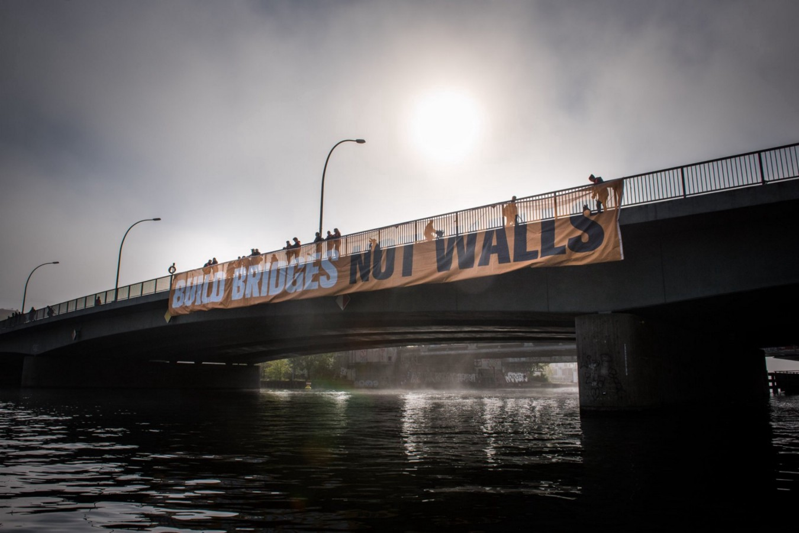
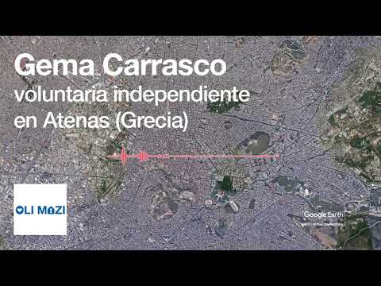

### خبرهایی از مسیر بالکان و تغییراتی در پروسه پناهندگی در اروپا
#### 19\-AYS Weekly News Summary in Persian, May 13

### **دریا**

امروزه سازمان دیده‌بان دریایی ۶۵ نفر را از آب‌های مدیترانه نجات داده‌است \. گروه نجات دریایی بلافاصله به ایتالیا ، مالت ، لیبی و هلند در مورد عملیات نجات اطلاع داد ، اما یک بندر امن برای ورود توسط وزیر کشور ایتالیا ، سالویینی را رد کرد \. سالویینی در توئیتر نوشت : “ بنادر ما در حال بسته شدن به قایق نجات کارگران هستند \. “ گروه نجات هنوز در تلاش برای مذاکره با یک بندر برای لنگر اندانختن یک کشتی است ، اما با گذشت زمان ، روزهای بیشتری می‌گذرد در حالی که این گروه می‌تواند جان انسان‌ها را در این منطقه سار حفظ کند \.

### **صربستان**

به روز رسانی اطلاعات از تیم ن\.ن\.ک در شهر سیید

تیم ن\.ن\.ک که در امتداد مرز صربستان کار می‌کند ، وضعیت پناهندگان در این منطقه را به روز رسانی کرده است\.

### **بوسنی و هرزگوین**

شرایط در مراکز بیهاچ \( بیرا \) , سازین \( سدرا \) و کلادوشا \( میرال \) هنوز هم بد هستند و بسیاری از افرادی که از ماندن در آنجاو ازشان خودداری می‌کنند و یا دسترسی به راه‌حل‌های خطرناک اقامت در ساختمان‌های نا امن و ناتمام را رد می‌کنند \. به تازگی مردی از یک ساختمان به زمین افتاد و جان خود را از دست داد , [در حالی که ۳ نفر دیگر پس از آتش‌سوزی در جایی که چمباتمه زده بودند خفه شدند](http://www.rtvusk.ba/vijest/bihac-otkriveno-sta-je-uzrok-smrti-pronadenih-migranata/29972?fbclid=IwAR2Xw7y2yV3SfF-8p5A-PNpqrYFv6hR39TxBGCdeO-krcEjKsEc0l6BSEFo) \. لطفا ً سعی کنید با افراد محلی یا مردمی که به آن‌ها کمک می‌کنند،کمک بگیرید برای جاهای ناامن , چه راه‌هایی هستند و چگونه می‌توانید به آن‌ها کمک کنید تا امن ‌ترین راه را پیدا کنند \.
### **کرواسی**
#### هشدار

به دلیل سیلاب‌های اخیر , زمین در مناطق مرزی بسیار ناامن است , رودخانه‌ها بسیار وسیع‌تر و عمیق‌تر از معمول هستند و این، مسیر را خطرناک‌تر می‌سازد \. لطفا ً اگر مطمئن نیستید که می‌توانید بروید، به مناطق ناشناخته سفر نکنید \.
#### مشاوره

همچنین , تحولات اخیر در خانه‌های مردم در منطقه مایلی و کرسکی کتار , توجه منفی زیادی را در مردم کرواسی به خود جلب کرده و ممکن است منجر به ترس مردم محلی از مهاجران شود \( به دلیل آنچه در روزنامه‌ها درباره آن گزارش‌شده \) و بیشتر پلیس در منطقه \. ما همه را تشویق می‌کنیم تا از اقدامات خشن بر روی اموال و خانه‌های مردم جلوگیری کنیم , زیرا افراد با ما تماس می‌گیرند تا بپرسند که چرا مردم از این مسیر عبور می‌کنند و از طریق خانه‌هایی که این شرایط می‌تواند تغییر کند و شرایط سخت‌تر شود \.
#### در مرز

](assets/6ebea1c73206/1*-0hzmrH69crQkv3m8qAT0w.jpeg)

[الفريق المتنقل لمعلومات اللاجئين](https://www.facebook.com/mobileinfoteam/?tn-str=k%2AF)

عقب‌نشینی دسته‌جمعی در مرز کرواسی هنوز هم اتفاق می‌افتد و اگرچه به طور کامل غیر قانونی است , پلیس اجازه درخواست پناهندگی در کرواسی را نمی‌دهد \. ما در حال جمع‌آوری داده‌ها و شهادت افرادی هستیم که یا از سوی پلیس یا کسانی که از کرواسی اخراج شده‌اند به بوسنی و هرزگوین منتقل شده‌اند \. لطفا , اگر شما یا هر کسی که این را می‌دانید , با ما تماس بگیرید تا بتوانیم از اطلاعات برای اثبات آن استفاده کنیم و با آن در کرواسی مبارزه کنیم تا این رفتار متوقف شود \. ما اطلاعات شخصی همه را حفظ می‌کنیم و از شما متشکرم اگر تصمیم بگیرید که کمک کنید \.

هر کسی که قصد دارد به دنبال پناهندگی باشد و در قلمرو کرواسی است باید سندی داد که گزینه‌ها و مراحل را توضیح دهد و باید در یکی از مراکز پذیرایی بیانیه‌ای صادر کند \. شما می‌توانید برای اطلاعات بیشتر و کمک‌های قانونی با مرکز حقوق کرواسی تماس بگیرید \. در اینجا اطلاعات بیشتری وجود دارد :

### **اتریش**
#### بازگشایی پرونده‌های پناهندگی پس از شکست تخصصی در افغانستان

تعدادی از موارد پناهندگی رد شده در اتریش بعد از “ [تخصصی مجرد](https://www.kleinezeitung.at/politik/5628209/Fluechtlinge-aus-Afghanistan_Asylantraege-muessen-neu-aufgerollt?fbclid=IwAR3R6few_XEumSL-qdjHrHsLo_0b0J9a0ZgxVVLGk_9tlY8YwztffLKav94) “ در افغانستان , سوریه و عراق بازگشایی شده‌اند که از وضعیت خود محروم شده‌است \. کارل ازوز یک مرد تجاری است که سال‌ها در افغانستان زندگی می‌کند و براساس این تجربه , توسط دولت اتریش یک کارشناس در کشور است \. تصویر خوش بینانه او از زندگی در افغانستان منجر به اخذ پناهندگی منفی بسیاری از پناهندگان افغانی در اتریش شد \. وضعیت او به عنوان یک متخصص اخیرا ً پس از اینکه تعدادی از محققان یافته‌های خود را به چالش کشیدند , لغو شد
### **آلمان**

سی هوفر , وزیر داخله فدرال , گفت : “ پناهندگان از سوریه دیگر نباید نگران باشند که اداره فدرال مهاجرت و پناهندگان درخواست‌های پناهندگی خود را متفاوت از قبل تعیین خواهند کرد\. چند هفته است که تغییر روش تصمیم‌گیری مورد بحث و بررسی قرار گرفته‌است \. تصمیمات معلق به دنبال این تصمیم متوقف شدند \.
### **ایتالیا**
#### مقامات کمپ کاریتاس و ایتالیایی اقدام به استفاده از اجاق‌گاز کردند و آن‌ها را مسئول غذا دانستند

کاریتاس و مقامات ایتالیایی در کمپ، سن فردیناندو وارد چادر شدند \( که رسمی اعلام شده‌است و نه اردوگاه موقتی \) ، در تلاشی برای بیرون بردن تمامیه گاز که مردم برای طبخ غذا استفاده می‌کنند \. قوطی‌های گاز قبلا ً علت آتش‌سوزی مرگبار در اردوگاه موقتی بودند \.

با این حال ، این انگیزه اصلی برای این اقدام نبود \. آن‌ها این کار را به دلیل نگرانی در مورد آتش‌سوزی بالقوه انجام ندادند ، بلکه به این دلیل که آن‌ها توانستند یک سرویس م\.نسا برای افرادی که در اردوگاه زندگی می‌کنند ایجاد کنند ، در هزینه 1/1\.50 برای هر فرد در هر وعده غذایی موفق شدند \. این به این معنی است که مردم باید برای غذای خود پول پرداخت کنند \. افرادی که در اردوگاه سان زندگی می‌کنند ، کم‌تر از ۲۰ روز در روز درآمد دارند، و برای دو برابر زمان مجاز از سوی قانون ، بدون هیچ گونه قرارداد یا بیمه مورد استفاده قرار می‌گیرند \. و اکنون او سعی دارد از آن‌ها برای چند دلار دیگر نیز استفاده کند \.
### **فرانسه**

بخشی از یک بازداشتگاه در اعتراض به اخراج قریب‌الوقوع یک مراکشی ۱۸ ساله به آتش کشیده شد \. در مورد این بازداشت انتقاد شده‌است \. این سه نفر که در این آتش‌سوزی به آتش کشیده شده‌بودند ، بلافاصله به دو سال زندان محکوم شدند \.

تیم اتوبوس اطلاعات پناهندگان به دنبال تلفن‌های همراه قابل‌استفاده برای دادن به پناهندگان در فرانسه است که نومیدانه نیاز به تماس با خانواده و عزیزان خود دارند\. اگر یک تلفن دارید که می‌خواهید اهدا کنید ، لطفا ً با این گروه در اینجا تماس [بگیرید](https://www.facebook.com/RefugeeInfoBus/posts/2392633410972073?hc_location=ufi) \.
### **کلی**

دیوان اروپایی حقوق پناهندگان را نمی‌ توان به طور خودکار به جرم جنایت از کشور اخراج کرد \.

پناهندگان در صورتی که در کشورهای زادگاهشان با خطر جدی مواجه شوند ، نمی‌توانند از طریق رویه‌های خودکار اخراج شوند \. براساس گزارش دادگاه ، ممکن است مردم هنوز با از دست دادن وضعیت پناهندگان رسمی خود در صورت مجرم شناخته شدن در جرایم جدی مواجه شوند ، اما ممکن است از کشور اخراج نشوند \.

](assets/6ebea1c73206/1*zUIIWLkXnJgSTHGE9bS_Jw.jpeg)

[الفريق المتنقل لمعلومات اللاجئين](https://www.facebook.com/mobileinfoteam/?__xts__%5B0%5D=68.ARCsL2Dr2_jqWdDYLBuWz5iUDwUqcj6drGtPVMO2XxeOsbun3BSkx5M0fhH2US09b_lo7Gjbotx_ivJYwcqJDVGriKyxhgEliORWmLLC_VPGTm4MrdGcXAPTqSHcK3Uj6BaIRQ6lH09aRzEVdKRYNjaDdw7vGgRyha8n4KDDeNJTfrAVbf87nF1nS8u48IzqPIgEofKsF3SLok1gKxVi-HHIMhWAl9dkvWtOa5MPTdXz0pkAUcHNhFmPFMypaeYCz0XQCrp8FN4qIQB4pNkKpqRiHzl8NbppomLIkNGSbywNUDpHgAR4ZFq-LGZSpU4SjzaY9BO3JE8YsIcVdRBk5ZiYgJ0n&__tn__=k%2AF&tn-str=k%2AF)

در طول این هفته انتخاباتِ پارلمانِ اروپا به وقوع خواهد پیوست\.در اعتراض به گروه های ملی گرا و نژاد پرست ۱۵۰ هزار نفر در ۵۰ شهر اروپا تظاهرات مسالمت آمیزی را در روز یکشنبه گذشته ترتیب دادند\. علاوه بر مطالباتِ دیگر، یک اروپای مهمان نواز تر برای مهاجرین و پناهندگان را طلب کردند\. اینکه بجای مستحکم‌تر کردن مرزهای اروپا، مسیرهای فرار امن و پروسه پناهندگی عادلانه‌تر تضمین شود\. تظاهرکنندگان پیامی برای تمام شهروندان اروپایی فرستادند با این مضمون که در انتخابات اروپا بر علیه ملی گرایی و نژادپرستی و به نفعِ یک اروپای دموکراتیک، صلح جو و متحد رای دهند\. تظاهرات‌کنندگان پلاکاردهایی را حمل می‌کردند که بر روی آن نوشته شده بود ’برای یک اروپایِ بدون حصار‘ یا ’قلبم برای تنوع نژادی می تپد‘\.

**اخبار بیشتری به انگلیسی در صفحه رسانه ما در دسترس است \. در مواردی که شما سوالاتی دارید و یا مایلید برخی اطلاعات مربوط به روند پناهندگی شما یا کشور مورد نظر را منتشر کنید , لطفا ً برای نوشتن پیغام روی فیس بوک یا نوشتن یک ایمیل به آر\.یو\.س تردید نکنید**

[**areyousyrious@gmail\.com**](mailto:areyousyrious@gmail.com)

_Converted [Medium Post](https://medium.com/are-you-syrious/%D8%AE%D8%A8%D8%B1%D9%87%D8%A7%DB%8C%DB%8C-%D8%A7%D8%B2-%D9%85%D8%B3%DB%8C%D8%B1-%D8%A8%D8%A7%D9%84%DA%A9%D8%A7%D9%86-%D9%88-%D8%AA%D8%BA%DB%8C%DB%8C%D8%B1%D8%A7%D8%AA%DB%8C-%D8%AF%D8%B1-%D9%BE%D8%B1%D9%88%D8%B3%D9%87-%D9%BE%D9%86%D8%A7%D9%87%D9%86%D8%AF%DA%AF%DB%8C-%D8%AF%D8%B1-%D8%A7%D8%B1%D9%88%D9%BE%D8%A7-6ebea1c73206) by [ZMediumToMarkdown](https://github.com/ZhgChgLi/ZMediumToMarkdown)._
