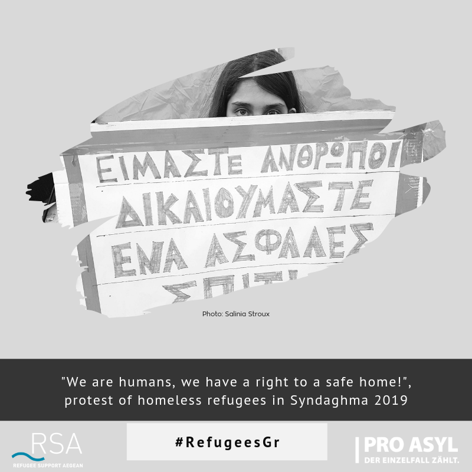

### AYS Daily Digest 23/05/2019 — After 3 years reception in Greece is still an emergency

EU keeps standing by while people are pushed back to Libya in the Central Med /// Samos: the forgotten frontline /// Italian court expose Salvini’s fake news once more /// Facebook hides video on police brutality in Paris /// Updates from Syria /// Open letter to British PM to speed up children safe passage /// more…

#### Feature: After 3 years, reception in Greece is still an emergency

[Refugee Support Aegean \(RSA\) researchers conducted interviews with individual refugees and families living in five refugee camps in Northern and Central Greece \(Central Macedonia, Epirus and Thessaly\)](https://rsaegean.org/en/reception-crisis-in-northern-greece-three-years-of-emergency-solutions/#2-4_vulnerable) \.

> Three years after the implementation of the EU\-Turkey ‘Deal’ and despite the reality of ongoing arrivals of refugees, the Greek government has not been able so far to create a functioning reception system\. Short\-term emergency solutions are being implemented until today\. Any increase of arrivals is viewed as “unexpected\.”

RSA state that “the Greek government never managed to move on from an emergency reception approach” to long\-term solutions or even just mid\-term ones\. As a consequence of the practice of using data and forecasts for electoral campaigning, “the numbers of refugees in need of shelter exceed those anticipated by Greek authorities for a third year in row\. As a result, refugee camps in the mainland became once more overcrowded while substandard reception conditions have a detrimental impact upon the physical and mental health of their residents”\.

> Camps that have ceased to operate in 2017 because of conditions re\-opened their gates in spring 2018\. Tents are being set up in the camps and then dismantled depending on the needs, and hotels are rented as short\-term shelters during the winter without seemingly any plan for what comes next\. Until today only three out of the 28 camps operating in the mainland have the required legal basis\. 

The lack of prospects and independence, the substandard conditions, and the risk of eviction and unequal opportunities have fueled fights and protests, underlining the, “need for a functioning reception system for recognized refugees and asylum\-seekers with the objective of finding dignified long\-term solutions that will allow also their integration in local societies\.”

Many of the people interviewed by RSA spoke of feelings of abandonment, giving a bleak picture of their life in the camps\.

■■■■■■■■■■■■■■ 
> **[RSA](https://twitter.com/rspaegean) @ Twitter Says:** 

> > In May 2019, residents stayed in prefabs, UNHCR tents, a hand full of summer tents and two buildings. Some were housed informally in empty office prefabs without any provisions. #DiavataCamp #RefugeesGR
Read more here:
[rsaegean.org/en/diavata-cam…](https://rsaegean.org/en/diavata-camp/#Suleiman) https://t.co/mP3KwXLq6R 

> **Tweeted at [2019-05-23 11:53:52](https://twitter.com/rspaegean/status/1131528668797460480).** 

■■■■■■■■■■■■■■ 

> They spoke of overcrowding and unequal housing options resulting in tensions among the refugee population in the camps and frequent fights\. They described how the remoteness of the camps and the decrease in services and gradual withdrawal of the UNHCR and NGOs had worsened their situation\. They reported increasing difficulties in accessing primary health care after the take\-over of health care services in camps by the National Organization for Public Health \(EODY\) \. Protests linked to conditions have frequently taken place particularly in [Diavata](https://rsaegean.org/en/reception-crisis-in-northern-greece-three-years-of-emergency-solutions/#post-5180-endnote-17) , [Filippiada](https://rsaegean.org/en/reception-crisis-in-northern-greece-three-years-of-emergency-solutions/#post-5180-endnote-18) and [Koutsochero](https://rsaegean.org/en/reception-crisis-in-northern-greece-three-years-of-emergency-solutions/#post-5180-endnote-19) camps\. 

Read the full research [HERE](https://rsaegean.org/en/reception-crisis-in-northern-greece-three-years-of-emergency-solutions/#2-4_vulnerable)

SYRIA
#### Updates on the situation in Idlib and Hama

Syria Civil Defence report the criminal attacks of the regime military forces and of the Russian army in the areas surrounding Idlib and Hama\. [At least 8 people died on Thursday in Idlib](https://www.facebook.com/SyriaCivilDef/photos/a.1712251465765921/2354648421526219/?type=3&theater) , and [fires are burning hundreds of acres](https://www.facebook.com/SyriaCivilDef/?__tn__=%2CdkCH-R-R&eid=ARCV2Th7cjypz7atZ7ygG42FiEBwLUnNF4T5dFv5kmXG85KndxZKIO_ttAC7MnlzllZ-3rcYo4_cWxzd&hc_ref=ARS6-pd4r9MDDdSUCcL9R6tmDqLyaM7wnk2tFCBrK6045ZR-yIriN0pFly0iPmfufzQ&fref=nf&hc_location=group) of farming land and woods as a consequence of the bombings\.

SEA
#### People risk death and are returned to Libya while Europe watches

During the last two days more than 300 people left Libya on at least 5 dinghies\. IOM report that [285](https://twitter.com/IOM_Libya/status/1131548412837548040) were intercepted by the Libyan Coast Guard and returned in the country, where they will be [immediately detained](https://twitter.com/IOM_Libya/status/1131646054984802306) \.

Sea Watch, Moonbird and AlarmPhone witnessed teh developments:

■■■■■■■■■■■■■■ 
> **[Sea-Watch International](https://twitter.com/seawatch_intl) @ Twitter Says:** 

> > Today #Moonbird witnessed #EU sanctioned & #HumanRights-violating interceptions of 2 boats by the so-called #Libya|n Coast Guard. There are possibly more unattended distress cases. Rescue capacity needed immediately! #SafePassage https://t.co/MmILy6xoF1 

> **Tweeted at [2019-05-23 13:07:52](https://twitter.com/seawatch_intl/status/1131547291393957888).** 

■■■■■■■■■■■■■■ 

Sea Watch [report](https://twitter.com/SeaWatchItaly/status/1131559508961058817?s=19&fbclid=IwAR2v-UnqPb-hrqkcwu_jZ9N363Ck8RwIgxHepQeHKKrFk8pfNbNrfjpjJCo) that an Italian military vessel refused to take action to rescue people risking to drown and hanging on to a deflating rubber dinghy\.

We’ll update when there will be more precise news\.

O [ne boat reached Lampedusa in Italy](https://twitter.com/RescueMed/status/1131795992267972608?s=19&fbclid=IwAR0IBCX4Mp8E1Vg8yYfKepyQKlZctbCdNuPGvvpStbQ0dAHzsa-vX2xENG0) \.

GREECE
#### ARRIVALS

Arrivals on the Greek islands have not made the headlines for a long while, but the lack of attention by mainstream media does not mean that people have stopped trying to cross the Aegean Sea or that numbers are decreasing\. [Aegaean Boat Report have summarized the attempts to cross and the arrivals on the Greek eastern islands of the last weeks](https://www.facebook.com/AegeanBoatReport/posts/579339682589140?hc_location=ufi) :

> So far this month 159 boats have started their trip towards the Greek Aegean Islands, 4885 people\. 57 boats, 1747 people arrived in Greece, 102 boats, 3138 people have been stopped by TCG/Police\. 

> 10 boats arrived on Lesvos, 311 people\. 
 

> 11 boats arrived on Chios, 329 people\.
 

> 12 boats arrived on Samos, 482 people\.
 

> 10 boats arrived on Kos, 234 people\.
 

> 4 boats arrived on Leros, 152 people\.
 

> 10 boats arrived on other islands, 239 people\. 

> Of the 102 boats stopped so far this month:
 

> 13 boats had destination Lesvos\.
 

> 25 boats had destination Chios\.
 

> 29 boats had destination Samos\.
 

> 18 boats had destination Kos\.
 

> 17 boats had destination Farmakonisi/Agathonisi\. 

[On Thursday 49 people landed on Lesvos](https://www.facebook.com/AegeanBoatReport/posts/579005249289250?hc_location=ufi) \.
#### Samos: forgotten frontline

#### Support and donations needed in Athens

[Harash Hampay](https://www.facebook.com/groups/446386565554391/permalink/1085992231593818/?hc_location=ufi) is asking for support and donation for a newborn soon to be made homeless in Athens\.

> A young woman alone has just given birth to a healthy baby in an Athens hospital two days ago\. Tomorrow she will be discharged\. Her new home is to be the streets\. 

> Welcome to Europe\. 

> Can we help her? Do you have space for a post natal woman with appropriate care? Please message us if you do\. 

> Can you help with cost of shelter, please donate on PayPal if you can: [https://www\.paypal\.me/Helphumaninneed](https://www.paypal.me/Helphumaninneed?fbclid=IwAR08QsjNuNF6S3TGcfcwtWoxXFHLgXBRnZZUfNNray4qBoNjJNgOuSTJPKc) 

ITALY
#### People on the Vos Thalassa found not guilty

Local media [report](http://www.alqamah.it/2019/05/23/assolti-i-presunti-rivoltosi/) that the court of Trapani, in Sicily, have ruled not to proceed against the two asylum seekers that had been charged for provoking a “revolt” on the Vos Thalassa in August 2018\.

The ruling refers to the Vos Thalassa/Diciotti case\. In the summer 2018 Italian minister Salvini, Italian media and police had loudly pointed at the two people as provokers and authors of a “revolt” on board of the Vos Thalassa vessel, after having being rescued and threatened to be returned to Libya\. The people were later transferred on the Diciotti boat that was held for days in the Sicilian port\. For this same case, Salvini was under investigation, but Italian Parliament voted to grant him immunity\.

FRANCE
#### Facebook censor police violence exposure

We publish this video in solidarity with Migrant Solidarity Wilson censored\. On May 21st, they published it on their Facebook page\. This video was deleted by Facebook in the afternoon while it had already been shared several thousands of times and watched more than 100,000 times\. For any explanation, they have received a message reporting that the \[video\] is “not allowed\.”

Against censorship? Capture, post and share\!

SMW: [https://www\.facebook\.com/Solidarit%C3\. \. \.](https://www.youtube.com/redirect?v=W7wIOFPshrA&event=video_description&q=https%3A%2F%2Fwww.facebook.com%2FSolidarit%25C3%25A9-migrants-Wilson-598228360377940%2F&redir_token=o6xPmO9gBTDHgKZPAlPf5zy9cep8MTU1ODc3MTUwNkAxNTU4Njg1MTA2)

Other Links to find the sequence:

👉 [https://vimeo\.com/338079782](https://www.youtube.com/redirect?v=W7wIOFPshrA&event=video_description&q=https%3A%2F%2Fvimeo.com%2F338079782&redir_token=o6xPmO9gBTDHgKZPAlPf5zy9cep8MTU1ODc3MTUwNkAxNTU4Njg1MTA2)

👉 [https://dai\.ly/x795fg4](https://www.youtube.com/redirect?v=W7wIOFPshrA&event=video_description&q=https%3A%2F%2Fdai.ly%2Fx795fg4&redir_token=o6xPmO9gBTDHgKZPAlPf5zy9cep8MTU1ODc3MTUwNkAxNTU4Njg1MTA2)

[\#OnNeLâcheRien](https://www.youtube.com/results?search_query=%23OnNeL%C3%A2cheRien)

UK
#### Open letter to British PM to speed up and increase the transfer of children from Northern France

11 humanitarian organizations working in Calais and Northern France, both Franch and British, have written [an open letter to Theresa May](http://safepassage.org.uk/resource/an-open-letter-to-the-prime-minister/) , setting her a deadline to fill the current Dubs quota of 480 places for unaccompanied children and urging her to, “enable children subject to acutely vulnerable circumstances to swiftly reach safety,” in the UK, by increasing the total number of places available\.
#### RefuAID & SLC partner to provide English Language certificates for refugee doctors

[RefuAid](https://refuaid.org/) and the [Specialist Language Courses](https://blog.specialistlanguagecourses.com/blog/) have partnered to provide English language certificates for refugee doctors in the UK who are ready to be employed in the NHS\. RefuAid works with hundreds of refugees and asylum seekers to give them the language skills and the professional training they need to enter the labour market\. They mentor a number of doctors who are ready to work but need the IELTS or OET English language qualification to register with the GMC\. These are high level, high stakes tests and require specialist training to pass with the grades specified\.

Read More [HERE](https://blog.specialistlanguagecourses.com/blog/slc-partner-with-refuaid-to-help-migrant-doctors-enter-uk-workforce?fbclid=IwAR1jdNKSKkOVBO5X4gdAPC_gv6MLS_RNkT9cBn7J8lIdqDo_tCw5CCVO6Mw)
#### AYS and the Daily News Digest — how to get involved?

**We strive to echo correct news from the ground through collaboration and fairness\. Every effort has been made to credit organizations and individuals with regard to the supply of information, video, and photo material \(in cases where the source wanted to be accredited\) \. Please notify us regarding corrections\.**

**Apart from daily news in English, we also publish weekly summaries in [Arabic](أخبار-من-طريق-البلقان-والتغييرات-في-إجراءات-اللجوء-في-الاتحاد-الأوروبي-19b405bdab20) and [Persian](خبرهایی-از-مسیر-بالکان-و-تغییراتی-در-پروسه-پناهندگی-در-اروپا-6ebea1c73206) \. Follow the links to read and share the ones from the week of May 13th to 19th\. Find specials in both languages on our medium site\.**

**If there’s anything you want to share or comment, contact us through Facebook, Twitter or write to: areyousyrious@gmail\.com\.**

**We’re open to expanding our team of volunteer researchers, editors, and info gatherers\.**

_Converted [Medium Post](https://medium.com/are-you-syrious/ays-daily-digest-23-05-2018-after-3-years-reception-in-greece-is-still-an-emergency-67df0acf7787) by [ZMediumToMarkdown](https://github.com/ZhgChgLi/ZMediumToMarkdown)._
