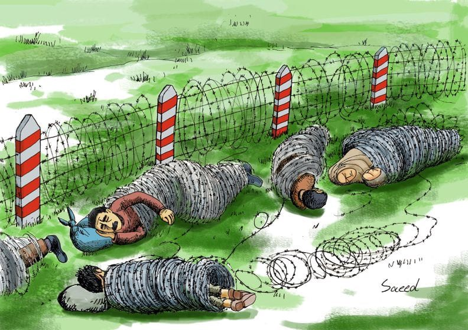
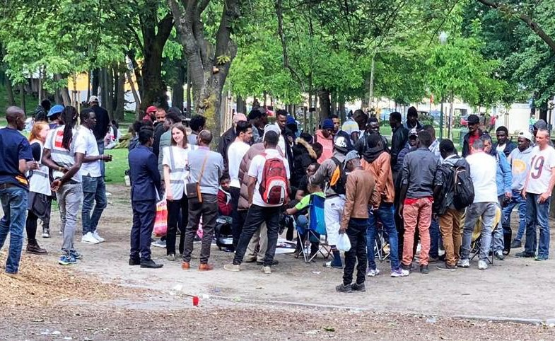

### AYS DAILY DIGEST 24/05/2019: Arrivals, Arrests, Closures, Confusion in Italy

_So they are hypocrites? Yes, and now what… // Fight in Diavata Camp // European Commission expresses concern over new deportation rules // Support needed in Brussells // Fundraiser to help the family of a deceased man receive his body…_

PHoto Credit: Art Against

Although this tweeter was commenting in reference to the political situation in the United States, it brings to light an important shift in the conversation that must be had in regards to migration\.

For years now, we, and others, have been highlighting the mismatch between the platitudes and the realities in regards to the right of people to freedom of movement and to claim asylum\. Although it is necessary to continue to note these lies, unfortunately, it can become seductively easy to simply stop there, crying “you hypocrites\! you hypocrites\!”

The author’s desire that we push past this does not stem from any vested interest in “giving the benefit of the doubt” or perhaps worse, the cry of the “concern troll” apolitical: “YOU try to come up with a better plan\! Don’t be so negative\!”

What I wish to highlight here is what we already know — there is no vested interest in portraying or abiding by the truth\. This can be exemplified in the excellent rebuttal to Italian Minister of the Interior Matteo Salvini’s boldfaced lie about deaths in the Mediterranean\. The organization MEDU posted the following response:

> “A few days ago, a grotesque controversy broke out over the number of [\#migrants](https://www.facebook.com/hashtag/migrants?source=feed_text&epa=HASHTAG&__xts__%5B0%5D=68.ARBLIkugUVXsE6NeMlcVQt6IpcbT6_hY-nfsh5qFTQkouYvsBTZutUyQqveRBaY_xL4s1MEbqjkdvSJJ4sSW3AAp2DJRcbDPyDZCl32SHWxTsdBNi4i6uHrasWqg1SEFho6C1Od7hxv6WnUxYLGgOJCJOnNIWQ_ZrVAR0N9EPQVqwDDRx26od2dFqaOnsTtFtI82_tkmyTOfOVTvvG-UHI-TUhgIe-_1N-Ke8wrKvbAIk2Jf5X_pgnLFn7p7Aaa_b0PnGx3SEC6XwfDzAjj2er0Uu72uJd6dPX3qdmVisdECnP0d3y1NRHDtP4tPU3v8F1Dp5s0dDTWvPTAPLA&__tn__=%2ANK-R) who died in the Mediterranean Sea following Minister Salvini’s statements, who, defending his anti\-landing policy, recklessly stated: “In 2019 there were only two deaths in the Mediterranean”\. In a subsequent tweet then the minister published, in support of his theses, a table with UNHCR data regarding the bodies recovered and migrants dead/missing in the Mediterranean in the last 5 years\. From this table it is immediately clear that in the first 4 months of 2019 the dead and missing in the Mediterranean are not 2 but 402, while the number of 2 refers to the bodies recovered\.” 

The full statement and a more comprehensive table is found below

A closer look at more comprehensive data by IOM, on the number of arrivals to Europe and deaths incurred on the journeys, highlights what we already knew — that the dangers involved in coming to Europe have skyrocketed\. One would expect that if this idea of “death as a deterrance” were based on any fact, we would be seeing results by now\. Instead, although arrivals have dropped by around 30%, deaths have only dropped by 20%\. Also one should keep in mind that these numbers do not include deaths after return to Libya, which would most likely have a [significant impact on the death rate\.](https://www.iom.int/news/mediterranean-migrant-arrivals-reach-19830-2019-deaths-reach-512)

Regardless, even though Salvini was caught in a most egregious lie, it does not appear that this will be affecting his approach\. As was stated before, most appeals to “rationality” and “cold facts” fall away very quickly, as they were never really a cornerstone of this ideology, merely a facade to lend a scrap of legitimacy, and to derail claims over racism\.

Likewise, another approach to derail serious concerns of the abuse of people on the move, is an approach that falls under the category “concern trolling\.” Specifically, the dressing up of a dangerous analysis under the guise of simple concern\. The abuse mentioned here involved both people on the move, and undocumented workers on the labour black market\. With the recent news of the horrific serial murder of [seven women and girl guest workers on Cyprus](https://www.bbc.com/news/world-europe-48110874) , the abuse of guest workers — termed as such because several of the women were in semi\-precarious standing with regards to visas — or undocumented workers, is a hot topic\.

As of yesterday, the Italian police investigated and burst a huge criminal network of worker exploitation and indentured servitude in the agricultural industry in Italy, where people were working for less than [5 euros an hour](https://www.lastampa.it/2019/05/22/cuneo/tre-arresti-per-caporalato-nel-saluzzese-migranti-della-frutta-pagati-meno-di-euro-allora-U2xCPvZTTpWSyqjHds0h4O/pagina.html) and were coerced into paying fees, fines, and for basic necessities by their employers\. Cases like this are an open secret in Italy, due to the employment crisis and a lack of basic workers\. This, the concern troll says, is why we need to support crackdowns on immigration — see who is benefitting? Again, this is a “truthy” statement, but it ignores the broader context\. If these workers had been given a more comprehensive support structure, they would not be forced into the arms of those who would exploit them\.

In the case of contemporary slavery, the criminals exploit the precarious legal situation of those they would abuse — knowing that their victims would most likely face far worse consequences than themselves, if the police were to show up\.

And with the backdrop of Salvini exacting his election woes out on SAR NGOs, the Sea Watch rescue ship remains seized\. [There will be a march happening](https://www.bbc.com/news/world-europe-48110874) in support of them at 4PM on Saturday\.

Two boats arrived to Lampedusa with no involvement from SARs — at least 57 people aboard\.

■■■■■■■■■■■■■■ 
> **[angela caponnetto](https://twitter.com/AngiKappa) @ Twitter Says:** 

> > 56 uomini e 1 donna #migranti, nazionalità Marocco,Algeria,  Siria,Libia,Gambia, Bangladesh sono approdati al #portosalvo di #Lampedusa alle 4 del mattino con una barca partita dalla #Libia (foto repertorio) https://t.co/hcQ6MKwSoe 

> **Tweeted at [2019-05-24 05:07:36](https://twitter.com/angikappa/status/1131788816417722368).** 

■■■■■■■■■■■■■■ 

It is clear that these new arrivals will be facing a much greater challenge\. The Cara di Mineo reception centre has been dropping in number of residents, whether through rejected applications or lack of ability to support them\. Slowly but surely the funding has been cut, however, it appears that the money will appear for CARA in order to “transform the current CARA of Mineo into a training and training center for the armed forces, the law enforcement, civil protection and fire brigades both for military cooperation and for peacekeeping initiatives”

Activists write:

_“Unfortunately behind each issue there are dramatic stories, often tragic, of people and whole families, which in a few days, after many months, sometimes years, waiting for responses, too often negative \(because now the right of asylum in Italy it is a rare exception granted\) they are transferred to Sprar in increasing difficulty or in CAS or in the hotspot in the former Gasparro barracks in Messina, which thanks to Salvino cuts, guarantee miserable conditions of survival\. Not a few find themselves getting by on the street, thus swelling the ranks of the homeless; despite the reports of doctors, the same end is due to people with serious vulnerable physical and mental, who will suffer for the consequences of the interruption of the therapies…\.”_

\(read the full statement in Italian, [here](https://www.facebook.com/permalink.php?story_fbid=1173057802855992&id=468545723307207&hc_location=ufi) \. \)

Not enough money for the centre, but then… a lot of money for the centre\. So, hypocrisies…

They are abundant, ongoing, flagrant, and will continue to become more so as we find ourselves playing chess with a three year old prone to first changing the rules and then flipping over the board at will\.

We should continue to highlight them in the hopes of bringing more people who are not aware of the lies we are walking through, to our sides\. However, if we rest too much of our moral case in holding some to account for their hypocrisies, we are left speechless when we see in their eyes: “So?”
### GREECE

> There were two arrivals to [Chios with 40 people](https://www.facebook.com/smhumanitario/posts/2258099144281923?hc_location=ufi) and [15 people respectively](https://www.facebook.com/smhumanitario/posts/2258446860913818?hc_location=ufi) , some in very precarious health situations, and another to Lesvos with 70 people yesterday\. 

Additionally there was a large fight between two groups of men in Diavata Camp yesterday\. There are no further updates as of yet, and any information is more than welcome — please contact us\. According to the eyewitness, the police did not intervene in any way\.

](assets/4a91051e4586/1*zKnhw6d0977nzv-gPDMvwQ.jpeg)

Police in the camp\. Photo Credit: [Lagkadikia Camp](https://www.facebook.com/lagkadikia.camp.12?__tn__=%2CdC-R-R&eid=ARBeJwNJ-8gIWIZzXhEmYntZbYVIJCkzyFVC2SIdibzcSXpKNL2kS6CBHz1rhCI0RCo2iWq6guH9nOKT&hc_ref=ARRd-w5xTKLl-ZujMSSXi2wCkAtraByWiHPCvlkXSxJOGoptEX4EeXs3lrarINKWU-c&fref=nf)
### FRANCE

The absurdity of the Dublin system highlighted by one of its victims who spoke to Utopia 56

> “ I am s\. I come from Iran, I was born in Iran\. I was there in 2009, I was 19 years old\. I left and went to Tehran, then in Turkey\. Then I went to Greece, from Greece I went to Belgium then in Sweden\. In Sweden, I was denied, and he wanted to send me back to Iran\. So I went all alone in Germany\. After a year, I had the Dublin procedure\. So I had to go back to Sweden, but I couldn’t go back to Sweden\. So I went to Austria\. After six months, I was told “you have to go to Sweden”\. but I’ve never been there, that’s why I’m a Dublin\. After six months, the police came at 5 in the morning\. They caught me and they sent me to Croatia\. I’ve never been there\. The government in Austria said I had a Dublin, but I had never been to Croatia\. After two years I went to Switzerland to ask for asylum, because in Croatia they had refused me\. I walked into Switzerland, after three months they told me that I was Dublin and I had to go back to Croatia\. So back in Croatia, I lived there five or six months\. And then I went all alone in Spain\. In Spain I asked for asylum and they told me that if I was asking for asylum in Spain, it wouldn’t work because I was Dublin in Croatia\. So I had to go back to Croatia\. And that’s why today I’m in France\.” 

Ten years of his life wasted, because of the absurdity of the procedure\. 
Read the full statement [here](https://www.facebook.com/U56ParisIDF/posts/2106012473031535?hc_location=ufi) \.

> Additionally the sister of the young man who died on the 21st is asking to raise money to repatriate his body to Eritrea\. Please [read](https://www.helloasso.com/associations/l%20auberge%20des%20migrants/collectes/collecte-pour-le-rapatriement-de-mulue-en-erythree) for more details\. 

### BELGIUM

Care4Calais posted an update on their work in Brussels\.

> “This Thursday people were cleared out of the Gare de Nord — the only shelter — so there are even more people in the park, and some new arrivals as well\. We saw around 400 people this week but the refugees told us that there were many more not present at the time of our visit\.” 

Photo Credit: Care4Calais
### GERMANY

The European Commissioner has urged the German parliament to increase safeguards to protect activists in forthcoming legislation designed to facilitate deportation\. As was previously covered, the proposed legislation jeopardizes freedom of speech by criminalizing the sharing of information related to pending deportations\. For the full statement, go [here](https://www.coe.int/en/web/commissioner/-/commissioner-urges-german-parliament-to-increase-the-human-rights-safeguards-of-the-bill-for-improving-the-implementation-of-expulsion-of-migrants) \.
### LIBYA

Forcible expulsions to different detention centres in Tripoli based on nationality\.

■■■■■■■■■■■■■■ 
> **[Sally Hayden](https://twitter.com/sallyhayd) @ Twitter Says:** 

> > Detainees in Tajoura dc, east Tripoli, say they've been told 80 of each nationality must be moved to Janzour detention centre tonight, because of the lack of food in Tajoura. They refused to go, and say they were told guards will come back in an hour &amp; force them. https://t.co/rQgyNR4qNh 

> **Tweeted at [2019-05-23 19:47:51](https://twitter.com/sallyhayd/status/1131647954157219841).** 

■■■■■■■■■■■■■■ 

### HUNGARY

Another case of food deprivation in Hungary\. Known to the government on the highest levels\.

■■■■■■■■■■■■■■ 
> **[HunHelsinkiCommittee](https://twitter.com/hhc_helsinki) @ Twitter Says:** 

> > Our 14th(!) case of food deprivation. A #diabetic Afghan couple, 59 and 63 yrs old, detained in the Röszke transit zone, didn't get food from the authorities for 3 days. Again, we got an emergency order from the European Court of Human Rights to stop the #inhuman treatment. https://t.co/zcJyWkbmzR 

> **Tweeted at [2019-05-22 10:45:35](https://twitter.com/hhc_helsinki/status/1131149100085338112).** 

■■■■■■■■■■■■■■ 

#### AYS and the Daily News Digest — want to get involved?

**We strive to echo correct news from the ground through collaboration and fairness\. Every effort has been made to credit organizations and individuals with regard to the supply of information, video, and photo material \(in cases where the source wanted to be accredited\) \. Please notify us regarding corrections\.**

**Apart from daily news in English, we also publish weekly summaries in [Arabic](%D8%A7%D9%84%D8%AA%D8%BA%D9%8A%D9%8A%D8%B1%D8%A7%D8%AA-%D9%81%D9%8A-%D9%82%D8%A7%D9%86%D9%88%D9%86-%D8%A7%D9%84%D9%84%D8%AC%D9%88%D8%A1-%D9%81%D9%8A-%D8%A7%D9%84%D8%AF%D9%86%D9%85%D8%A7%D8%B1%D9%83-b99e429d54ad) and [Persian](%D8%B9%D9%88%D8%B6-%D8%B4%D8%AF%D9%86-%D9%82%D9%88%D8%A7%D9%86%DB%8C%D9%86-%D9%BE%D9%86%D8%A7%D9%87%D9%86%D8%AF%DA%AF%DB%8C-%D8%AF%D8%B1-%D8%AF%D8%A7%D9%86%D9%85%D8%A7%D8%B1%DA%A9-7b984cac7a86) \. Follow the links to read and share the ones from the week of May 6th to 12th\. Find specials in both languages on our medium site\.**

**If there’s anything you want to share or comment, contact us through Facebook, Twitter or write to: areyousyrious@gmail\.com\.**

**We’re open to expanding our team of volunteer researchers, editors, and info gatherers\.**

_Converted [Medium Post](https://medium.com/are-you-syrious/ays-daily-digest-24-05-2019-arrivals-arrests-closures-confusion-in-italy-4a91051e4586) by [ZMediumToMarkdown](https://github.com/ZhgChgLi/ZMediumToMarkdown)._
