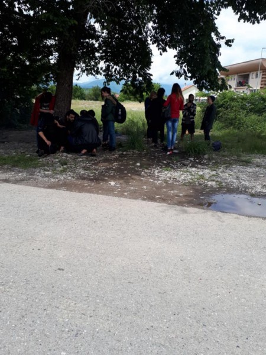

### نشر المزيد من هيئات الرقابة على الحدود
#### 26\-AYS Weekly News Summary in Arabic May 20

### **سوريا**
#### مستجدات الوضع في إدلب وحماة

تقرير الدفاع المدني السوري عن الهجمات الإجرامية لقوات النظام العسكرية والجيش الروسي في المناطق المحيطة بإدلب وحماة\. لقى ٨ أشخاص على الأقل حتفهم يوم الخميس في إدلب ، والحرائق تحرق مئات الأفدنة من الأراضي الزراعية والغابات نتيجة للتفجيرات
### لبنان
#### ترحيل سوريين من المطار بإجراءات موجزة

لبنان رحّل بإجراءات موجزة 16 سوريا على الأقل، بعضهم مسجلون كلاجئين، عند وصولهم إلى مطار بيروت في 26 أبريل/نيسان 2019\.

5 منهم على الأقل مسجلون على لدى “مفوضية الأمم المتحدة لشؤون اللاجئين” \(المفوضية\)، في حين أعرب 13 منهم على الأقل عن خوفهم من التعذيب والملاحقة في حال إعادتهم إلى سوريا\. مع ذلك، لم يُمنَح السوريون أي فرصة فعلية لطلب اللجوء أو الاعتراض —

### **البحر**
#### يخاطر الناس بالموت ويعادون إلى ليبيا بينما تشاهد أوروبا

خلال اليومين الأخيرين ، غادر أكثر من ٣٠٠ شخص ليبيا على الأقل ٥ زوارق\. تفيد المنظمة الدولية للهجرة أن خفر السواحل الليبي اعترض ٢٨٥ وعادوهم إلى البلاد ، حيث سيتم احتجازهم على الفور

شهدت \( مشاهدة البحر\) و \( طائر القمر\)

■■■■■■■■■■■■■■ 
> **[Sea-Watch International](https://twitter.com/seawatch_intl) @ Twitter Says:** 

> > Today #Moonbird witnessed #EU sanctioned &amp; #HumanRights-violating interceptions of 2 boats by the so-called #Libya|n Coast Guard. There are possibly more unattended distress cases. Rescue capacity needed immediately! #SafePassage https://t.co/MmILy6xoF1 

> **Tweeted at [2019-05-23 13:07:52](https://twitter.com/seawatch_intl/status/1131547291393957888).** 

■■■■■■■■■■■■■■ 

و \(هاتف الانذار\) تطورات ذكرت \( مشاهدة البحر\) أن سفينة عسكرية إيطالية رفضت اتخاذ إجراء لإنقاذ الأشخاص الذين يخاطرون بالغرق والتعلق بقوارب مطاطية مفرغة

### **اليونان**
#### الوصول

لم يصنّف الوافدون إلى الجزر اليونانية العناوين الرئيسية لفترة طويلة ، لكن عدم اهتمام وسائل الإعلام الرئيسية لا يعني أن الناس قد توقفوا عن محاولة عبور بحر إيجة أو أن الأرقام تتناقص\. لخص تقرير بحر إيجة محاولات عبور الوافدين إلى الجزر الشرقية اليونانية خلال الأسابيع الماضية

وحتى الآن هذا الشهر ، بدأ ١٥٩ قاربًا رحلتهم نحو جزر بحر إيجة اليونانية ، ٤٨٨٥ شخصًا\. ٥٧ قاربًا ، وصل ١٧٤٧ شخصًا إلى اليونان ، وتم إيقاف ١٠٢ قاربًا ، و ٣١٣٨ شخصًا من قبل
#### الشرطة

وصل ١٠ قوارب في ليسفوس ، ٣١١شخصا\.

وصل ١١ قاربًا على خيوس ، ٣٢٩ شخصًا\.

وصل ١٢ قاربا في ساموس ، ٤٨٢ شخصا\.

وصل ١٠ قوارب في كوس ، ٢٣٤ شخصا\.

وصل٤ قوارب في ليروس ، ١٥٢شخصا\.

وصل ١٠ قوارب في جزر أخرى ، ٢٣٩ شخصا\.

من بين ١٠٢ قارب توقفت حتى الآن هذا الشهر:

وكان ١٣ قارب الوجهة ليسفوس\.

وكان ٢٥ قاربا شيوس الوجهة\.

وكان ٢٩ قارب وجهة ساموس\.

وكان ١٨ قارب كوس الوجهة\.

وكان ١٧ قارب الوجهة فارماكونيسي / أغاثونيسي\.

يوم الخميس ، وصل ٤٩ شخصًا إلى ليسفوس\.

### إحصائيات حول معدلات قبول اللجوء في اليونان ودول أوروبية أخرى

أصدر المكتب الإحصائي الأوروبي إحصائيات اللجوء لعام 2018\. قمنا نحن فريق معلومات المتنقل بجمع هذه البيانات وتحويلها إلى رسوم بيانية\. يمكنكم الذهاب إلى موقعنا على الإنترنت الآن وإلقاء نظرة على معدلات قبول بعض الجنسيات في مختلف البلدان الأوروبية بما في ذلك اليونان وألمانيا والمملكة المتحدة: [https://www\.mobileinfoteam\.org/asylum\-decision\-ar](https://www.mobileinfoteam.org/asylum-decision-ar?fbclid=IwAR1N1lHw7PDO-xhDksHqy6-7Uh-FzHsyOnKWtPCBfJUDbjmntG3WcjedzEU) \. لقد شرحنا أيضًا الأنواع المختلفة لحالات اللجوء المتاحة لكم\. بشكل عام ، يجب أن نقول ، أن معدلات القبول تختلف كثيرًا حسب البلد الذي يتقدم شخص بطلب للجوء فيه\.إذا كان لديكم أي أسئلة حول الإحصائيات ، فيرجى إرسال رسالة بنا على الخط الساخن على الواتساب : 8283 538 695 0030\. — [الفريق المتنقل لمعلومات اللاجئين](https://www.facebook.com/mobileinfoteam/?__xts__%5B0%5D=68.ARAlLE5Rae56kpPEHecxyajxeQeiU7wi8AsIGo54gSuSFRuCA8xPEPCUYeEbNjEzFK-gBPz-7mTaOBVeWwR8mVFEk35B4zSCNVfIZ36L6IZ9DUl8pwiQWJ8BGDbqU7-dICZbRUywle_7-BvQsTFQ7NgTldqar_TUt6mFhrm2DZ2Yv_cl8w5Wc3FDOQOCdS7_G_d24Q4ZNjAtnvBP7rQTeR8Zhz2H9VKQC4RDkICmBh__caH8WKZfxbgPinqP1A6lAIrN4I6GJqZFdyMbG0kXZqSUYM3JwYq8Ohyg-oU85dz40_Rlw-sa7DCt-2tfr0sZ1MV0lcSY2GYUcgbu2HKg3p23lwId&__xts__%5B1%5D=68.ARAY5yRF-cOuPKbnJYSnexxDsVim3mqh01Ub5keefSu18eAR0AKdSznTh6lqO3EodIU3XexqwJ1DP84qU18QOwT5Byve6RI5HTPE-FVEJvZNaLChFaRR-CmpbwcJpIZmJJLZWIOw_cMHfJbkQLVDgoYaXRHV-OH5WMj7t4r9iI7rzn1u9JucKuVkwWrKPdXl03t-X-N5xHhRIm2UXpg1PL1fSPmLTLlWo2VgM0jQdHhQ_9TX5cUoiobOFS4HDzO-J4iWkRjkxVUgtdxfGhl9VeOaSYEUzXHCezqcnuFAZN7EPAhkmenxe4gyVrTjx3v6AHZjQwFo2w4vRw8kcD19RcD2yNeZ&__tn__=kC-R&eid=ARDB4N2n043kyQEtuxVpSi0VR_XgEIp9IM-glDFudQKViTrKC3ersVT8Ed78FWiq1_rzLdRPS81dld9e&hc_ref=ARStjD_uHAPqCrI-pz7N5PGvSuW_eevD4QvGdrQ73_W8cB1MntOUYnh6Fajh2KEjAwc&fref=nf)
### **ألبانيا**
#### استجابة الاتحاد الأوروبي للعنف على الحدود — نشر المزيد من هيئات الرقابة على الحدود؟\!

تنشر فرونتكس ٥٠ ضابطًا مع ١٦ سيارة دورية وسيارة واحدة ذات رؤية حرارية من ١٢ دولة عضو في الاتحاد الأوروبي “لدعم ألبانيا في مراقبة الحدود والتصدي للجريمة عبر الحدود”\. يزعم أنهم كانوا يتابعون الانتهاء من اتفاق الوضع بشأن التعاون الحدودي بين الاتحاد الأوروبي وألبانيا في وقت سابق من هذا الشهر\. هذه هي الاتفاقية الأولى من هذا النوع مع دولة مجاورة غير تابعة للاتحاد الأوروبي والاتحاد الأوروبي\. رد فعل آخر غير مناسب من جانب من يقف وراء القرارات التقييدية ذات الاتجاه الواحد
### **الجبل الأسود**

وصل بعض الأشخاص اليوم إلى مركز الاستقبال في سبوز، الجبل الأسود\. أتيحت لنا الفرصة للتحدث والاستماع إليهم والإجابة على بعض أسئلتهم\. نأمل أن يجد الأشخاص المتعبون والمرهقون القليل من الراحة في كل البؤس المحيط بهم

](assets/7ad54e5733d5/1*Qg81Ra8B-mxCZ4PYBS6IWQ.jpeg)

Credit: [فراس شامي](https://www.facebook.com/profile.php?id=100011544815460&fref=gs&__tn__=%2CdC-R-R&eid=ARD_ZKheQ1_gMiNShqmg0zN4tXFI0Kq6e12GVYK8-TINHGky4EdQJTfenJrGxIJFk9M-bzIOWhghkFK3&hc_ref=ARTZwJbv4fdqHouMpEuZipfbDHANn_DtpskvqhufH1JD2oRAGX6W4IDfD382dwqFs1k&dti=1157824667713728&hc_location=group)
### **البوسنه والهرسك**

وصول الكثير من الناس الى توزلا… و الناس ينامون بصعوبة طوال الليل

](assets/7ad54e5733d5/1*yKug83x4gkhLcvT7rFs2IQ.jpeg)

[Pomoc izbjeglicama u BiH/Help to refugees in Bosnia and Herzegovina](https://www.facebook.com/groups/144469886266984/permalink/352874732093164/)
### معلومات حول سلوفينيا:

### **أسبانيا**
#### زيادة كبيرة في الوافدين

في إسبانيا ، شهدت السلطات زيادة في المعابر البحرية بحوالي ٢٥٪ مقارنة بعام ٢٠١٨\. وصل أكثر من ٧٥٠٠شخص حتى الآن هذا العام ، بينما توفي ١٥٩، وفقًا للمنظمة الدولية للهجرة

### ألمانيا

حث المفوض الأوروبي البرلمان الألماني على زيادة الضمانات لحماية النشطاء في التشريعات القادمة التي تهدف إلى تسهيل الترحيل\. كما تم تغطيته سابقًا ، يعرض التشريع المقترح حرية التعبير للخطر من خلال تجريم مشاركة المعلومات المتعلقة بعمليات الترحيل المعلقة

للحصول على البيان الكامل ، اذهب هنا

**يتوفر الكثير من الأخبار باللغة الإنجليزية يوميًا على صفحتنا في موقع الميديوم**

**في حال كان لديك أسئلة أو ترغب في نشر معلومات معينة ذات صلة بإجراءات اللجوء أو بلد اخباره مهمة ، يرجى عدم التردد في الكتابة إلينا — إما عن طريق إرسال رسالة إلينا على فيسبوك أو إرسال بريد إلكتروني إلى**

[**areyousyrious@gmail\.com**](mailto:areyousyrious@gmail.com)

_Converted [Medium Post](https://medium.com/are-you-syrious/%D9%86%D8%B4%D8%B1-%D8%A7%D9%84%D9%85%D8%B2%D9%8A%D8%AF-%D9%85%D9%86-%D9%87%D9%8A%D8%A6%D8%A7%D8%AA-%D8%A7%D9%84%D8%B1%D9%82%D8%A7%D8%A8%D8%A9-%D8%B9%D9%84%D9%89-%D8%A7%D9%84%D8%AD%D8%AF%D9%88%D8%AF-7ad54e5733d5) by [ZMediumToMarkdown](https://github.com/ZhgChgLi/ZMediumToMarkdown)._
