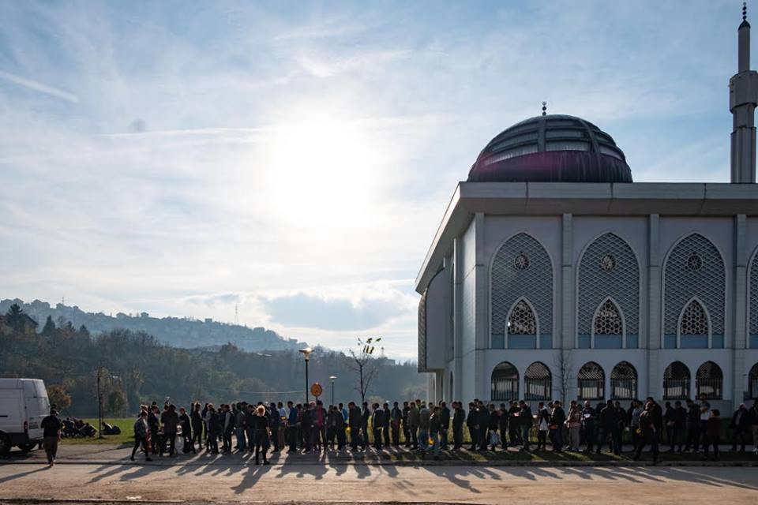
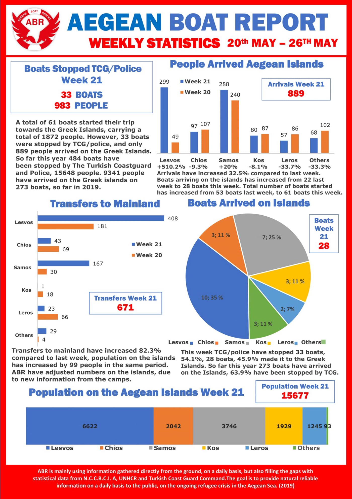

### AYS Daily Digest 28/5/19: Banned from helping
#### New arrivals on the Greek islands // AidBrigade stopping with activities in Sarajevo // Bombings in Syria continue // Chased to death in Turkey // Italian organisations call to a conference to strenghten ties and join forces

People waiting for food distribution\. Credits: AidBrigade
### Featured: International volunteer group banned from Sarajevo

A volunteer collective AidBrigade had to stop its operations recently, after its community was visited and shut down by authorities who checked for credentials, documentation and raided the distribution area\. “The international volunteers present on site were taken to the SFA \(Service for Foreigners Affairs\) office and banned from the country for reasons including ‘disturbance of peace’, ‘providing assistance to migrants and refugees’ and ‘volunteering under a tourist visa’\.

> After waiting for a reply for 5 months, our request to become an official NGO was denied on the same day,” _Aid Brigade reported in a [statement](https://www.facebook.com/groups/1652972374920129/permalink/2228120027405358/) \._ 

According to their own account, the volunteer feed an average 285 refugees two meals every day since March 2018\. That equals 120\.000 meals\. Additionally, they provided non\-food items and have recently opened a new shelter\. They will try to continue their operations elsewhere, with this experience behind them, hopefully the bureaucratic obstacles won’t be left to present a problem\.

As apparently some of the volunteers and the organisation itself didn’t obtain the permits to volunteer within Bosnia and Herzegovina on time, hopefully the local volunteers will try to find a solution to provide such continuous support in their capital, although it is interesting the closing happened just now as there are many foreign pilgrims during Ramadan and ahead of the more tourist season in Sarajevo, some have noted\.

### Syria: Bombings continue

The White Helmets [report](https://www.facebook.com/SyriaCivilDef/posts/2358921767765551?hc_location=ufi) about new bombings in Aleppo countrysides as well as on Hama and Idlib\. At least 23 people were killed in this shellings\.
### Turkey: Chased to death

While there were many new arrivals on the Greek islands the last days — with more than 100 only on Samos last weekends — , there are also some who did not manage to make it on safe soil\. Hamza A\., citizen of Palestine, died when he felt the cliffs in Kusadasi, Turkey, Aegean Boat Report [writes](https://www.facebook.com/AegeanBoatReport/photos/a.285312485325196/582215638968211/?type=3&theater) \. The 28 years old man intended to go to Samos: “He and four of his friends was on their way to the starting point, when police started to chaise them\.”

### Greece

■■■■■■■■■■■■■■ 
> **[Samos Volunteers](https://twitter.com/samosvolunteers) @ Twitter Says:** 

> > 105 new arrivals over the weekend on Samos. 105 new people added to the extremely overcrowded camp. 105 new people stuck on the island 

> **Tweeted at [2019-05-27 09:57:47](https://twitter.com/samosvolunteers/status/1132949009407139840).** 

■■■■■■■■■■■■■■ 

[Aegean Boat Report](https://www.facebook.com/AegeanBoatReport/?__tn__=kC-R&eid=ARCVI1lM5NTJ0J4USbXDD6WZ51nyqva_XKzCI_SfycK8V6IS_AaXno9JgwD_8DFKOHp3SxaSJF-iBpf5&hc_ref=ARTrju5EfXTlrMDhJENo82GgS03s3l0Lrz9xNf-dE698L3kkGDVtfei6sWQK9xujibw&fref=nf&__xts__%5B0%5D=68.ARDm2QJMqCnB66mC78fOm6jSVsPB-Rzsmq3VqVdb7FVHhxxEXsn1yV571xh8Cpqs7LjtpPLVqcRd6reKTgZq8fpslnc6g-L_3J_DZSU-Luc_4CQiAUVb05zSKSPitV7NIu-wkMeB4ogO9y6vUQ8k23EsYxy3_Lh5L2F9w-5nWqHAjBZjpYarbJMVggIJal6My4w_xV8da2kAGRSv_6LAMeHp0wcny8VfLo8YotZmF62GnCSMe3RCuXlbrNlISTRKltpWtIiSdJpUPW2u4GRcBR7TuowsvmvQWAasVeN0LyPazay7Rpx9wvnbKu3-kzyp2dZ0Vuiv19h0x93nhq8DOhk) publishes monthly statistics for the Greek islands, updated daily\. You can find total numbers on arrivals, boats, total numbers on the islands, transfers to mainland, boats stopped by Turkish Coastguard \(TCG\), and number of people arrested by TCG\. Follow them for more info on the arrivals\.

### Italy

For a long time the electoral consensus threatens our communities, says an opening of an invitation to a weekend event in Italy\. “This happens both globally and in different local areas\. It is the result of a highly toxic mainstream debate, in which migrants are at most numbers and statistics exploited in electoral campaigns in order to increase the consensus of the political party that best interprets and fosters the perceived fears and resentments of European populations\.
The security mantra that in recent years has led the European Union and Italy to externalization policies of the borders and strongly unjust and repressive laws “

> The only way forward to reverse this trend is to continue relentlessly weaving relationships to expand and connect those plural forms of social resistance and civil disobedience that do not feel enlisted in this war against the poorest\. 

This coming weekend in Trento, hosted by [OltrEconomia Festival](https://www.facebook.com/oltreconomiafestival/?eid=ARBGcFp9EujUqMcnhPdNMKRPpIbAFCjUSwqI-XJKMlTSuLl5lrAxY6L3k5LRIM3oHtSqhslmOyKaj1FC) and [Melting Pot Europa](https://www.facebook.com/meltingpoteuropa/?eid=ARAXQoTE6Dc0Xo_nlXQlusmEBLpNeR5ypYDTxdCBH6qIbsyzEOcpupO4GDT7XIPt0fvxGE39twyUBa9n) there will be a conference dedicated to the question of the right to migrate and the issue of criminalisation of solidarity\.

#### AYS and the Daily News Digest — want to get involved?

**We strive to echo correct news from the ground through collaboration and fairness\. Every effort has been made to credit organizations and individuals with regard to the supply of information, video, and photo material \(in cases where the source wanted to be accredited\) \. Please notify us regarding corrections\.**

**Apart from daily news in English, we also publish weekly summaries in [Arabic](%D8%A7%D9%84%D8%AA%D8%BA%D9%8A%D9%8A%D8%B1%D8%A7%D8%AA-%D9%81%D9%8A-%D9%82%D8%A7%D9%86%D9%88%D9%86-%D8%A7%D9%84%D9%84%D8%AC%D9%88%D8%A1-%D9%81%D9%8A-%D8%A7%D9%84%D8%AF%D9%86%D9%85%D8%A7%D8%B1%D9%83-b99e429d54ad) and [Persian](%D8%B9%D9%88%D8%B6-%D8%B4%D8%AF%D9%86-%D9%82%D9%88%D8%A7%D9%86%DB%8C%D9%86-%D9%BE%D9%86%D8%A7%D9%87%D9%86%D8%AF%DA%AF%DB%8C-%D8%AF%D8%B1-%D8%AF%D8%A7%D9%86%D9%85%D8%A7%D8%B1%DA%A9-7b984cac7a86) \. Follow the links to read and share the ones from the week of May 6th to 12th\. Find specials in both languages on our medium site\.**

**If there’s anything you want to share or comment, contact us through Facebook, Twitter or write to: areyousyrious@gmail\.com\.**

**We’re open to expanding our team of volunteer researchers, editors, and info gatherers\.**

_Converted [Medium Post](https://medium.com/are-you-syrious/ays-daily-digest-28-5-19-banned-from-helping-a0bc696dfeaf) by [ZMediumToMarkdown](https://github.com/ZhgChgLi/ZMediumToMarkdown)._
