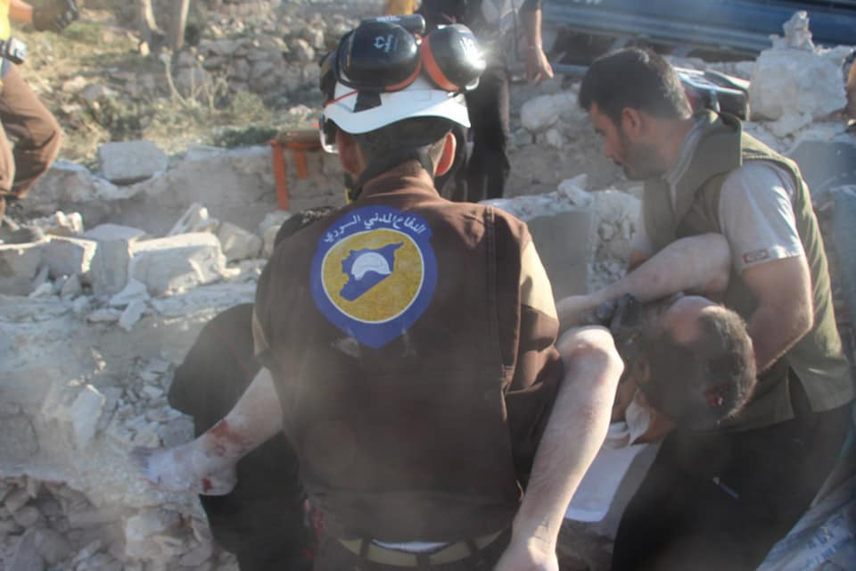
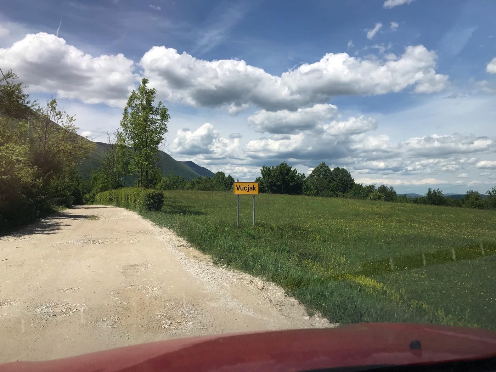

### AYS Daily Digest 30/05/19: 100 people finally rescued by Italian Navy
#### _New arrivals in Greece // Idlib bombardment deaths // BiH: Official decision made about moving people to a campsite to be built in Vučjak, near Bihać // protests in the UK // and more…_

](assets/e817fa071377/1*M2lCv1QxNEjQag9IZtov5Q.jpeg)

“ 13 years ago, the world was shocked by images of 27 migrants clinging for dear life to a tuna pen towed behind a trawler\. Yesterday, we collectively shrugged\.” Photo by [Marc Tilley](https://twitter.com/TilleyMarc/status/1134039110790914054?fbclid=IwAR2lwTN-yBR6usr9oLiBcCT1gDOLRsRtArx6BUNKM4aQyP9iAukytcky4ng)
### Featured
#### 3 separate events happened at sea; ALL bring up the necessity of swift rescue:

**The first** concerns the Italian Navy’s hesitation to rescue a boat of 100 people, where they were adrift for 24 hours\. [A 9 month](https://twitter.com/SkyTG24/status/1134123783126704129?fbclid=IwAR1tKp9WCgGTevanXwIbeAjlr51s1291IzT20BsQwRTEBBEEqb4axjFlP4k) old baby and a pregnant woman were on board, as well as 17 women and 23 minors in total\. As Mediterana Saving Humans stated:

> “We learn with joy that there would be no victim following the distress that was reported yesterday and that risked becoming the umpteenth massacre\. We are grateful to the crew and the commander of the navy ship P490 Cigala Fulgosi for rescuing them\.” 

Sea Watch International echoed:

■■■■■■■■■■■■■■ 
> **[Sea-Watch International](https://twitter.com/seawatch_intl) @ Twitter Says:** 

> > .@[ItalianNavy](https://twitter.com/ItalianNavy) rescued 100 ppl spotted by #Moonbird yesterday, after civil society pressure. It's a low point in the #Mediterranean when a #rescue is only prompted after 24hrs. Rescue is not laudable, it is required by law. 100 lives were put at risk in yesterday's non-assistance! 

> **Tweeted at [2019-05-30 11:32:58](https://twitter.com/seawatch_intl/status/1134060124094500864).** 

■■■■■■■■■■■■■■ 

[**The second**](https://www.infomigrants.net/en/post/17204/maltese-navy-rescues-75-migrants-clinging-to-a-tuna-pen?ref=tw) involves the Maltese Navy rescuing 75 people Wednesday night\. The Maltese army says its corroborated with the Italian authorities in several joint rescues, yet it still supports the Libyan Coast Guard\. [UNHCR Malta](https://twitter.com/UNHCRMalta/status/1134008948531572736) tweeted that:

> “\(we were\) at the disembarkation this morning and spoke to the rescued refugees and migrants, who were exhausted, hungry, and extremely relieved to be on land after three days at sea\.” 

[**And finally** ,](https://www.voaafrique.com/a/m%C3%A9diterran%C3%A9e-des-dizaines-de-migrants-%C3%A9puis%C3%A9s-d%C3%A9barquent-%C3%A0-malte-et-lampedusa/4938633.html) 2 boats arrived on Lampedusa from Libya late on Wednesday and early on Thursday, carrying 46 and then 57 people\. [They sailed for three](https://twitter.com/InfoMigrants_fr/status/1134056895000526849?fbclid=IwAR3NqkLPvuKr03ZowJmQMq8dmrSJ9uFVb7KfXoWs2bkuFsGdJcjvJZsCoR0) days before miraculously coming to Italy\.

**The Mediterranean is one of the deadliest borders in the world\. Sea rescue is not optional: it is necessary under international law\.**
### Syria

[22 people](https://twitter.com/SyriaCivilDef/status/1133906854441029632?fbclid=IwAR30xwkoHUrbDc_O9ZVXdZCu5bEJgYyX0kg3ix6BrkFJ38p-v2dTxjr507w) were killed on Wednesday, including 8 children and 6 women, as [The Syrian Civil Defense](https://twitter.com/SyriaCivilDef/status/1133906854441029632?fbclid=IwAR30xwkoHUrbDc_O9ZVXdZCu5bEJgYyX0kg3ix6BrkFJ38p-v2dTxjr507w) \(White Helmets\) continue to document the horror surrounding the the Idlib siege\. Thursday was the 35th day of bombardment\.

[On Thursday](https://twitter.com/SyriaCivilDef/status/1134232398353305600) , the White Helmets documented their rescue of the parents and brother of three other boys who were killed in the attack on Maaret Numan City\. The surviving brother watched one of his brothers die in front of his own eyes\.

](assets/e817fa071377/1*UaR78o4HI_bu7lWjSaRKfg.jpeg)

Photos by [the White Helmets](https://twitter.com/SyriaCivilDef/status/1133906854441029632?fbclid=IwAR30xwkoHUrbDc_O9ZVXdZCu5bEJgYyX0kg3ix6BrkFJ38p-v2dTxjr507w)

[As for the refugee situation:](https://twitter.com/phoeberamsay/status/1134236773691928577?fbclid=IwAR30fnvoHB8TC32w9ddRfGSJ3AlQzDQp6Cyqr6PwSIYqE7svL-T01o3THMg)

> “An estimated quarter of a million people have been displaced in the last month with nowhere to flee: the Turkish border remains closed\.” 

What happens in Syria affects us all\.
### Turkey

Turkish police report they have broken up the largest smuggling ring bringing people to Europe from Turkey\.

> “Twenty people, including ringleader Akbar Omar Tawfeeq, were detained in operations in four Turkish provinces after a year\-long investigation into the organization, Istanbul police said\.” 

The smuggling leaders are said to have earned about 2 million euros annually\. Find out more [here](https://www.reuters.com/article/us-europe-migrants-turkey-idUSKCN1SZ1UZ?fbclid=IwAR12KN1w-zcgxHV2Fi7iXlD_0Qw2SmOYdArcotFMWmn37fbwGcmXAD4CNB4) \.
### Greece

Refugee Support Aegan \(RSA\) released a report in the reception crisis in Northern Greece\. With the imperative to move people from the overcrowded hot spots:

> “The Greek government never managed to move on from an emergency reception approach to more mid\- or even long\-term solutions\. The numbers of refugees in need of shelter exceed those anticipated by Greek authorities for a third year in row\.” 

Read more on the report [here](https://rsaegean.org/en/reception-crisis-in-northern-greece-three-years-of-emergency-solutions/#2-4_vulnerable) \.

[19 people](http://www.ekathimerini.com/241065/article/ekathimerini/news/nineteen-migrants-rescued-in-eastern-aegean) were rescued by the Greek coast guard early Thursday morning\. They were taken to the port on the island of Farmakonisi\. [A second boat](https://www.facebook.com/AegeanBoatReport/posts/583238082199300) was also picked up with 28 people\. No breakdowns were available for either\.

■■■■■■■■■■■■■■ 
> **[NoBorders](https://twitter.com/Refugees_Gr) @ Twitter Says:** 

> > At 23:58, information was received about the death of an Iraqi man named Hamza (Abu Mansour) on the Greek island of Kos.
According to the information, the man died after the camp police refused to transfer him to the hospital because his health suddenly deteriorated.
#refugeesgr 

> **Tweeted at [2019-05-30 16:42:44](https://twitter.com/refugees_gr/status/1134138082549276680).** 

■■■■■■■■■■■■■■ 

### Montenegro

In a video, a father recalls the Bosnian police brutality he and his son experienced on the Montenegro border\. _“They took us out of the hospital and put us in the forest\.”_ See the video [here](https://www.facebook.com/groups/1157824667713728/permalink/1182161721946689/) \.
### Bosnia and Herzegovina
#### Camp opening in the Vučjak area, close to Bihać

Vučjak, in the outskirt of Bihać, will be the location where people from the camps Bira and Miral will be transfered to, the Operational group for migrations decided in Sarajevo\. The minister of security of Bosnia and Herzegovina, as well as a delegation of the Una\-Sana district took part in the meeting and decision making\.

They expect the European Commission to finance it:

> “Because Bosnia and Herzegovina didn’t contribute for all this to happen, this is a matter of the EU and this problem ends in the EU\. Since we have tto suffer the problem, in that case we demand that Bosnia and Herzegovina sets the rules and conditions on how things should evolve”, _the minister said\._ 

IOM on the other hand would prefer for a new centre to be built, rather than to take people to a tent camp, which is the only current option for the selected location\. However, their estimates were criticized as unrealistic, with a huge amount of money planned and a centre that implies a permanent solution, while this is supposed to be a transit camp, Bosnian politicians argued\.

“We cannot allow for Bihać to collapse, and according to the current situation, it’s bound to happen\. We are the only ones who have o authority over the situation and no resources either, Bihać mayor said, continuing:

> Yesterday in Bira there were 1,800 people, in Borići 400, in Sedra 400\. Nobody can give a precise estimate on how many people are in private accommodation or other lodging, but there are certainly over 1,000\. In front of Bira there are about 200–300\. Therefore, more than 3,000 or 4,000 are currently in Bihać\.” 

In five days, the action plan should be voted and the preparations should start according to the politicians\. They also said that they would prefer the decision making and funds to be given to the national authorities, like in the other Balkan countries, unlike in the case of their country, where it’s IOM who has received all the funds and is ‘running the show’\.

### Italy

[UNHCR evacuated 150 people](https://www.repubblica.it/cronaca/2019/05/30/news/libia_unhcr_evacua_150_rifugiati_da_tripoli_a_roma_65_sono_minori-227594436/?fbclid=IwAR2G4UWfKyTw-f1HeahCtGq2x1BGGF-2IHameM5nGYab-JoX364Jsz0t9EM) from Tripoli to Rome on Thursday, 65 of whom are minors\. 13 of the minors were under 1 year of age and 1 baby was less than 2 months old\. With the deteriorating and violent conditions in Libya, many more malnourished and in need of medical attention\. [UNHCR](https://www.unhcr.org/news/press/2019/5/5ceff1144/unhcr-evacuates-hundreds-vulnerable-refugees-libya-safety.html?utm_medium=social&utm_source=twitter&utm_campaign=HQ_EN_post_Global_Core%2520Social%2520Media%2520Outreach&fbclid=IwAR0qhWYe_4uLtEdZdTyHpHqExNLOb0SzgQeSyDECLhKbLcqy-9OicXPVSVE) is urging that with assistance from the Libyan and Italian authorities, more and more evacuations are needed\.
### France

Thousands of people are living on the edge of Paris in makeshift camps\. [Paris’s “périphérique”](https://www.france24.com/en/20190530-eritrean-migrants-refugees-paris-peripherique-report-france?fbclid=IwAR1iIEOqNovXoRWwNP7fU21Y9e_4QnP5biAscZIutAqWfDI_xTIfqPJJtrk) ring\-road is a temporary home of so many people who are becoming more hopeless by the day as living conditions continue to worsen\.
### Switzerland

The Swiss Refugee Council is trying to encourage the government to increase the number of people its planning on resettling in 2020 and 2021\. Only 800 people may be adopted into the program so far, but the council wants to see that number increase to 1,500–2,000 people to account for more need\. Find out more [here](https://www.swissinfo.ch/eng/politics/resettlement-_switzerland-urged-to-take-in-more-vulnerable-refugees-/44997594?fbclid=IwAR33Db0ldtxW5AVSmbNF0LPBMPO0OhMIZqLLmxqJ4PkBy5uT89_b0bwCRjw) \.
### UK

Anyone who may provide evidence for how the Home Office uses interpreters in the asylum process is urged to bring their information to [The Chief Inspector](https://www.gov.uk/government/news/call-for-evidence-use-of-interpreters-in-the-asylum-process?fbclid=IwAR2Tqu3T-y4xnsOHBYUK0sffL4OYm_9OgxAYITwc3EignLiwgPQL3E8Eyxw) :

> “I am inviting bodies with relevant knowledge and expertise, including NGOs, academics, think tanks, faith groups and representative bodies, to write to me by 13 June 2019 with their supporting evidence or case studies they are able to share…\.I would also like to receive evidence from individuals, including those who have first\-hand experience of the asylum process and have used interpreters during it\.” 

[On Saturday July 20th](https://www.facebook.com/events/461186481298838/) , from 12pm\-5pm there is a protest in Bedford to end all detention centers:

> “We return to Yarl’s Wood to demonstrate alongside those detained inside, together we strengthen the struggle inside detention to shut down these racist, inhuman centres once and for all\!” 

**AND** on June 1st from 5pm\-6pm there is an information session on the latest news from the Calais border\. Find out more [here](https://www.facebook.com/events/354025168554973/) \.
#### AYS and the Daily News Digest — want to get involved?

**We strive to echo correct news from the ground through collaboration and fairness\. Every effort has been made to credit organizations and individuals with regard to the supply of information, video, and photo material \(in cases where the source wanted to be accredited\) \. Please notify us regarding corrections\.**

**Apart from daily news in English, we also publish weekly summaries in [Arabic](%D8%A7%D9%84%D8%AA%D8%BA%D9%8A%D9%8A%D8%B1%D8%A7%D8%AA-%D9%81%D9%8A-%D9%82%D8%A7%D9%86%D9%88%D9%86-%D8%A7%D9%84%D9%84%D8%AC%D9%88%D8%A1-%D9%81%D9%8A-%D8%A7%D9%84%D8%AF%D9%86%D9%85%D8%A7%D8%B1%D9%83-b99e429d54ad) and [Persian](%D8%B9%D9%88%D8%B6-%D8%B4%D8%AF%D9%86-%D9%82%D9%88%D8%A7%D9%86%DB%8C%D9%86-%D9%BE%D9%86%D8%A7%D9%87%D9%86%D8%AF%DA%AF%DB%8C-%D8%AF%D8%B1-%D8%AF%D8%A7%D9%86%D9%85%D8%A7%D8%B1%DA%A9-7b984cac7a86) \. Follow the links to read and share the ones from the week of May 6th to 12th\. Find specials in both languages on our medium site\.**

**If there’s anything you want to share or comment, contact us through Facebook, Twitter or write to: areyousyrious@gmail\.com\.**

**We’re open to expanding our team of volunteer researchers, editors, and info gatherers\.**

_Converted [Medium Post](https://medium.com/are-you-syrious/ays-daily-digest-30-05-19-100-people-finally-rescued-by-italian-navy-e817fa071377) by [ZMediumToMarkdown](https://github.com/ZhgChgLi/ZMediumToMarkdown)._
