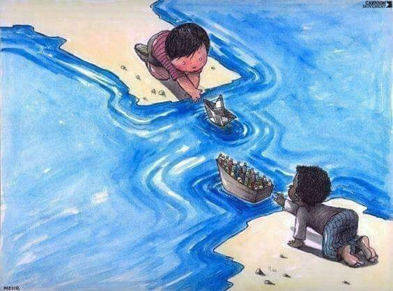

### AYS Daily Digest 31/05/2019 — People are returned to Libya faster than they are evacuated

Tunisia to welcome more people fleeing Libya /// Children and minors at risk in Greece /// Italian government assigns one of the farthest port for disembarkation to people rescued by Navy /// German BAMF rejected 75% of family reunification applications from Greece in 2019

Feature story
#### Feature Story: People are returned to Libya faster than they are evacuated

Yesterday, 211 people arrived in Europe via humanitarian corridors \(In Italy and Norway\) \. This is good news, but it is far from being enough\. To set the record straight, it is important to remind everyone that — according to MSF data — f [or every 100 people evacuated, 250 are instead returned to Libya](https://twitter.com/sallyhayd/status/1134481772941586432?fbclid=IwAR3oR8M6iRnXzPoxtFfH2ra42fhgAKb5s1wXrW8JJybOYOJCsy2ZZHD3QNc) \. Something is evidently not working:

■■■■■■■■■■■■■■ 
> **[Jeff Crisp](https://twitter.com/JFCrisp) @ Twitter Says:** 

> > From UNHCR:
"Libya’s coast guard is intercepting refugees &amp; migrants &amp; returning them to detention faster than the agency can evacuate them out of the country."
So has UNHCR asked the EU to lift restrictions on search-and-rescue NGOs and to halt support for the Libyan coastguard? https://t.co/kx1rjGiaui 

> **Tweeted at [2019-05-31 11:38:48](https://twitter.com/jfcrisp/status/1134423982453788679).** 

■■■■■■■■■■■■■■ 

Media sources [reveal](https://www.theguardian.com/world/2019/may/31/un-calls-for-evacuation-of-libyan-refugees-amid-dire-conditions?fbclid=IwAR2lR5U0jxc6ujkpe2uNscLzO1ShJm-VebMmSEcePK6x3H1gpTqGZHZTtDI) that — according to UNHCR’s and IOM’s internal documents — 3,919 of the 5,378 people held in Libyan detention centres are “persons of concern”, due to particular vulnerabilities\. 4,148 of them are in the security danger zone in Tripoli or in the north\-west of the country and more than a quarter \(27%\) are children, including babies and toddlers\.

TUNISIA

[UNHCR has visited the Tunisian border area with Libya](https://twitter.com/cochetel/status/1134456403115094017https://twitter.com/cochetel/status/1134456403115094017) , to assess the situation and prepare the ground for the expected increase of people fleeing Libya due to the armed conflicts\.

SEA

Mediterranean Hope [inform](https://www.mediterraneanhope.com/2019/05/31/8113/) that over 600 people attempted to leave the Libyan coasts in the last week\. Thanks to the support given by European countries to the Libyan coast guard, large numbers of these people were forcibly returned to the horrifying conditions in detention centres in the north African country\.

■■■■■■■■■■■■■■ 
> **[HEMAV Foundation](https://twitter.com/HEMAVFoundation) @ Twitter Says:** 

> > #ProyectoFreeda 🚀🚤
"Spanish engineers are developing a specially-adapted drone that can aid lifesaving migrant search and rescue operations in the Mediterranean Sea. The device can detect vulnerable vessels and alert humanitarian groups to the location."
[euronews.com/2019/05/31/cou…](https://www.euronews.com/2019/05/31/could-this-drone-help-save-migrant-lives-in-the-mediterranean) 

> **Tweeted at [2019-05-31 17:10:10](https://twitter.com/hemavfoundation/status/1134507374654476288).** 

■■■■■■■■■■■■■■ 

GREECE
#### Arrivals

[MoChara report](https://www.facebook.com/RefugeeRescueUK/posts/2242177539183017?hc_location=ufi) that they brought 14 people to safety at Skala Sikamneas last night after finding an inflatable boat while on a training exercise\. The 14 people \(3 men, 4 women, 7 children\) from Afghanistan were brought to the transit camp, where they received blankets, clothes, and tea as well as food\.

Two boats have arrived on Lesvos since yesterday: 45 people\.

[Aegean Boat Report](https://www.facebook.com/AegeanBoatReport/posts/583946815461760?hc_location=ufi) also recorded another landing on Lesvos which was picked up by HCG outside Agrilia Kratigou, Lesvos south 02\.00, carrying 31 people\. No breakdown available\.

[Samos Volunteers report](https://twitter.com/samosvolunteers/status/1134391722077802496?fbclid=IwAR2gZl0NRLXaygpWcS9zxjq3AAZfFFjewHI10HRKe2GRHPmZ8mKtDC31OLY) that 207 new asylum seekers have arrived on the island this week from Afghanistan, Cameroon, Iran and other countries\.
#### Children at risk in Greece

■■■■■■■■■■■■■■ 
> **[InfoMigrants](https://twitter.com/InfoMigrants) @ Twitter Says:** 

> > The European Committee of Social Rights of @[coe](https://twitter.com/coe) has said that #Greece "must adopt all possible measures to avoid serious and irreparable harm to minor #migrants" - ensuring, among other things, food and timely and adequate medical care. 
[infomi.gr/14OH.T](http://infomi.gr/14OH.T) 

> **Tweeted at [2019-05-31 19:08:00](https://twitter.com/infomigrants/status/1134537025590185984).** 

■■■■■■■■■■■■■■ 

#### Cinema Project at Katsikas

People living in Katsikas Camp are fundraising for a projector so that they can start their own cinema\. Mohammed, who will be running the project says:

> The life on the camp \(or prison life\) is everyone waiting, no jobs, no work to do, it’s boring and sad\. So a cinema inside the camp would be a good idea for children and adults\. Everyone can be involved\. I want to show children’s movies, educational and schooling programs\. For adults I think comedy movies from each others countries and documentary programs that can help us learn\. 

To donate contact paul@refugeesupport\.eu\. The projector costs £400 and they have so far raised £299\!
#### Volunteer Call

[Lifting Hands International](https://www.facebook.com/liftinghandsinternational/?ref=gs&__tn__=%2CdK-R-R&eid=ARAXNqcoDsic3ZCo11MhIr2HfG5fJL-JrpkukHDqjuTrOnuVUOsIVV5nNARTlnJBQyLMkaQ4mH-_dROh&fref=gs&dti=228469170832717&hc_location=group) is looking for a Volunteer Coordinator to run recruitment for their Serres community Centre project, about one hour away from Thessaloniki\. The post will start mid July and you must be able to commit for at least 90 days\. Accommodation is free and there is a small stipend for expenses\. Age requirement 21\+ \.

For more information on the project please email our current volunteer coordinator Lea: greecevolunteer@liftinghandsinternational\.org

ITALY

In May, 300 people arrived on Lampedusa, Italy\. This accounts for more than half of the total of arrivals on the island in 2019\.

As Mediterranean Hopes [explains](https://www.mediterraneanhope.com/2019/05/31/8113/) it:

> As we have always stated, data show that the real pull factor \[…\] is not the presence of NGOs in the Mediterranean, but the good weather\. 

Those rescued yesterday by the Italian Navy will arrive on Saturday morning in Genoa, on the northernmost shore of country\.

We can’t help but wonder, along with Mediterranea — Saving Humans, why the ministry assigned the farthest port to disembark people who have already been stranded at sea for days\. It is just cruel\.

■■■■■■■■■■■■■■ 
> **[Mediterranea Saving Humans](https://twitter.com/RescueMed) @ Twitter Says:** 

> > È Incomprensibile e fuori da ogni criterio previsto dalle convenzioni internazionali la decisione del Viminale di imporre alla #CigalaFulgosi il porto più lontano. È crudele far stare in mare per altri due giorni le persone salvate, una donna incinta, un neonato, molti minori. 

> **Tweeted at [2019-05-31 18:39:55](https://twitter.com/rescuemed/status/1134529961086324739).** 

■■■■■■■■■■■■■■ 

BOSNIA

[Udruženje Solidarnost — Bosnia](https://www.facebook.com/solidarnostbosnia/) published a new video recorded during food distribution

GERMANY

A broad alliance of lawyers and judges associations, along with NGOs working for children’s rights, welfare and human rights, is calling on the members of the German parliament in an [open letter](https://www.der-paritaetische.de/fachinfos/geordnete-rueckkehr-gesetz-nicht-verabschieden-22-zivilgesellschaftliche-organisationen-schreiben-of/?fbclid=IwAR2CycgOQxUWKSz4xK0KGjYOUzfPPGcFEJYIA_6QmUWCUvTceAcDem-TmK4) , to stop the “Geordnete\-Rückkehr\-Gesetz”, a law which — among other things — would facilitate deportations\.

The organisations stated that the proposed law aims at exclusion of migrants and violates fundamental and human rights\. In particular, the planned extension of the terms of pre\-deportation detention, the cuts of asylum\-seeker benefits below the subsistence level and the introduction of a new precarious status are unacceptable and will have a dramatic impact on those affected\.

German media also [report](https://www.dw.com/de/bamf-lehnt-viele-antr%C3%A4ge-auf-familiennachzug-ab/a-48988345?fbclid=IwAR3KS0GlCemzPJ6aDQCNsTu2BmukzioBPa1uLrudRQzocG1D_sTh5SZbfwE) that, according to a government response to a parliamentary question from Die Linke party, between January and May 2019, the German asylum authority BAMF has rejected 472 of the 626 applications for family reunification filed in Greece\. This accounts for 75% of the total\.

FRANCE

The organisation [Le Mouvement ETIC](https://www.facebook.com/MouvementETIC/) is organising a [debate on asylum and immigration at the National Assembly in Paris](https://www.eventbrite.fr/e/billets-debat-a-lassemblee-nationale-asile-et-immigration-62426581586?utm-medium=discovery&utm-campaign=social&utm-content=attendeeshare&aff=escb&utm-source=cp&utm-term=listing&fbclid=IwAR03qqXum8EiP29SyI_3uoJheKb4DeuAd9Mj4T4uTSTFFZFAWi01Hv-5wAY) for June 17th\. Among other associations, the [Timmy — Soutien aux Mineurs Exilés](https://www.facebook.com/TimmySoutienAuxMineursExiles/?__tn__=%2CdK-R-R&eid=ARC8KBg3zzZ2bq7guDTkNGLpOGrEk1vdRsCIpgOwfHZKpBeL6XBrjz-z3UDHQbejbCgMiFqvr2MfqsMh&fref=tag&hc_location=group) has been invited to testify on the situation of exiled minors\.
[Registrations](https://www.eventbrite.fr/e/billets-debat-a-lassemblee-nationale-asile-et-immigration-62426581586?utm-medium=discovery&utm-campaign=social&utm-content=attendeeshare&aff=escb&utm-source=cp&utm-term=listing&fbclid=IwAR03qqXum8EiP29SyI_3uoJheKb4DeuAd9Mj4T4uTSTFFZFAWi01Hv-5wAY) are open for anyone interested in participating\.

DENMARK

Following up on the case of Zarmina Waziri, elderly woman affected by dementia who is fighting to remain in Denmark since 2017, Afghanistan authorities stated that they would refuse to accept her if Denmark attempts to deport her\.

As [Welcome to Denmark](https://www.facebook.com/welcome2dk/photos/a.1471269049868616/2262684617393718/?type=3&theater) puts it, “it is in itself grotesque that Afghanistan should lecture Denmark on how to treat sick people humane\. But the reaction of Ingers Støjbers — Danish migration minister — to Afghan authorities’ statement is even more grotesque: she said that Afghanistan is obliged to accept Zarmina because Denmark provides aid to the country and she threatens almost directly to withhold it if Afghanistan does not play its part in this inhumane, risky and potentially deadly treatment of Zarmina”\.

**Apart from daily news in English, we also publish weekly summaries in [Arabic](%D8%A7%D9%84%D8%AA%D8%BA%D9%8A%D9%8A%D8%B1%D8%A7%D8%AA-%D9%81%D9%8A-%D9%82%D8%A7%D9%86%D9%88%D9%86-%D8%A7%D9%84%D9%84%D8%AC%D9%88%D8%A1-%D9%81%D9%8A-%D8%A7%D9%84%D8%AF%D9%86%D9%85%D8%A7%D8%B1%D9%83-b99e429d54ad) and [Persian](%D8%B9%D9%88%D8%B6-%D8%B4%D8%AF%D9%86-%D9%82%D9%88%D8%A7%D9%86%DB%8C%D9%86-%D9%BE%D9%86%D8%A7%D9%87%D9%86%D8%AF%DA%AF%DB%8C-%D8%AF%D8%B1-%D8%AF%D8%A7%D9%86%D9%85%D8%A7%D8%B1%DA%A9-7b984cac7a86) \. Follow the links to read and share the ones from the week of March 4–10\.**

**We strive to echo correct news from the ground through collaboration and fairness\. Every effort has been made to credit organizations and individuals with regard to the supply of information, video, and photo material \(in cases where the source wanted to be accredited\) \. Please notify us regarding corrections\.**

**If there’s anything you want to share or comment, contact us through Facebook or write to: areyousyrious@gmail\.com**

_Converted [Medium Post](https://medium.com/are-you-syrious/ays-daily-digest-31-05-2019-people-are-returned-to-libya-faster-than-they-are-evacuated-1e9ee5808049) by [ZMediumToMarkdown](https://github.com/ZhgChgLi/ZMediumToMarkdown)._
