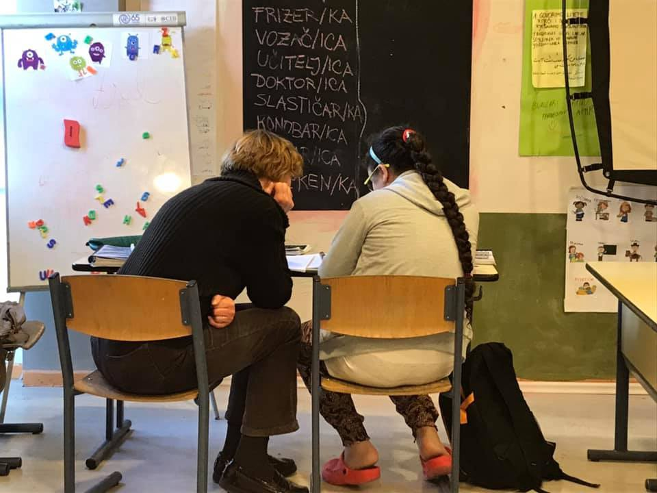
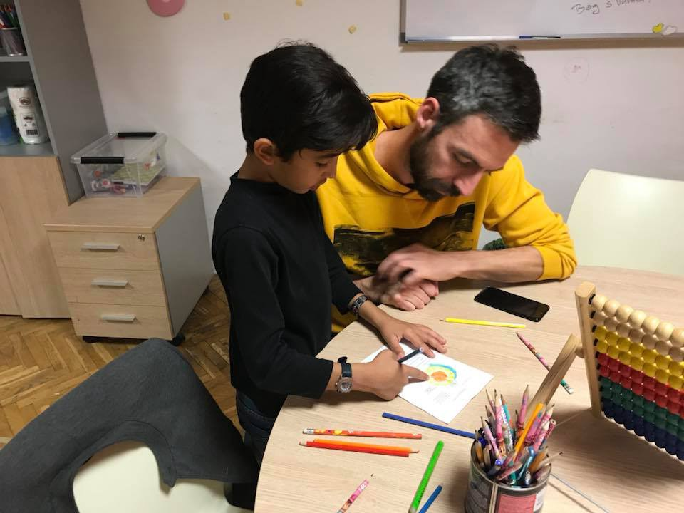
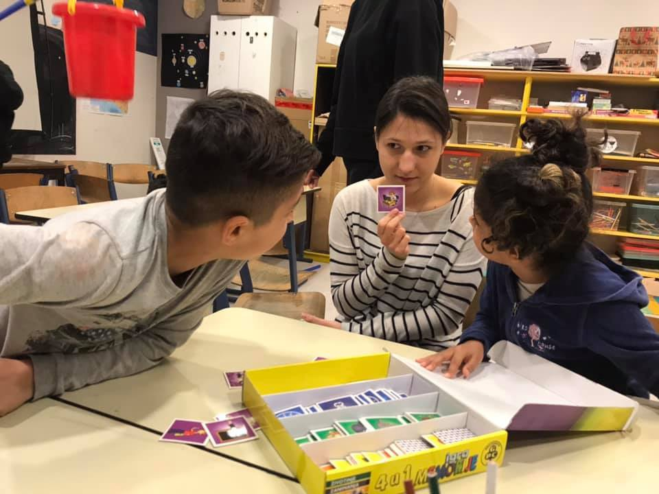
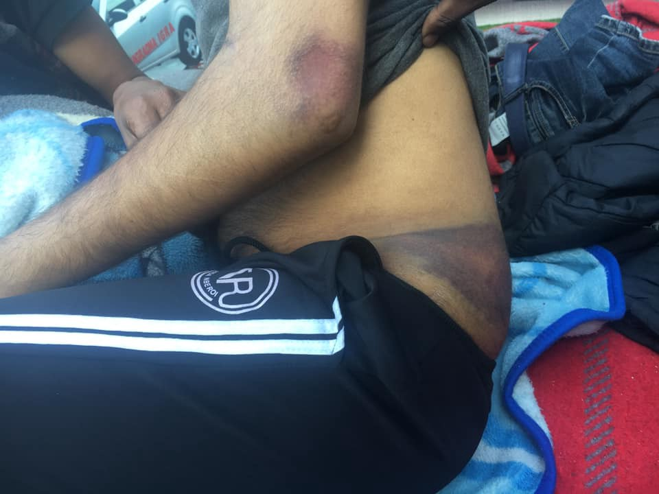
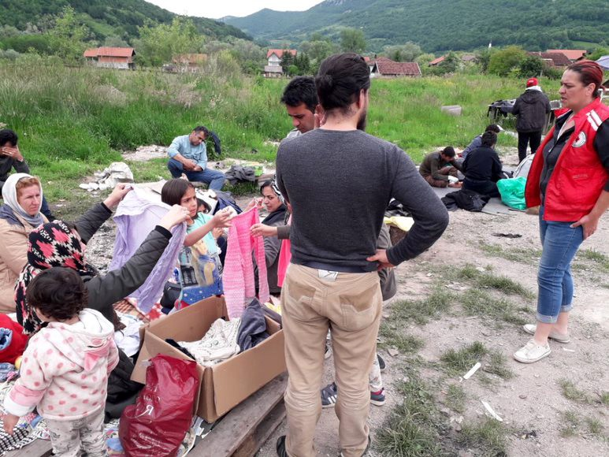
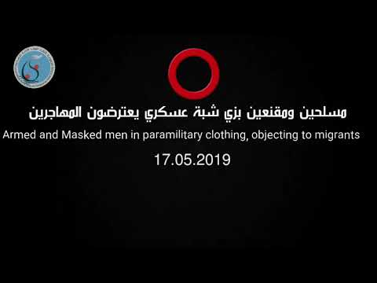

### AYS Weekend Digest 1\. \-2\./06/19 Teachers banned from tutoring refugee children
#### AYS faces further backlash from Croatian government: our teams of teachers and psychologists expelled from the Porin centre in Zagreb // Aftermath of fire in the Miral reception centre in Bosnia: 30 wounded, IOM claims all necessary safety procedures were in place // Masked renegades filmed while intercepting boats in the Aegean, forcing them back to Turkey

AYS has been the only volunteer NGO systematically mentoring children in the reception camp since early 2016\. Our program was recognized as such by schools and other relevant professionals\.
#### FEATURE STORY
### In an Act of Political Revenge, AYS Teachers are Expelled from the Porin Centre in Zagreb

As most of our readers know, Are You Syrious is a volunteer\-run NGO that has been providing integration support to asylum seekers and grantees in Croatia for four years now\. Apart from running an independent integration centre, a free shop, offering language lessons, assisting refugees in finding housing and entering the labour market and doing numerous other activities, we had continuously volunteered in Hotel Porin, Zagreb’s only reception centre for asylum seekers, where we ran programs with a specific focus on refugee children\. There, in daily shifts, our volunteers prepared the children of asylum seekers for entrance into the education system and guided them through the schooling process\. Our main activities inside and outside of Porin included teaching children the Croatian language, assisting them with studying and homework to prepare them for upcoming exams, taking them on fieldtrips, and cultural activities, and not least of all, lots of playing\.

In the Reception Centre, Are You Syrious founded the Big Sister/Big Brother programme through which every child or family got their personal volunteer to make their integration into Croatian society easier\. These volunteers were often a bridge between families and schools, in moments when, because of language barriers or other obstacles, they could not establish or maintain direct communication with teachers and other school staff\. So far we have provided around 5,000 hours of tutoring and supervision to refugee children in the Porin camp\. Eventually, when a family is granted international protection, our volunteers continue assisting the children in the aforementioned learning activities outside Porin\.

Through the Big Sister/Big Brother program every child or family got their personal volunteer to make their integration into Croatian society easier\. Photo: AYS

It must be said that Are You Syrious is the only volunteer\-run NGO offering these kinds of services to refugee children in Croatia\. As such, we are recognised by schools, child psychologists and other relevant stakeholders, who often point out that our programme is crucial for the integration of the youngest asylum seekers into Croatian society\. Many teachers from public schools have openly said that without the teachers and psychologists from AYS, their work with refugees would be a lot harder, if not impossible\.

**So what happened and how did we get kicked out of the reception centre where our services were obviously needed?**

At the beginning of 2019, the contract Are You Syrious had with the Croatian Ministry of Internal Affairs expired, and it seemed there was no interest from the government’s side for the contract to be extended\. It must be said that this contract only allowed our volunteers to enter the centre\. We have never posed any financial requests to the Ministry of the Interior, which runs the camp and has a legal obligation to ensure quality programmes for refugees, but they systematically fail to do so\. However, all this time we were pretty vocal about human rights violations in Croatia, and especially on the Croatian borders, which caused a lot of anger in the Ministry\. Three weeks ago, the head of the camp verbally asked us not to return to Porin until our contract was extended, but we did not get any written explication of this decision\. All of our formal petitions to the Ministry have been repeatedly left unanswered\.

Almost immediately after we had to pause our activities inside Porin, we received numerous cries for help from children, but also their families and their teachers\. All of them said the same: if this programme were to end due to the non\-extension of the contract, it would have dire consequences for the education and integration of child refugees\. And the end of the school year, which is the most intense period for kids who are attending schools together with their local peers, is approaching in only two weeks\.

Almost immediately after we had to pause our activities inside Porin, we’ve received numerous cries for help from children, their families, and their teachers, who had relied on our volunteers\. Photo: AYS

Faced with a complete lack of communication from the Ministry, we finally decided to go pubic with this issue\. After almost five months of silence, they reacted immediately: only an hour after our volunteers spoke out on a prominent regional TV station, N1, the Ministry published a statement, claiming that there are many NGOs doing the same job as Are You Syrious \(which is, unfortunately, completely untrue\) and finally confirming that they do not intend to allow our teachers, psychologists, and other qualified volunteers to return to the centre\.

It is interesting to note that this ban came only a week after an AYS volunteer spoke in the European Parliament, where she warned MEPs and representatives of the European Commission about disregard of the human rights of refugees and criminalisation of solidarity in Croatia\. In this same period, we published a fifth report about the push\-backs that are happening on the Croatian borders\. Informal information that we received from several trusted sources within the system said that we would not get our contract extended because we do not know how to keep problems out of the scope of the public\.

It should be noted that this it not the first attempt to shut us down: the Ministry even tried to ban our work in court, and one of our volunteers was convicted for “assisting the illegal border crossing” of a refugee family he had never met\. This was the family of little Madina Hussiny, who died minutes after she was pushed back from Croatia a few months before this trial, after which AYS raised formal charges against unknown perpetrators in the Croatian police for manslaughter\. We have published a special report focusing on this and other attempts to criminalise our work, which can be found [HERE](ays-special-when-governments-turn-against-volunteers-the-case-of-ays-81fcfe0e80e7) \.
#### **With the support of MSF, Amnesty International, and dozens of other prominent organisations who have sent letters to the Ministry, asking them to extend our contract and to stop criminalising our NGO, we shall keep on fighting for continued access to work within the Porin centre\. Any act of solidarity will be highly appreciated\.**
#### Bosnia
### Fire Broke Out in the Miral Reception Center, 30 people Were Wounded, But IOM Says All Safety Procedures Were in Place

On Saturday around 6:20, a fire broke out on the first floor of the Miral temporary reception center in Velika Kladuša, which accommodates 247 refugees hoping to cross the nearby Croatian border\. A total of 30 people have been injured, most of them by jumping through windows in order to escape the raging fire\. Nineteen of them were transported to the Cantonal hospital in Bihać, including eight who have been kept at the hospital for further treatment\. According to information from the hospital, two of them had very serious injuries and remain under medical supervision\.

> “Firefighters were there 30 minutes after the fire broke out and ambulances as well\. We didn’t see any fire extinguishers; all of this time we maybe saw one extinguisher in the entire building\. People from two rooms, 60 people in total, were forced onto the roof and had to break the glass window because of the fire\. Some of them jumped down the 20 meters from the roof to the ground, breaking legs and being injured by the broken glass\.Everything is burned inside, \[and\] we don’t know where we’ll sleep tonight,” a resident told one of our volunteers on site\. 

■■■■■■■■■■■■■■ 
> **[Are You Syrious?](https://twitter.com/areyousyrious) @ Twitter Says:** 

> > BOSNIA - Yesterday's fire at the camp in Velika Kladusa forced the residents to climb up the rooftop to escape out.. https://t.co/2xTUvlsl2d 

> **Tweeted at [2019-06-02 12:45:38](https://twitter.com/areyousyrious/status/1135165577109155840).** 

■■■■■■■■■■■■■■ 

Soon, a public statement was published by IOM, portraying a different story\. They claim that the center is equipped with a functional fire hydrant as well as sufficient fire extinguishers, “according to the plan”\.

> “IOM staff, which is present in the centers 24/7 and is trained to respond to such events, quickly responded and successfully evacuated the migrants from the burning part of the building\. IOM staff and partners are working on ensuring that the migrants and refugees, who were accommodated in the part of the Center that caught on fire, have new accommodation and everything else they need\. Additional staff is available if needed to get that part of the Center back in function as soon as possible\. The center has an evacuation plan in the cases of fire and other hazardous situations,” IOM says\. 

On Monday morning, IOM staff confiscated all electrical devices from residents of Miral, to avoid any potential fire hazard\. Residents reacted with anger and despair, but their protests were ignored\.
### Residents of Miral: They All Care About the Fire, But No One Wants to See Our Scars

An AYS volunteer who was present near Miral when the fire broke out spoke to the residents of the camp, who have shared their frustraton about the situation at the Croatian border, where police violence remains high and seems to be of less interest to the international and local media\.

Scars from the border: around 10,000 people were pushed back from Croatia in the last year alone, many of them violently, according to AYS and other public sources\. Photo: AYS

> “I went to Miral today \(just outside\) at 3 and the situation was under control; there were some tv broadcasters, staff members etc\. I spoke to a group of about 10 people from Bangladesh who were lying down just outside the camp\. Some of them have been in Bosnia for two–three months and on average tried to cross three\-four times\. They were complaining that none of the journalists were listening to their stories, they were just there for the fire\. Two of them have severe scars provoked by the Croatian police when they tried to cross two days ago, around 5 PM\. They were a group of six and the police was present with 16 agents, all of them with full helmet, leaving just the eyes visible\. The two guys were severely beaten with batons and kicked to the ground\. Their phone was broken, the little money they had was taken\. Doctors inside the camp visited them and gave them medicine, now they were waiting to go inside the camp again\. They feel they are voiceless and asked me multiple times why the police were torturing them and that we need to go to the European Parliament and denounce this behaviour\. ‘Why do they need to beat us,’ they asked\. A lot of them also asked me about the future of Europe after these elections and if it’s going to be harder or easier to get asylum in Croatia or elsewhere\. I told them that I don’t know how it’s going to be, because it’s still early and that I could speak just for my own country and no other, but the situation was not good and that getting asylum in the country doesn’t look like it’s going to be easier\. On the contrary,” our volunteer told us after the incident\. 

### Alarming Increase in Mental Issues and Skin Diseases Among Refugees in Bosnia

According to the new Red Cross / Red Crescent [report](https://media.ifrc.org/ifrc/press-release/migrants-bosnia-herzegovina-dying-seeking-safety/?fbclid=IwAR2PKxSo0S9b-t_CKW3NUz4snALlwC_vPvR2G0EJgY5PmBCKWjk10cm5QOc) which confirms our previous findings, there has been an alarming increase in mental issues and communicable diseases\. This is directly linked to conditions in overcrowded camps\. The Minister of Health Dr\. Nermina Cemalovic said on 15 May there were 800 cases of scabies in Bihac transit centres\.

> “We are extremely concerned for people on the move in Bosnia and Herzegovina\. They are arriving in poor condition, and many, including children, have walked for weeks\. They are hungry, exhausted, sick, cold and traumatized by their journeys\. The recent wet weather has just made their misery worse\. A few weeks ago, three migrants sheltering in an abandoned building burned to death when a candle they were using caused a fire\. Soon after, another fell from the top floor of a building he was sheltering in\. Psychological stress among migrants is high — just last week one man set himself on fire in desperation\. The situation is dire,” said Indira Kulenovic, operations manager for the International Federation of Red Cross and Red Crescent Societies in Bosnia and Herzegovina\. 

Many refugees are made to get off public transport near the town of Kljuc, Bosnia, and are then faced with a 90km walk to reach the nearest reception center in Bihac\. Photo: IFRC

Since the beginning of 2019, the country’s security agencies estimate around 6,000 people, including women and children, have entered Bosnia and Herzegovina, but the current transit centres holding around 3,500 people are full and thousands are sleeping at the mercy of the elements\. Last year, 25,000 migrants entered Bosnia and Herzegovina, and this spring has brought more arrivals and put even more pressure on the Una\-Sana Canton area in the northwest of the country near the Croatian border\.
#### Greece
### Masked Renegades Filmed While Intercepting Boats in the Aegean, Forcing Them Back to Turkey

Over the two weeks from May 13 to May 26, the Alarm Phone was alerted to nine boats in distress in the Aegean Sea, involving over 300 people\. Two boats were chased and attacked at sea by men in masks and returned to Turkey\.

An especially disturbing incident happened on May 17, at 4\.25 am, when the Alarm Phone was informed about a boat carrying 62 people, including 
15 women, 12 children and infants, one pregnant woman and a family with four children with disabilities\. According to the migrant travellers, they were detected and attacked by three masked men who spoke Greek and English\. These men wore black military clothes and arrived on a black highspeed dinghy, coming from the Greek coast\. They hunted them down, stole their fuel with a long metal stick, turned off their engine and then left them adrift in Turkish waters in the middle between Kusadasi and Samos Island in Greece\.

This time, the armed men who are intercepting boats have been filmed and the footage will be submitted to the authorities\.

At 4:39 am the people told the Alarm Phone that they could still see the boat with the masked men\. At 4:54 am the Alarmphone lost contact with the boat\. Later, the people informed them that the Turkish coastguard arrived after sunrise, shortly after the masked men had left, with a larger boat, intercepted them and pulled them back to Turkey\.

> “I tried four times to reach Greece\. I have faced death several times\. It is very difficult for me as I have a baby\. I cannot risk our lives\. We were so afraid\. The kids were screaming when they saw the masked men,” one of the survivors said\. 

**The survivors were brought to Aydin \(Turkey\) and are in detention\. Reportedly the pregnant lady miscarried after the terrifying attack at sea\.**

You can read the full Alarm Phone report [HERE](https://www.facebook.com/watchthemed.alarmphone/photos/a.1526182797655958/2378821179058778/?type=3&theater&hc_location=ufi) \.

**Apart from daily news in English, we also publish weekly summaries in [Arabic](%D8%A7%D9%84%D8%AA%D8%BA%D9%8A%D9%8A%D8%B1%D8%A7%D8%AA-%D9%81%D9%8A-%D9%82%D8%A7%D9%86%D9%88%D9%86-%D8%A7%D9%84%D9%84%D8%AC%D9%88%D8%A1-%D9%81%D9%8A-%D8%A7%D9%84%D8%AF%D9%86%D9%85%D8%A7%D8%B1%D9%83-b99e429d54ad) and [Persian](%D8%B9%D9%88%D8%B6-%D8%B4%D8%AF%D9%86-%D9%82%D9%88%D8%A7%D9%86%DB%8C%D9%86-%D9%BE%D9%86%D8%A7%D9%87%D9%86%D8%AF%DA%AF%DB%8C-%D8%AF%D8%B1-%D8%AF%D8%A7%D9%86%D9%85%D8%A7%D8%B1%DA%A9-7b984cac7a86) \. Follow the links to read and share the ones from the week of March 4–10\.**

**We strive to echo correct news from the ground through collaboration and fairness\. Every effort has been made to credit organizations and individuals with regard to the supply of information, video, and photo material \(in cases where the source wanted to be accredited\) \. Please notify us regarding corrections\.**

**If there’s anything you want to share or comment, contact us through Facebook or write to: areyousyrious@gmail\.com**

_Converted [Medium Post](https://medium.com/are-you-syrious/ays-weekend-digest-1-2-06-19-teachers-banned-from-tutoring-refugee-children-70b921b1167b) by [ZMediumToMarkdown](https://github.com/ZhgChgLi/ZMediumToMarkdown)._
