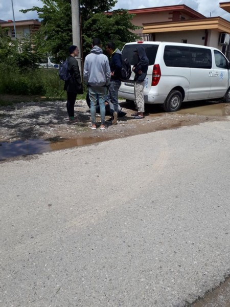
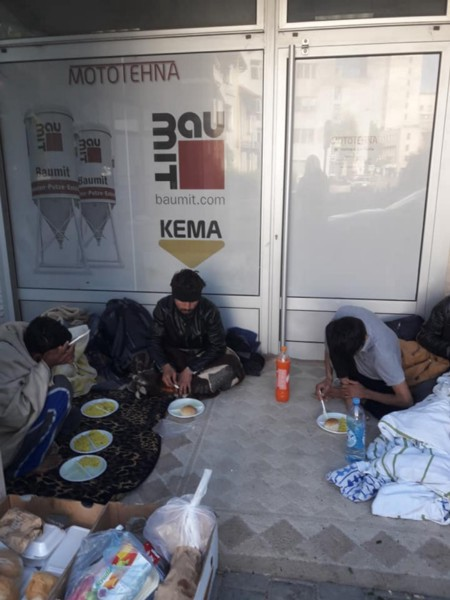
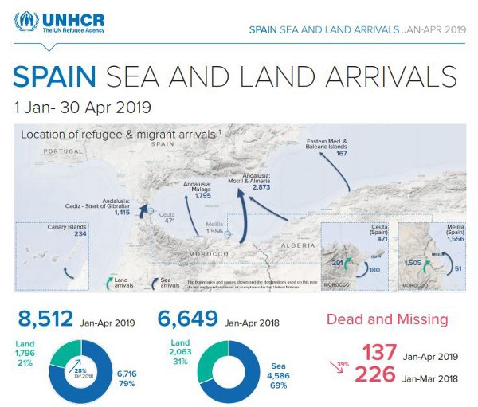

### استقرار ناظران بیشتر در مرزها
#### 26\-AYS Weekly News Summary in Persian May 20

### **سوریه**
#### به‌هنگام‌سازی وضعیت در ادلب و حما

دفاع مدنی سوریه حملات جنایتکارانه نیروهای نظامی رژیم و ارتش روسیه در مناطق اطراف ادلب و حما را گزارش می‌دهد \. حداقل ۸ نفر در روز پنجشنبه در ادلب کشته شدند و آتش‌سوزی در حال سوزاندن صدها هکتار زمین کشاورزی و جنگل به عنوان پیامد این بمب‌گذاری‌ها است \.
### **یونان**
#### تازه به مقصد رسیدگان

انتظار مسافران در جزایر یونان برای مدتی طولانی تر خبری نشده است ، اما فقدان توجه رسانه‌های اصلی به این معنا نیست که مردم تلاش برای عبور از دریای اژه را متوقف کرده‌اند و یا این اعداد در حال کاهش هستند \. گزارش قایق اژه ای تلاش برای عبور و ورود تازه‌واردها به جزایر شرقی یونان در چند هفته گذشته را به طور خلاصه بیان کرده‌است \.

### **دریا**

مردم در خطر مرگ قرار دارند و در حالی که اروپا ساعت‌های خود را تماشا می‌کند به لیبی باز می‌گردند

طی دو روز گذشته بیش از ۳۰۰ نفر از مردم لیبی را در حدود ۵ قایق خارجی ترک کردند \. سازمان بین‌المللی مهاجرت گزارش داد که ۲۸۵ نفر توسط گارد ساحلی لیبی متوقف شدند و به کشور بازگشتند و در آنجا فورا ً بازداشت خواهند شد \.

تیم سی\.وا ، مونبرد و الارم شاهد این تحولات بودند :

■■■■■■■■■■■■■■ 
> **[Sea-Watch International](https://twitter.com/seawatch_intl) @ Twitter Says:** 

> > Today #Moonbird witnessed #EU sanctioned &amp; #HumanRights-violating interceptions of 2 boats by the so-called #Libya|n Coast Guard. There are possibly more unattended distress cases. Rescue capacity needed immediately! #SafePassage https://t.co/MmILy6xoF1 

> **Tweeted at [2019-05-23 13:07:52](https://twitter.com/seawatch_intl/status/1131547291393957888).** 

■■■■■■■■■■■■■■ 

گزارش تیم سی\.وا حاکی از آن است که یک کشتی نظامی ایتالیایی از اقدام به نجات مردم برای غرق شدن و آویزان کردن قایق به سوی قایق‌های پارویی تهی شده خودداری کرده‌است \.

ما وقتی خبر دقیق‌تر خواهیم داشت به روز خواهیم رسید \.

یک قایق به لمپدوسا ایتالیا رسید \.

#### تازه به مقصد رسیدگان

انتظار مسافران در جزایر یونان برای مدتی طولانی تر خبری نشده است ، اما فقدان توجه رسانه‌های اصلی به این معنا نیست که مردم تلاش برای عبور از دریای اژه را متوقف کرده‌اند و یا این اعداد در حال کاهش هستند \. گزارش قایق اژه ای تلاش برای عبور و ورود تازه‌واردها به جزایر شرقی یونان در چند هفته گذشته را به طور خلاصه بیان کرده‌است \.

تا کنون این ماه ۱۵۹ قایق سفر خود را به جزایر دریای اژه ، ۴۸۸۵ نفر آغاز کرده‌اند \. ۵۷ قایق ، ۱۷۴۷ که وارد یونان شدند ۱۰۲ قایق ، ۳۱۳۸ نفر توسط پلیس / پلیس متوقف شده‌اند \.

۱۰ قایق به لیسووس ، ۳۱۱ نفر رسید \.

۱۱ قایق به چیوس و ۳۲۹ نفر رسید \.

۱۲ قایق به ساموس و ۴۸۲ نفر رسید \.

۱۰ قایق به کاس ، ۲۳۴ تن رسید \.

۴ قایق به لروس ، ۱۵۲ نفر رسید \.

۱۰ قایق به جزایر دیگر ، ۲۳۹ نفر رسید \.

از ۱۰۲ قایق تا کنون در این ماه توقف کردند :

۱۳ قایق را به مقصد لیسووس بودند \.

۲۵ قایق را به مقصد چیووس داشتند \.

۲۹ قایق را به مقصد ساموس بودند \.

۱۸ قایق دارای مقصد Kos بودند \.

۱۷ قایق دارای مقصد Farmakonisi / Agathonisi بودند

روز پنجشنبه ۴۹ نفر به لیسووس رسیدند \.

دفتر آمار اروپا، آمار پناهندگیِ سال ۲۰۱۸ را منتشر کرده است\. موبایل اینفو تیم، این داده ها را جمع آوری کرده و در قالب گرافیک درآورده است\. شما از هم اکنون میتوانید به این تارنما \(وبسایت\) مراجعه کنید و نرخ پذیرش افغان ها و ایرانیان را در کشورهای گوناگون من جمله یونان، آلمان و انگلیس مشاهده نمایید: [https://www\.mobileinfoteam\.org/asylum\-decision\-fa](https://www.mobileinfoteam.org/asylum-decision-fa?fbclid=IwAR3fItNWyYLhVDaTyk5nnqg14BrlRADLk8Ogkdcf6-0Ct8g7MF4W9KQp5x4) 
ما همچنین انواع مختلفِ وضعیت پناهندگیِ مناسبِ شما را برایتان توضیح داده ایم\. به طور عمومی باید گفت که نرخ پذیرشِ درخواست پناهندگی بسته به کشوری که در آن تقاضای پناهندگی داده شده، به شدت تغییر میکند\. اگر پرسش یا مشکلی در مورد آمار دارید، لطفاً پیامی به خط واتس آپِ ما ارسال نمایید: ۸۲۸۳ ۵۳۸ ۶۹۵ ۰۰۳۰

2018 میں یورپی شماریاتی دفترنےاپنے پناہ گزینوں کے اعداد و شمار کو جاری کیا۔ موبائل انفو ٹیم نے اس ڈیٹا کو مرتب کرکے گرافکس میں تبدیل کیا۔ آپ ہماری ویب سائٹ پر جا کرپاکستانیوں اور بنگلہ دیشیوں کی مختلف یورپی ممالک یونان، جرمنی اور برطانیہ سمیت منظوری کی شرح پر نظر ڈال سکتے ہیں۔ [https://www\.mobileinfoteam\.org/asylum\-decision\-ur](https://www.mobileinfoteam.org/asylum-decision-ur?fbclid=IwAR0csGdOPgDnIfT-SA9FWS8LcRA44zLC-nxcH3jdfk5fb5oLzBFFMw4JtlY) ۔ 
ہم نے آپ کے لئے دستیاب مختلف قسم کے پناہ گزینوں کی حیثیت کو بھی واضع کیا ھے۔عام طور پر، یہ کہا جانا چاہیے کہ قبولیت کی شرح بہت مختلف اور اس پہ منحصرہےکہ آپ کس ملک میں پناہ کی درخواست درج کرواتےہیں۔اگر آپ کو اعداد و شمار کے بارے میں کوئی سوالات ہیں تو، براہ مہربانی ہمیں ہمارے واٹئس ایپ ہاٹ لائن پر پیغام بھیجیں۔ 00306955388283
### **آلبانی**
#### واکنش اتحادیه اروپا به خشونت مرزی — استقرار ناظران بیشتر در مرزها ؟ \!

گروه مقابله در حال استقرار ۵۰ افسر با ۱۶ خودرو گشت و یک ون از ۱۲ کشور عضو اتحادیه اروپا برای حمایت از آلبانی در کنترل مرزی و مقابله با جرائم فرامرزی است \. ظاهرا که آن‌ها از اوایل این ماه پس از تکمیل توافقنامه وضعیت در رابطه با هم‌کاری مرزی بین اتحادیه اروپا و آلبانی بوده‌اند \. این اولین توافقنامه از این نوع با کشورهای غیر اتحادیه اروپا و اتحادیه اروپا است \. با این وجود , واکنش نامناسب دیگری توسط کسانی که پشت این تصمیمات محدود کننده, یکطرفه , امنیت سازی \( فقط \) وسواسی شده
### **مونته نگرو**

امروز بعضی از مردم به مرکز پذیرش در اسپوز ، مونته نگرو وارد شدند \. ما فرصت صحبت کردن و گوش دادن به آن‌ها را داشتیم و برخی از سوالات آن‌ها را پاسخ دادیم \. امیدواریم مردم خسته و خسته بتوانند کمی استراحت کنند \.

](assets/515a9134d5ce/1*cEqFhrDe_a1e5ZYUyw_EQQ.jpeg)

Credit: [فراس شامي](https://www.facebook.com/profile.php?id=100011544815460&fref=gs&__tn__=%2CdC-R-R&eid=ARD_ZKheQ1_gMiNShqmg0zN4tXFI0Kq6e12GVYK8-TINHGky4EdQJTfenJrGxIJFk9M-bzIOWhghkFK3&hc_ref=ARTZwJbv4fdqHouMpEuZipfbDHANn_DtpskvqhufH1JD2oRAGX6W4IDfD382dwqFs1k&dti=1157824667713728&hc_location=group)
### **بوسنی**

تازه‌واردها در توزلا ، همه ی شب را سخت می‌خوابند

](assets/515a9134d5ce/1*yKug83x4gkhLcvT7rFs2IQ.jpeg)

[Pomoc izbjeglicama u BiH/Help to refugees in Bosnia and Herzegovina](https://www.facebook.com/groups/144469886266984/permalink/352874732093164/)
### **اسپانیا**
#### افزایش زیاد در تازه‌ واردها

در اسپانیا ، مقامات شاهد افزایش میزان عبور دریایی از ۲۵ % در مقایسه با سال ۲۰۱۸ بودند \. براساس گزارش سازمان بین‌المللی مهاجرت ، امسال بیش از 7,500 تن تاکنون وارد شده‌اند که ۱۵۹ نفر جان‌ باخته اند \.

### **آلمان**

کمیسر اروپایی از پارلمان آلمان خواسته‌است تا تدابیر حفاظتی را برای حفاظت از فعالان در قوانین آتی که برای تسهیل اخراج از کشور طراحی شده‌اند ، افزایش دهد \. همانطور که قبلا ً تحت پوشش بود ، قانون پیشنهادی ، آزادی بیان را با تقسیم کردن به اشتراک گذاری اطلاعات مربوط به تبعید معوق مورد بحث قرار داد \. برای شرح کامل ، به این جا بروید \.

**اخبار بیشتری به انگلیسی در صفحه رسانه ما در دسترس است \. در مواردی که شما سوالاتی دارید و یا مایلید برخی اطلاعات مربوط به روند پناهندگی شما یا کشور مورد نظر را منتشر کنید , لطفا ً برای نوشتن پیغام روی فیس بوک یا نوشتن یک ایمیل به آر\.یو\.س تردید نکنید**

[**areyousyrious@gmail\.com**](mailto:areyousyrious@gmail.com)

_Converted [Medium Post](https://medium.com/are-you-syrious/%D8%A7%D8%B3%D8%AA%D9%82%D8%B1%D8%A7%D8%B1-%D9%86%D8%A7%D8%B8%D8%B1%D8%A7%D9%86-%D8%A8%DB%8C%D8%B4%D8%AA%D8%B1-%D8%AF%D8%B1-%D9%85%D8%B1%D8%B2%D9%87%D8%A7-515a9134d5ce) by [ZMediumToMarkdown](https://github.com/ZhgChgLi/ZMediumToMarkdown)._
