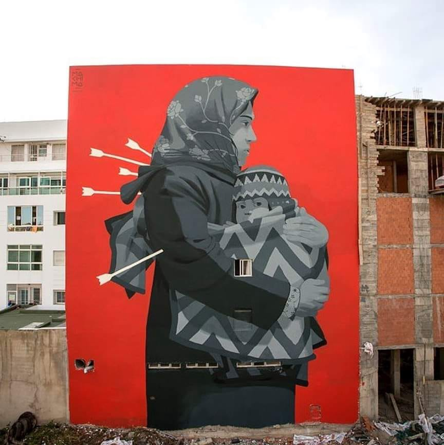
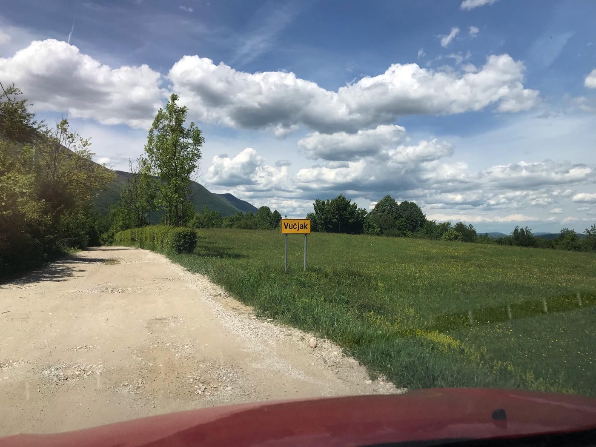
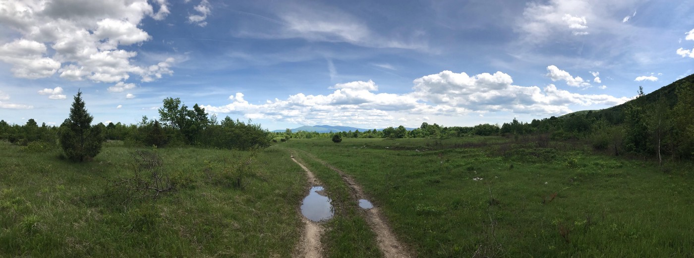
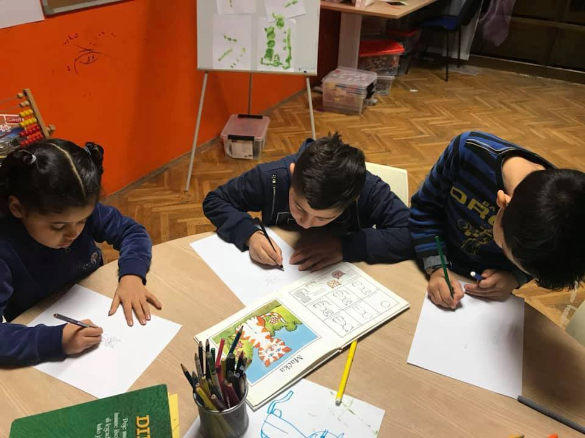
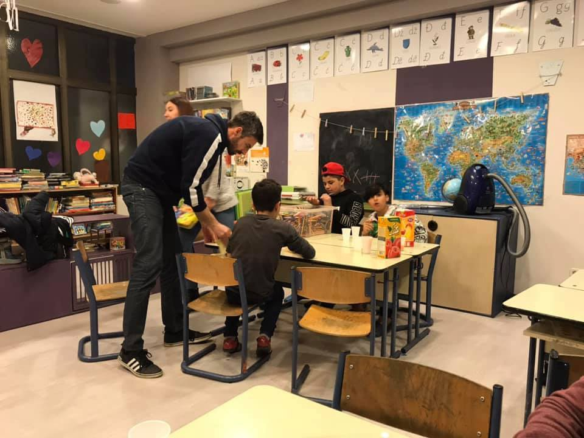

### وزارت کرواسی به این موضوع اهمیت نمی‌دهد که بچه‌ها و والدین آن‌ها
#### AYS Weekly News Summary in Persian May 27 — June 2

Rabat, Morocco By Mehdi Annassi
### **سوریه**

۲۲ نفر در روز چهارشنبه ، از جمله ۸ کودک و ۶ زن ، کشته شدند که این اتفاق در هلمت سفید اتفاق افتاده است \. پنجشنبه سی و پنجمین روز بمباران بود \.
### **ترکیه**

پلیس ترکیه گزارش داد که آن‌ها بزرگ‌ترین باند قاچاق را متلاشی کرده‌اند که مردم را از ترکیه به اروپا می‌آورد \.
### **یونان**

دفتر پشتیبانی از پناهندگان \( RSA \) گزارشی را در بحران پذیرش در شمال یونان منتشر کرد \. برای ضرورت به ترک مردم از نقاط شلوغ و پر رفت و آمد

### **مونته نگرو**

در یک ویدیو ، پدر، وحشیگریه پلیس بوسنی که او و پسرش در مرز مونته نگرو تجربه کرده‌اند را به یاد می‌آورد “ آن‌ها ما را از بیمارستان بیرون بردند و ما را در جنگل گذاشتند \.”

### **بوسنی و هرزگوین**
#### گروه داوطلب بین‌المللی از ورود به سارایوو منع شد\.

یک گروه داوطلب مجبور به توقف عملیات خود شده‌است ، پس از بازدید از جامعه توسط مقامات که برای اعتبار مدارک، اسناد و مدارک بازرسی کرده و به منطقه توزیع حمله کردند ، چرا که آن‌ها داوطلبانه تحت ویزای توریستی داوطلب شده‌اند \.” با این حال ، این بدان معنی است که توزیع روزانه غذا برای کسانی که در خیابان‌های شهر سارایوو هستند متوقف شده‌است ، و همچنین هیچ مرکز اجتماعی دیگری در سارایوو وجود ندارد که در آن برای اطلاعات ، غذا و حمایت در طول راه بین بوسنی و هرزگوین به کار می‌رود \.
#### آغاز کمپ در ناحیه ووچیاک ، نزدیک به بیهاچ

به گفته گروه عملیاتی مهاجرت در سارایوو ، ووچیاک ، در حومه بیهاچ ، مکانی خواهد بود که مردم اردوگاه‌ها از اردوگاه بیرا و میرال به آنجا منتقل خواهند شد \. وزیر امنیت بوسنی و هرزگوین و همچنین هیات نمایندگان منطقه اونا — سانا در این جلسه و تصمیم‌گیری شرکت کردند \.

در این میان ، ۳۰ نفر در آتشی که امروز صبح در اردوگاه میرال در ناحیه ی کلادوشا در شمال بوسنی آغاز شد ، مجروح شدند ، جایی که مردم در انتظار عبور از مرز کروات هستند \. تا ۱۰ صبح ۱۹ تن از پناهندگان در بیمارستان کنتونال در بیهاچ پذیرفته شدند که اغلب آن‌ها اعضای شکسته و جراحات مشابهی را از طریق پریدن از پنجره‌ها به منظور فرار از آتش‌سوزی متحمل شده بودند \. نیمی از آن‌ها باید برای درمان بیشتر در بیمارستان بمانند \. به گفته پرسنل پزشکی ، حداقل یکی از آن‌ها آسیب‌های بسیار سنگینی دارد \.

■■■■■■■■■■■■■■ 
> **[Are You Syrious?](https://twitter.com/areyousyrious) @ Twitter Says:** 

> > BOSNIA - Yesterday's fire at the camp in Velika Kladusa forced the residents to climb up the rooftop to escape out.. https://t.co/2xTUvlsl2d 

> **Tweeted at [2019-06-02 12:45:38](https://twitter.com/areyousyrious/status/1135165577109155840).** 

■■■■■■■■■■■■■■ 

### **کرواسی**

داوطلبان “ آر\.یو\.س \( معلمان ، مدرسان و دستیاران یادگیری \) که هر روز با بچه‌ها در مرکز پذیرش برای پناهندگان در زاگرب کار می‌کردند ، از کمک به کودکان با فعالیت‌های روزمره محروم شده‌اند ، زیرا وزارت کشور علی‌ رغم گزارش کامل در مورد فعالیت‌ها و نتایج عالی در کار آن‌ها تصمیم گرفته ‌است که این قرارداد را تمدید نکند که به داوطلبان ما اجازه ورود به پورین را بدهند و به هر طریقی که بتوانند کمک کنند \.

AYS

اگرچه آر\.یو\.س عملا ً کار دولت را برای آزادی انجام می‌دهد ، به نظر می‌رسد که یک نفر در وزارت کرواسی به این موضوع اهمیت نمی‌دهد که بچه‌ها و والدین آن‌ها به دلیل تصمیم شان از دست دادن مداوم حمایت می‌کنند \. ما همچنین فرض می‌کنیم که این تصمیم “ مجازات “ به شیوه‌ای برای سازمان ما اتخاذ شده‌است زیرا ما بطور مداوم به مردم در مورد آنچه در جریان است ، از جمله در مورد رفتار غیر قانونی و ناعادلانه مردم توسط پلیس و مقامات آگاه هستیم \. برخی از گزارش‌ها ما به تغییر وضعیت کمک کرده‌اند ، بنابراین ادامه خواهیم داد و از افرادی دعوت خواهیم کرد که چیزی برای گفتن به ما داشته باشند \.

> ما همچنین مبارزه خواهیم کرد تا بتوانیم از کودکان به هر طریقی که بتوانیم حمایت کنیم \. 

### **ایتالیا**

کمیساریای عالی پناهندگان سازمان ملل روز پنجشنبه ۱۵۰ نفر را از ترابلس به رم تخلیه کرد که ۶۵ تن از آن‌ها خردسال هستند \. ۱۳ مورد از کودکان زیر سن ۱ سال بودند و ۱ کودک کم‌ تر از ۲ ماه سن داشت \. با شرایط وخیم و خشونت‌آمیز در لیبی ، بسیاری از افراد دچار سو تغذیه و نیاز به توجه پزشکی هستند \. کمیساریای عالی پناهندگان سازمان ملل بر آن است که با کمک مقامات لیبی و ایتالیا تخلیه منازل بیشتری صورت گیرد \.
### **فرانسه**

هزاران نفر در لبه پاریس در حلقه موقتی “ peripherique “ زندگی می‌کنند — جاده “ peripherique “ موقتی است ، خانه موقتی بسیاری از مردمی است که روز به روز بدتر می‌شوند چون شرایط زندگی بدتر می‌شود \.
### سوییس

شورای پناهندگان سوییس در تلاش است تا دولت را تشویق کند تا شمار افرادی که برنامه‌ریزی خود را در اسکان مجدد ۲۰۲۰ و سال ۲۰۲۱ افزایش دهند را افزایش دهد \. تنها ۸۰۰ نفر ممکن است در این برنامه تا کنون پذیرفته شوند ، اما این شورا می‌خواهد شاهد افزایش تعداد ۱۵۰۰ تا ۲۰۰۰ نفر باشد \. اطلاعات بیشتری در اینجا پیدا کنید \.
### **بریتانیا**

هر کسی که ممکن است شواهدی را برای چگونگی استفاده از مترجم شفاهی در فرآیند پناهندگی ارائه دهد ، توصیه می‌شود که اطلاعات خود را به بازرس ارشد ارسال کند \.

**اخبار بیشتری به انگلیسی در صفحه رسانه ما در دسترس است \. در مواردی که شما سوالاتی دارید و یا مایلید برخی اطلاعات مربوط به روند پناهندگی شما یا کشور مورد نظر را منتشر کنید , لطفا ً برای نوشتن پیغام روی فیس بوک یا نوشتن یک ایمیل به آر\.یو\.س تردید نکنید**

[**areyousyrious@gmail\.com**](mailto:areyousyrious@gmail.com)

_Converted [Medium Post](https://medium.com/are-you-syrious/%D9%88%D8%B2%D8%A7%D8%B1%D8%AA-%DA%A9%D8%B1%D9%88%D8%A7%D8%B3%DB%8C-%D8%A8%D9%87-%D8%A7%DB%8C%D9%86-%D9%85%D9%88%D8%B6%D9%88%D8%B9-%D8%A7%D9%87%D9%85%DB%8C%D8%AA-%D9%86%D9%85%DB%8C-%D8%AF%D9%87%D8%AF-%DA%A9%D9%87-%D8%A8%DA%86%D9%87-%D9%87%D8%A7-%D9%88-%D9%88%D8%A7%D9%84%D8%AF%DB%8C%D9%86-%D8%A2%D9%86-%D9%87%D8%A7-89ae93a4dd2d) by [ZMediumToMarkdown](https://github.com/ZhgChgLi/ZMediumToMarkdown)._
