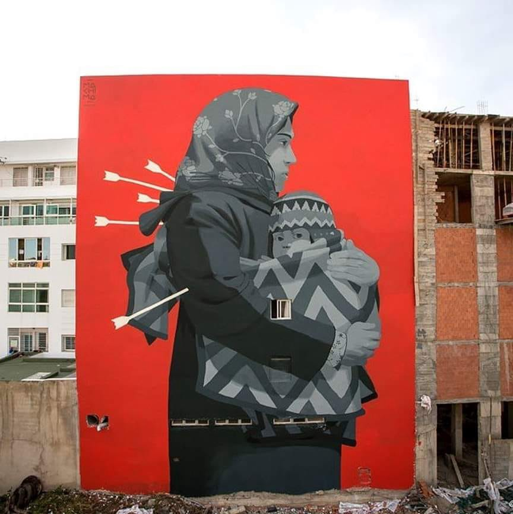
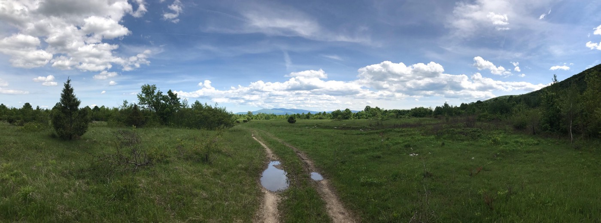
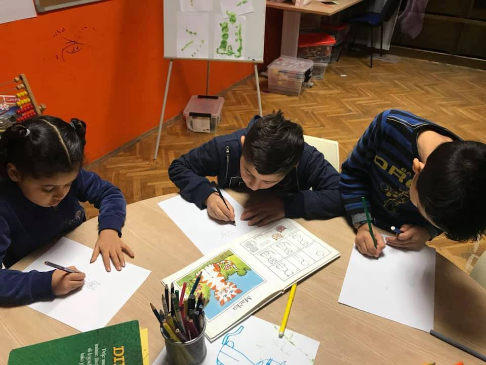
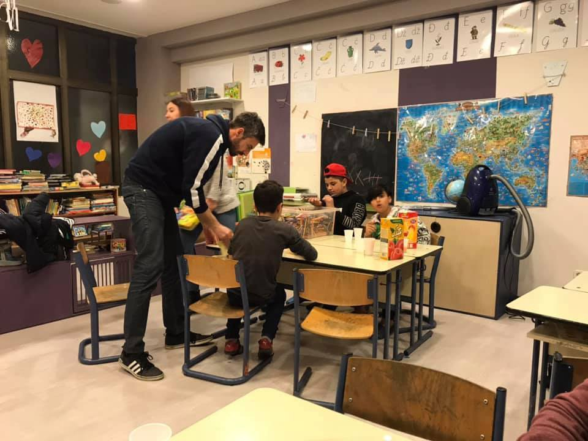

### يبدو أن شخصًا ما في الوزارة الكرواتية لا يهتم بأن الأطفال ووالديهم يفقدون الدعم
#### AYS Weekly News Summary in Arabic May 27 — June 2

Rabat, Morocco By Mehdi Annassi
### **سوريا**

قُتل ٢٢ شخصًا يوم الأربعاء ، بينهم ٨ أطفال و ٦ نساء ، بينما يواصل الدفاع المدني السوري \(الخوذات البيضاء\) توثيق الرعب المحيط بحصار إدلب\. كان يوم الخميس هو اليوم الخامس والثلاثين للقصف\.
### **تركيا**

ذكرت الشرطة التركية أنها فضت أكبر حلقة تهريب تنقل أشخاصاً إلى أوروبا من تركيا\.
### **اليونان**

أصدرت وكالة دعم اللاجئين أيغان \(ر س ا\) تقريراً عن أزمة الاستقبال في شمال اليونان\. مع ضرورة نقل الناس من المناطق الساخنة المكتظة

### **الجبل الأسود**

في مقطع فيديو ، يتذكر الأب وحشية الشرطة البوسنية التي عاشها هو وابنه على حدود الجبل الأسود\. لقد أخرجونا من المستشفى ووضعونا في الغابة

شاهد الفيديو هنا

### **البوسنة والهرسك**
#### مجموعة المتطوعين الدولية المحظورة من سراييفو

كان على متطوع جمعي ايدابريكادا أن يوقف عملياته مؤخرًا ، بعد أن تم زيارة مكانه وإغلاقه من قبل السلطات التي بحثت عن وثائق التفويض والوثائق وداهمت منطقة التوزيع ، لأنهم كانوا “متطوعين بموجب تأشيرة سياحية”\. ومع ذلك ، فإن هذا يعني أن توزيع الطعام اليومي لمن هم خارج شوارع سراييفو قد توقف ، كما أنه لم يعد هناك مركز مجتمعي في سراييفو حيث اعتاد البعض التوقف وجمع المعلومات والطعام والدعم في طريقهم عبر البوسنة والهرسك\.
#### افتتاح معسكر في منطقة فوجياك ، بالقرب من بيهاتش

سيكون فوجياك ، في ضواحي بيهاتش ، هو المكان الذي سيتم فيه نقل الأشخاص من مخيمي بيرا وميرال ، كما قررت مجموعة العمليات للهجرة في سراييفو\. شارك وزير الأمن في البوسنة والهرسك ، بالإضافة إلى وفد من منطقة صنعاء ، في الاجتماع و وضع القرار

في غضون ذلك ، أصيب ٣٠ شخصًا في حريق اندلع هذا الصباح في مخيم ميرال في منطقة فيليكا كلادوسا في شمال البوسنة ، حيث ينتظر الناس على أمل عبور الحدود الكرواتية\. وحتى الساعة ١٠ صباحًا ، تم إدخال ١٩ لاجئًا إلى مستشفى الكانتون في بيهاتش — معظمهم أصيبوا بكسر في الأطراف والإصابات المماثلة من القفز عبر النوافذ هربًا من النيران المدمرة\. واضطر نصفهم إلى البقاء في المستشفى لمزيد من العلاج\. وفقًا للطاقم الطبي ، يعاني واحد منهم على الأقل من إصابات شديدة\.

■■■■■■■■■■■■■■ 
> **[Are You Syrious?](https://twitter.com/areyousyrious) @ Twitter Says:** 

> > BOSNIA - Yesterday's fire at the camp in Velika Kladusa forced the residents to climb up the rooftop to escape out.. https://t.co/2xTUvlsl2d 

> **Tweeted at [2019-06-02 12:45:38](https://twitter.com/areyousyrious/status/1135165577109155840).** 

■■■■■■■■■■■■■■ 

### **كرواتيا**

تم منع متطوعي “اريو سيريوس” \(المعلمين ، التربويين ومساعدي التعلم\) الذين يعملون يوميًا مع الأطفال في مركز الاستقبال لطالبي اللجوء “بورين” في زغرب من مساعدة الأطفال في أنشطتهم اليومية بقرار من وزارة الداخلية ، على الرغم من تقرير شامل عن الأنشطة والنتائج العظيمة في عملهم ، قرر عدم إطالة العقد الذي يسمح للمتطوعين لدينا بدخول بورين ومساعدة بأي طريقة ممكنة\.

AYS

على الرغم من أن “اريو سيريوس” تقوم عملياً بعمل الحكومة مجانًا ، يبدو أن شخصًا ما في الوزارة الكرواتية لا يهتم بأن الأطفال ووالديهم يفقدون الدعم المستمر بسبب قرارهم\. نحن نفترض أيضًا أن القرار اتخذ “لمعاقبة” بطريقة ما منظمتنا لأننا نقوم باستمرار بإبلاغ الناس بما يجري ، بما في ذلك حول المعاملة غير القانونية وغير العادلة للأشخاص من قبل الشرطة والمسؤولين\. لقد ساعدت بعض تقاريرنا في تغيير الموقف ، لذلك سنستمر وندعو الأشخاص الذين لديهم شيء للمشاركة إلى الكتابة إلينا مباشرة\.

> سنقاتل أيضًا لنكون قادرين على دعم الأطفال في بورين بأي طريقة ممكنة\. 

### **إيطاليا**

قامت المفوضية بإجلاء ١٥٠ شخصًا من طرابلس إلى روما يوم الخميس ، ٦٥منهم من القاصرين\. كان ١٣ من القاصرين أقل من سنة واحدة وكان عمر طفل واحد أقل من شهرين\. مع تدهور الأوضاع والعنف في ليبيا ، يعاني الكثير منهم من سوء التغذية ويحتاجون إلى عناية طبية\. تحث مفوضية الأمم المتحدة لشؤون اللاجئين أنه بمساعدة من السلطات الليبية والإيطالية ، هناك حاجة إلى المزيد والمزيد من عمليات الإجلاء\.
### **فرنسا**

يعيش آلاف الأشخاص على حافة باريس في المخيمات المؤقتة\. الطريق الدائري “محيطي” الخاص بباريس هو منزل مؤقت للعديد من الناس الذين أصبحوا أكثر ميؤوسًا منهم في اليوم مع استمرار تدهور الظروف المعيشية\.
### **سويسرا**

يحاول مجلس اللاجئين السويسري تشجيع الحكومة على زيادة عدد الأشخاص الذين تعتزم إعادة توطينهم في عامي ٢٠٢٠و ٢٠٢١\. وقد يتم اعتماد ٨٠٠ شخص فقط في البرنامج حتى الآن ، لكن المجلس يريد أن يرى هذا العدد يرتفع إلى ١٥٠٠ / ٢٠٠٠

اذا احتاجو لمزيد من الناس
### **المملكة المتحدة**

يتم حث أي شخص قد يقدم أدلة على كيفية استخدام وزارة الداخلية للمترجمين الفوريين في عملية اللجوء لإحضار معلوماتهم إلى كبير المفتشين

**يتوفر الكثير من الأخبار باللغة الإنجليزية يوميًا على صفحتنا في موقع الميديوم**

**في حال كان لديك أسئلة أو ترغب في نشر معلومات معينة ذات صلة بإجراءات اللجوء أو بلد اخباره مهمة ، يرجى عدم التردد في الكتابة إلينا — إما عن طريق إرسال رسالة إلينا على فيسبوك أو إرسال بريد إلكتروني إلى**

[**areyousyrious@gmail\.com**](mailto:areyousyrious@gmail.com)

_Converted [Medium Post](https://medium.com/are-you-syrious/%D9%8A%D8%A8%D8%AF%D9%88-%D8%A3%D9%86-%D8%B4%D8%AE%D8%B5%D9%8B%D8%A7-%D9%85%D8%A7-%D9%81%D9%8A-%D8%A7%D9%84%D9%88%D8%B2%D8%A7%D8%B1%D8%A9-%D8%A7%D9%84%D9%83%D8%B1%D9%88%D8%A7%D8%AA%D9%8A%D8%A9-%D9%84%D8%A7-%D9%8A%D9%87%D8%AA%D9%85-%D8%A8%D8%A3%D9%86-%D8%A7%D9%84%D8%A3%D8%B7%D9%81%D8%A7%D9%84-%D9%88%D9%88%D8%A7%D9%84%D8%AF%D9%8A%D9%87%D9%85-%D9%8A%D9%81%D9%82%D8%AF%D9%88%D9%86-%D8%A7%D9%84%D8%AF%D8%B9%D9%85-35e23e9d10fa) by [ZMediumToMarkdown](https://github.com/ZhgChgLi/ZMediumToMarkdown)._
