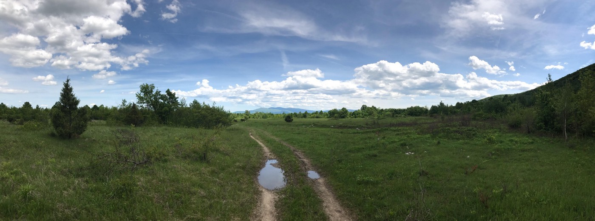

### AYS News Digest 8–9/6/19: A curfew on people in Bihać, desperation grows as no humane solutions are in sight
#### Silent escalation stemming from unbearable living conditions in the Una Sana canton, particularly Bihać, leaves both those in need of help and those assisting them desperate / Germany rejects more than 75% of family reunification requests from Greece / An accidental fire in Bekaa Valley sets off a chain of incidents further displacing 600 people while exposing deepening tensions with local residents / & more news

Bihać, Bosnia and Herzegovina \(Photo: AYS\)
### Featured

The situation is getting more serious, if that is even still possible, in Bihać and the Una\-Sana canton\.

Last night a young man fell from a construction site building close to Una river and is currently in the hospital\. His friends were held by the police to give a statement and until the publishing of this Digest, no news was available about the boys to the involved locals\.

Those who are in Bira cannot go out of the camp, while those who are outside are hungry and unattended in every way\. They are not allowed to buy food or enter most of the places in the city\.

Police in Bihać taking groups of people away from the river bank \(Photo: AYS\)

Two boys managed to get a permission to attend a funeral of their friend who drowned in Una river\.

After a special meeting was held due to the escalation of the crisis in Una\-Sana canton, some decisions were made, though no proper solution proposed for the source of the issue\. The meeting was attended by the USK Government, representatives of IOM, Mayors of Bihać and Cazin, heads of Ključ and Bosanska Krupa, representatives of UNHCR, and the Red Cross of the USK\. 
In trying to protect the local tourism and the economy of the USK, the state of emergency will not technically be introduced\. However, that is only valid for the uninformed and uninvolved public, because control of movement of migrants will take place straight away, as they announced the start of curfew restrictions, stating primarily that, “migrants will have their movement restricted\.”

People are constantly being removed from the public areas in the city \(Photo: AYS\) \.

In spite of the fact that the European Commission allegedly does not support the move of people to previously announced location in Vučjak, the city decided that the first “residents” will be on the Vučjak tomorrow\.

> If they can be on a meadow in the centre, they can also go to the meadow on Vučjak\. 

Vučjak area

They assure that the works should be completed in seven days, and they will not wait; the mayor of Bihać said:

> All the migrants who are not in Bira and Borići go to the Vučjak from tomorrow\. 

People are not allowed to be accommodated in private lodging and rented flats and, “everyone who does not have a registered activity and where undocumented migrants will be found, will be closed\.”

According to their diplomatic statements at the meeting, IOM awaits to receive the decision on whether they are taking part in the project proposed by the Bosnian politicians, and getting the funds for the new camp in Vučjak, or not\.

Reportedly, the European Commission supports **the Council of Ministers in getting more actively involved** in the whole issue, and according to the mayor of Bihać, they are siding with the idea to trust them with the previously mentioned 18 million euros assigned to the project in Bosnia and Herzegovina\. However, for the time being, neither side is fully taking the responsibility to provide people with dignified living conditions, and the only ones suffering in the situation are the people — sick, hungry, left in the sun, in the cold, out in the open as a potential victim of those who prey on the vulnerable, with pretty much all of their human rights denied, including the right to move freely and provide themselves food and shelter\.

If someone doesn’t fly over and start handling the situation as if their own child was at risk, a disaster is awaits and the culpable side in those areas might once again bear the same acronyms\.
### Syrians Displaced Further from the Turkish and Lebanese Camps

Turkey — The decision to close down the camps in Turkey has less to do with the government’s integration policy and more with contextualizing Syrians’ repatriation, experts [say](https://www.al-monitor.com/pulse/originals/2019/06/turkey-syria-why-government-closes-down-refugee-camps.html#ixzz5qGIv2smW) \. Syrians are left with three options: become urban dwellers and receive financial aid for rent, which is ambiguous in terms of sustainability; relocate temporarily to another camp and wait for its turn to be closed; or return to Syria\. The fact remains that refugees living in camps are among the most vulnerable\.

> Of the 21 camps hosting some 292,000 Syrians, there are only 13 camps left accommodating some 117,000 Syrians\. There is, however, uncertainty concerning the destination preferences of those who leave the camps\. 

Lebanon — Dozens of Syrian refugees dismantled their tents, filled trucks with belongings, and left a camp they had lived in for years in eastern Lebanon on Sunday after local authorities ordered them to evacuate in the aftermath of a brawl with local firefighters, media report\. Last week, a fire broke out on the hill overlooking the camp sparking panic\. When firefighters arrived, residents pelted their vehicle with stones over what they said was the rescuers’ late arrival\. A brawl ensued and a firefighter was injured and tents were damaged\.
As usual, the officials say the decision to evacuate is to prevent revenge attacks and further tension, after residents of the town threatened to storm the camp\. Read more [here](https://www.theage.com.au/world/middle-east/tension-as-authorities-in-lebanon-order-syrian-refugees-out-of-camp-20190610-p51w25.html) \.

> At least 15,000 Syrian children are facing homelessness as their homes in north\-east Lebanon are scheduled for demolition 

In Lebanon, more than 5,682 hard structures made of concrete are to be demolished\. They house more than 25,000 people, including 15,000 children\.
 Other villages in neighbouring regions of Bekaa, Baalbeck and Hermel are expected to suffer similar fates, with several hundred families to be affected\.
Read more [here](https://www.thenational.ae/world/mena/15-000-syrian-children-face-homelessness-in-lebanon-ngos-warn-1.870902?fbclid=IwAR14XWDITQHizYEbwtHnjMN9ORhd85ViFYGxa5YQO-dCyNy-Go_BoYWfxlE) \.
#### EU

The European Union plans to issue visas with the condition that third countries take back rejected asylum\-seekers, media r [epor](https://www.dw.com/en/eu-restricts-visas-for-non-cooperation-on-migration/a-49089434?maca=en-Twitter-sharing&fbclid=IwAR2htujvGCY4FsDRFKy6hs4HUMY8P9zD7CEEFHhEOl3qwq-ShyhO0FKnntw) t\. As this was planned back in 2017 by the Foreign Minister Thomas de Maiziere, who knows which other old, then seemingly unlikely suggestions will be put forth as the situation unravels\.

> According to EU diplomats, Bangladesh has significantly improved cooperation since the test project was introduced\. 

There is a growing concern among both potential asylum seekers and the citizens of tthe EU countries about the consequences of the recent political turns\. However, analysis shows they should take the whole picture into consideration\.

■■■■■■■■■■■■■■ 
> **[Sophie Hill](https://twitter.com/sophie_e_hill) @ Twitter Says:** 

> > THREAD: The Narrative says that the Social Democrats won in Denmark because they took a hardline stance on immigration. 

What do political scientists say? Read on for a #twitreview… https://t.co/JE9jvoxvGi 

> **Tweeted at [2019-06-06 15:13:47](https://twitter.com/sophie_e_hill/status/1136652413048381442).** 

■■■■■■■■■■■■■■ 

Political parties should not shift exclusively on immigration, regardless of what the “instinct” would say\.

■■■■■■■■■■■■■■ 
> **[Sophie Hill](https://twitter.com/sophie_e_hill) @ Twitter Says:** 

> > So how did this strategy work out?

As @[kai_arzheimer](https://twitter.com/kai_arzheimer)'s analysis shows, these policy shifts had NO effect on the propensity of working class voters to vote for the left instead of the far-right! https://t.co/1IoE1KApd0 

> **Tweeted at [2019-06-06 15:13:50](https://twitter.com/sophie_e_hill/status/1136652422280032257).** 

■■■■■■■■■■■■■■ 

Becoming hardline on immigration does not stem the tide of disaffected working class and furthermore, only legitimizes the party that was anti migration from the beginning in their position\.
#### GREECE
### Patras

![Last night I couldn’t sleep\. The buzzing of a mosquito didn’t let me rest in peace\. The idea of ​​the itch that would come later made me toss and turn in bed\. That itchy sensation that makes you scratch for days\. Surely you know that feeling, so common in summer, or when the weather gets warmer\.
 When Mohammed arrived at our truck that afternoon asking for help from the nurse, we thought his hand was broken\. The inflammation was huge and the pain reached up to his shoulder; but Mohammed told us that he didn’t fall running away from the police or trying to jump the fences\. He woke up that morning with unbearable pain in his entire arm\. He was bitten by a mosquito\. After taking him to the hospital, the doctors decided that the best solution was to drain all the pus that inflamed his hand\. It was not pleasant to see the hole between his fingers after removing the infected fluid under his skin\.
 The differences between my trivial discomfort and the real pain, and the need of the medical attention that was given to Mohammed to cure the bite of a mosquito, are the horrible conditions in the place where he was sleeping for the last eight months, waiting for an opportunity to get to northern Europe\. Something is very wrong when governments do nothing to help hundreds of people forced to live in abandoned factories, full of trash and stagnant water, which is the perfect place for mosquitoes to proliferate\.
 In Patras we see it every day when we go to give food and clothes and to visit the place that has become the home of hundreds of human beings trapped in Greece\.
 I still can not assume how big was the difference between that tingling that makes me scratch at this moment and the huge pain that didn’t allow Mohammed to rest for days, leaving a scar that will become a memory of his passage through this inhuman Europe when he was just looking for a better future\. — [Sergio GI](https://www.facebook.com/gersiog?__tn__=K-R&eid=ARAZsVNbM-i-f2KZZ8QUtQQuQ50p1Vcrj0Aai0fYPStjQZ8d9sN247fhgc4mSA1gUOM5G_dQm2QC4t_K&fref=mentions&__xts__%5B0%5D=68.ARAihA4CPh_DeNz1aQnOJQ5Y8cY0fHCVIYc5YxVXfJVpqdvhflP2u62sGQbIDwziK_zStY36qKQ20mkbgslm_74zU9MRwWYF8ihvmG0wfNsin-mxdDXii_w6t41IN79vor99n2b6wGLic_KVQtLZic3HSfN_Zgx33SMLaC4fjs5_NLUVDiItMSbty4nxVFso00qRrVCov1i_dMWUG4IlguOlhTyUxddM7IntP3AAjJm2wzY51cdNsw8fZG60wGPNCrLiOMz_30_6_CrPAvLrRliQBVKktHT3T7S4xnWx7G_SQbIocJLKpLF-pQAIfwsTZCPQqv1ZNT6FxpzD1YAZtRo) , [No Name Kitchen](https://www.facebook.com/NoNameKitchenBelgrade/)](assets/680880b7405a/1*TDs9JZWZ32PWcNv5zQaVcg.jpeg)

Last night I couldn’t sleep\. The buzzing of a mosquito didn’t let me rest in peace\. The idea of ​​the itch that would come later made me toss and turn in bed\. That itchy sensation that makes you scratch for days\. Surely you know that feeling, so common in summer, or when the weather gets warmer\.
 When Mohammed arrived at our truck that afternoon asking for help from the nurse, we thought his hand was broken\. The inflammation was huge and the pain reached up to his shoulder; but Mohammed told us that he didn’t fall running away from the police or trying to jump the fences\. He woke up that morning with unbearable pain in his entire arm\. He was bitten by a mosquito\. After taking him to the hospital, the doctors decided that the best solution was to drain all the pus that inflamed his hand\. It was not pleasant to see the hole between his fingers after removing the infected fluid under his skin\.
 The differences between my trivial discomfort and the real pain, and the need of the medical attention that was given to Mohammed to cure the bite of a mosquito, are the horrible conditions in the place where he was sleeping for the last eight months, waiting for an opportunity to get to northern Europe\. Something is very wrong when governments do nothing to help hundreds of people forced to live in abandoned factories, full of trash and stagnant water, which is the perfect place for mosquitoes to proliferate\.
 In Patras we see it every day when we go to give food and clothes and to visit the place that has become the home of hundreds of human beings trapped in Greece\.
 I still can not assume how big was the difference between that tingling that makes me scratch at this moment and the huge pain that didn’t allow Mohammed to rest for days, leaving a scar that will become a memory of his passage through this inhuman Europe when he was just looking for a better future\. — [Sergio GI](https://www.facebook.com/gersiog?__tn__=K-R&eid=ARAZsVNbM-i-f2KZZ8QUtQQuQ50p1Vcrj0Aai0fYPStjQZ8d9sN247fhgc4mSA1gUOM5G_dQm2QC4t_K&fref=mentions&__xts__%5B0%5D=68.ARAihA4CPh_DeNz1aQnOJQ5Y8cY0fHCVIYc5YxVXfJVpqdvhflP2u62sGQbIDwziK_zStY36qKQ20mkbgslm_74zU9MRwWYF8ihvmG0wfNsin-mxdDXii_w6t41IN79vor99n2b6wGLic_KVQtLZic3HSfN_Zgx33SMLaC4fjs5_NLUVDiItMSbty4nxVFso00qRrVCov1i_dMWUG4IlguOlhTyUxddM7IntP3AAjJm2wzY51cdNsw8fZG60wGPNCrLiOMz_30_6_CrPAvLrRliQBVKktHT3T7S4xnWx7G_SQbIocJLKpLF-pQAIfwsTZCPQqv1ZNT6FxpzD1YAZtRo) , [No Name Kitchen](https://www.facebook.com/NoNameKitchenBelgrade/)

MONTENEGRO

![People who were in prison, for whatever reason, while they were fleeing say that the life there was even better than in the camp they are currently staying\.
The doors here in the camp are closed at 10pm and the guardians don’t care about what’s happening during the night in rooms\. They don’t care if there are fights happening, if somebody gets injured or sick or needs any other kind of help\. As nobody is allowed to go outside, everybody smokes in the dorm and there is no possibility of fresh air\. Not only the hygiene, \[but\] also the overall treatment of the people here is cruel and not acceptable\. The people here not only need a safe place and food, they are traumatized and we should not forget that they are human beings like you and me, and we should spread the world to make sure they get all the help they need\. — [Aldar Aldar](https://www.facebook.com/aldar.aldar.98622?fref=gs&__tn__=%2Cd%2AF%2AF-R&eid=ARBQvniqfLO61joyfamOHLrUXP7-JOgWvrZsvcRlgDOnztTFY4DgCtLk9vN9kYo1azlJSULyV6MEjrZf&tn-str=%2AF&dti=1157824667713728&hc_location=group_dialog) ‎](assets/680880b7405a/1*c84rNDpKRQBxuriizT-TPg.jpeg)

People who were in prison, for whatever reason, while they were fleeing say that the life there was even better than in the camp they are currently staying\.
The doors here in the camp are closed at 10pm and the guardians don’t care about what’s happening during the night in rooms\. They don’t care if there are fights happening, if somebody gets injured or sick or needs any other kind of help\. As nobody is allowed to go outside, everybody smokes in the dorm and there is no possibility of fresh air\. Not only the hygiene, \[but\] also the overall treatment of the people here is cruel and not acceptable\. The people here not only need a safe place and food, they are traumatized and we should not forget that they are human beings like you and me, and we should spread the world to make sure they get all the help they need\. — [Aldar Aldar](https://www.facebook.com/aldar.aldar.98622?fref=gs&__tn__=%2Cd%2AF%2AF-R&eid=ARBQvniqfLO61joyfamOHLrUXP7-JOgWvrZsvcRlgDOnztTFY4DgCtLk9vN9kYo1azlJSULyV6MEjrZf&tn-str=%2AF&dti=1157824667713728&hc_location=group_dialog) ‎
#### ITALY
### As the Snow Melts, Discovered Bodies in Need of Burial

Last Friday on the Italian side of the Alps, not far from Bardonecchia, a hunter reportedly found a body\. The lifeless body of the person most likely spent the winter there, police confirmed\.

This man must have gotten lost\. Many people were trying to explain to those eager to cross the mountain that no matter what season, the mountain has a way to present a danger for anyone inexperienced, underdressed, and with no knowledge of the area\.

This death was not the only one in the area of Briançon\. On the French side, two deaths were reported last month\. The local Association now wants to give posthumous justice to these “victims of migration policies\.”
#### FRANCE
### Mobilization Monday in Paris

**June 10 at 16 pm** : great cleaning of the camp of Wilson Avenue in Saint\-Denis \(meeting at the camp site\) \.
The state of the camp is deteriorating day by day — with a lot of rubbish the rats are gathering, and it is becoming impossible to use or to look at, so with communal efforts, the activists hope to clean up the area\. Join them if you are in Paris, and don’t forget to bring some gloves\!
#### GERMANY

Three quarters of requests for family reunification under the Dublin III regulation from Greece to Germany were rejected this year by the German Federal Office for Asylum and Migration \(BAMF\) \.
The high rejection rate draws criticism from NGOs and MPs who say the BAMF imposes exceedingly harsh requirements\.

[Data](http://asylo.gov.gr/en/wp-content/uploads/2018/10/Dublin-stats_September18EN1.pdf) from the Greek Asylum Service shows that in 2018 less than 40% of “take\-charge requests” were accepted, a stark proportional decrease from 2017, when over 90% of requests were accepted\. The German government did not provide any reasons for the high rejection rate\.

Find the entire report here:

### Reporting Violent Deportations

[Afghanistan Migrants Advice & Support Org](https://www.facebook.com/AmasoAfg/?__tn__=%2CdkCH-R-R&eid=ARAmy3pYX7HM4tKcBCyg6Mi7njaU22-I_Wb4eN-GZdwI03TZZ1UbgON0gBxKEpEy4c5n_p3Pp17OEOYB&hc_ref=ARTsLcYQdWXoTyCrTys_SQ8DqBENtS_cR54jzqGItktOppVMakhwHhGILDzl-zUuR8w&fref=nf&hc_location=group) intends to document the incidents of misbehavior, use of unnecessary force, torture and ill treatment of the Afghan asylum seekers during deportation to Afghanistan, and to file a formal complaint to the Frontex Fundemental Rights Officer \(FRO\), representing those facing mistreatment during deportation to bring an end to such treatments in the future\.

> We will be filing these complaints in cooperation with the German NGO Proasyl who have presence in Germany and have documented such stories before\. Therefore, you can also contact us and become a voice if: 

> **A\) you are a returnee and have faced mistreatment during deportation\.** 

> **B\) If you know someone who has faced such a treatment and want to file a complaint\.** 

> AMASO will represent the returnee and will meet him/them in our office in Kabul and fill up the form\. Since Frontex is responsible for all the deportations to Afghanistan, therefore it doesn’t matter which country you have been deported from, you can contact us via message or email us at [amaso\.org](https://l.facebook.com/l.php?u=http%3A%2F%2Famaso.org%2F%3Ffbclid%3DIwAR3HeyTUvwJXZZE7Y_VENKqDcVOOFqvB4DPrmJw5ZLJsEvIJnEw1oBVCiog&h=AT0IYM3VqA0PvMJQ2FAG-q6cqyae31fvMTc2EuxAcDnZ9cLJhBOCWc40QT_Q9XTy0RDonuuHSzRmSDm0JDBTHgs2ci9cQqEOuSxGCkar0AmKrqvZlOutfRzGaVbtGFq_2ZSqtJIFbC9INBjsChStvGw) @gmail\.com 

#### UK

> This is so important\. Are you aware that shortly the UK government will be terminating every Safe and Legal route for child refugees to come to the UK? Are we going to let this happen without a fight? Please come and join us on 18th June\. 

On the blog of [Unis Resist Border Controls](https://www.unisresistbordercontrols.org.uk/2019/04/16/hello-world/) , you can read texts relating to various issues concerning the hostile environment policy inside British universities\. The ‘hostile environment policy’ is the anti\-migrant policy [announced](https://www.telegraph.co.uk/news/uknews/immigration/9291483/Theresa-May-interview-Were-going-to-give-illegal-migrants-a-really-hostile-reception.html) by then\-Home Secretary Theresa May in 2012, though [effectively in place](https://www.redpepper.org.uk/the-long-history-of-the-hostile-environment/) for years previously\. The policy extends border policing into universities, healthcare, schools, and other sectors, forcing workers in those sectors to enforce immigration policy\.

Unis Resist Border Controls \(URBC\) is an international collective of British, EU, non\-EU, migrant students, lecturers, & university workers opposed to Home Office surveillance, the Hostile Environment, and border controls on UK campuses\.

They are now posting this hoping it might connect people and groups are who are organizing and resisting border controls in higher education\.

**Apart from daily news in English, we also publish weekly summaries in Arabic and Persian\. You can find them on this page under “Arabic&Persian Weekly”\.**

**We strive to echo correct news from the ground through collaboration and fairness\. Every effort has been made to credit organizations and individuals with regard to the supply of information, video, and photo material \(in cases where the source wanted to be accredited\) \. Please notify us regarding corrections\.**

**If there’s anything you want to share or comment, contact us through Facebook or write to: areyousyrious@gmail\.com**

_Converted [Medium Post](https://medium.com/are-you-syrious/ays-news-digest-8-9-6-19-a-curfew-on-people-in-biha%C4%87-desperation-grows-as-no-humane-solutions-680880b7405a) by [ZMediumToMarkdown](https://github.com/ZhgChgLi/ZMediumToMarkdown)._
