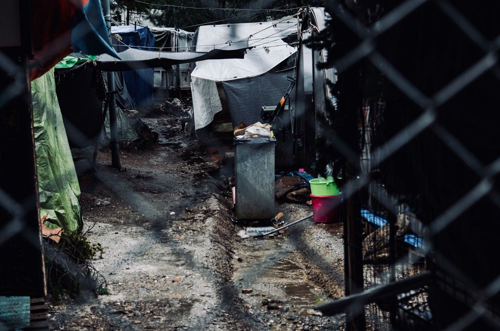
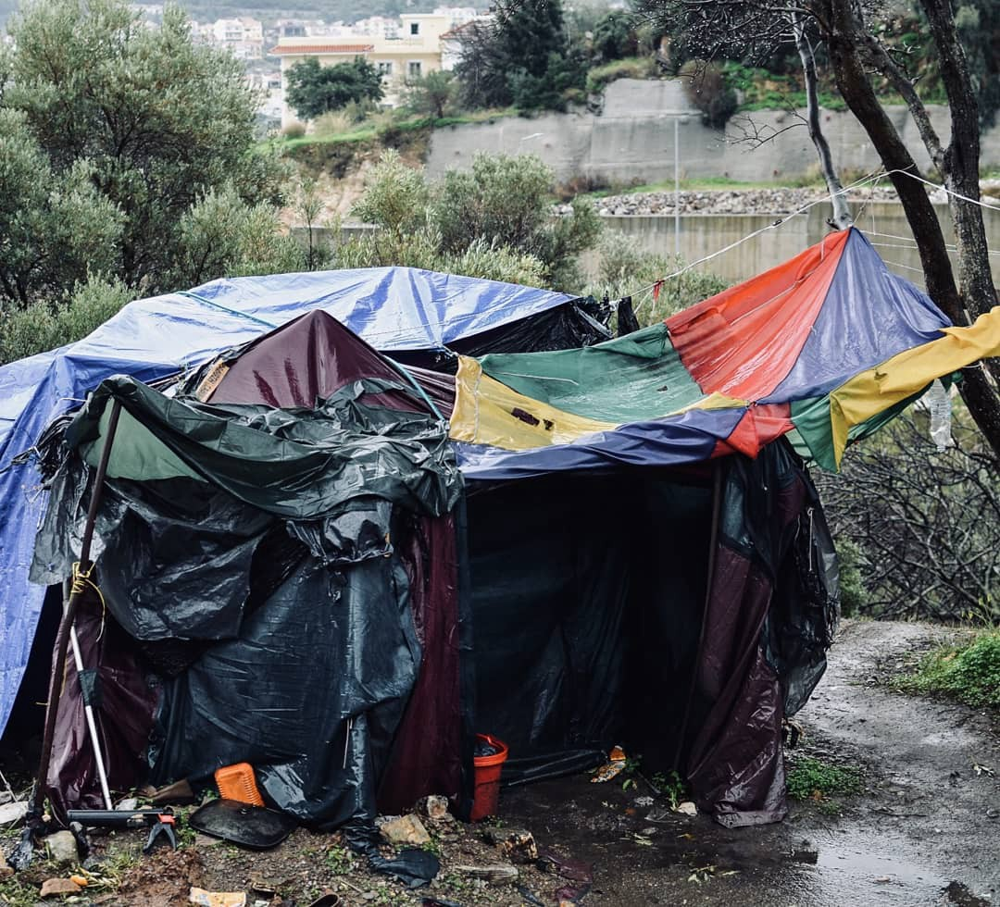

### AYS Digest 11/6/2019: Seven People Drowned, but “the situation is improving\.”

_Brave fight to expose the truth on Samos // eleventh day of port blockade for Egyptian ship carrying rescued people // France spent 500 million euros on deportation, to what effect // Meetings and protests in Germany and UK_

Samos, photo credit: Help Refugees
### FEATURE

In tragic news, seven people drowned off of Lesvos yesterday when the boat carrying sixty\-four people capsized\. [One man, four women, and two girls drowned](https://www.facebook.com/AegeanBoatReport/posts/590959538093821) \. The remaining [survivors were transferred to Moria camp](https://twitter.com/rspaegean/status/1138459992179322880) \.

■■■■■■■■■■■■■■ 
> **[RSA](https://twitter.com/rspaegean) @ Twitter Says:** 

> > Reportedly one mother who lost 2 children in #Lesvos shipwreck has been transfered in #Moria and waits to be registered. Children who survived and have fever also have to wait there. #RefugeesGr #Safepassage 

> **Tweeted at [2019-06-11 14:56:28](https://twitter.com/rspaegean/status/1138459992179322880).** 

■■■■■■■■■■■■■■ 

Additionally two more boats landed on Lesvos, carrying a total of 62 people, with another boat with an unconfirmed number of people landing near Kos\.

On Samos, the organization Still I Rise has gathered the necessary materials to file a lawsuit against the management of the refugee hotspot there\.

Samos has long been a black hole of information, with volunteers being subjected to extreme intimidation and harassment if they attempt to report the neglect and abuse in the camp\.

Samos, 2019\. Photo Credit: Still I Rise\.

Follow [their page for more updates](https://www.facebook.com/stilliriseNGO/posts/425807718012792?hc_location=ufi) \!

However, in spite of drownings, the neglect, in spite of the fact that the death rate to cross to Europe is higher than ever, in spite of the fact that search and rescue still remains effectively off limits for the Mediterranean, Frontex came out and stated that “ [the migrant situation is improving\.](http://www.ansamed.info/ansamed/en/news/sections/politics/2019/06/11/frontex-says-migrant-situation-improving-aegean-main-route_62295bf5-c79f-4c22-ad3c-2ed3e94af7e6.html) ”

> “The European Union is still under pressure, and will remain under pressure in the coming decades\. Therefore, the EU and its member states must also closely collaborate with countries of origin to make life more viable there\. Politics shouldn’t limit itself to just border protection,” Leggeri said\. Regarding the Mediterranean, Leggeri said the EU’s goal is to have a rescue centre in Tripoli, “so that migrants rescued at sea can be brought there and treated adequately”\. 

Said Fabrice Leggeri, the head of Frontex\.

Let’s not forget that the current detention facilities in Libya are essentially hellish prisons\. This has been well known for two years and still Frontex and the EU do very little except the occasional “strong condemnation\.” Leggeri added that Frontex should be involved in training Libyan authorities in search and rescue, the fight against human trafficking, and, lastly, “respect for human rights\.”

A year after the horrendous Aquarius debacle where the SAR ship was kept at sea, dangerously loaded with people, for weeks with no respite, an Egyptian ship is facing a similar issue in Tunisian waters\. It has been 11 days since the ship Mari Dive 601 saved 75 people from drowning, but they are not allowed to disembark\. [There are supplies being delivered to the ship but she needs a safe port\.](https://www.facebook.com/SeebrueckeSchafftsichereHaefen/photos/a.640137809691739/861244710914380/?type=3&theater)

But don’t worry, the situation is improving\.
### BOSNIA

In Tuzla, the authorities have officially rejected the idea of creating formal accommodation for people on the move staying there\. In 2018, there were 1725 people registered that had arrived there\. So far in 2019, 1138\. Understandably this is a significant increase, but the authorities refuse to treat this as an issue\. Of course, this means the support of these people falls to the local community who are continuing in their extraordinary efforts\. For more information, in Bosnian, go [here](http://ba.n1info.com/Vijesti/a349479/Tuzla-odbila-organizovanje-smjestaja-migrantima.html) \.

Furthermore, what Croatia is willing to spend money on is a metal fence near Velika Kladusa and in several other locations\. This is of course all in the service of Croatia’s hopeful ascent to Schengen which requires full control of border security\. The article also details that previously reported “200,000 individuals attempted to enter Croatia since last year but the strong police forces kept them out\.” This brag seems to be also at odds with the consistent denial of illegal pushbacks\. It would be interesting to see the data on the number of individuals legally readmitted to Bosnia \(which, if the “no wrongdoing” claim is to be maintained, should amount to 200,000\), but this has yet to be seen\. For more information, in Croatian, go [here](https://www.jutarnji.hr/vijesti/hrvatska/foto-pogledajte-nove-mjere-osiguranja-granice-hrvatska-na-prijelazu-omiljenom-medu-migrantima-postavila-tri-metra-visoku-metalnu-ogradu-sa-siljcima/8991416/) \.
### FRANCE

France spent 500 million euros in 2018 on deportations and their facilitation\.

[The article highlights the following](http://m.leparisien.fr/societe/immigration-le-vrai-cout-des-expulsions-05-06-2019-8086461.php) : 
“Contrary to popular belief, his conclusions are irrevocable: forced evictions, very much in the majority \(between 70 and 80% of escorts\), are more than six times more expensive than a return assisted in the country of origin\. On average, 13,800 euros against 2,500 euros\. Many of our European neighbors favor assisted returns\.”

The top five countries of forcible deportation or return were Albania, Romania, Algeria, Morocco, and Sudan\.

It’s more costly and not terribly effective, yet this “feels like the most pragmatic” decision\. This is the real cost of an ideology\. Furthermore, as is noted with Sudan as one of the top five countries of return, Solidarity Migrants Wilson reminds us of the prevalence of deportation to Sudan in the midst of the ongoing protests and fight for freedom\. [Sudan is not a safe country to return to](https://www.facebook.com/permalink.php?story_fbid=1155180631349374&id=598228360377940&hc_location=ufi) , with militias and government affiliates enacting abuse on those resisting them\.

Germany

Seebruecke is holding a conference on practical skills on how citizens can organize to petition to make their cities an open port\.

From the event advertisement, via google translate:

“In June, the first explanations for safe ports were published\. This is the right time to analyze at which point the safe ports stand and to discuss with which strategies municipalities can use for a decent migration policy\. That’s why the pier invites you to the Congress “ Safe ports\.” on June 13th and 14th at the Red City Hall in Berlin\.
 At The Congress, the first nationwide Mayor, women and responsible from the administration are networking to advance safe ports together\. Reigning Mayor Michael Müller opens the Congress\. The Capital of Potsdam is founded with nine other municipalities on the second kongresstag the municipal alliance “cities of safe ports”\.
 
 Let’s follow the words actions —SICHERE HÄFEN: LEINEN LOS FÜR KOMMUNALE AUFNAHME\!”

For more information, in German, go [here](https://seebruecke.org/startseite/sichere-haefen-in-deutschland/kongress-sichere-haefen/) \.
### UK

There will be a demonstration in advocacy for the safety of child refugees next week\. For more information, follow the link\!

**Apart from daily news in English, we also publish weekly summaries in [Arabic](%D8%A7%D9%84%D8%AA%D8%BA%D9%8A%D9%8A%D8%B1%D8%A7%D8%AA-%D9%81%D9%8A-%D9%82%D8%A7%D9%86%D9%88%D9%86-%D8%A7%D9%84%D9%84%D8%AC%D9%88%D8%A1-%D9%81%D9%8A-%D8%A7%D9%84%D8%AF%D9%86%D9%85%D8%A7%D8%B1%D9%83-b99e429d54ad) and [Persian](%D8%B9%D9%88%D8%B6-%D8%B4%D8%AF%D9%86-%D9%82%D9%88%D8%A7%D9%86%DB%8C%D9%86-%D9%BE%D9%86%D8%A7%D9%87%D9%86%D8%AF%DA%AF%DB%8C-%D8%AF%D8%B1-%D8%AF%D8%A7%D9%86%D9%85%D8%A7%D8%B1%DA%A9-7b984cac7a86) \. Follow the links to read and share the ones from the week of March 4–10\.**

**We strive to echo correct news from the ground through collaboration and fairness\. Every effort has been made to credit organizations and individuals with regard to the supply of information, video, and photo material \(in cases where the source wanted to be accredited\) \. Please notify us regarding corrections\.**

**If there’s anything you want to share or comment, contact us through Facebook or write to: areyousyrious@gmail\.com**

_Converted [Medium Post](https://medium.com/are-you-syrious/ays-digest-11-6-2019-seven-people-drowned-but-the-situation-is-improving-523febaac302) by [ZMediumToMarkdown](https://github.com/ZhgChgLi/ZMediumToMarkdown)._
