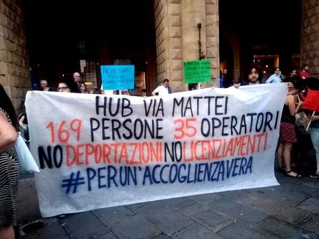

### AYS Daily Digest 13/6/2019 — Greece violated basic rights of 5 minors

More than 10,000 people intercepted at sea by Turkish coast guard /// Sea Watch refuses to bring people back to Libya /// Plans for a new camp on Samos revealed /// After 14 days, 75 people are still refused disembarkation in Tunisia /// Reception center in Bologna closed by authorities /// 15 people rescued and brought back to France on the Channel…

Rome — launch of the \#IOACCOLGO campaign
#### FEATURE STORY — GREECE FOUND TO HAVE VIOLATED BASIC RIGHTS OF FIVE MINORS

On June 13th, [The European court of Human Rights found that Greece had violated basic rights of five minors](https://twitter.com/ECHR_Press/status/1139081235391766529) \.

This court decision regards five unaccompanied minors, aged between 14 and 17, who entered Greece in 2016\. They had all fled Afghanistan as they feared for their lives as members of the Ismaili religious minority\. They were arrested and put in detention \(officially named, given their age, “protective custody” but even the court uses the term in inverted commas…\) \. Two of them attempted suicide in the Filata police station\.

The court found that the conditions of detention in various police stations amounted to **degrading treatment** and it was an **unlawful deprivation of liberty** , as the Greek government was **unable to explain why these minors had been detained in the first place** \.

Also, the court found that the authorities had not done all that could reasonably be expected of them to fulfill the obligation to provide for and protect the applicants, who had lived for a month in the Idomeni camp in an environment unsuitable for adolescents\. That obligation was incumbent on the Greek State with regard to persons who were particularly vulnerable because of their age\.

> “The Court stressed that the police stations had features that were liable to give those detained there a feeling of solitude \(no outdoor access to take a walk or have physical exercise, no internal catering arrangements and no radio or television to allow contact with the outside world\) and were unsuited to prolonged detention\. \[…\] Consequently, the conditions of detention to which three of the applicants had been subjected in various police stations amounted to degrading treatment\.” 

Authorities also failed to inform the prosecutor for minors about the arrests they had carried out\.

> “Had the prosecutor been informed, he or she would have had to take the necessary steps to have the applicants transferred to an appropriate reception facility and ensure that they did not have to live for several days in an environment that was patently unsuitable for unaccompanied minors\. 

> \[…\] Consequently, the Court was not persuaded that the authorities had done everything that could reasonably be expected of them to fulfil the obligation to provide for and protect the applicants in question, an obligation that was incumbent on the respondent State with regard to persons who were particularly vulnerable because of their age\.” 

The Court held that Greece was to pay 4,000 euros \(EUR\) to one applicant and EUR 6,000 each to four applicants in respect of non\-pecuniary damage, and EUR 1,500 to the applicants jointly in respect of costs and expenses\.

As many reports have highlighted in the past months and years, children and minors are particularly at risk in Greece and all over Europe\. The trend of European authorities to doubt their status as minors only worsens the situation\. While these five teens had the chance to officially complain to the court of human rights, many more are forced into silence by abusive authorities and lack of opportunities\.

TURKEY
#### More than 10,000 Intercepted by TCG So Far in 2019

Local media [report](https://www.ensonhaber.com/egede-yakalanan-duzensiz-gocmen-sayisi-10-bini-gecti.html) that since the beginning of 2019, the Turkish Coast Guard intercepted 10,331 people attempting to cross the Northern Aegean sea and reach Greece\. Citing an unnamed research, it is stated that during this period, 16 people lost their lives at sea and 17 presumed smugglers were captured\.

SEA

WESTERN MED — Several Spanish associations and human right defenders [denounce](https://twitter.com/walkingborders/status/1139107930207326208) that four people are still missing from the last shipwreck that took place in the Alboran sea\. The boat, which left the coasts of Morocco with 53 people, was rescued 22 miles off the coast of Granada on Wednesday, after having spent more than 48 hours adrift at sea\. Four people had to be transported via helicopter to the hospital\. [One of them did not survive](https://www.eldiario.es/andalucia/almeria/Fallece-inmigrantes-evacuados-medicamente-Alboran_0_909559425.html) \. According to local [media](https://www.eldiario.es/desalambre/desaparecidos-Mar-Alboran-Caminando-Fronteras_0_909559200.html) , once disembarked, nine people were taken to the hospital, including a child presenting severe burns\.

A second boat is known to have [returned](https://www.eldiario.es/desalambre/desaparecidos-Mar-Alboran-Caminando-Fronteras_0_909559200.html) to Moroccan coasts\. No other information is available\.

■■■■■■■■■■■■■■ 
> **[Sergio Rodrigo](https://twitter.com/SRodrigoruiz) @ Twitter Says:** 

> > #FronteraSUR Inician la búsqueda de 4 balsas de plástico en el #Mediterraneo con unas 147 personas tras el aviso de @[walkingborders](https://twitter.com/walkingborders). El Frontex está en la zona operando y Salvamento se suma al operativo https://t.co/6WA2dUBOpT 

> **Tweeted at [2019-06-13 13:23:50](https://twitter.com/srodrigoruiz/status/1139161454911852546).** 

■■■■■■■■■■■■■■ 

CENTRAL MED — Italian interior minister Salvini and MRCC Rome maintain that Libyan ports are safe place for disembarkation\. Salvini yesterday also threatened SeaWatch with fines and jail if they won’t return to Libya the 52 people who were rescued on Wednesday\.

This is SeaWatch’s reply:

■■■■■■■■■■■■■■ 
> **[Sea-Watch International](https://twitter.com/seawatch_intl) @ Twitter Says:** 

> > #SEAWATCH WON'T DISEMBARK SURVIVORS IN LIBYA - Tripoli is not a port of safety. It is a crime to forcibly return rescued people to a country at war, where they face unlawful imprisonment and torture. Italy promoting these atrocities and the #EU being complicit is outrageous. https://t.co/kD7BQ6djEY 

> **Tweeted at [2019-06-13 14:14:17](https://twitter.com/seawatch_intl/status/1139174151707615232).** 

■■■■■■■■■■■■■■ 

We have reported on conditions faced by migrants in Libya day after day \(read: abuse, violence, malnutrition, overcrowding, lack of basic health care, fear for the armed conflict that is waged in the country…\) \.

At the same time in Zarzis, Tunisia, 75 people are still refused desembarkation\. They left Libya more than two weeks ago, and have been stranded in the port for 14 days\.

UNHCR’s special envoy for the Central Mediterranean Situation, Vincent Cochetel, reports that only those who accept “ [to return home](https://twitter.com/cochetel/status/1139160534325125121) ” will be allowed to disembark\. While he finally spent some words and tweets criticizing Italian policies in the Mediterranean, he also described the expectations of those stranded off the coast of Tunisia to be allowed disembarkation and supported in the country as “ [irrealistic](https://twitter.com/cochetel/status/1136704252938792960) \.”

This is one more example of the ‘two faces’ of international agencies such as UNHCR\.

[Read and sign the petition](https://www.change.org/p/impunity-for-sea-rescue-freepia?fbclid=IwAR2jqch2UEDkPnG02KC-r6BJN42QZxUHSkb0lDtd_-M5uJNvBcg1ty96-nE) to support Pia Klemp and the other members of the crew of SeaWatch3 and Iuventa, who are on trial in Italy for saving lives at sea\.

GREECE
#### ARRIVALS

Aegean Boat Report informs that seven boats arrived between Wednesday night and today\. Find more info [HERE](https://www.facebook.com/AegeanBoatReport/posts/592359747953800) and [HERE](https://www.facebook.com/AegeanBoatReport/posts/592958714560570) \.
#### Plans for New Camp on Samos Revealed

Aegean Boat Report also [informs](https://www.facebook.com/AegeanBoatReport/posts/592544184602023) that plans for the construction of a new camp on Samos island are ready\. It will be situated in Zervou, in an area that is far from any town, service, or store\. The plans reveal already a number of issues, mainly the fact that its max capacity \(1,400 people\) is less than half of today’s asylum seeker population on the island\.

 \) \.](assets/c96712ac35a8/1*cqFPnYUcSvjc_HlaWpgNlw.jpeg)

Location where the new camp will be built \(Image from [Aegean Boat Report](https://www.facebook.com/AegeanBoatReport) \) \.

With ABR, we ask, “So why build a camp, that already today, would only be able to accommodate under half of today’s population? And why is the camp planned in the middle of nowhere?”
#### HOT AND UNSTABLE WEATHER ALL OVER GREECE

Tempertures reaching 38° C are forecast for Friday 14th and for the weekend, together with high chance of rain and thunderstorm\. Read more [HERE](https://www.keeptalkinggreece.com/2019/06/13/greece-weather-boiling-hot-june2019/) \.
#### URBAN TRANSPORT BLOCKAGE IN ATHENS

Local media outlets [report](https://www.keeptalkinggreece.com/2019/06/12/athens-metro-tramiisap-june14/) that Tram, Metro and ISAP Urban Train workers have called for an extraordinary meeting of their general assembly for Friday 14th of June between 10AM and 6PM\. From 10 o’ clock in the morning until 2 o’ clock in the afternoon, the Tram operation will be halted\. Metro Lines **1** — ISAP, **2** and **3** will not operate from 12 noon until 6 o’ clock in the afternoon\. Please note that the wagons start to withdraw to depots about an hour before the stoppage and traffic returns to normal about an hour after the stoppage\.
#### GOLDEN DAWN MEMBER TO EVALUATE POLICE ABUSE

Local media [inform](https://www.xronos.gr/epikairotita/aposyrei-tin-ypopsifiotita-toy-me-tin-hrysi-aygi-o-iatrodikastis-n-kifnidis?fbclid=IwAR2xuuHoxxI4EejkWYpi-eIOe4FvfW9fiHe_tLG3QFJ0odiurl5ICaEOS3o) that Nikolaos Kifnidis was appointed as the only coroner for the Thrace region in northern Greece\. Only after the appointment he withdrew his candidacy to the European election with the Nazi party Golden Dawn, of which he has been a long time supporter\. It is worrying that he is going to be the only Greek state official in the region with the power to ascertain police abuse, ill treatment, and torture against migrants in the Evros region\.

■■■■■■■■■■■■■■ 
> **[Vassilis Tsarnas](https://twitter.com/VassilisTsarnas) @ Twitter Says:** 

> > As @[PDimitras](https://twitter.com/PDimitras) noted, the only coroner in Thrace, the only person qualified to ascertain, inter alia, ill treatment or #Torture (by the police or paramilitary units) against migrants and #RefugeesGr in Evros, is a #Nazi #GoldenDawn party cadre!!!
#PushBacks
[xronos.gr/epikairotita/a…](https://www.xronos.gr/epikairotita/aposyrei-tin-ypopsifiotita-toy-me-tin-hrysi-aygi-o-iatrodikastis-n-kifnidis?fbclid=IwAR2xuuHoxxI4EejkWYpi-eIOe4FvfW9fiHe_tLG3QFJ0odiurl5ICaEOS3o) 

> **Tweeted at [2019-06-13 17:26:02](https://twitter.com/vassilistsarnas/status/1139222406684401665).** 

■■■■■■■■■■■■■■ 

#### VOLUNTEERING OPPORTUNITIES

Samos Volunteers are in need of a Communications & Social Media Coordinator: find the details [HERE](https://www.facebook.com/samosvolunteers/photos/a.567427800102051/1263855777125913/?type=3&theater) \. They are also looking for a Volunteer coordinator: take a look [HERE](https://www.facebook.com/samosvolunteers/photos/a.567427800102051/1263848300459994/?type=3&theater) \.

Drapen i Havet \(A Drop in the Ocean\) is looking for a [coach](https://www.facebook.com/groups/763313107147281/permalink/1798735380271710/?hc_location=ufi) for their new football team on Lesvos\.

ITALY
#### ARRIVALS

Local news [report](https://www.lastampa.it/2019/06/11/italia/nuovo-sbarco-fantasma-in-sicilia-trovata-solo-la-barca-con-il-motore-ancora-acceso-bMoDALiyYpgBlldgtWuGeO/pagina.html) of a boat found on the coast of Agrgento \(Sicily\) \. When the boat was found, the people who had arrived on it had already left the area\.

Infomigrants [published](https://twitter.com/InfoMigrants/status/1139164373312856064?fbclid=IwAR0zgP3HbsfJGlcUjcGchAH-52cisFiVnIGDAK-XbrJ453R7lMt86TO95m8) the latest numbers on asylum and migration in Italy for 2019:

2,144 migrants landed on Italian shores \( \-85%\)

15,634 asylum requests filed \( \-48%\)

42,916 asylum decisions \(75% rejections\)
#### HUB IN BOLOGNA CLOSED BY AUTHORITIES

Hub of Via Mattei — 169 people, 35 workers — No deportations, No firings \(Foto by Radio città Fujiko\)

Earlier this week, Italian authorities [decided](https://www.pressenza.com/it/2019/06/hub-di-bologna-7-domande-al-ministro-dellinterno/) — without giving any notice — to empty the reception center in via Mattei in Bologna\. In one day, activists, local organizations and unions organized a protest and were able to avoid forced transfers and police violence\. Most of the 169 “guests” will be accommodated in the city by associations and private citizens\. 20 people will be moved to the reception center in Caltanisetta\. Local media [claim](https://bologna.repubblica.it/cronaca/2019/06/11/news/migranti_bologna_presidio_davanti_all_hub_di_via_mattei_fermeremo_i_pullman-228496866/?fbclid=IwAR0gHdcj1ZtggW8Ju9zjytMaSw0Rm9ePvTzDwDlgmI9X0IPs6H-u6wwqpN0) that this is the result of the clash between Salvini’s national policies and local administrations\.
#### VOS THALASSA: Court Acquits Migrants Charged with Taking Control of the Ship

As we reported earlier, the two people who were charged for taking control of the Vos Thalassa vessel in July 2018 were acquitted in May\. The Judges, releasing the motivation of their decision, argued that, “all those embarked on the Vos Thalassa — not only those two who were identified — were witnessing a violation of their right to be taken to a safe place,” and that for the same reason, “the order given by Libyan authorities to the Vos Thalassa was clearly against the convention of Hamburg,” \(SAR convention\) \.

SEA WATCH TO DENOUNCE SALVINI FOR DEFAMATION

Italian grassroots information website, Redattore Sociale, [informs](https://twitter.com/RedattoreSocial/status/1139111689130008576) that Sea Watch intends to denounce Italian minister Salvini for defamation, regarding the false declarations on Italian media, facebook and twitter he released in the last months\.

START OF THE \#IOACCOLGO CAMPAIGN IN ROME

■■■■■■■■■■■■■■ 
> **[Carlotta Sami](https://twitter.com/CarlottaSami) @ Twitter Says:** 

> > #IoAccolgo Impressive start in Rome for the new @[ioaccolgo](https://twitter.com/ioaccolgo)  campaign promoted by almost 50 Italian associations and networks to express solidarity with migrants and refugees. Italy is an open country.
We say NO to fear and hate! https://t.co/PnB6NQBbMN 

> **Tweeted at [2019-06-13 09:22:43](https://twitter.com/carlottasami/status/1139100777253953537).** 

■■■■■■■■■■■■■■ 

FRANCE
#### 15 People Rescued on the Channel

Local news [report](https://www.lavoixdunord.fr/597396/article/2019-06-12/seize-migrants-dont-un-enfant-de-deux-ans-secourus-au-large?fbclid=IwAR3fqgtYq3l5ZhkQdgBEWLkYL-bZ1j8qhrNCiH8C_M3ai6SnhiA1ZVGAVoo) that early this Wednesday morning, fifteen people, including seven children aged between two and thirteen and one woman, were rescued off the French coast on the Channel leading to the UK\. In a state of mild hypothermia, they were brought back and taken care of at the port of Boulogne\-sur\-Mer\.
#### AYS and the Daily News Digest — how to get involved?

**We strive to echo correct news from the ground through collaboration and fairness\. Every effort has been made to credit organisations and individuals with regard to the supply of information, video, and photo material \(in cases where the source wanted to be accredited\) \. Please notify us regarding corrections\.**

**Apart from daily news in English, we also publish weekly summaries in Arabic and Persian\. Follow the links to read and share the [summary in Arabic for the week June 3–9](%D8%A7%D9%84%D8%AD%D8%AF-%D9%85%D9%86-%D8%AD%D8%B1%D9%8A%D8%A9-%D8%A7%D9%84%D8%AD%D8%B1%D9%83%D8%A9-%D9%88%D8%A7%D9%84%D8%AD%D8%B1%D9%85%D8%A7%D9%86-%D9%85%D9%86-%D8%A7%D9%84%D8%AD%D8%B1%D9%8A%D8%A9-%D9%81%D9%8A-%D8%A7%D9%84%D8%A8%D9%88%D8%B3%D9%86%D8%A9-344a48b33e4d) and the [summary in Persian for the week May 27\-June 2](%D9%8A%D8%A8%D8%AF%D9%88-%D8%A3%D9%86-%D8%B4%D8%AE%D8%B5%D9%8B%D8%A7-%D9%85%D8%A7-%D9%81%D9%8A-%D8%A7%D9%84%D9%88%D8%B2%D8%A7%D8%B1%D8%A9-%D8%A7%D9%84%D9%83%D8%B1%D9%88%D8%A7%D8%AA%D9%8A%D8%A9-%D9%84%D8%A7-%D9%8A%D9%87%D8%AA%D9%85-%D8%A8%D8%A3%D9%86-%D8%A7%D9%84%D8%A3%D8%B7%D9%81%D8%A7%D9%84-%D9%88%D9%88%D8%A7%D9%84%D8%AF%D9%8A%D9%87%D9%85-%D9%8A%D9%81%D9%82%D8%AF%D9%88%D9%86-%D8%A7%D9%84%D8%AF%D8%B9%D9%85-35e23e9d10fa) \. Find specials in both languages on our medium site\.**

**If there’s anything you want to share or comment, contact us through Facebook, Twitter or write to: areyousyrious@gmail\.com\.**

**We’re open to expanding our team of volunteer researchers, editors, and info gatherers\. Get in touch\!**

_Converted [Medium Post](https://medium.com/are-you-syrious/ays-daily-digest-13-6-2019-greece-violated-basic-rights-of-5-minors-c96712ac35a8) by [ZMediumToMarkdown](https://github.com/ZhgChgLi/ZMediumToMarkdown)._
