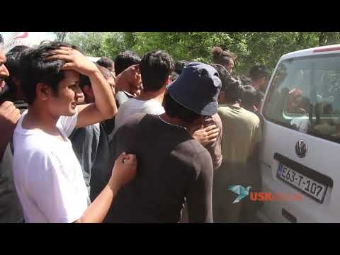
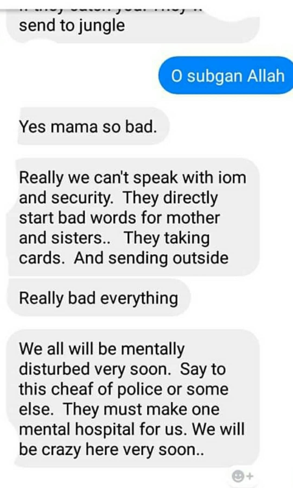
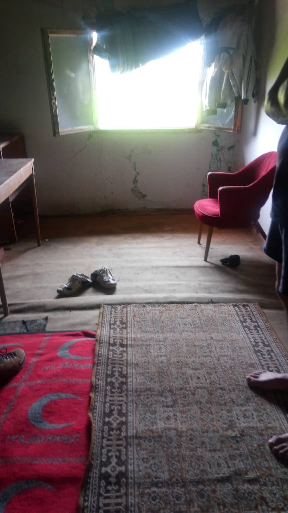

### تصاعد الوضع على حساب أضعف فئات الناس
#### AYS Weekly News Summary in Arabic, June 10–16

By Tasos Anastasiou
### **اليونان**

في جزيرة ساموس ، جمعت منظمة \(ما زلت أنا ارتفاع\) المواد اللازمة لرفع دعوى قضائية ضد إدارة نقطة ساخنة للاجئين هناك\.

كانت ساموس منذ فترة طويلة بمثابة ثقب أسود في المعلومات ، حيث يتعرض المتطوعون للترهيب والمضايقة الشديدة إذا حاولوا الإبلاغ عن الإهمال وسوء المعاملة في المخيم\.

Samos, 2019\. Photo Credit: Still I Rise\.
### **البوسنة والهرسك**

في بيهاتش ، تصاعد الوضع على حساب أضعف فئات الناس\. تم إغلاق المعسكر بالكامل طوال معظم أيام الأسبوع ، دون إمكانية التنقل بحرية للداخل أو الخارج للأشخاص المحتجزين هناك\. كما تم فرض قيود محدودة على الأشخاص الموجودين خارج المخيم والمحرومين من أي سبل انتصاف إنسانية أو قانونية من المنظمات المسؤولة اسمياً\.

هذه الشروط ليست بأي حال من الأحوال متوافقة مع أي التزامات لحقوق الإنسان ، أو النهج الإنساني من أي نوع\. لقد قررت البلاد أن تسجن حرفيًا أشخاصًا وأن المجتمع الدولي يستفيد من ذلك بوضوح ، بالنظر إلى ردود الفعل الغامضة — إن وجدت — وأي إجراءات لمعارضة هذه القرارات\.

لسوء الحظ ، فإن الحل الذي وجدوه للأشخاص خارج المخيم هو أن الحكومة المحلية ، مع رفض الأمم المتحدة ، قررت بناء موقع مؤقت للمخيم “في وسط اللا مكان” ، في الحقل المعلن عنه سابقًا في منطقة فوجيك ، على مقربة إلى الغابات المؤدية إلى الحدود الكرواتية ، بالقرب من حقول الألغام ، ولكن بعيدًا عن أي مساعدة قد يحتاجها الشخص: لا يوجد شيء ، لا توجد محلات ، ولا مياه ، ولا مبانٍ ، ولا شيء\. الشيء الوحيد الذي يضعونه في هذه الأيام هو خيام بسيطة مخصصة لجميع أولئك الذين ليس لديهم مكان للنوم داخل بيهاتش\. لقد بدأ نقل الأشخاص الذين يستخدمون الحافلات وأصبح الأشخاص الذين لا مكان لهم في المخيم قد أخذوا إلى هناك الآن\.

لا تزال هناك معارك مستمرة بين المجموعات المختلفة التي تصاعدت بالنظر في جميع الحالات الصعبة في الوقت الراهن\.

مع إغلاق بعض المعسكرات في تركيا ، يُعتقد أن البوسنة ستصبح مكانًا يقيم فيه عدد أكبر من الناس ، ومن المحتمل جدًا أن يكون لتركيا والبوسنة بعض الترتيبات المشابهة لتلك الموجودة في تركيا والاتحاد الأوروبي الآن\. هذا حديث حاليًا عن ، لم يتم نشر أي بيان رسمي حتى الآن\.

لا يزال من المستحيل السفر باستخدام وسائل النقل العام داخل البلاد ، من البلدات والقرى المختلفة ، ولا يزال العديد منهم يجلسون في منازل مهجورة في المنطقة الواقعة بين بيهاتش وكلادوشا وحول كلادوشا\. لا تزال عمليات العودة العنيفة من الشرطة الكرواتية موجودة ويترك الناس بدون حذاء ، ويتعرضون للسرقة وتعطل هواتفهم أو سرقتها\. أيضا ، يتم جعل العديد من المشي عبر النهر ، مرة أخرى تعرض للضرب بعد عبور النهر\. لسوء الحظ ، لا يتمكن الكثيرون من المرور هذه الأيام أو الاحتفاظ بممتلكاتهم بعد الاجتماع مع الشرطة\.

في كلادوشا ، هناك مجموعة صغيرة من المتطوعين يعملون لتزويد الناس بالملابس والمرافق الأساسية ، اتصل بهم إذا كنت بحاجة إلى الدعم\. سيتمكن أولئك الموجودون بالفعل في البلدة من إعطائك موقع المستودع\.
#### **تطبيق مهم جدا ومفيد**

> تتيح هذه الصفحة / التطبيق إرسال وثائق حدث عنيف حدث لك أو للآخرين ، مع حفظ البيانات حتى في حالة تلف هاتفك الذي اعتاد التقاط الصورة\. يرجى مشاركة هذه المعلومات مع الآخرين\. 

[https://www\.eyewitnessproject\.org/ar/](https://www.eyewitnessproject.org/ar/)

أيضًا ، إذا كنت أنت أو أي شخص تعرفه مررت بتجربة عنيفة من قبل الشرطة ، وكان لديك بعض الوثائق حول هذا الموضوع \(الصور والموقع المحدد وما إلى ذلك\) ، فنحن نقدر ما إذا كنت تشاركنا قصتك معنا \(على فيسبووك ا ي س\)؟ أو عبر البريد الإلكتروني\) لأننا بهذه الطريقة نقوم ببناء وتقوية التقارير المستخدمة لمحاربة هذه الممارسة ونأمل أن ننهيها قريبًا\.
### **فرنسا**

أنفقت فرنسا ٥٠٠ مليون يورو في عام ٢٠١٨ على عمليات الترحيل والتسهيلات\.

وكانت الدول الخمس الأولى من الترحيل القسري أو الإعادة القسرية هي ألبانيا ورومانيا والجزائر والمغرب والسودان\.

### **المملكة المتحدة**

إذا كنت في إنجلترا ، انضم إلى المظاهرة في الدعوة من أجل سلامة الأطفال اللاجئين الأسبوع المقبل\. لمزيد من المعلومات ، اتبع الرابط\!

> يرجى مشاركة هذا الرابط مع الأصدقاء الآخرين الذين يتحدثون لغتك ، خاصة إذا كانوا في حالة تنقل ، وربما تكون هذه المعلومات مفيدة لهم\. 

**يتوفر الكثير من الأخبار باللغة الإنجليزية يوميًا على صفحتنا في موقع الميديوم**

**في حال كان لديك أسئلة أو ترغب في نشر معلومات معينة ذات صلة بإجراءات اللجوء أو بلد اخباره مهمة ، يرجى عدم التردد في الكتابة إلينا — إما عن طريق إرسال رسالة إلينا على فيسبوك أو إرسال بريد إلكتروني إلى**

[**areyousyrious@gmail\.com**](mailto:areyousyrious@gmail.com)

_Converted [Medium Post](https://medium.com/are-you-syrious/%D8%AA%D8%B5%D8%A7%D8%B9%D8%AF-%D8%A7%D9%84%D9%88%D8%B6%D8%B9-%D8%B9%D9%84%D9%89-%D8%AD%D8%B3%D8%A7%D8%A8-%D8%A3%D8%B6%D8%B9%D9%81-%D9%81%D8%A6%D8%A7%D8%AA-%D8%A7%D9%84%D9%86%D8%A7%D8%B3-4853eb5584b5) by [ZMediumToMarkdown](https://github.com/ZhgChgLi/ZMediumToMarkdown)._
