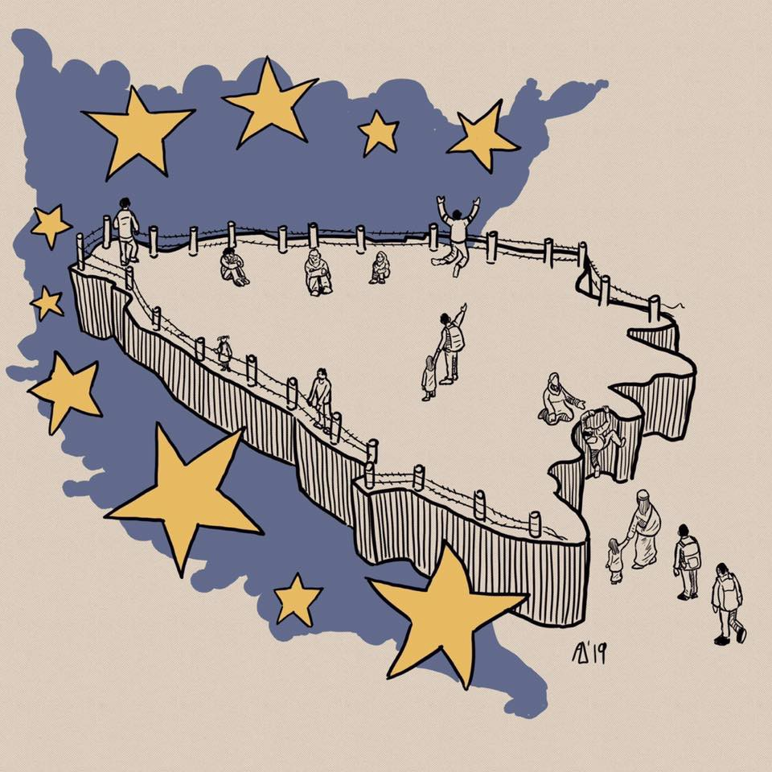

### محدود کردن آزادی حرکت و محرومیت از آزادی در بوسنی
#### AYS Weekly News Summary in Persian, June 3–9

via Tuzla volunteers page
### **یونان**

ورود مسافران به یونان در کاس ، در حال حاضر برای کسانی که انتظار تبعید به ترکیه تحت قرارداد اتحادیه اروپا — ترکیه را دارند ، رزرو شده‌است \. مردم مجبور شده‌اند برای خود در جزیره پناهگاه درست کنند چون ظرفیت آن بسیار کوچک است \.

علاوه بر این، یک نویسنده محترم در یونان فعالیت‌های غیرقانونی شهروندان ترک که از دولت اردوغان فرار کرده‌اند را به تفصیل شرح داده‌است \. آن‌ها اکنون در ترکیه زندانی هستند \. این پرونده نقض جدی حقوق بین‌الملل است چرا که این افراد به طور خاص از دست دولت ترکیه فرار می‌کنند \.

جزایر یونان — مسافران در سال جاری

گزارش قایق ا\.ژ آمار سال را برای ورود به جزایر منتشر کرده‌است :

تعداد کل پناهندگان در این جزایر در حال حاضر ۱۶۳۴۱ است \.

لیسووس : رسیدن ماه ژوئن : ۳۱۸ — کل تازه واردان امسال : ۳۶۵۱

چیوس : از ژوئن : ۱۵ تا Total تازه‌وارد در سال : ۱۲۴۰

ساموس : ورود مسافران از ماه ژوئن : ۱۱۹ — Total نفر در سال جاری : ۲۸۷۸

کاس : تعطیلات مسافران : ۱۱۲ — ۱۱۲ نفر در سال : ۹۰۵

تعداد مسافران از ماه ژوئن : ۳۶ نفر در سال جاری : ۱۰۲۳

جزایر دیگر : از ژوئن : ۲۴ تا کل تازه واردان امسال : ۷۳۲

قایق‌ها توسط پلیس دریایی متوقف شدند :

پناهندگان در ژوئن : ۴۷۵ — قایق جون : ۲۰ قایق

کل پناهندگان در سال جاری : ۱۷۱۵۸ قایق در سال جاری : 549 قایق

از صفحه آنها برای اطلاعات مربوط به مسافران دریایی به یونان پیگیری کنید \.
### **صربستان**

کمیساریای عالی پناهندگان سازمان ملل اطلاعاتی را برای ماه مه ۲۰۱۹ منتشر کرد \. براساس اطلاعات به‌دست‌آمده ، 2,512 نفر در ماه آوریل وارد این کشور شدند \( 1826در ماه آوریل \) \. در میان این عده ، ۴۵۶ و شصت و پنج کودک خردسال وجود داشتند \.

پناهندگان 3,592 در این کشور حضور دارند ، اما تنها 3,020 نفر در مراکز پذیرش دولتی اسکان داده می‌شوند \.

یک افزایش تعداد افرادی در صربستان نیز ثبت شده‌است : ۲۱۱ نفر از مجارستان ، ۲۸۴ از کرواسی ، ۴۸ تن از رومانی و ۳۰۶ از بوسنی \.

مرکز حفاظت از پناهندگان گزارش می‌دهد که بسیاری از پناهندگان که با آن‌ها روبرو می‌شوند عبارتند از “ خوابیدن \[ در شرایط سخت \] اطراف مرکز ترانزیت “ Obrenovac “ که از پناه‌گاه ، غذا و خدمات بهداشتی محروم شده‌اند \. آن‌ها از استرس و اضطراب به عنوان پیامد خشونت ، رفتار غیرانسانی ، و دفاع غیر قانونی که در کرواسی و بوسنی پیش از اینکه به صربستان اخراج شوند ، رنج می‌برند \. بسیاری از افرادی که با آن‌ها صحبت کردند ، غذا ، آب و اقلام بهداشتی را رد کردند و خشونت در بین ۶۰۰ تا ۱۰۰۰ پناهنده در اردوگاه Obrenovac را حفظ کردند \.”
### **مونته نگرو**

یک خانواده دیگر در اردوگاه تصویری از پسرشان را در شرایط بد و احساس ناتوانی خود پست می‌کنند \. کاره‌ای بیشتری باید برای سلامت روانی پناهندگان انجام شود
### **بوسنی و هرزگووین**

پس از درگیری که در اردوگاه Miral آغاز شد ، چند داوطلب برای حفظ آرامش به کار خود ادامه می‌دهند ، بنابراین اولین کمک تیم Kladusa SOS برای روزه‌ای آینده کار نمی‌کند ، با این حال توزیع مواد غذایی و مواد غذایی در چند روز آینده ازسر گرفته خواهد شد \.

در اردوگاه بیهاچ ، قرنطینه در حال حاضر پر است ، بنابراین آن‌هایی که به “ بازی “ رفتند و مکان خود را در اردوگاه از دست دادند و یا آن‌هایی که تنها رسیدند باید در پارک و یا جلوی اردوگاه بخوابند و منتظر بمانند تا برای تازه‌واردها دست خالی کنند \. متاسفانه ظرفیت‌های این اردوگاه‌ها هنوز کافی نیستند و افراد زیادی در خارج از اردوگاه‌های رسمی وجود دارند ، اما همانطور که شرایط بدتر می‌شود ، رفتار نیز بدتر می‌شود \. گروه‌هایی هستند که مبارزات خشونت‌بار خود را در میان خود آغاز کرده‌اند و برخی از مردم محلی در بیهاچ اکنون به خاطر آن می‌ترسند ، بنابراین مهم است که از افرادی جلوگیری شود که دعوا را شروع می‌کنند ، به طوری که همه افراد مبتلا به عدم تحمل رنج می‌برند ، به دلیل افزایش مبارزات افراد \. همچنین به این دلیل است که بیشتر از همیشه پلیس وجود دارد \.

اردوگاه‌ها بیرا \( در بیهاچ \) و میرال \( ولیکا کلادوشا \) تیم‌ها و مکان‌هایی برای نوجوانان بدون همراهی دارند , اما اردوگاه در سازین \( سدرا \) جای ویژه‌ای برای آن‌ها ندارد \. با ورود مامورین پلیس به اونا سانا کنتون که به می‌رسد , این بخش ادامه دارد \. اگر قدری کوچک هستید , باید منتظر بمانید تا محافظ ثبت به آنجا برسد تا شما را به اردوگاه برساند \.

تعداد افسران پلیس در طرف کروات افزایش‌یافته است و گروه‌هایی از مردم از ناحیه مرزی به بوسنی باز می‌گردند \. انتظار می‌رود که این روزها دمای هوا ، اگر شما یا هر کسی که می‌شناسید در حرکت باشد ، لطفا ً سعی کنید که کیسه‌های سنگینی حمل نکنید ، اما به جای آن مقدار زیادی آب ، مقداری غذا و در صورت امکان ، ویتامین بردارید \. بسیاری از مردم به خاطر کثیفی خسته و فرسوده شده‌اند \.

**دولت منطقه‌ای تصمیم گرفته‌است که این روز یکشنبه پس از دیدار با شروع محدودیت‌های مقررات منع رفت و آمد مردم در اردوگاه بیرا و محدود کردن حرکت در شهر of برای افرادی که در خارج از اردوگاه‌ها زندگی می‌کنند را اعلام نماید \. همچنین ، آن‌ها تصمیم گرفتند که فورا ً محل را در ووتسیاک \( که خارج از شهر به مرز کرواسی است، شروع کنند ، اما بدون هیچ ساختمانی ، مغازه‌ها ، یا حتی آب در حال حاضر \) \. تاکنون هیچ اقدام مشخصی در رابطه با آن وجود ندارد \.**
### **آلمان**
#### تغییرات پیشنهادی جدید در قانون مهاجرت

تغییرات ناشی از قانون مهاجرت جدید در آلمان ، تاثیر زیادی بر پناهجویان ، به خصوص آن‌هایی که رد شده‌اند ، خواهد داشت \.

افراد بدون مجوز اقامت دائم مجاز به تحمل مدت استخدام \( Beschaftigungsduldung \) تا پایان سال ۲۰۲۳ هستند \. و شکیبایی آموزشی نیز به شغل‌های کمکی گسترش خواهد یافت \. سپس مردم به مدت ۳۰ ماه از تبعید محافظت خواهند کرد \. با این حال ، این الزام این است که آن‌ها به مدت ۱۲ ماه تحمل خواهند شد و برای مدت ۱۸ ماه حداقل ۳۵ ساعت در هفته کار کردند \. این قانون فقط برای مردم اعمال می‌شود که قبل از ۱ اوت ۲۰۱۸ به این قانون رسیدند \.

علاوه بر این ، مقررات جدیدی در مورد اخراج \(اخراج‌ها وجود خواهد داشت \. وضعیت جدیدی برای افرادی وجود خواهد داشت که در تلاش برای جلوگیری اخراج هستند که در گرفتن مدارک خود هم‌کاری نمی‌کنند \. آن‌ها حقوق کمتری نسبت به مردم با تحمل خواهند داشت و به راحتی بازداشت خواهند شد \. تا سال ۲۰۲۲ آن‌ها ممکن است در زندان‌های معمولی بازداشت شوند ، تا زمانی که از زندانیان عادی جدا شوند \.

همچنین ، دسترسی به آموزش و همچنین ادغام و دوره‌های زبان به راحتی قابل‌دسترس خواهد بود \. اما بسیاری از مقررات تنها برای افرادی که پیش از ۱ اوت ۲۰۱۹ رسیدند ، اعمال خواهند شد \. اگر آن‌ها بعد از آن بیایند ، باید یک دیدگاه خوب برای گرفتن یک تصمیم مثبت داشته باشند \.
### **مراکش**

در این هفته ۱۰۰ نفر از جمله ۲۰ زن و کودک توسط مقامات مراکش دستگیر شدند \. آن‌ها به بازداشتگاه جدید مهاجران در کبدان برده شدند \.

این خبر با خبر منتشر شد که مقامات مراکش در مورد تاثیر آن‌ها بر توقف مهاجرت به اسپانیا سخن می‌گویند \. مقامات اسپانیایی و مراکشی به هم‌کاری یکدیگر برای جلوگیری از عبور مردم ادامه می‌دهند ، با این حال بسیاری از فعالان حقوق بشر به طور فزاینده‌ای نگران رفتار پناهندگان در مراکش هستند \. اینجا بیشتر یاد بگیرید \.

**اخبار بیشتری به انگلیسی در صفحه رسانه ما در دسترس است \. در مواردی که شما سوالاتی دارید و یا مایلید برخی اطلاعات مربوط به روند پناهندگی شما یا کشور مورد نظر را منتشر کنید , لطفا ً برای نوشتن پیغام روی فیس بوک یا نوشتن یک ایمیل به آر\.یو\.س تردید نکنید**

[**areyousyrious@gmail\.com**](mailto:areyousyrious@gmail.com)

_Converted [Medium Post](https://medium.com/are-you-syrious/%D9%85%D8%AD%D8%AF%D9%88%D8%AF-%DA%A9%D8%B1%D8%AF%D9%86-%D8%A2%D8%B2%D8%A7%D8%AF%DB%8C-%D8%AD%D8%B1%DA%A9%D8%AA-%D9%88-%D9%85%D8%AD%D8%B1%D9%88%D9%85%DB%8C%D8%AA-%D8%A7%D8%B2-%D8%A2%D8%B2%D8%A7%D8%AF%DB%8C-%D8%AF%D8%B1-%D8%A8%D9%88%D8%B3%D9%86%DB%8C-8b88ed32934) by [ZMediumToMarkdown](https://github.com/ZhgChgLi/ZMediumToMarkdown)._
