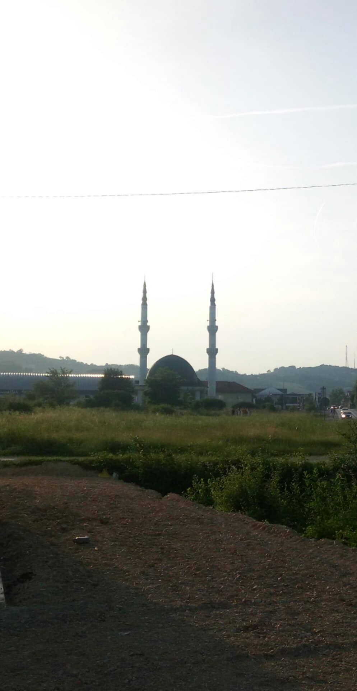

### وضعیت به قیمت آسیب ‌پذیرترین گروه‌های جامعه افزایشر‌یافته است
#### AYS Weekly News Summary in Persian, June 10–16

By Tasos Anastasiou
### **یونان**

در جزیره ساموس ، یک سازمان هنوز هم مواد لازم را جمع‌آوری کرده‌است تا پرونده‌ای را علیه مدیریت کانون پناهندگان در آنجا به ثبت برساند\.

ساموس از دیرباز یک سیاه‌چاله اطلاعات بوده و در صورت تلاش برای گزارش بی‌توجهی و سو استفاده در اردوگاه ، داوطلبان در معرض تهدید و آزار و اذیت شدید قرار می‌گیرند \.

Samos, 2019\. Photo Credit: Still I Rise\.
### **بوسنی و هرزگوین**

در بیهاچ وضعیت به قیمت آسیب ‌پذیرترین گروه‌های جامعه افزایشر‌یافته است\. این اردوگاه برای اکثر طول هفته کاملا ً بسته بود ، بدون این که امکان حرکت آزادانه در داخل یا خارج برای افرادی که در آنجا گیر کرده بودند وجود داشته باشد\. جنبش محدود همچنین بر افرادی تحمیل شده‌است که خارج از اردوگاه هستند و از هر گونه درمان‌های انسان‌دوستانه یا قانونی از سوی سازمان‌های مسئول مسئول محروم شده‌اند\.

این شرایط به هیچ وجه مطابق با الزامات حقوق بشر ، یا رویکرد بشر دوستانه به هر نوع نیست \. این کشور تصمیم گرفته‌است که به معنای واقعی زندانی کردن مردم و جامعه بین‌المللی است که از آن بهره‌مند خواهند شد، با در نظر گرفتن واکنش‌های مبهم — اگر واکنش‌ها و هیچ اقدامی برای مخالفت با این تصمیمات وجود ندارد \. متاسفانه ، راه حلی که آن‌ها برای مردم خارج از اردوگاه پیدا کردند این است که دولت محلی با مخالفت سازمان ملل تصمیم به ساخت یک اردوگاه موقتی در وسط هیچ کجا ، نزدیک به جنگل‌های منتهی به مرز کرواسی ، اما دور از هر کمکی که ممکن است نیاز داشته باشد: هیچ چیزی وجود ندارد ، نه مغازه ، نه آب ، نه ساختمان ، نه هیچ چیز \. تنها چیزی که در این روزها سر و کار دارند چادرهای ساده هستند که برای همه کسانی که مکانی برای خوابیدن در بیهاچ ندارند قرار دارند \. انتقال افراد با اتوبوس آغاز شده‌است و افراد بدون مکان در اردوگاه اکنون در آنجا دستگیر شده‌اند \.

هنوز نبرده‌ای مداوم بین گروه‌های مختلف وجود دارد که در حال حاضر در حال بررسی وضعیت سخت در آن لحظه هستند \. با بستن چند اردوگاه در ترکیه ، تصور می‌شود بوسنی به مکانی تبدیل خواهد شد که در آن مردم بیشتری در آنجا باقی خواهند ماند و احتمالا ً ترکیه و بوسنی ممکن است قراردادی مشابه آنچه که ترکیه و اتحادیه اروپا دارند داشته باشند \. این موضوع در حال حاضر فقط در مورد آن صحبت شده‌است ، هیچ بیانیه رسمی تا کنون منتشر نشده است \.

هنوز امکان سفر با حمل و نقل عمومی در کشور ، از شهرهای مختلف و روستاهای مختلف وجود ندارد و بسیاری هنوز خانه‌های متروک در منطقه بین بیهاچ و کلادوشا و اطراف کلادوشا را اشغال کرده اند \. دیپورت های خشونت‌آمیز از پلیس کرواسی هنوز رخ می‌دهند و مردم بدون کفش می‌مانند ، دزدی می‌کنند و یا دزدیده‌شده یا دزدیده می‌شوند \. همچنین بسیاری از آن‌ها در طول رودخانه راه می‌روند و یک‌بار دیگر پس از عبور از رودخانه مورد ضرب و شتم قرار می‌گیرند \. متاسفانه ، بسیاری از افراد موفق به گذراندن این روزها یا حفظ دارایی‌های خود پس از دیدار با پلیس نشدند \.

در کلادوشا ، گروه کوچکی از داوطلبان کار می‌کنند که برای ارائه لباس و امکانات پایه پایه کار می‌کنند و اگر به کمک نیاز دارید با آن‌ها تماس بگیرید \. آن‌هایی که در حال حاضر در شهر هستند می‌توانند مکان انبار را به شما بدهند
### **یک اپلیکیشن بسیار مهم و مفید**

> **این صفحه / برنامه این امکان را برای ارسال اسناد یک رویداد خشونت‌آمیز که برای شما و یا دیگران اتفاق می‌افتد فراهم می‌کند ، حتی اگر گوشی شما برای گرفتن عکس مورد استفاده قرار بگیرد \. لطفا ً این اطلاعات را با دیگران به اشتراک بگذارید \.** 

**همچنین ، اگر شما یا هر کسی که می‌شناسید یک تجربه اخیر از یک دیپورت اجباری توسط پلیس داشته‌ است ، و مدارکی هم در مورد آن دارید \( عکس ، محل دقیق و غیره \) ، ما از این که شما داستان خود را با ما به اشتراک بگذارید \( در صفحه آر\.یو\.س در فیسبوک یا توسط ایمیل \) استفاده کنید ، زیرا این روش ما گزارش‌ها را برای مبارزه با چنین عملی و امیدواریم که به زودی به پایان برسد\.**
### **فرانسه**

فرانسه ۵۰۰ میلیون یورو در سال ۲۰۱۸ در مورد اخراج و تسهیلات آن‌ها هزینه کرده‌است \.

پنج کشور برتر از تبعید و بازگشت اجباری آلبانی ، رومانی ، الجزایر ، مراکش و سودان بودند \.

### **انگلستان**

اگر شما در انگلستان هستید ، هفته آینده در حمایت از امنیت پناهندگان کودک به تظاهرات ملحق شوید \. برای اطلاعات بیشتر ، لینک را دنبال کنید \!

**اخبار بیشتری به انگلیسی در صفحه رسانه ما در دسترس است \. در مواردی که شما سوالاتی دارید و یا مایلید برخی اطلاعات مربوط به روند پناهندگی شما یا کشور مورد نظر را منتشر کنید , لطفا ً برای نوشتن پیغام روی فیس بوک یا نوشتن یک ایمیل به آر\.یو\.س تردید نکنید**

[**areyousyrious@gmail\.com**](mailto:areyousyrious@gmail.com)

_Converted [Medium Post](https://medium.com/are-you-syrious/%D9%88%D8%B6%D8%B9%DB%8C%D8%AA-%D8%A8%D9%87-%D9%82%DB%8C%D9%85%D8%AA-%D8%A2%D8%B3%DB%8C%D8%A8-%D9%BE%D8%B0%DB%8C%D8%B1%D8%AA%D8%B1%DB%8C%D9%86-%DA%AF%D8%B1%D9%88%D9%87-%D9%87%D8%A7%DB%8C-%D8%AC%D8%A7%D9%85%D8%B9%D9%87-%D8%A7%D9%81%D8%B2%D8%A7%DB%8C%D8%B4%D8%B1-%DB%8C%D8%A7%D9%81%D8%AA%D9%87-%D8%A7%D8%B3%D8%AA-81fe7dd6e6d) by [ZMediumToMarkdown](https://github.com/ZhgChgLi/ZMediumToMarkdown)._
