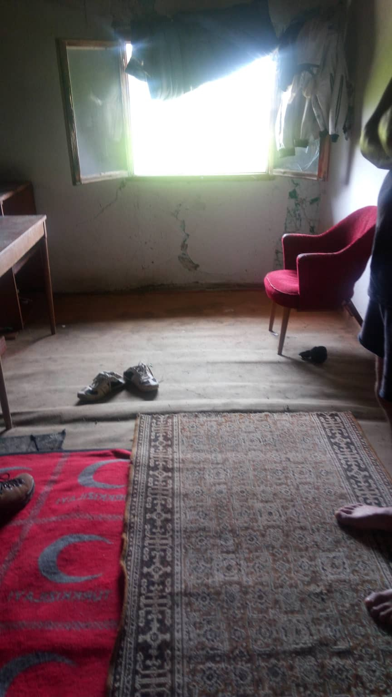
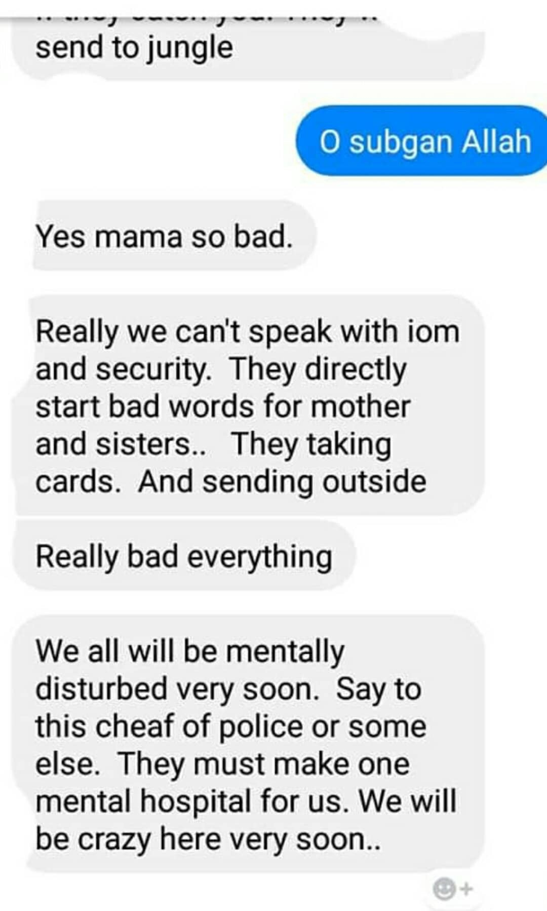
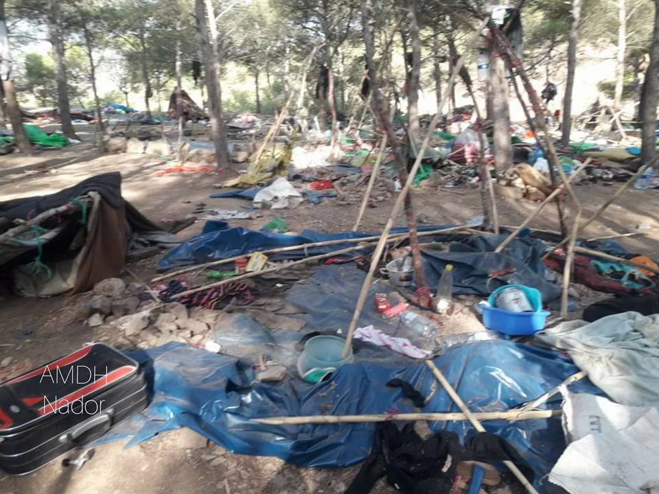
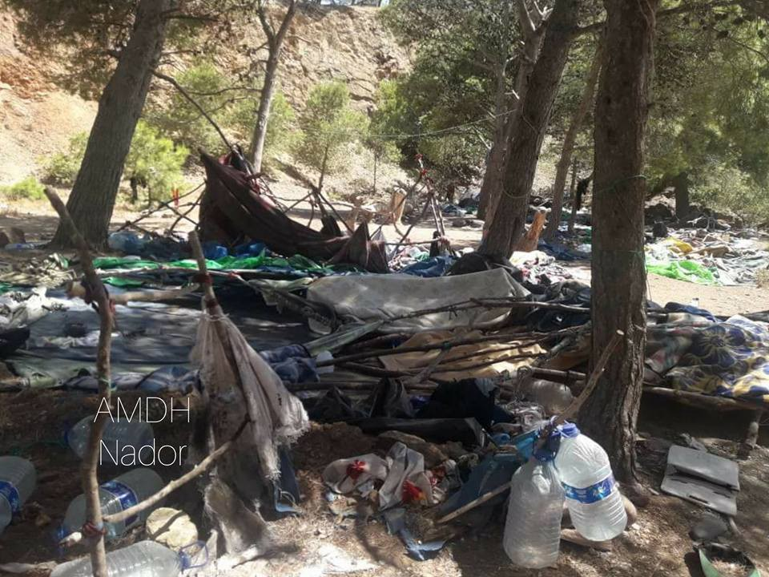
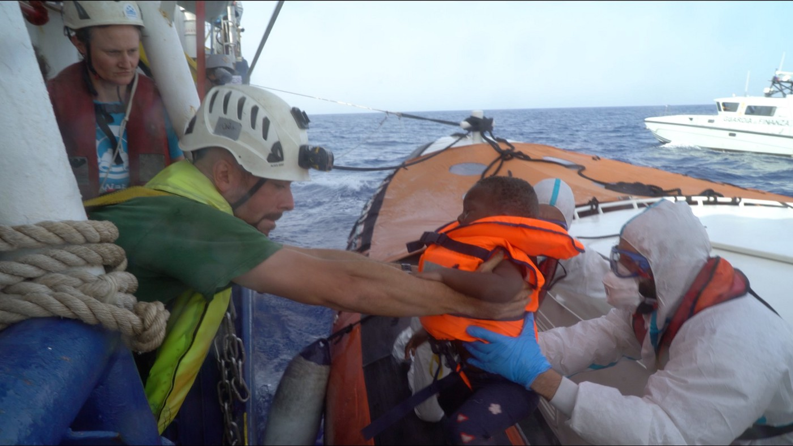

### AYS News Digest 15\-16/6/19: Dispersion of responsibility at the cost of lives in Bihać
#### Status quo in Bosnia and Herzegovina and growing frustration on all sides / A man in Gorizia dies / ‘Dublin’ returns from Germany to Italy continue / New arrivals in the UK / very important website&app to share around…

People staying in abandoned houses fear new police raids in areas around Bihać \(Photo:AYS\)
### Featured

About 600 people were transferred from Bihać to Vučjak, as previously announced and as we reported during the week\. Also, the Bihac police raided several private houses in which nearly 300 people were accommodated and moved them to tents on a former garbage dump outside the town in Vučjak\. In fact, all the people who were uregistered and not placed in the Bira centre in Bihać were taken on buses and left in the Vučjak area\.

The local police and local Red Cross teams are the only ones present there as the international organisations don’t support the idea and placement in Vučjak in the current setting\. The Red Cross is reportedly only allowed to provide first aid, so there is no medical care for the people staying there\. Also, the food being distributed is very simple and not sufficient to feed the people\. As there is nothing around, there is also no possibility for them to buy something\.

The situation in Bira has not gotten better in the meantime\.

messages sent from Bira camp in Bihać

The Ministry of the Interior of the Una Sana canton said that four policemen were injured and one person being transferred to Vučjak was also injured in the process\. However, the people who were transferred there were taken without being asked about anything that concerns their situation, state or case, and the police is forcing them to stay in this area, which has been made a provisional camp in an ‘ad hoc’ manner\. The area is unsuitable and dangerous for living, including dangers because of the snake season, proximity of mine fields, wild animals inhabiting that region, the lack of any sort of security or safety measures for the place to function as a reception site, etc\.

Some groups of Bihać citizens gathered on Sunday afternoon in a protest against the current situation in the city, violence and poor security, calling on officials to stop ignoring the situation on the federal level\.

The often superficial media reporting has not done justice to the people, and media sensationalism only adds fuel to the fire\. The international organisations have a similar attitude to the situation as do the governments, refusing to accept that they all have to adjust to this particular situation and try to solve it, instead of dealing with some theoretical type of situation or project, and this stubbornness and sticking to each one’s supposed principles in this case means more lives lost and people irreversibly damaged in all possible ways\.

The efforts of the local and other people willing to help can only go so far\. It is clear who must take up the responsibility in this situation\.

Why they are not doing so and whose appetite and greed has not yet been satisfied in the way they insist on, is unknown to us\.
#### MOROCCO

During a visit to one of the camps in Nador, the volunteers of AMDH Nador noticed the damage done by the auxiliary forces and the gendarmes when they visited the sites\.

Recent deaths in the forest are linked to the ban on migrants accessing care by the Moroccan authorities, but also to the failure of projects intended for assistance to migrants, which in spite of the important funding received have not succeeded in offering each household a simple hygiene kit and a few square meters of plastic in order to build a shelter, AMDH team reports\.
#### SEA

The Sea Watch was allowed to evacuate five medical emergencies and their relatives from the vessel that saved the people off Libyan shores, but as the Sea Watch crew reports, the situation on board remains intolerable\.

> There are still 43 people left on the Sea\-Watch, of whom about 1/3 have already had to receive medical care\. Many of our guests are suffering from seasickness\. Among them are also numerous patients, who can be helped only on land with the urgently necessary specialist medical treatment and diagnostics\. 

> For four days now we have been living here together in a very small space\. The hygienic conditions are critical, the supply possibilities limited, and the psychological strain enormous\. The majority of our patients have been exposed to psychological and physical violence for years, which makes the confined situation all the more stressful and potentially retraumatizing\. 

> Every day that this situation continues, we endanger the physical and mental health of our guests and crew\. 

> Please help us to stand up for the rights of the people on board and to live up to our common European values\. 

While Italy seriously considers Libya to be safe, the EU is silent\. But 60 German cities and municipalities have declared themselves safe ports, the mayor of rottenburg even offered a bus to pick up survivors of the sea\-watch3\.
#### CROATIA

With the rain and storm episodes, the past few days have been difficult for the areas inland and especially in the [Gorski kotar](http://www.gorskikotar.hr/en/discover_gorski_kotar/natural_attractions/rivers) region\. The rivers in the area can be dangerous during stormy weather and hail has caused a lot of damage in many places, so if someone you know is passing through those areas, make sure they are mindful of the weather situation\.

In general, all water sources and all running water from water pipes and other similar sources is good for drinking across the region\.

If someone finds themselves in harm’s way or in danger within the country, with a need for emergency help, the number 112 is the central number to call for help, and the conversations made to that number are being recorded so whatever you state in the phone call can be traced and serve as documentation if there is a need later on\.

Please, let us know if you or anyone you know has experienced violent treatment from official personnel you believe to be Croatian\.
#### ITALY

The [corpse of a Pakistani man](http://www.telefriuli.it/cronaca/si-sporge-parapetto-ponte-gorizia-morto-acque-isonzo-ospite-cara-gradisca/2/195809/art/?fbclid=IwAR0Aroty3DgsCM_IPDa7r59a0aLN3C5O0Sng_Cm5AobIQwSnas2fwR4TAOc)

was found on Sunday morning in Gorizia\.

He was seen by an eye\-witness jumping over the protective fence of Ponte Piuma and disappearing in the river, late on Friday evening\.

Firefighters and scuba\-divers from the police forces found the body at 9\.30 AM on Sunday\.

He was hosted inside the contested CPR \(Centro Permanente per il Rimpatrio\) of Gradisca, which has been at the centre of very heated discussions and controversy since the day it was opened in 2006 \(closed for the first time in 2013, after the [death of Majid El Kodra](https://www.meltingpot.org/Ogni-anima-muore-La-storia-di-Majid-morto-di-CIE.html#.XQd6OS2B2fV) \) \.

A recent demo, on Sunday 9th June, was held in Gorizia against the structure \(a former barracks\) and its prison\-like environment, where people could be held for up to 180 days \(according to the new Salvini Decree\), just because of possessing an expired permit\.

For more information on the conditions inside CPRs, please read [here](https://www.meltingpot.org/Gradisca-Corteo-contro-i-CPR-e-le-violenze-lungo-la-rotta.html?fbclid=IwAR361XFAKWGayfpbnW7oFqw4erR68gQcCWumdZ4hDitJSMsCfZj9C0R7YQw#.XQd5gy2B2fV) \(in Italian\) \.
### Dublin returns continue

[Germany has sent 1,200 people back to Italy in 6 months](http://www.ansa.it/sito/notizie/politica/2019/06/16/migranti-repubblica-dalla-germania-1.200-in-italia-in-6-mesi.-pd-allattacco_02ef46d2-4643-4cac-8ef9-cb74cbf6bd84.html) \(1\.114 just between November 2018 and March 2019\) \.

These transfers are happening regularly and via plane and are the consequences of a missed accord between Germany and Italy on Dubliners\.

On the other hand, more positive requests from Italy to Germany were accepted in the same period, compared to the previous three\-month period \(3,540 vs\. 2,629\) \.

Compared to Greece \(which signed an accord with Germany\), in the period between January and March, while 557 people were transferred towards Italy, only four were flown back to Athens\.
#### UK

Two boats carrying 40 people have been intercepted off the Kent coast, media report\. Border Force vessels were alerted to two separate incidents in the English Channel, near Dover\. The people were found to be men, women and children reportedly from Pakistan, Iran and Afghanistan\.
### Important and useful app to share with your friends on the move

The eyeWitness app allows your photos and/or video footage to be stored in a virtual evidence locker for use in trials and investigations

#### AYS and the Daily News Digest — how to get involved?

**We strive to echo correct news from the ground through collaboration and fairness\. Every effort has been made to credit organisations and individuals with regard to the supply of information, video, and photo material \(in cases where the source wanted to be accredited\) \. Please notify us regarding corrections\.**

**Apart from daily news in English, we also publish weekly summaries in Arabic and Persian\. Find specials in both languages on our medium site\.**

**If there’s anything you want to share or comment, contact us through Facebook, Twitter or write to: areyousyrious@gmail\.com\.**

**We’re open to expanding our team of volunteer researchers, editors, and info gatherers\. Get in touch\!**

_Converted [Medium Post](https://medium.com/are-you-syrious/ays-news-digest-16-6-19-dispersion-of-responsibility-at-the-cost-of-lives-in-biha%C4%87-235e7ad10a68) by [ZMediumToMarkdown](https://github.com/ZhgChgLi/ZMediumToMarkdown)._
