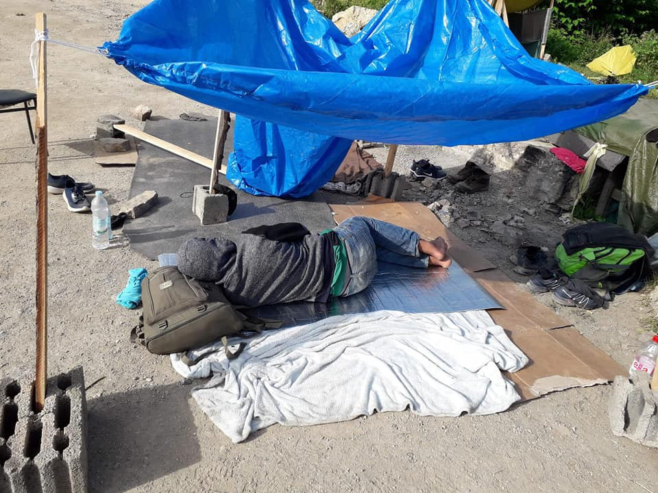
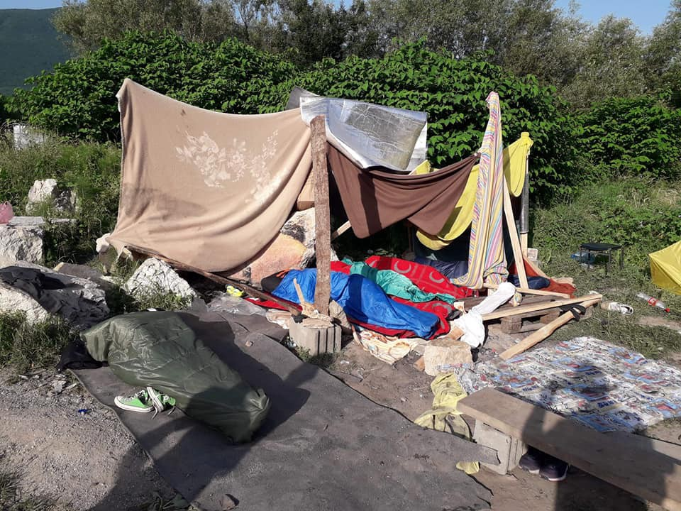

### AYS Daily Digest 19/6/19: Children and minors suffer under fallible systems across the continent
#### Tensions in Calais running high with the recent surge of arrivals / Minors left unprotected in many cases across Bosnia and Herzegovina / 22 people missing, SAR ongoing in the Mediterranean / ECHR condemns detention of minors in Greece; Greek Council for Refugees filed a complaint with the Supreme Court over violent pushbacks / & more news

Ključ, Bosnia and Herzegovina \(Photo: Red Cross volunteers in Ključ\)
#### FEATURED
#### The situation on the ground at Grande\-Synthe is reaching a breaking point

[Refugee Women’s Centre](https://www.facebook.com/refugeewomenscentre/?__tn__=kC-R&eid=ARB_cAta69M_hRy7A1WmzyBUKcNBwz3KhF5E7VkrHsjNEXWHdKMLiVIzdUA9Z6LU0Zw9k7QAX4DO_QbC&hc_ref=ART1D7yf2YK_oc0-GBZJdW3FQVveCIOd709MirF54sk3jLitbe0JjTKMDnbfOmx1EvE&fref=nf&__xts__%5B0%5D=68.ARBFpaaata9EimqN6dsGd6_elRFUYnnC0C2qDuvnfONtCJA1ZGObAdELL_K__CJ5j2DbSd7Jf3a32C5OL7u7Xq4JM3fAiOmtuPAx8CiY5LMxaqY5ITMcv-WZ05rUKhKwN301xkGusKXBCNeBU7ClPzCssD2V0gkcozQ-nHrXJ3-oj4G3G5Bmuuum_Vc1VlS6VsfpEC97uHJhZhITGWlNpcbe08irKlwoVfhew63n7OqbrDyDOuuyRAjnAgGh8oJXE__PuxP7ZQHMWZumHiy4Dz0h2NEl5ZfYPQSoqp-1hEu1iSL_Z89eXUp3rn-cKFfbobG7BqISVxbKxZwD7TimYQy1Z3W_k_BHPnxL3AaNvRo62bF8kOBu9X0) team reports on the current situation:

> _The tents outside the gym have exceeded the “sight\-line” — the spatial limit imposed on the families to prevent passers\-by from seeing the camp\. There is little to no space between the tents, and families are camping nearly on top of each other\._ 

> _Based on the number and size of tents outside and the number of spaces inside the family room in the gym, the Women’s Centre team of 7 is supporting approximately 300 people\. Our stocks of emergency items, such as tents, sleeping bags and blankets, are rapidly being depleted due to the sharp increase of new arrivals\._ 

> _Material distribution is becoming more difficult, but Thursday activity days and outings are starting to become extremely popular among the women and children\._ 

> _Tensions in Calais are still running high with frequent problems between separate camps\. It’s a dangerous atmosphere for anyone to be in, and we are lucky enough that most of the women and children we know of are being hosted in emergency accommodation, citizen accommodation, or friends’ houses\._ 

> _We are still looking for volunteers to join our team\! Are you interested? Do you know someone who might be? Email supportus@refugeewomenscentre\.com_ 

#### **Bosnia and Herzegovina failed to provide refugees and migrants with effective access to international protection and adequate reception conditions**

Amnesty International clearly states this in their latest [country report\.](https://www.amnesty.org/download/Documents/EUR6304992019ENGLISH.PDF) 
Out of an estimated number of over [24,000 people who have passed](http://: https://ec.europa.eu/echo/where/europe/bosnia-andherzegovina_en) through Bosnia and Herzegovina as of the end of 2018, about 23,000 expressed the intention of seeking asylum, while only less than 7% managed to do so\. There are many bureaucratic obstacles with registration, a lack of adequate legal help and translation, very limited capacities at the Ministry of Security and poor support for the potential asylum seekers\. All of this has resulted with many people continuing towards the EU countries, AI reports\.

For those who have not been following the situation in Bosnia and Herzegovina, and missed our reports \(that stem from direct information from people _from_ Velika Kladuša and Bihać\), AI summarizes their view on the matter:

> Bosnia and Herzegovina has only one official reception centre for asylum\-seekers near Sarajevo, in Delijaš\. The centre is operated by the Ministry of Security and has a capacity to accommodate only 150 people\. In addition, the national authorities also operate a refugee centre in Salakovac, managed by the Ministry of Human Rights and Refugees, with a capacity to accommodate 250 people\. However, this centre is designated for people who have already obtained refugee status\. In the absence of adequate facilities or a meaningful support system, refugees and migrants often travel to the towns of Bihać and Velika Kladuša, closer to the Croatian border\. By March 2019, an estimated 5,500 refugees and migrants remain trapped in Bosnia and Herzegovina, the vast majority of them in overcrowded temporary accommodation camps in Bihać and Velika Kladuša, operated by IOM, living under inhumane and unsanitary conditions\. 

With regards to their findings, the AI recommended Bosnia and Herzegovina should:
- Ensure that all asylum\-seekers have access to fair and effective asylum procedures, including an assessment of their claim for international protection on its merits in an individualized procedure;
- Take concrete steps to ensure that the country is better prepared to adequately respond to the needs of refugees and migrants transiting through or staying in the territory of Bosnia and Herzegovina, including by providing them with adequate and safe accommodation, food, sanitation, medical care and legal aid, as required by national and international law\.

](assets/26cca07ab812/1*1eIDncgtKhaUmPJtjISgtw.jpeg)

Photos: [Senad Cupo](https://www.facebook.com/profile.php?id=1032645245&fref=gs&__tn__=%2Cd%2AF%2AF-R&eid=ARDB6gXrWL0mSOzpl6Wh-9WoEsR5pWogc_pkWPphoLi367W0-OlzvhhFTDLBvPrD7uMA_DH6sjjnaAz7&tn-str=%2AF&dti=348461619200701&hc_location=group_dialog)

People keep arriving in Tuzla, and are for the most part taken care of by the group of volunteers who have been tirelessly active in assisting everyone who passes through their town in every possible manner\. However, as everywhere else, they too have been faced with different reactions to their work, as well as with the people in general\. Some of these pictures were placed in the area where people gather and wait for the Foreigners’ Office to open\.

The local Red Cross personnel are trying to provide everything they can in terms of assistance and basic amenities to the people who are constantly taken off the buses in Ključ\. Unfortunately, this is the current state of things there:

Photos: Red Cross volunteers in Ključ

In cases like today, when a group of minors arrives, the procedure is lengthy, as they must wait for the social worker to come on site in order for the children to be taken to the area of the camp designated for minors or in some sense be taken care of by the UNICEF workers\. This happens in cases when there is room at the camp, unfortunately more often than not lately, **there is no more room** \. Therefore, it happens that more than 35 \(identified\) minors per week are left outside the \(very basic\) system designed to support minors\.

In cases when someone comes to Ključ with no documents issued by the police, they have no chance to ultimately arrive at a camp as there is nobody there to ‘profile’ them on site, something that should be done by the centres for social work\.

A concerning new issue is that they are now also taken to the provisional campsite in Vučjak \(still without any toilets, but with many snakes all around, people write\), thus ignoring completely any of their basic children’s rights, and rights of the UASC\.

Accounts of police violence keep arriving from Bihać and especially now that those stopped by the police with camp cards often end up in Vučijak, regardless of the fact that they have another type of document stating that they are staying in Bira camp, as locals and people involved report\. According to some media stories over the past two days, the intention behind the local official politics is to gradually downsize and close Bira camp as well, but those are just comments coming from some of the politicians for the time being\. Those stuck in Bihać now are scared and running away in recent days, whenever they can, say local volunteers\. Although they try to find a safe place in other towns, it is very likely that police activities will follow in other places as well\.

> Maritime Rescue is becoming an instrument of necropolitics, of the death policies that are being carried out in the Mediterranean, ignoring that it should be an element of defense of the right to life 

On Wednesday, the SAR ship Vronskiy that covers the route between Melilla and Motril found a boat that reported no communication since Tuesday night, Helena Maleno reported\. In the boat, missing in the Alboran Sea, there were 49 people traveling, including two women and a girl of eleven years\.

22 people are [reportedly](https://www.publico.es/internacional/nueva-tragedia-mar-alboran-22.html?fbclid=IwAR3YetWWIOwweEH129a9XLlPqn5wyCwXMof3k0lc6J8qvHxhwFCGCUTXOSk) missing\.

■■■■■■■■■■■■■■ 
> **[Sergio Rodrigo](https://twitter.com/SRodrigoruiz) @ Twitter Says:** 

> > #Vídeo exclusivo del momento en el que la balsa a la deriva dos días era rescatada con 27 persona por el Ferry VRONSKIY en el mar de Alborán. Hay 22 desaparecidos #MED #SAR #FronteraSUR #DDHH https://t.co/3yEnTIehUU 

> **Tweeted at [2019-06-19 21:25:33](https://twitter.com/srodrigoruiz/status/1141457013630742528).** 

■■■■■■■■■■■■■■ 

173 people have lost their lives so far this year on the Western Mediterranean route\.

**](assets/26cca07ab812/1*Iaa7zmla3LB4wHEgBGSBdw.jpeg)

**After being denied a Port of Safety for seven days, the 43 people rescued by Sea\-Watch 3 are still stuck on board the ship\. Sea\-Watch is calling on European leaders to allow disembarkation immediately\. This unbearable situation cannot continue on World Refugee Day\. The solution is there, more than 60 cities have declared their willingness to take people\. — Sea Watch [reminds](https://sea-watch.org/en/sea-watch-demands-disembarkation-43-survivors-world-refugee-day/?fbclid=IwAR3q5QNwOYfWmOZeoTl4k_zTrsSGJ2AdFWJuBPDPrt14TvsDidAUwoti0mQ)**
#### GREECE

In only two days, 15 boats with a total of 508 people have arrived at the country\. Follow [Aegean Boat Report](https://www.facebook.com/AegeanBoatReport/?tn-str=k%2AF) for updates on new arrivals on the Greek islands\.
### ECHR condems detention of minors in Greece

In an appeal filed by lawyer Electra\-Leda Koutra at the European Court of Human Rights \(ECHR\), the entire adventure in the hands of the Greek authorities was described: from Chios to Eidomenos and Edomeni in Athens, from Patras to Italy and from Italy in Igoumenitsa, from a detention facility to a detention center, from one inappropriate structure to another, from the prosecutor’s office in the Police Department and the Asylum service at the National Center for Social Solidarity\.

The European Court of Human Rights once again condemned Greece for detaining unaccompanied minors in police stations \(it lists many similar convictions against Greece since 2009\), considering that the guardianship regime is a detention that violates the right to freedom and security and detention conditions are degrading treatment\. The Court also considered the circumstances in Edomeni, where the authorities did not do their duty to look after and protect minors\.

Also, the Greek Council for Refugees has filed a complaint with the Supreme Court in Athens over claims of violent pushbacks at the northeastern Evros border with Turkey\. 
The GCR also said that it has “made repeated appeals” for a judicial **investigation into claims of human right violations at the Evros crossing\.**

Claims concerning the illegal practice of pushbacks continue to grow in number, as they do in Croatia, but no official reaction or action has yet come about\.
### Chios

Disinformation and misinformation about refugees feed xenophobic attitudes, reports Mare Liberum\. On 3 June 2019, the recent municipal elections in Chios were won by ex\-military Stamatis Karmantzis with about 52% of the vote\. Karmantzis will become the new mayor of Chios\.
According to local activists, some of the expected consequences of these political ideologies gaining more power are:
1. Vial may become a detention center and a closed camp, meaning people will not be able to go freely into town to buy necessities or visit community centers run by NGOs such as Action for Education and others which provide a safe space for refugees to learn new skills, relax and enjoy a community outside of the camp\.
2. Massive deportations may begin, which is something few people are aware of and public information on this possibility is very limited\.
3. Increase in refoulment, the militarization of the border, increased pushbacks including masked military men damaging refugee boats\.

Follow [this link](https://mare-liberum.org/en/news?fbclid=IwAR0icppwnOef2EZ38WIBkZ6WmBdCX2493zfXz_ZSN9vQXDGqCbolANcqnhQ) to find out more\.
### Athens

On the occasion of this year’s World Refugee Day, “we unite our voices and forces in two events\-meetings where all together we will create, discuss, learn, seek solutions and suggestions, play, Photograph, sing, Sending a strong message of solidarity and harmonious coexistence\.”

Check out their event program:

#### HUNGARY

A [Government Decree](https://bit.ly/2FkTBuV) entering into force next month establishes a National General Directorate for Immigration \( _Országos Idegenrendészeti Főigazgatóság_ \) under the management of the police, which will be responsible for immigration and asylum\-related tasks, reports ECRE \.
Those working at the Immigration and Asylum Office \( _Bevándorlási és Menekültügyi Hivatal_ \) will be able to cross to the newly appointed institution\. 
Let us remind you of the report we wrote about earlier—by Dunja Mijatović, Council of Europe Commissioner for Human Rights—and invite you to read it if you haven’t yet: the [Report on Hungary](https://rm.coe.int/report-on-the-visit-to-hungary-from-4-to-8-february-2019-by-dunja-mija/1680942f0d) , of 21 May\.
#### AUSTRIA

About 100 people participated in the“Freedom Instead of Stock” rally on Monday evening, 17 June\.

](assets/26cca07ab812/1*m4uZRucgSOopV28-d33SAg.jpeg)

Photos: [Wiener Vernetzung gegen Abschiebungen](https://www.facebook.com/plattform.refugees.welcome/?tn-str=k%2AF&hc_location=group_dialog)

> Deportations, camps and police repression are always the means of combating and racist exclusion of impoverished and marginalised parts of society\. 

#### ITALY

■■■■■■■■■■■■■■ 
> **[MSF Sea](https://twitter.com/MSF_Sea) @ Twitter Says:** 

> > Today the #Italian coastguard rescued 45 people off the coast of #Lampedusa where they have now been disembarked safely. We hope that the wait for a place of safety to disembark will soon be over for 43 people onboard @SeaWatch_intl 

> **Tweeted at [2019-06-19 16:35:13](https://twitter.com/msf_sea/status/1141383946875396098).** 

■■■■■■■■■■■■■■ 

Comitato Antirazzista Saluzzese has reported on a restrictive and dehumanising move of erecting a fence to keep away those who had nowhere to go and had to sleep under the trees and in provisional tents:

Photos: Comitato Antirazzista Saluzzese

The national ombudsman of the rights of persons in prison or deprived of personal liberty, [in the Report to Parliament of 2019](http://www.garantenazionaleprivatiliberta.it/gnpl/it/pub_rel_par.page) , highlighted several critical issues related to these structures and their functioning\. First of all, in relation to the recent “Security Decree”, he stressed how “ _the new law effectively reduces the exclusivity of these Centers as a place of deprivation of liberty by expanding the possibility of fulfilling this function in other places and for more extended times”;_ in fact, the new legislation provides for the preparation of structures for the detention and repatriation of irregular migrants in each Italian region, as states the **new report on the health situation in detention in Turin by the Human Rights and Migration law clinic** \. 
Among the premises used for the detention of the foreigner in the expulsion phase, the decree also includes the frontier offices, without however having conducted any evaluation of the suitability of the structures\.

In most cases, there are no common spaces for the consumption of meals and recreational and social activities\. Also, the result of the innovations introduced by the “Security Decree” on international protection — are linked to the abolition of humanitarian protections and the typing of a small number of cases in which a residence permit can be issued, therefore more people will be detained at such centres as a result\. Find more detailed analysis [here](https://openmigration.org/analisi/la-sospensione-dei-diritti-nei-cpr/?fbclid=IwAR3FvYQXPawEsPfiZEwFbn0NSLJo929HhRP7n3_qdb2dbv50MMn5nlq_z-0) \.
### Rome

Throughout Rome, as in the rest of the world, initiatives will take place to learn more about the history of people forced to leave their war\-torn land, as well as the rhetoric of anti\-migrant propaganda or by dictatorships\.

20 June, India Theater, 5:30 p\.m\. [– 2019 World Refugee Day at the India Theater](https://www.facebook.com/events/884711285215077/?acontext=%7B%22source%22%3A3%2C%22source_newsfeed_story_type%22%3A%22regular%22%2C%22action_history%22%3A%22%5B%7B%5C%22surface%5C%22%3A%5C%22newsfeed%5C%22%2C%5C%22mechanism%5C%22%3A%5C%22feed_story%5C%22%2C%5C%22extra_data%5C%22%3A%5B%5D%7D%5D%22%2C%22has_source%22%3Atrue%7D&source=3&source_newsfeed_story_type=regular&action_history=%5B%7B%22surface%22%3A%22newsfeed%22%2C%22mechanism%22%3A%22feed_story%22%2C%22extra_data%22%3A%5B%5D%7D%5D&has_source=1&__tn__=K-R&eid=ARAlPdlvusO7DfUHq0vMYCG7yWJS-meb-LqMSdZGCylxjXTWGyAqj81iIsz1mw0pVvqJDEQBv9wPoP0n&fref=mentions&__xts__%5B0%5D=68.ARCDwFmvTyW2OIN_VUJ7F3dcosMYWP3QlmAzX30Rv3l09rNWLZYERBs2X5DixwIDydCB7pI2VNhY0FUydj4LWZrBIWr9KfHrSAiimpqFYXM1GfXdYNM8Wbr47NEDY8Fs3w0g5tYAvigK9tDNJz6xCCipBsun9z0J1FZAFZP7shqsle3Dc2uY7myAbaMnruq0LTyNaBeTusnGopJDRZ3yb_52yCEoHQDCgNPF4pL05lErHG1CtClnK7p5fDVi2L-584FqsiJDa5x-APIMKFDgg8jcqndW_kODMSTRZbpM21vOIwn0lasVGB-1Lop_s8vAEZpnivTSvVStELtJnLTWMMH_IQ) 
 21–22 June \(from 8:00 p\.m\. \) 23 June \(all day\) [— Sunset Tuscolo Festival 2019 — Habitart](https://www.facebook.com/events/2364055723872890/?acontext=%7B%22source%22%3A3%2C%22source_newsfeed_story_type%22%3A%22regular%22%2C%22action_history%22%3A%22%5B%7B%5C%22surface%5C%22%3A%5C%22newsfeed%5C%22%2C%5C%22mechanism%5C%22%3A%5C%22feed_story%5C%22%2C%5C%22extra_data%5C%22%3A%5B%5D%7D%5D%22%2C%22has_source%22%3Atrue%7D&source=3&source_newsfeed_story_type=regular&action_history=%5B%7B%22surface%22%3A%22newsfeed%22%2C%22mechanism%22%3A%22feed_story%22%2C%22extra_data%22%3A%5B%5D%7D%5D&has_source=1&__tn__=K-R&eid=ARCbzQzNYt1lo_PMp72Q0YzdUgy7L3fGjlt0kHLnlUjSbjYSH8KoS-VSX9T0s3uwn_3l4i8OSvRTfjFp&fref=mentions&__xts__%5B0%5D=68.ARCDwFmvTyW2OIN_VUJ7F3dcosMYWP3QlmAzX30Rv3l09rNWLZYERBs2X5DixwIDydCB7pI2VNhY0FUydj4LWZrBIWr9KfHrSAiimpqFYXM1GfXdYNM8Wbr47NEDY8Fs3w0g5tYAvigK9tDNJz6xCCipBsun9z0J1FZAFZP7shqsle3Dc2uY7myAbaMnruq0LTyNaBeTusnGopJDRZ3yb_52yCEoHQDCgNPF4pL05lErHG1CtClnK7p5fDVi2L-584FqsiJDa5x-APIMKFDgg8jcqndW_kODMSTRZbpM21vOIwn0lasVGB-1Lop_s8vAEZpnivTSvVStELtJnLTWMMH_IQ) Archaeological Cultural Park of Tusculum
 25–29 June \(from 8:00 p\.m\. \) [IFEST — Independent Festival Roma](https://www.facebook.com/IFESTindipendentfestival/?__tn__=K-R&eid=ARBV8vLtfdBAv5K0EnGgkGhDqlfcPa_EP7eST2p_jKVIpzAl-rsY4WpA8QNuSJVGA1kaU4-tB6K-Ic72&fref=mentions&__xts__%5B0%5D=68.ARCDwFmvTyW2OIN_VUJ7F3dcosMYWP3QlmAzX30Rv3l09rNWLZYERBs2X5DixwIDydCB7pI2VNhY0FUydj4LWZrBIWr9KfHrSAiimpqFYXM1GfXdYNM8Wbr47NEDY8Fs3w0g5tYAvigK9tDNJz6xCCipBsun9z0J1FZAFZP7shqsle3Dc2uY7myAbaMnruq0LTyNaBeTusnGopJDRZ3yb_52yCEoHQDCgNPF4pL05lErHG1CtClnK7p5fDVi2L-584FqsiJDa5x-APIMKFDgg8jcqndW_kODMSTRZbpM21vOIwn0lasVGB-1Lop_s8vAEZpnivTSvVStELtJnLTWMMH_IQ) Parco Nomentano
If you decide to come, be sure to check their list for donations:
 [https://baobabexperience\.org/raccolta\-donazioni/](https://baobabexperience.org/raccolta-donazioni/?fbclid=IwAR37qTMsoZntwTpnNpYlBIp9qkIoNB3K55N_W-9imbK6rninpzEYD0XANoc)
#### FRANCE

[Solidarité migrants Wilson](https://www.facebook.com/Solidarit%C3%A9-migrants-Wilson-598228360377940/?__xts__%5B0%5D=68.ARAn3ZwmZ-cyuBTUCeDX7FyNN91egF-XwOI91KkKiCTgOvjOC62DaG31MMwm2S1eyRQlKHqbjyCa_8bU7CX3KrwHkDq0wTspGS_HhW9VMtFA-gxe-rNhACpL4Ka1vhPgVmi35UFqHt6cYaaLnWYEB3CxQfFugdWtbbnM6-OJPbB3A8DNNSy-znQasuTGNc-xYpjfwLigYK3kfolkO-4HHp0rVA8gXH22dh1xKjJoGmMdYpKw8b1js_cnZmWgm32dQV0Ft3SrdVBm4AaeOMh0zBIb1LflYNojupdDmrvIo7uACelA32_ZtJndk6sy1tkyLolYc7uPmWZRfP8qdsTlzB08vQlm50gLWI3vG4QW-YawuRUad2gLTMmsWhHbmwwthXnpOp4wGwrdERhcjaaaGLwamQmyOPLVyaG55Hu_ei5kwOw&__tn__=k%2AF&tn-str=k%2AF) reported that the Wilson Avenue Camp in Saint\-Denis was evacuated\. Please, contact them if you have ways to help or support those without shelter\.

](assets/26cca07ab812/1*_G86J0p_mp_HtpX2v7Camw.jpeg)

Photos: [Solidarité migrants Wilson](https://www.facebook.com/Solidarit%C3%A9-migrants-Wilson-598228360377940/?__xts__%5B0%5D=68.ARAn3ZwmZ-cyuBTUCeDX7FyNN91egF-XwOI91KkKiCTgOvjOC62DaG31MMwm2S1eyRQlKHqbjyCa_8bU7CX3KrwHkDq0wTspGS_HhW9VMtFA-gxe-rNhACpL4Ka1vhPgVmi35UFqHt6cYaaLnWYEB3CxQfFugdWtbbnM6-OJPbB3A8DNNSy-znQasuTGNc-xYpjfwLigYK3kfolkO-4HHp0rVA8gXH22dh1xKjJoGmMdYpKw8b1js_cnZmWgm32dQV0Ft3SrdVBm4AaeOMh0zBIb1LflYNojupdDmrvIo7uACelA32_ZtJndk6sy1tkyLolYc7uPmWZRfP8qdsTlzB08vQlm50gLWI3vG4QW-YawuRUad2gLTMmsWhHbmwwthXnpOp4wGwrdERhcjaaaGLwamQmyOPLVyaG55Hu_ei5kwOw&__tn__=k%2AF&tn-str=k%2AF)

> They dared\! Avenue Wilson, the only place where people could protect themselves a bit from the weather \(…\)
 

> Tonight people were looking for places to stay, plastic to protect themselves from the rain, those who brought food could not find those who are hungry\!
 

> Spend thousands, tens of thousands of euros, hundreds of thousands, millions of euros and finally billions to break, destroy\. But even more for the poor, for hospitals, or for schools, more for our values\. 
 

> A disgrace to raise our children in this country\! 

#### AYS and the Daily News Digest — how to get involved?

**We strive to echo correct news from the ground through collaboration and fairness\. Every effort has been made to credit organisations and individuals with regard to the supply of information, video, and photo material \(in cases where the source wanted to be accredited\) \. Please notify us regarding corrections\.**

**Apart from daily news in English, we also publish weekly summaries in Arabic and Persian\. Find specials in both languages on our medium site\.**

**If there’s anything you want to share or comment, contact us through Facebook, Twitter or write to: areyousyrious@gmail\.com\.**

**We’re open to expanding our team of volunteer researchers, editors, and info gatherers\. Get in touch\!**

_Converted [Medium Post](https://medium.com/are-you-syrious/ays-daily-digest-19-6-19-children-and-minors-suffer-under-fallible-systems-across-the-continent-26cca07ab812) by [ZMediumToMarkdown](https://github.com/ZhgChgLi/ZMediumToMarkdown)._
