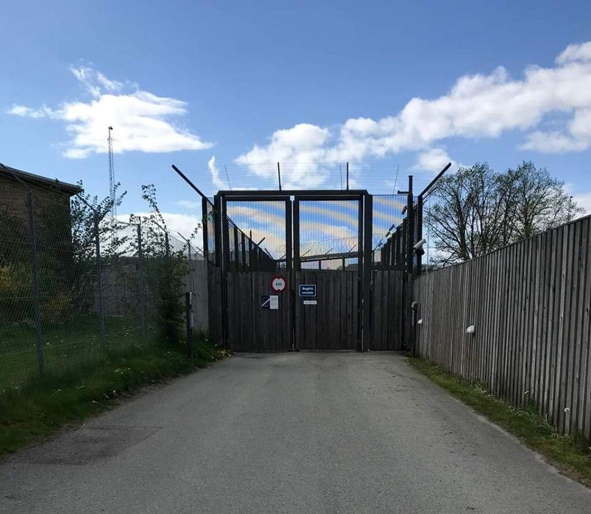
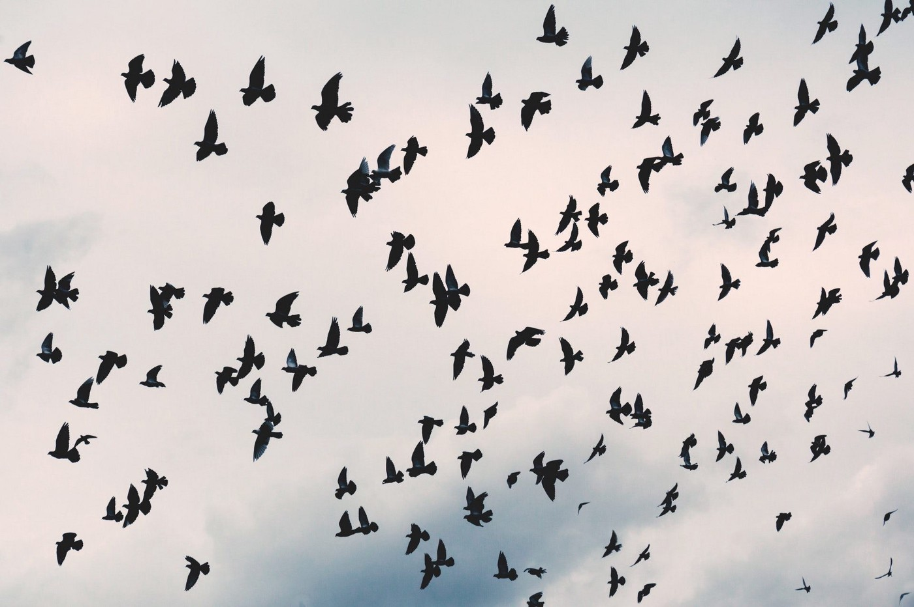
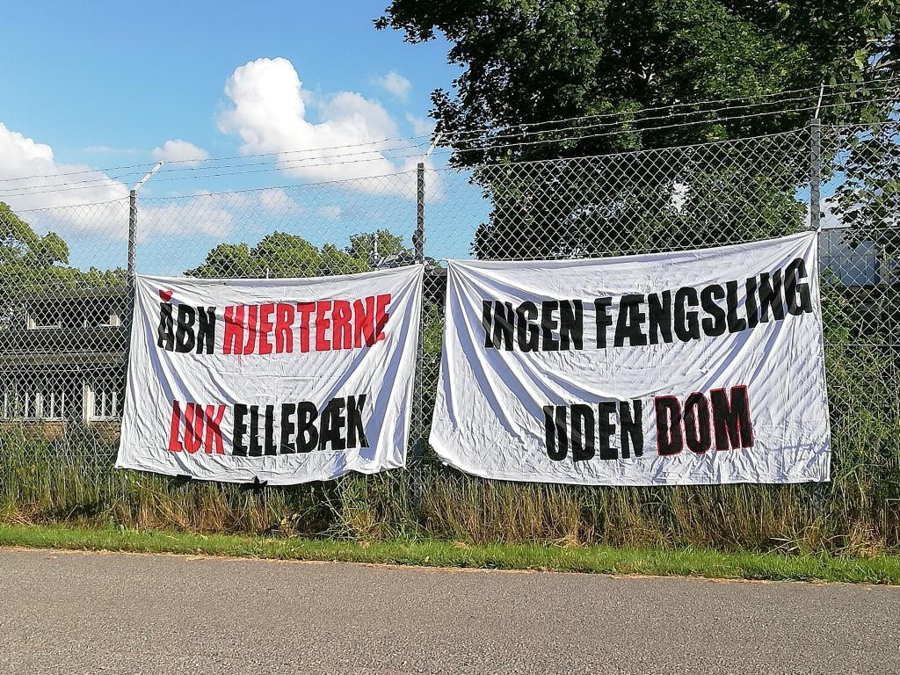

### AYS SPECIAL: Trapped in Ellebæk — Everyday life marked by fear and powerlessness
#### **On the 4th of June 2019, a man hung himself in his cell after 3 months of detention in the Immigration Centre Ellebæk\. This is not the first suicide in Ellebæk\. In June, the Ombudsman instructed the free\-hanging pipes attached to the cells’ ceiling to be covered, in order to prevent further suicide attempts\. At the time, there had been 7 suicides and suicide attempts in the last 5 years\.**

The entrance gate to Ellebæk

The Immigration Centre Ellebæk is located in Allerød, halfway between Sjælmark’s deportation centre and the Sandholm Camp \(Arrival unit\) \. The sun has been shining all the days I have been there\. But the sun contrasts with daily life marked by darkness, anxiety and hopelessness for the inmates who live behind the barbed wire fence, a fence that encircles the place called an immigration centre, but in fact is run as a closed prison\.

I am meeting with Andrew, who fled Uganda, but has been imprisoned in Ellebæk since November 2018\. We have been in contact over the phone for a few weeks\. The only communication outside of prison takes place over the prison’s coin phone\. A phone that is expensive and often out of work\. He has to call me, I cannot reach him\. If I miss his call, there is nothing else I can do but wait until he calls again\.

_“Hi, this is the prison,”_ the door phone responds when I tell that I have arranged a visit\. I have to pass two large gates, bordered by barbed wire fences\. When the inner gate opens, the outer one is closed\. I show my ID, and my phone is locked up in a small closet for phones\. I have to pass the metal detector\.

Outside the visitor’s room, I am met by a poster that reads:

“ _Your future is decided by what you do today, not tomorrow”_ \.

— words that seem off\-place in a place, where the inmates are deprived all power over their own fate\.

> Andrew has been detained in Ellebæk for 8 months\. He has no deportation date and therefore does not know whether the police will pick him up tomorrow, in a week or in 6 months\. 

He also does not know whether the authorities will manage to deport him to Uganda\. Homosexuality is illegal in Uganda and involves great stigma from family, friends and communities\. For Andrew, this meant that his church, which had taken care of him since the death of his parents, turned their back on him due his sexual orientation\. In January 2014, the Government of Uganda also carried out a controversial legislation to prolong the punishment for homosexuality up to life in prison\. Andrew tells that he will flee again if he is deported to Uganda, because he is convinced that he will not be safe there, even though the Danish authorities believe the opposite\.
### Closed prison, extinguished dreams

Ellebæk is run by the Danish prison agency “Kriminalforsorgen” and operates as a closed prison, with the exception that the inmates are not serving a punishment, but waiting for the day a group of police officers will come to pick them up, and put them on a plane back to the country they do not want to go back to\.

Most of them are rejected asylum seekers, and a few have lost their residence permit due to a criminal offence\. The police believe that these people are at risk of going underground, which is why they are detained, until their deportation is made possible\.

> Others are imprisoned under so\-called “motivational measures”, where the purpose of detention is to “motivate” the inmates to voluntarily return to the country, which they have fled\. 

_“We can sit inside and look at the sun outside”_ Andrew says\.

Andrew asks for my pen and writes down a typical day divided into time slots\. Breakfast at 8:30, factory\-like work, eating breaks and three 15\-minute\-long outdoor time\. In the outdoor time you can get some fresh air or smoke a cigarette\. The last outdoor time of the day is at 17:30\. Most of the day and all evening and night are spend inside Ellebæk’s run down cells, which a TV2 documentary in 2019 gave a unique and cruel insight into\.

> “I understand why Ellebæk is here, and I am saying it shouldn’t be here, but why can’t we sit outside?” _Andrew tells and continues:_ “Why can’t we be allowed to cook or at least have a microwave oven in the hallway? Then we would be able to reheat our food, if we don’t feel like eating at the same time every day\.” 

Andrew explains that he has complained to the Ombudsman about the living conditions in Ellebæk and asked to have an independent caseworker in the prison, to whom the inmates can go to when they experience violence, irregular solitary confinement or other unfair conditions\.
### Psychological Torture

I talk to Navid on Skype\. He spent one month in Ellebæk after being denied asylum in Denmark\. Navid fled to Denmark from Afghanistan\. Today he is in Germany, fighting to get his asylum case re\-opened\. Navid explains how the psychological torture and the fear of deportation characterized every day and night as an inmate in Ellebæk prison\. He fears being send back to Denmark and to Ellebæk\.

> _“Ellebæk is a prison, and for most people, a prison is a horrible place\. I suffered from bad headaches when I was inside Ellebæk prison\. Some days the police came to deport other inmates\. It was so hard for me\. They told me that they would deport me too\.”_ 

The stress sits in his bones and affects his sleep\.

> “Most nights I have nightmares about deportation\. About Denmark, about being in Ellebæk again,” _Navid tells and continues:_ “I think about Ellebæk every single day\. Why was I there? I think about the other people, who were there, and what could have happened to them since I got out\. Where are they now?” 

Amnesty International and the Danish Institute for Human Rights have criticized the detention of particularly vulnerable people, including survivors of torture and people suffering from mental health issues\.

> The lack of screening to decide if a rejected asylum seeker has been tortured or is too mentally vulnerable to be imprisoned is in breach of the Convention on Human Rights\. 

Andrew lived at the same department as the man who took his own life, and shared cleaning duty with him in the prison\. He tells about the suicide, the shock and subsequent apathy of the prison’s guards, when I meet him a second time a few days after the suicide\.

Andrew was in his bed in his cell when he heard prison guards and other inmates struggling to open the blocked door to the deceased’s cell\. _“I thought it was a fight\. There are always fights, so I didn’t react\.”_

When they managed to slightly open the door, the prison guards send an inmate, who was slender build, inside to open it from the inside\. What was waiting on the other side was the body of a man who had hung himself from the window\.

> _“Everyone is in shock\. It destroys you from the inside\. Especially those who have not seen a suicide before\._ ” 

Subsequently, everyone in the department was locked inside their cells, for what Andrew think was about 30 minutes, whilst the body was carried out\. The inmate who had found the deceased was allowed to speak with the nurse, who allegedly advised him not to talk to the other inmates about his experience\. Later in the day, the cell was cleaned\.

At no point in the following days, did the prison guards assemble the inmates, to talk about what had happened\. The prison priest was the only one the inmates could take comfort from\.

> “It feels like people can die in here, and they can cover it up\. It’s like this is something we need to get used to,” _Andrew says with a sad look on his face\._ 

The lawyer of the deceased had not been given any information about the death when a Danish activist called him more than a day later\.
### Legal Dark zones

The daily feeling of distress is further exacerbated by a non\-transparent trial, a lack of understanding of one’s case, and unclear procedures for complaints\.

Three days after Andrew arrived to Ellebæk, he faces the court procedure that will come to decide his fate every four weeks for the following many months\.

According to the Danish foreign policy law, detention for expulsion purposes must be reviewed every four weeks\. One can be detained for a maximum of 18 months\.

> “When you are going to trial, you are placed next to a lawyer\. It is the first time you meet your lawyer\. The judge is on a screen with the police\. Your lawyer will usually say that he can’t do anything,” _Andrew tells and continues:_ 

> ”Most often the police will tell the judge that they do what they can to prepare your repatriation, and that they need more time\. No matter what you say, it doesn’t really matter\. The whole procedure takes around 15 minutes\.” 

_”Every time it is a new judge, and it feels like I am new in Ellebæk at every court meeting,”_ Andrew explains\. He holds the impression that neither the lawyer nor the judge knows anything about his case, and that the court meeting process simply is a formality with the sole purpose of prolonging his imprisonment\.

Andrew’s impression is backed by a report made by the **Global Detention Project on Danish deportation centres** \. In the report, the UN Special Rapporteur on Torture notes that the court had _“authorised the extension of the detention period as requested by the police in all cases except two”_ over the last five years\. It also concludes that the procedure for legally challenging one’s detention under article 37 of the Aliens Act is not satisfactory\.

Andrew has asked for transcriptions of his court meetings, which he has been refused\. He also asked for the contact information of the lawyers who represented him\. This he has been refused too\. After six months of struggle and help from a Danish activist, he now has a lawyer who will take his case and not least listen to him\.

**The lack of access to cellphones is making it difficult to find a lawyer, contact support\-groups, relatives and others** \. Andrew has asked the police officers if he could use his phone to get the phone numbers he could not remember by heart\. He was refused that as well\.

If police officers find a cellphone, the owner is often punished with two weeks in solitary confinement, Andrew tells\. Something he experiences himself\.

_”Why are they so afraid of phones, even cameras? If everything was at it should be, what is it then they are afraid of?”_ Andrew asks _\._
### Fear and hopelessness

> _“Ellebæk is a horrible place\. Anyone who sees it finds it unbelievable\. Why are refugees put in this place? All refugees in Denmark have a problem\. They don’t put themselves in these bad situations for fun\. “_ – Navid 

The Danish authorities have estimated that the inmates in Ellebæk do not have a need of protection\. For Andrew, Navid and several other rejected asylum seekers, repatriation means that they will have to flee again, as they are convinced that they are not be safe in the country Denmark will send them to\.

The dead cannot speak, and we will never know exactly what lead to the suicide on the 4th of June 2019 in a prison cell in Ellebæk\. But we do know that the deceased, had asked to be sent back to Germany the day before\. And that he was told, he was going to be deported to the country he had fled\.

> _“He must have thought, that whatever was waiting him, was worse than taking his own life” Andrew says\._ 

The statistics show that many forced deportations from Ellebæk succeed\. 87 percent of the inmates in Ellebæk were deported last year according to the Police National Immigration Centre\. When the police come, unannounced, dressed in riot suits, ready to employ such harsh methods, that a forced deportation in 2017 ended with an Algerian man losing his life, _“they always win”,_ as Andrew puts it\.

Ellebæk prison, with 136 beds, does not occupy much space in media, the population or the politicians\.

> It is a place where human rights are broken and people die or are deported in silence\. 

Former immigration minister, Inger Støjberg, acknowledged that the living conditions at Ellebæk are not “neat and nice”, but she did not think there was anything to be ashamed of\. I hope, for the legal security of those deprived of freedom and the consciousness of Denmark, that whoever becomes the new immigration minister will have more reservations on being responsible for this place of disgrace in Denmark\.

**Written by: Elisabet Kass**

**The article was [originally published](https://www.eftertrykket.dk/2019/06/16/fanget-i-udlaendingecenter-ellebaek-en-hverdag-praeget-af-frygt-og-magtesloeshed/) in Eftertrykket in Danish\.**

_Converted [Medium Post](https://medium.com/are-you-syrious/ays-special-trapped-in-elleb%C3%A6k-everyday-life-marked-by-fear-and-powerlessness-c9996e3756dd) by [ZMediumToMarkdown](https://github.com/ZhgChgLi/ZMediumToMarkdown)._
