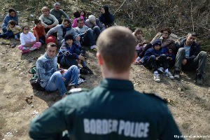

### عمليات الإخلاء القسري تزيد من الصدمات المتراكمة
#### AYS Weekly News Summary in Arabic, June 17–23

](assets/7bdeee86fd90/1*S69boXmype5PesZCQLh-sg.jpeg)

Photo: [Wiener Vernetzung gegen Abschiebungen](https://www.facebook.com/plattform.refugees.welcome/?tn-str=k%2AF&hc_location=group_dialog)
### **تركيا**

> انقلب قارب قبالة الساحل التركي\. تم الإبلاغ عن مقتل ١٢ شخصًا ، بينهم ثلاثة أطفال ، بينما تم إنقاذ ٣١ شخصًا\. لا تزال تفاصيل محددة عن الأشخاص الذين فقدوا حياتهم مجهولة\. المؤكد أنهم لم يرتدوا سترات النجاة وأنهم دفعوا ٥٠٠٠ يورو لكل رحلة\. 

مأساة أخرى في بحر إيجه عندما انقلب قارب يحمل 43 شخصًا على الأقل خارج بودروم في تركيا ، مما أسفر عن مقتل 12 شخصًا ، بينهم ثلاثة أطفال\.

في نهاية الفجر ، صعد 43 شخصًا إلى قارب من الألياف الزجاجية طوله 23 قدمًا في ضواحي بودروم \. كان القارب مثقلاً بأعباء شديدة وبدأ في أخذ الماء بعد وقت قصير من مغادرة الساحل التركي\. عدد قليل من الركاب كانوا يستخدمون سترات النجاة ولم يكن هناك غرفة \.

تم تنبيه خفر السواحل التركي ووصل في الموقع ساعة 07\.20 صباحا وكان القارب قد غرق بالفعل \.
كان الناس اليائسون يصرخون طلباً للمساعدة وكان بالنسبة للبعض فات الأوان و متأخراً بالفعل بعد غرقهم \. حيث داخل القارب على عمق 32 متراً عثر الغواصون على 8 أشخاص ، وتم العثور على 4 المتبقية بالقرب من الحطام \.

31 تم انقاذهم :
23 فلسطينيا ، 4 سوريين ، 2 صوماليين ، 2 يمنيين\.

12 غرقا:
7 رجال ، امرأتان ، 3 أطفال \(صبيان / فتاة واحدة\)
جنسية الميت غير معروفة \.

أبلغ الناجون أنهم دفعوا 5000 يورو لكل رحلة ، وبالتالي فإن ربحًا لا يقل عن 215\.000 يورو لهذه الرحلة \. \. هذه القوارب “القاتلة” هي فخ الموت ، والقوارب المطاطية آمنة في المقارنة ،في الأسبوع الماضي سقط قارب مماثل في طريقه نحو ليسفوس مما أسفر عن مقتل 7 أشخاص\.

ألم يدفع هؤلاء الأشخاص ما يكفي من الدماء بالفعل ، وكم يحتاجون للموت ، وكم عدد الأطفال الذين نحتاج إلى وضعهم للراحة في البحر ، قبل أن نستيقظ \. \. هذه جريمة قتل من قبل الحكومة \. عندما تكون كافي فأنه كافي \. \.

### **لبنان**

نقلت الحكومة اللبنانية أشخاصاً من مخيم “كاريتاس” للاجئين السوريين في دير الأحمر إلى أطراف مقن ، وهي بلدة في محافظة بعلبك\. يواجهون غيابًا تامًا للخدمات مثل الكهرباء والمياه والصرف الصحي في معسكرهم الجديد ، والذي يبعد عدة كيلومترات عن أقرب سوق\.

من أجل شراء الخبز من خارج المخيم ، “سوف يستغرق الأمر عشرين دقيقة إذا كنت تأخذ وسائل النقل الخاصة\.”

بصرف النظر عن التهديدات الأمنية ، تقع المنطقة على طول طريق التهريب ، الأمر الذي يخيف السكان\.

على الرغم من الالتزامات الشفوية من ممثلي مفوضية الأمم المتحدة لشؤون اللاجئين بتقديم الدعم الأساسي للاجئين في المخيم الجديد ، إلا أنه لم يكن هناك “أي نشاط للمفوضية في المخيم”\.

دون أي مساعدة من المنظمات غير الحكومية ، يعتمد الأشخاص الموجودون في المخيم الآن على “المشرف” على المخيم \(شاويش\) ، الذي يعمل به عدد من السكان في الزراعة أو ورش العمل ، ويساعد في تسهيل الأنشطة الضرورية ، مثل النقل ، مقابل رسوم\.

اقرأ القصة الكاملة هنا\.

طالبت ثماني منظمات حقوقية السلطات اللبنانية بضمان حق الدفاع ضدّ الترحيل القسري للقادمين من سوريا إلى لبنان، وهي تباعا: المفكرة القانونية، روّاد الحقوق، ألف، المركز اللبناني لحقوق الإنسان، أمم للتوثيق والأبحاث، دعم لبنان، منظمة تبادل الإعلام الاجتماعي، والمرصد اللبناني لحقوق العمال والموظفين\.
### **اليونان**
#### هل تمت إعادتكم من اليونان إلى تركيا؟ سوف نقدم لكم المعلومات اللازمة عن كيفية اعداد تقرير بشأن ما حدث لكم\.

وفقاً للقانون اليوناني و الدولي إنه من غير القانوني إعادة طلب لجوء محتمل إلى تركيا بدون معاينة طلبه للجوء وفقاً للقوانين اليونانية\.
و مع ذلك العديد من اللاجئين يتواصلون معنا لإخبارنا أنه تمت إعادتهم و هم يحاولون العبور إلى اليونان من الحدود البرية عن طريق إيفروس\.
إذا كان هذا ما حدث معكم أو مع شخص تعرفونه الآن هناك شيء بامكانكم فعله بهذا الشأن\!
منظمة الفرونتكس صممت منظومة لتقديم الشكاوى الرسمية حيث بإمكانكم تسجيل و تقديم ما حصل لكم، كل المعلومات التي ستقدمها ستكون سرية، و يمكنك تقديم الشكوى بالمجان و بلغتك الأم\.
بإمكانك إيجاد شكل الشكوى على هذا الرابط :
[Https://microsite\.frontex\.europa\.eu/en/complaints](https://microsite.frontex.europa.eu/en/complaints?fbclid=IwAR210G1DSXTRxh6ZGTF7EcVGL3tH7PEEVMD4avNCCei-Aug0q4a1hT31Rwk) 
إذا إحتجتم للمساعدة بتقديم شكواكم أو أردتم مشاركتنا قصتكم بشأن إعادتكم لتركيا، و بهذا بإمكاننا الضغط على الدولة اليونانية لوقف هذه الأعمال غير القانونية، بإمكانكم التواصل معنا على رقم الواتس آب هذا: 00306944312793
الرجاء إرسال الرسائل الصوتية أو النصية فقط، حيث ليس بإمكاننا إستقبال المكالمات\!
سوف نتعامل مع كل المعلومات المقدمة منكم بسرية تامة، و لن نمرر أي معلومة لأي طرف ثالث ما لم تقدم لنا موافقتكم الصريحة\.
الرجاء عدم التواصل مع هذا الرقم ما لم ترد أن تعلمونا بشأن إعادتكم إلى تركيا، أي أسئلة أخرى يمكنكم إرسالها عبر صفحتنا على الفيسبوك أو عبر خطنا الساخن\.

### **البوسنة والهرسك**
#### بيهاتش

أثناء تحديثنا يوميًا في ديلي نيوز دايجست باللغة الإنجليزية ، دأبت الشرطة البوسنية على مداهمة المنازل المحلية حيث يمكن استضافة المهاجرين ، خاصة في المناطق المحيطة ببيهاتش وفيليكا كلادوسا\. في بيهاتش ، من المستحيل إيجاد سكن الآن خارج النظام ، وسيتم نقل جميع الأشخاص الذين يواجهون في جميع أنحاء المدينة دون وثائق ومكان في المخيم إلى معسكر فويجاك المؤقت\. على الرغم من أنه تم الآن تثبيت المياه المخصصة للاستحمام \(في المجال المفتوح\) ، لا توجد مرافق لائقة مزودة بمراحيض وحمامات ، ولا توجد خصوصية أو أمان ، ويقدم الصليب الأحمر وجبات بسيطة واحدة يوميًا\.

### **النمسا**

تحتجز النمسا بشكل متزايد اللاجئين وتستخدم احتجاز المهاجرين\. تم الحصول على هذه المعلومات من وزارة الداخلية الاتحادية\. في عام ٢٠١٨ ، تم احتجاز ٥٢٤٢ شخصًا ، بينما تم احتجاز ٤٩٦٢ شخصًا في عام ٢٠١٧ \.
### **المانيا**

تم ترحيل ١١ رجلاً آخرين إلى أفغانستان من ألمانيا صباح الثلاثاء ، مما يجعلهم الترحيل الجماعي الخامس والعشرين منذ ديسمبر ٢٠١٦ \. وقد قامت ألمانيا بترحيل ٦٠٠ شخص إلى أفغانستان\.
### **فرنسا**

تضم فرنسا عددًا أكبر من الأشخاص في مراكز الاحتجاز الإداري \(كرا \) أكثر من أي دولة أوروبية أخرى\. تحدد التقارير الأوضاع النفسية المتدهورة في وكالات التوظيف الفرنسية في فرنسا

والتوترات المتزايدة\.

أفاد مهاجرو سوليداريتي ويلسون أنه تم إخلاء معسكر ويلسون أفينيو في سانت دينيس\. يرجى الاتصال بهم إذا كنت بحاجة إلى الدعم أو إذا تركت بدون مأوى\.
#### عمليات الإخلاء القسري في كاليه

نشرت العديد من المنظمات الموجودة في كاليه تقريرًا مشتركًا عن عمليات الإخلاء العنيفة التي ما زالت تحدث في شمال فرنسا ، المنطقة المحيطة بكاليه ، حيث يجتمع الآن المزيد والمزيد من الناس خلال فصل الصيف\.

تتم عمليات الإخلاء هذه يوميًا في كاليه ، حيث يُجبر النازحون على الخروج من أماكن معيشتهم ، ويتعرضون للعنف من قبل الشرطة ، وإذا لم يكونوا موجودين ، فإن تدمير ممتلكاتهم\. إنها تؤثر على جميع النازحين في كاليه ، بمن فيهم الأطفال غير المصحوبين الذين تقل أعمارهم عن ١٠ سنوات\. ويبدو أن الطبيعة المتواصلة والمتكررة لعمليات الإخلاء تستنفد المجتمعات عن عمد\.

عمليات الإخلاء القسري لا تؤدي إلا إلى زيادة الصدمة المتراكمة للاجئين والمهاجرين ، مما يخلق المزيد من العداء بدلاً من تقديم حل كريم … يثبت هذا التقرير أن السياسة الحالية التي تركز على منع أي “نقاط تثبيت” لمجتمعات المهاجرين هي الفشل\. في الواقع ، على الرغم من ٨٠٣ عمليات إخلاء بين أغسطس ٢٠١٨ ويونيو ٢٠١٩ ، لا يزال هناك أكثر من ١٠٠٠ نازح موجودين في المنطقة ، منهم ٢٥٥ من القُصَّر غير المصحوبين ، و ٢٧٧ من أفراد الوحدات العائلية\.

المئات من ضباط الشرطة الذين يقومون بأعمال مهينة وغير إنسانية ومكلفة وغير فعالة على الإطلاق\.

يمكنك تنزيل التقرير بالكامل \(الفرنسية والإنجليزية\) هنا\.
### **عام**

أصدرت المفوضية تقريرها الشهري عن الوافدين إلى أوروبا\. ووجدوا أنه في شهر مايو ، وصل إلى أوروبا ٦٣٠٠ لاجئ ومهاجر\. يمكنك العثور على التقرير بالكامل هنا\.
#### تقرير عن تجريم التضامن

كشف تقرير ركز على تجريم العمل التضامني المتزايد بين المواطنين الغربيين واللاجئين الذي صاغته المنظمة غير الحكومية الإيطالية \(بوت اوربا\) ، أنه في عام ٢٠١٨ ، تمت مقاضاة ١٠٤ أشخاص لمساعدة المهاجرين واللاجئين\. وفقًا للتقرير نفسه ، تم التحقيق مع ١٥٨ شخصًا على الأقل أو مقاضاتهم بسبب مساعدة اللاجئين بين عامي ٢٠١٥ و ٢٠١٩ \. وكانت اليونان وإيطاليا وفرنسا من أفضل الدول التي حدثت فيها هذه الملاحقات القضائية\. يمكنك الاطلاع على التقرير الكامل \[باللغة الإيطالية\] هنا\.

هذا رابط لخريطة \( \.إدفع إلى الخلف\) يُظهر المناطق التي شهد فيها الأشخاص عمليات طرد جماعي يشاركون فيها وسلوك الشرطة العنيف أثناء العملية\. استخدمه كدليل إعلامي أو اتصل بنا إذا كنت قد وثقت تجربتك الخاصة أو أي شخص آخر برد الشرطة عبر الحدود\.
### **اليونان**

وصفت دراسة أجرتها \(ر س ا\) لدعم اللاجئين نظام الاستقبال اليوناني بأنه فشل هيكليا و لا يوفر حلولًا مستدامة\.

على الرغم من أن ظروف مركز الاستقبال تختلف اختلافًا كبيرًا من مكان إلى آخر ، فإن هذا يوضح أن قرارات الاستقبال الجادة قد اتخذت باستخدام نهج الترقيع الذي كان غير واضح وغير منظم\.

في السادس من يونيو ٢٠١٩، كان هناك ١٦١٠٨ لاجئ وطالب لجوء ومهاجرون تقطعت بهم السبل في الجزر اليونانية ساموس ، شيوس ، ليسفوس ، ليروس وكوس\. من بين هؤلاء ، كان هناك ١٢٦٢٨ شخصًا في المناطق الساخنة بينما كانت قدرة هذه المراكز تصل إلى ٦٤٣٨ شخصًا\. وفي الوقت نفسه ، كان هناك ما يقدر بنحو ١٦٤٥٦ لاجئًا وطالب لجوء ومهاجرًا يعيشون في ٢٥ مخيماً للاجئين في بر اليونان الرئيسي\.

**يتوفر الكثير من الأخبار باللغة الإنجليزية يوميًا على صفحتنا في موقع الميديوم**

**في حال كان لديك أسئلة أو ترغب في نشر معلومات معينة ذات صلة بإجراءات اللجوء أو بلد اخباره مهمة ، يرجى عدم التردد في الكتابة إلينا — إما عن طريق إرسال رسالة إلينا على فيسبوك أو إرسال بريد إلكتروني إلى**

[**areyousyrious@gmail\.com**](mailto:areyousyrious@gmail.com)

_Converted [Medium Post](https://medium.com/are-you-syrious/%D8%B9%D9%85%D9%84%D9%8A%D8%A7%D8%AA-%D8%A7%D9%84%D8%A5%D8%AE%D9%84%D8%A7%D8%A1-%D8%A7%D9%84%D9%82%D8%B3%D8%B1%D9%8A-%D8%AA%D8%B2%D9%8A%D8%AF-%D9%85%D9%86-%D8%A7%D9%84%D8%B5%D8%AF%D9%85%D8%A7%D8%AA-%D8%A7%D9%84%D9%85%D8%AA%D8%B1%D8%A7%D9%83%D9%85%D8%A9-7bdeee86fd90) by [ZMediumToMarkdown](https://github.com/ZhgChgLi/ZMediumToMarkdown)._
