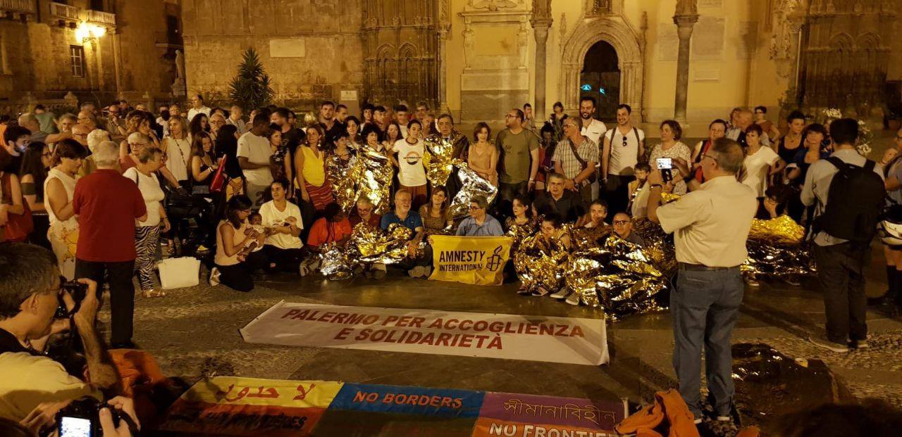

### AYS Daily Digest 26/06/2019: Bosnia… €24 Million for ‘Migration Management’ or ‘Lethal Deterrence?’
#### Sea Watch 3 finally enters Italian waters but still unable to disembark//10 dead and 30 injured in Turkey as vehicle loses control//UNHCR requests $220 Million to ‘combat smuggling’ in the Mediterranean// // New Danish government scraps plans for deserted island deportation centre

By Enrico Bertuccioli
#### FEATURE: The EU to give a further €14\.8 million to fund the [IOM — UN Migration](https://medium.com/u/664cb26312d4) for Bosnia

[It was announced yesterday by the EU that a further €14\.8 million will be given to the International Organisation for Migration](http://europa.ba/?p=64423&fbclid=IwAR1y8EYvR6H61qCunCyXHUMGF3Yyr9L2SikRtqQSACUdl92N-UGzuXg9ZQQ) to “manage” the needs of people on the move in Bosnia\. However, only **€1\.8 million will be used for humanitarian aid** — and the rest for ‘migration management\.’

What exactly ‘migration management’ means remains very unclear from the point of view of an objective observer of the situation in Bosnia\. In fact, the situation does not appear to be managed at all, and especially not in a way that upholds human rights or even the slightest trace of dignity for people on the move who are stuck in the country\.

**Nevertheless, this brings the total funds awarded to IOM to €24 million\.**

Meanwhile, the conditions in all corners of Bosnia, but especially in the Una Sana Canton, which borders on Slovenia and Croatia are becoming more disturbing by the day\.

Currently, 8,000 people are estimated to be in BiH, with only 4,500 accommodated in IOM reception centers\. This leaves at least 3,500 people on the street, hiding in squatted buildings and houses without access to medical care or food\.

The only support they are receiving is coming directly from locals\. Their strong and unwavering support has been a huge contribution, but it is ridiculous to assume that the local civic response can manage this situation\. After all, they do not have millions of euros of funding from the EU at their disposal to do so\. Instead, they rely on donations from friends and family to sustain their laborious voluntary work\. It should be said that Bosnia is not a rich Western European country where high salaries are normal — an average salary is often less than €400/ month\.

A very interesting ‘migration management’ strategy implemented and enforced by IOM over the last eight months has been to selectively prohibit any services to people who are staying outside of the official reception centers — this also includes access to medical care\.

However, people have no choice but to stay outside of the centers as they are all full— this means 3,500 people are not only denied entry to the reception centers, but they are also denied all of the services that may be offered within them\.

AYS is aware of a number of urgent medical cases that are being left untreated, as local hospitals in Una Sana Canton are turning people away, telling them to ‘go to the camp’ — but when they try to go to the camps — the camp private security guards that are hired by IOM turn them away too, as do the IOM personnel\. This leaves these people in a life\-threatening limbo\.

While talks of increasing the capacity of the centers by IOM has been ongoing since the start of the year, nothing has happened\. The only significant development has been the [transfer of people from Bihać, to a deplorable ‘jungle’ camp in Vučjak](https://www.borderviolence.eu/for-a-week-now-in-vucjak/?fbclid=IwAR3jGcdbQKdG4xwNixop3x9SIF8I9STp28HfPc4hwgEc9ImG2IZtbULBBQY) — a place in the middle of nowhere that is allegedly surrounded by active landmines\. Eight hundred people are now in this new camp, which cannot even be considered a camp as it is simply an open field with no toilets, showers, electricity or access to medical care\.

Recently, reports of police violence have sharply increased in Bihać, where it has become routine for authorities to search houses and squats as they look for people to transfer to the new ‘facility’ in [Vučjak](https://www.borderviolence.eu/for-a-week-now-in-vucjak/?fbclid=IwAR3jGcdbQKdG4xwNixop3x9SIF8I9STp28HfPc4hwgEc9ImG2IZtbULBBQY) \. A 23\-year\-old Algerian man describes the tactics implemented by Bosnian police as directly comparable to those implemented by Croatian police during push\-backs to Bosnia\. ‘They are even breaking phones and taking peoples’ money now too,’ he reports\.

It is important to note that while funding may be coming into Bosnia from the EU, the mismanagement of this funding, predominantly by IOM, but also the other large actors in the country, is devastating for the people who need to endure their idea of ‘migration management’ and ‘humanitarian assistance’\. Perhaps a more appropriate term for what is happening with the **€** 24 million of funding is ‘lethal deterrence tactics’ or ‘contemporary border imperialism\.’
#### TUNISIA

Alarmphone reports that 32 people have been deported from Tunisia to Bangladesh — 20 of them unaccompanied minors\. They were allegedly coerced into signing the ‘voluntary’ return agreement by [IOM — UN Migration](https://www.facebook.com/IOM/?__xts__%5B0%5D=68.ARBmZavgxoflZpBFxeyAkhwGuoEJksMmH9V9kG0z1xRO5_dqUsayXekh27sIFK2nFAWgw0ELo2cXF581_aLbZHM7gd5kzYtYqiPIxnQJaJjjfI33XDmrk91XwY7ZJJtDfk2hH2sI0iPVQJpp9EjKw-nfuWVlwGnswdeX1LW2f1E5Ku3alTJIumEltY-v2qpPmNriCMEVhkZT8Fr9XRKiCHM4paYEQrDFT0DVjyX6K1OJ2iCGKXJAiIRf_UJxA0yVtX8xL-ClNwZc5ETO1x4B0h_3sVzrKlJ3dYkCJ0ZDaGYazPWcezYFSYeNT_DkO-8EUzoPfHBuV7y_R0hIqiBEMZKqw_Sj&__tn__=%2CdK%2AF-R&eid=ARCsREec0jjLM4EoNWUJ_D_qrp9F3TBvc8OZZ39a7zkDTtyK0ExH_WwQySKS0S7DasGe0h8XKhEW50hE) \.
#### LIBYA
#### TURKEY

A vehicle is alleged to have lost control in Edirne Turkey, crashing into a shop front, killing 10 people and injuring 30 others\. The vehicle is said to have been transporting people on the move\.

Erdine is a city in north west Turkey that borders both Greece and Bulgaria\. It has seen an influx of people traveling through it over the last years as they attempt to reach the EU\.
#### SEA

42 people remain stranded on the Sea Watch 3 vessel as it finally enters Italian waters — nearing the port of Lampedusa\. Below the captain of Sea Watch 3 describes the current situation — where authorities have boarded the ship and begun to check the ship crew documents\.

An appeal against the European Court decision on Tuesday that ruled against Sea\-Watch 3’s emergency was also rejected\.

Hundreds of people all over Italy have slept outdoors in protest of their governments’ inhumane treatment of those on board as well as the captain and crew of the NGO, who will undoubtedly face a hefty fine and expensive legal fees\.

Protest Across Italy in Support of Sea\-Watch 3

[UNHCR has requested $210 million to assist and ‘protect’ people on the move crossing the Mediterranean](https://www.unhcr.org/news/press/2019/6/5d1330db4/unhcr-calls-210-million-address-deaths-abuses-central-western-mediterranean.html?fbclid=IwAR14UiHaCY8H2_naIew_3uIcy230WX4TcKSEwbNOnSaUCSIhbTHpQ7m4v0U\) \. These funds will support programs that will allegedly prevent people from ‘falling into the hands of smugglers\.’ Perhaps more important than funding is that the UNHCR is calling out EU complicity through their support of the Libyan Coast Guard and the forced interception and transfer of people fleeing Libya back to an active war zone where their lives are at the mercy of human traffickers\.

[57 people were rescued by the Salvation Marines off the coast of Almería\.](https://www.eldiario.es/andalucia/almeria/Rescatados-migrantes-navegaba-cercanas-provincia_0_914108670.html)
#### GREECE

Two boats have arrived in Greece\. One carrying 26 people arrived on Farmakonisi before being transported to Leros\. Another carrying 15 people arrived on Chios\.

RSA Aegean reports that the registration of asylum claims will be halted on Lesvos until further notice due to technical problems\. Without registration, arrivals will not be able to receive cash assistance\.

[Mosaik Support Center](https://www.facebook.com/mosaiksupportcenter/?__tn__=K-R&eid=ARBdxErO2W1ciFYuI5gYprkfc2twE0fZW4ll3a2rBXYotJHL1CvHzkN3oVqXkzDD31oQfCpNrCaJkdZN&fref=mentions&__xts__%5B0%5D=68.ARBy-97JB-H_qc7TdiOGaXLk2KcamR6mV4Ry3BAKBEwIQgxW00Kh8X-hUNRh4TrQnC5QagA5f7RpKKDza5i5UkDl_mlrSKtZ5PxO4BEkrx_aahPT5j2vG_1H3ULmVeZhlGIgNX6xh7D-hbsBRnZwWF63wKguN3xu9LsqRE27jEMEFj1SWP9Jx5MWkCdV9drufxMx-r4UYtKb2FXi4isRlTNlzmxI9y_33r0y7rMyzAV3xIG8dJjRpVPYReYVxNG3rWpDY9CgFxqF4vWk_Q2o8lCfd_vkcn6gN-U7undfPBItDIsJqNYhjTzamsC9vLEiB3TUxBm2Mrz6Tk0_Om7Lc32ndvus) is recruiting a project fundraiser\. Anyone interested should send a CV and cover letter to info@lesvosmosaik\.org or [follow this link for more information\.](http://socialpolicy.gr/2019/06/project-fundraiser-mosaik-support-center-for-refugees-and-locals.html?fbclid=IwAR0UdtroF0e6hTOwuxQWwABYoX49Uex3w-7TviGfMfF8OB_U80sp0reHzFs)

[A 16\-year old,](http://www.ekathimerini.com/241858/article/ekathimerini/news/three-arrested-for-migrant-smuggling-in-as-many-incidents?fbclid=IwAR0Tqxjo17CmfN9wqFXhwju1hA_TYZIJaoZ3yeQWUR7zr1Gcu1wtGfiv47M) along with two others, has been arrested on Lesvos on charges of people smuggling\. We have previously reported on how minors fall victim to criminal gangs and smuggling organizations in our special from Bosnia [‘Being Recruited by Smugglers\.’](ays-special-being-recruted-by-smugglers-144b3cb2cf7e) The point to take home from this is that this boy is a victim, not a criminal\.

> Thousands of young lives have been left to stagnate on the wrong side of the EU borders at a result of securitization practices\. Left with a limited set of options which incentivizes illegal movement, people on the move place their lives in the hands of human smugglers and criminal organisations\. 

#### SERBIA

**InfoPark reports on a case of a 21\-year\-old woman from Algeria who was imprisoned in Sremska Mitrovica for three months\.**

> “A 21\-year\-old woman from Algeria approached IP, claiming that she had been detained and imprisoned in Sremska Mitrovica for three months\. The woman was noticeably upset and claimed her fear was due to previous distressing experiences\. Reportedly, she was put in an undesirable situation of rough sleeping in the unsafe environment of nearby woods, as she was not accepted into an official accommodation facility in the north\. IP staff accompanied her to the clinic of Doctors Without Borders \(MSF\) for a medical check\-up\. The woman could not be provided with safe overnight accommodation at OSP Miksalište due to full capacity\.” 

#### ITALY

Latest statistics by UNHCR account for 112,906 asylum seekers accommodated in reception facilities across Italy\. In May, 782 people reached Italy, the highest month of arrivals this year\.

[A Demonstration for Sea Watch 3 is planned for Thursday\.](https://www.facebook.com/events/907298442941378/)

> The [Rete Restiamo Umani](https://www.facebook.com/ReteRestiamoUmani/?__tn__=K-R-R&eid=ARBgJzNQc4PxhHAGrkeASZHHXYReEVROGzfWtcFX8lndTjB3Ic4RnJ_7chbhgBX9L4PLN28BOHn59qqr&fref=tag&__xts__%5B0%5D=68.ARD8oidAMVg8KRnLfzHiLghAgKjhZUnieDDL1a46i90qZb7cxqmu4dtR174cuJr95dXqC77KOagx6pWE8UtgKQQi-nrG7THWCZrT3n6DjpZbYz6_lSGUHT7SUkgGSlRvg7fu2EmXGzdj5xM6Wk_FczuFJPmiORqUgCr_y6sTZUsjT02cHqLpjgTuk-1Ob6Mxc93cuUYdyNLS4O4J) invites one and all to participate in a public gathering tomorrow at 6:00 pm at Piazza Dell ‘esquilino to start a permanent mobilization in our city in support of the Sea Watch and its crew, welcome whoever comes ashore, call for their immediate release from the Ionian Sea, counter the BIS security decree, the regulatory framework of this barbarism\. 

#### FRANCE

Help Refugees reports that a group of associations won a legal battle against the French government in relation to the failure to provide basic services to people on the move in Dunkirk\.

> As a result of months of work from [La Cimade](https://www.facebook.com/lacimade/?__tn__=%2CdK%2AF-R&eid=ARBfD5zX__d5k_5y1CmwFqx5jsQ5jHJ9eN1Uc7D3JwozqrPJBvILKX3XaeP1qEDY1ghUiz-sdc2YR8tZ&hc_location=group_dialog) , the Human Rights Observer Team, [Refugee Women’s Centre](https://www.facebook.com/refugeewomenscentre/?__tn__=%2CdK%2AF-R&eid=ARAwJhujLjlmbaEHaAUVvKrtR7tc9w6UDgeHlmEjAWsL6zxMdC3qJn4jBB1dS4a_YUKT6wPno1iALjds&hc_location=group_dialog) , PSM, [L’Auberge des Migrants](https://www.facebook.com/AubergeMigrants/?__tn__=%2CdK%2AF-R&eid=ARD1auA6H5eAKJCXBWUJFSijTO5H5m-fLSl_hIYHDjSFAl8daKe0E1rQWv8zo9d44K-CtLHkxMRv8lTc&hc_location=group_dialog) \(and others\), the French government is now obliged to provide running water, showers, toilets and legal information for the 700 refugees in Dunkirk\. 

About 20 associations sent a letter on Wednesday to the Minister of the Interior in France pertaining to the conditions in French Detention centers \(CRA\) \. The letter explains that the centers lack basic human rights and many people self harm and attempt suicide there\.
#### DENMARK

[Denmark’s new Social Democrat\-led minority](https://www.thelocal.dk/20190626/new-danish-government-to-scrap-plans-for-deserted-island-deportation-facility?fbclid=IwAR2zyxJRIVRmIOPKM1-R9n4HDxH9DC11c13t_qFWd_rpiViV0RiJwfivBxA) government has scrapped the coalition plan for a ‘deserted island’ prison deportation facility where rejected asylum seekers would be deported\. A new plan must now be formed, and we hope this one will be more humane\.

> The new government will also place families at an alternative location to Sjælsmark, a facility for rejected asylum seekers which has been criticized by the Danish Red Cross\. 

#### AYS and the Daily News Digest — how to get involved?

**We strive to echo correct news from the ground through collaboration and fairness\. Every effort has been made to credit organizations and individuals with regard to the supply of information, video, and photo material \(in cases where the source wanted to be accredited\) \. Please notify us regarding corrections\.**

**Apart from daily news in English, we also publish weekly summaries in Arabic and Persian\. Find specials in both languages on our [medium site](https://medium.com/are-you-syrious/ays-weekly-in-arabic-and-persian/home) \.**

**If there’s anything you want to share or comment, contact us through Facebook, Twitter or write to: areyousyrious@gmail\.com\.**

**We’re open to expanding our team of volunteer researchers, editors, and info gatherers\. Get in touch\!**

_Converted [Medium Post](https://medium.com/are-you-syrious/ays-daily-digest-26-06-2019-bosnia-24-million-for-migration-management-or-lethal-deterrence-4ac5aa72455b) by [ZMediumToMarkdown](https://github.com/ZhgChgLi/ZMediumToMarkdown)._
