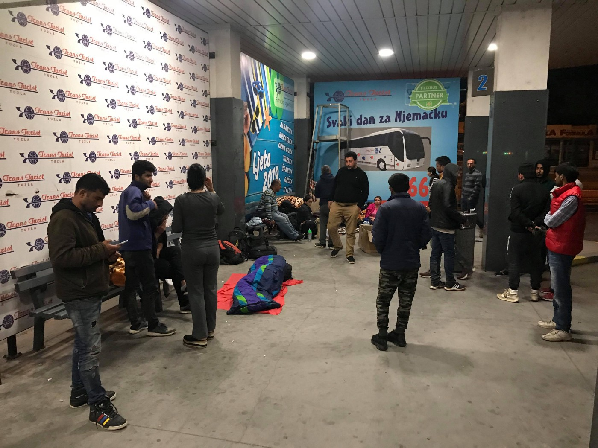
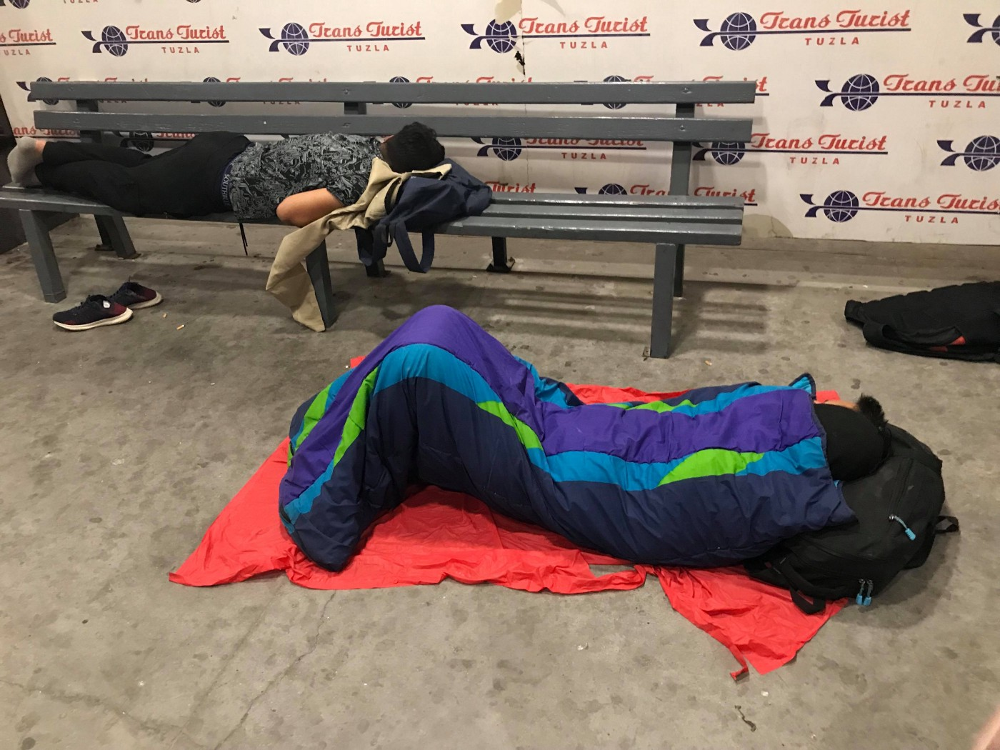

### AYS Daily Digest 28\.06\.19: EU and Morocco to intensify partnership
#### New joint declartion published to fight migration / Protestant Church in Germany wants to send a rescue ship / Greece to be taken to ECHR / Surge of arrivals in Tuzla, with no UN aid groups in sight / Investigation against Sea Watch captain

](assets/2a610a685b14/1*VvIzivf_hFodrK7zhDAf6Q.jpeg)

Credits: [Amany Al\-ali/Art Against](https://www.facebook.com/artagainstproject/photos/a.639651369417634/2278637518852336/?type=3&theater)
#### FEATURED STORIES
### Morocco: A “true Euro\-Moroccan partnership”

After many years, the European Union and Morocco have published a joint declaration to intensify their partnership\. With respect to the topic of migration, this means the same empty words EU officials have been publishing for almost five years now\. “Deal with the root causes of irregular migration” is the well\-known phrase which usually means nothing will change for the better for the people themselves\.

However, it can mean easy money for the countries concerned\. For example, [Libya](https://ec.europa.eu/europeaid/sites/devco/files/action-document-libya-action-fiche-20170727_en.pdf) received some 46,300,000 Euro from the EU for their border and migration management in 2017, and [Egypt](https://ec.europa.eu/europeaid/sites/devco/files/action_document_egypt_action_fiche_20170523_en.pdf) got 60 Million Euros in the same year and [another](https://ec.europa.eu/trustfundforafrica/sites/euetfa/files/t05-eutf-hoa-reg-78_-_bmm_ii_ocnhpwq.pdf) 35 million this year\.

In the joint statement, one of the aims is said to be: “The prevention of and fight against irregular migration, against trafficking in human beings and in migrants, and their protection, including through communication and by raising awareness of the risks tied to irregular migration, stepping up the management of the sea and land borders, mobility, in particular improving the mobility of professionals, legal migration, return, readmission and reintegration, visa facilitation and the development of mutually beneficial human exchanges, in particular for students, young workers and young volunteers, will form part of the objectives pursued\.”

In an [analysis](https://www.ispionline.it/sites/default/files/pubblicazioni/out_of_africa_web.pdf) from 2017 it says:

> Smuggling is actually a reaction to border controls rather than a cause of migration\. 

### What lies ahead for Tuzla as more people arrive

Bosnia and Herzegovina — The local volunteers in Tuzla have reported an increased number of people who have arrived in the town\.

Photos: Tuzla volunteers

During the night they reported about 40 people waiting in front of the Foreigners’ Office and at least about 50 people were seen at the station, along with many others scattered around the city in the parks\. They met a dozen children sleeping rough, and among the families there was a pregnant woman\.

Photo: Tuzla volunteers

Quite a few people have asked for medical help, many are tired and bruised, with numerous mosquito bites, especially the children, one of whom had a cast\.

The locals keep trying to provide the basic amenities to the newly arrived people, disappointed at the inert and negative attitudes of both the officials and their fellow citizens\.

Photo: Tuzla volunteers

There are also no mobile teams of international organisations to provide aid and care to those people in any way, though it has been a year now that the situation is ongoing and surely some support should have been installed by now, especially given the enormous amounts mentioned in the past days\.
### Germany: Protestant church considers deploying a rescue ship

Heinricht Bedford\-Strohm, council president of the protestant church in Germany, [said](https://www.epd.de/ueberregional/schwerpunkt/kirche/bedford-strohm-echte-identitaet-gruendet-nicht-auf-abgrenzung) that his institution is checking the possibility of sending a rescue ship to the Mediterranean Sea to rescue people in distress\. The assembly passed a resolution about it after the MEP Sven Giegold \(Green\) started a petition\. Bedford\-Strohm explained that at the moment the church is working to form a civil alliance\.
### Greece to be taken to ECHR

After having faced a two\-year trial for allegedly aiding illegal migration and being cleared of all charges, Team Humanity founder [Salam Aldeen](https://www.facebook.com/222085658130542/photos/a.226226631049778/885982645074170/?type=3&__tn__=H-R&hc_location=ufi) announced he was filing a lawsuit against Greece at the European Court of Human Rights, “challenging their crackdown on and criminalization of human goodness\.”

Due to the the increasing number of members in the Irida Women’s Centre, InterVolve announced they would stop accepting new registrations for one month, starting from 1st July\. “We have reached our maximum capacity to accommodate the ever\-growing daily number of women and children in the centre”, the team [stated](https://www.facebook.com/InterVolve/photos/a.256091268062602/882807462057643/?type=3&permPage=1) \.
### Bosnia: Corpse found near Bihac

Radio Bihac reports that the police found a dead person in a river near the city bridge\. The body has not been identified yet, but it is assumed that it was a man on the move\.

### Sea: Investigation against Sea\-Watch captain

Italian authorities have opened an investigation against Sea Watch captain Carola Rackete for aiding illegal migration, according to [Internazionale](https://www.internazionale.it/bloc-notes/annalisa-camilli/2019/06/28/seawatch-3-favoreggiamento-immigrazione-clandestina) \. However, a spokesperson said they have not received any official information yet\.

Meanwhile 16 people [made it](https://twitter.com/AngiKappa/status/1144473983196155905?fbclid=IwAR25-q7rPi0J-kho110cEoXtiU5XI_8lbow5cTZa4l6tQIoPFn9G95Iw0Wk) to Lampedusa on their vessel without being rescued or in distress\.

■■■■■■■■■■■■■■ 
> **[IOM - UN Migration 🇺🇳](https://twitter.com/UNmigration) @ Twitter Says:** 

> > Between 2014 and 2018, more than 17,900 people died or went missing in the Mediterranean – the remains of almost two thirds of those victims have not been recovered. 

> **Tweeted at [2019-06-28 08:49:51](https://twitter.com/unmigration/status/1144528322396901376).** 

■■■■■■■■■■■■■■ 

### Worth reading
- [Alarmphone update March\-June](https://alarmphone.org/en/2019/06/28/alarm-phone-aegean-report/?post_type_release_type=post)
- [ELENA legal updates this week](https://mailchi.mp/ecre/elena-weekly-legal-update-28-june-2019)

#### AYS and the Daily News Digest — how to get involved

**We strive to echo correct news from the ground through collaboration and fairness\. Every effort has been made to credit organizations and individuals with regard to the supply of information, video, and photo material \(in cases where the source wanted to be accredited\) \. Please notify us regarding corrections\.**

**Apart from daily news in English, we also publish weekly summaries in Arabic and Persian\. Find specials in both languages on our [medium site](https://medium.com/are-you-syrious/ays-weekly-in-arabic-and-persian/home) \.**

**If there’s anything you want to share or comment, contact us through Facebook, Twitter or write to: areyousyrious@gmail\.com\.**

**We’re open to expanding our team of volunteer researchers, editors, and info gatherers\. Get in touch\!**

_Converted [Medium Post](https://medium.com/are-you-syrious/ays-daily-digest-28-06-19-eu-and-morocco-to-intensify-partnership-2a610a685b14) by [ZMediumToMarkdown](https://github.com/ZhgChgLi/ZMediumToMarkdown)._
