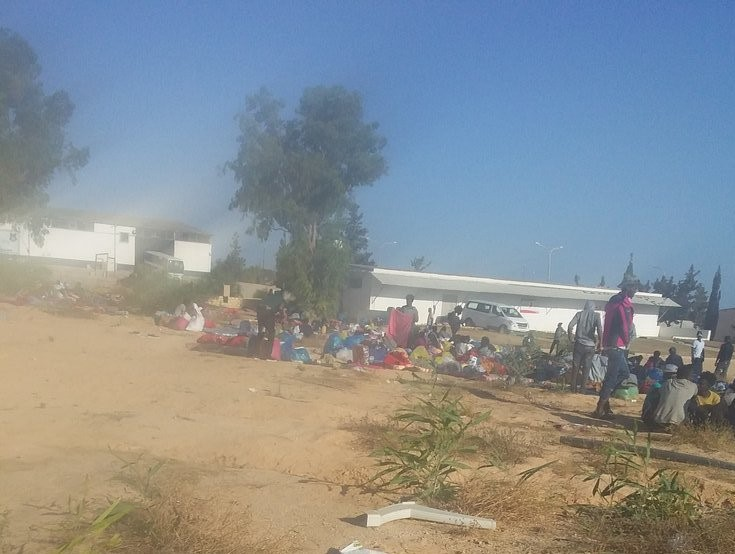
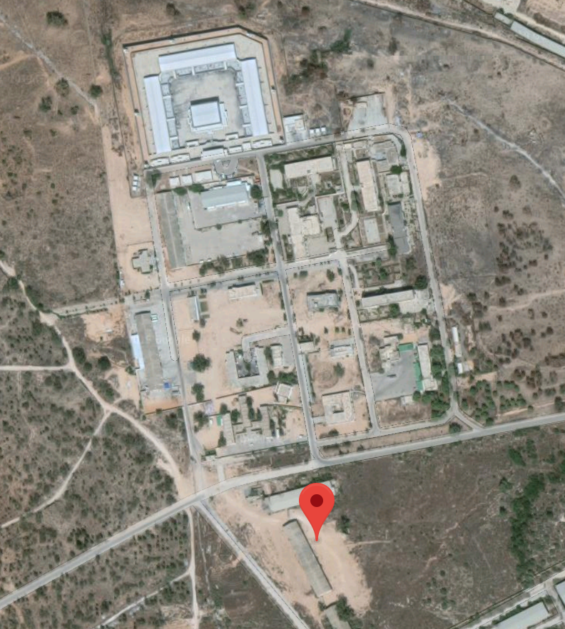

### AYS Daily Digest 3/7/19: An increase in ‘Dublin returns’ to Italy
#### Aftermath of the bombing in Libya / An increase of Dublin returns to Italy / Germany: countrywide day of action on 6 July / Protest in the Netherlands / Need for help and donations across France

People left waiting after the bombing of the detention centre Tajoura in Libya \(Photo: Sara Creta\)
#### FEATURED

In the Italian city Ventimiglia, the number of asylum seekers sent back from other European countries to Italy is increasing\.

The reason behind the returns is the Dublin 3 regulation, which puts the country of first entry into the EU in charge of carrying out the asylum process\. Italy is often not able to answer the request by other countries to take back refugees in time\. As not replying in time is seen as approval, for many of the returnees the responsibility might in fact be with another country\.

As we reported earlier, [Germany has sent 1,200 people back to Italy in six months](http://www.ansa.it/sito/notizie/politica/2019/06/16/migranti-repubblica-dalla-germania-1.200-in-italia-in-6-mesi.-pd-allattacco_02ef46d2-4643-4cac-8ef9-cb74cbf6bd84.html) \(1,114 just between November 2018 and March 2019\) \. This still happens regularly\. On the other hand, more positive requests from Italy to Germany were accepted in the same period, compared to the previous three\-month period \(3,540 vs\. 2,629\) \. Compared to Greece \(which signed an accord with Germany\), in the period between January and March, while **557 people were transferred towards Italy, only four were flown back to Athens\.**
### Aftermath of the attacks in Libya

As the Libyan authorities had continued to transfer people to the Tajoura detention centre despite humanitarian organizations repeatedly saying they risked getting caught in conflict, the inevitable disaster happened, as we reported yesterday\.

44 people \(at least\) lost their lives, while more than 130 were seriously injured after the bombing of Tajoura, when it was hit by two airstrikes early this Wednesday morning\. The same centre was also targeted on 7 May\.

■■■■■■■■■■■■■■ 
> **[Sara Creta](https://twitter.com/saracreta) @ Twitter Says:** 

> > @[UNHCRLibya](https://twitter.com/UNHCRLibya) @[ItalyinLibya](https://twitter.com/ItalyinLibya) #Libya Video filmed by a survivor, after the airstrike on #Tajoura detention center. Shame to those who claimed (esp In #Italy) that #Libya is a safe place. https://t.co/mVEzD3Zp2W 

> **Tweeted at [2019-07-03 08:07:55](https://twitter.com/saracreta/status/1146329710718332929).** 

■■■■■■■■■■■■■■ 

There were more than 610 people inside the centre when the two missiles struck it\. More than 3,300 are reportedly considered at risk following the attack\. Such a deadly airstrike on a detention center in Libya could amount to a war crime because the fighting sides knew that civilians were inside\.

Tajoura is a military complex and the militia there force detainees to assist them with moving and loading weapons, though no weapons were being kept in the big hangar people were held in, as Sally Hayden reports\.
The MSF \(Doctors Without Borders\) said a team that visited hours before the airstrike counted 126 people in that room alone\.

Location of the bombing, pin photo by: Sara Creta

The UN Secretary Ceneral, António Guterres, called for an independent investigation into the “outrageous” bombing\. The UN’s shock, however, has never saved anybody and we don’t suppose it will this time\. The centre was never safe and the UN was well aware of that, before and after the first shooting at the detention centre, not to mention after the recent visit to the centre\.
Reminder:

■■■■■■■■■■■■■■ 
> **[Italy in Libya](https://twitter.com/ItalyinLibya) @ Twitter Says:** 

> > 1/2 This morning Amb @[giuseppbuccino](https://twitter.com/giuseppbuccino) visited migrants center of #Tajoura. Two are #Italy's key priorities: to promote better living conditions which fully respect human rights, in particular for women &amp; children; to enhance resettlement &amp; repatriation programs. https://t.co/xu18RVOPSj 

> **Tweeted at [2019-06-16 17:25:14](https://twitter.com/italyinlibya/status/1140309369705443328).** 

■■■■■■■■■■■■■■ 

People have been held in horrifying conditions in detention centers in Libya for a while now\. The European Union supports the Libyan Coast Guard quite literally ‘catching’ people from the sea\. Now, in spite of all the [accounts](ays-news-digest-18-19-5-19-thanks-to-the-political-hypocrisy-47-shipwrecked-deprived-of-their-33c6941942f5) , [reports](ays-special-from-libya-on-the-ben-ghasr-shooting-85070b9532af) and [news coverage](https://t.co/emcLoWJTih) , warnings and pleas, they are being killed in the civil war\.

There are many other perspectives on the consequences of the bombing:

■■■■■■■■■■■■■■ 
> **[Emadeddin Badi](https://twitter.com/emad_badi) @ Twitter Says:** 

> > Shameful seeing #Libya-n citizens calling out #Haftar for airstrikes that led to dozens of #migrants' demise in Tajura while most multilateral institutions seemingly cower in fear w/ wilfully watered down statements not naming him.

This policy of appeasement is what got us here. 

> **Tweeted at [2019-07-03 18:12:20](https://twitter.com/emad_badi/status/1146481815760310272).** 

■■■■■■■■■■■■■■ 

The EU’s top diplomat and two top policy commissioners deplored the “shocking and tragic attack” and said that it highlights “the dire and vulnerable situation of migrants caught up in the spiral of violence in the country\.” As stated many times, Europe is equipping and training the Libyan Coast Guard, which has intercepted thousands of migrants on the Mediterranean and taken them back to detention centers in Libya, where many languish without sufficient food or medical care\.

As a clear comment on the EU’s reaction, we share with you this tweet:

■■■■■■■■■■■■■■ 
> **[Jeff Crisp](https://twitter.com/JFCrisp) @ Twitter Says:** 

> > The refugees &amp; migrants were not "caught up in the spiral of violence." They were returned to it with the support of the EU, with full knowledge of the fact that they would be trapped in an abusive detention centre.. 

> **Tweeted at [2019-07-03 16:54:36](https://twitter.com/jfcrisp/status/1146462254143082497).** 

■■■■■■■■■■■■■■ 

#### GREECE

Seven boats arrived on the Greek Aegean Islands, in the night between 2 July to 3 July, with **185 people** on board\. See [Aegean Boat Report](https://www.facebook.com/AegeanBoatReport/?tn-str=k%2AF&hc_location=group_dialog) page for details\.

 \)](assets/98888fce39fd/1*k3_u-rkK74OtrbJu-oOg5Q.jpeg)

Landing on Farmakonisi \(Photo: [Aegean Boat Report](https://www.facebook.com/AegeanBoatReport/?tn-str=k%2AF&hc_location=group_dialog) \)
#### ITALY
### Closure of CARA di Mineo

The Italian organization Medici per i Diritti Umani \(MEDU\) reports that the CARA di Mineo reception center on Sicily was closed today\. CARA die Mineo has been the biggest reception center with the highest occupancy of over 4000 people in July 2014, whilst having a capacity of up to 2000 people\. MEDU has been operating in MARA di Mineo since 2015\. The organization reported on failures to register asylum seekers to the National Health Service, dysfunctions in supply and access to psychological and legal support services, and mismanagement of public money\. Still it sees the closure of CARA di Mineo with mixed feelings, as it does not see the Salvini ministry of the interior taking any steps to improve the situation of asylum seekers\.
#### SEARCH AND RESCUE

■■■■■■■■■■■■■■ 
> **[Sea-Watch International](https://twitter.com/seawatch_intl) @ Twitter Says:** 

> > After #FreeCarola it's now time to demand: #FreeThemAll - evacuate the camps in #Libya! We are ready to do our part: The #SeaWatch3 must be released immediately from probatory confiscation, she provides space for up to 500 people. It's high time for #FerriesNotFrontex! https://t.co/KMTq7RTMm6 

> **Tweeted at [2019-07-03 13:19:58](https://twitter.com/seawatch_intl/status/1146408240000970752).** 

■■■■■■■■■■■■■■ 

Open Arms has organized a press conference with the intention of pushing for official dismissal of the infamous Decree:

■■■■■■■■■■■■■■ 
> **[Open Arms IT](https://twitter.com/openarms_it) @ Twitter Says:** 

> > Oggi pomeriggio, conferenza stampa per confrontarci su Decreto Sicurezza e sue criticità. Avremmo voluto farlo in Parlamento, lo faremo qui. 
Vi aspettiamo. https://t.co/kB0sUq20de 

> **Tweeted at [2019-07-03 09:02:49](https://twitter.com/openarms_it/status/1146343526201999360).** 

■■■■■■■■■■■■■■ 

A strange account of a call for rescue was reported by the Alarm Phone\. 
On the late evening of 2 July, a man called Alarm Phone who said he was among a group of 60 people on a boat in distress off the coast of Zawiya, Libya\. According to him, there were 20 women & small children on board, one of the tubes was deflating & water was entering from that side\. He claimed that they wanted to be rescued even if this meant being returned to Libya, they had no other option\. After the first call, AP team reports, contact to the man broke & could not be re\-established\. They emailed the Libyan Coast Guard, and tried to reach them directly by phone, but neither worked, showing once more how dysfunctional the Libyan authorities are\.

> For 11 hours now, the Libyan authorities could not be reached\. — _\(AP, on 3 July, 11pm\)_ 

They finish by saying:

> At 11:41 pm we informed the MRCC Rome about the situation\. The [\#Italian](https://twitter.com/hashtag/Italian?src=hash) authorities replied that they would inform the Libyan authorities\. We have no idea what happened to the boat & the 60 people\. We hope they survived, even if this means being back in an ongoing war zone\. 

](assets/98888fce39fd/1*_EUDzcGmZmWmInQSDlQPhA.jpeg)

Copyright: [europapress](https://www.europapress.es/andalucia/cadiz-00351/noticia-rescatados-seis-migrantes-menores-patera-navegaba-aguas-estrecho-20190703091548.html?fbclid=IwAR30U_xDWEuovUV5UWxRzYLuvSZbM-7GU92uVKCtiTd7ipXcfZvBmTvtayI)

The Spanish Coast Guard rescued six minors on what was defined as a ‘toy boat’ in the Gibraltar Strait\. All were okay\.
#### FRANCE
### Grande Synthe

As we reported earlier, on 21 June, the State Council confirmed the faulty action of the authorities in Grande\-Synthe in terms of access to water, hygiene and sanitary conditions\. The prefecture of the North had to to install water points, showers and toilets in sufficient amount, as well as to set up an info point for the people to know their rights\. On Friday, 28 June, the prefecture has complied with some of its obligations, La Cimade reports\. They remain vigilant so that the application of the fundamental rights of the refugees is effective\. As of 2 July 2019, they have a coordinator for the activities regarding the access to the legal remedies in Grande\-Synthe on the behalf of La Cimade\.
### Paris

Urgent needs at the warehouse in Paris:
Hygiene products — shampoo, shower gel, soaps, toothpaste, toothbrushes, shaving cream, razors, body cream, deodorant, toilet water, handkerchiefs\.

For children: milk, diapers size 4, 5, 6, strollers\.

For women: long skirts, long dresses, leggings and slim\.

For men: shoes \(trainers\), pants \(jeans\), shorts, joggings, boxers, socks, caps, backpacks, sleeping bags, tents, t\-shirts and shirts size S\.

**Wednesday from 2 to 6 pm, Saturday and Sunday from 9 am to 2 am** you can contact the Vestiaire at 07 53 54 59 99\. On **Saturday and Sunday from 9am to 2pm** , the Vestiaire is open for the users and to deposit donations\.
Also, volunteers are welcome, please inscribe via SMS on: 06 03 02 83 72\.

You can deposit donations outside of their hours at the Emmaus Défi\. Contact: Hélio Borges at 06 37 75 43 37, but preferably at:

**VESTIAIRE POUR LES MIGRANTS** 
**12, rue Saint Bruno 75018 Paris** 
**Église Saint Bernard de la Chapelle** 
**Téléphone 06 03 02 83 72** 
**mail : vestiairemigrants\.paris@gmail\.com**

A guide for asylum seekers in Paris is available here: [www\.guideasile\.wordpress\.com](http://www.guideasile.wordpress.com/?fbclid=IwAR00qci3Tph60RUjIJYycuVwv0jlpjgkr79H2100SUFieEHJcaDo78hPhUc)

Anti\-racist protest will take place on 4 July in Paris, attended also by the ‘gillets noirs’:

### Rennes
#### Call for donations, call for volunteers, call for your support

In and around Rennes, [Utopia56 Rennes](https://www.facebook.com/utopia56Rennes/?__tn__=kC-R&eid=ARDW544ZV0nymDDi0DOhCFkB4DtvSl6jkl_Ce6C-V1jghK8YULI4RVgv9rxKTYS4yEEvz_2GPJJljytx&hc_ref=ARRvpmrGxPbcR9cene3N0pjn_gtQQf7SXp7X9qTqOi46Z2u2P-lJnoU6zcrjdW6povk&fref=nf&__xts__%5B0%5D=68.ARAxssfocRYzO4d_andZpQrUAE3svNaBBjeru5Bgu0a7tH46z8Ymj6mgg28IlinCcIwEn9-Bp4wf9syvh0p5OEcYa_jHu4ZYzDu-pPJpSU7nEmFTI-iyb7uX7TjHxTYn6z5qhfFe2H3lW-uDyPnfctEu1BWWgbZubIVZmMFYmdgc5ueeU8AW2Ue21U1HkoSSQVyorNajE2wHYfMcdI-0gLVVqEI06Pppwc1JnzERahCeUIhEDm2iReC1JQf9nAnIiFyxz0_ff3c5_s8EAyH27NSwnsgCN5fsc-EbyRqaMfE7JMIJRW3kS_yZzYa8E_sEtZAhb-MexGfe-nZiIb5Ppgrk5Q) is collecting donations for those on the street\. The needs of the moment that are a priority are the material for shelter: tents, duvets, and mattress\.

Feel free to drop it off at the following locations:

\-Maison du Ronceray,Rennes \(110 rue de la poterie\)
\- Le Bateau Ivre, Rennes \(28 Rue de la Visitation\)
\- Le Chantier, Rennes \(18 Carrefour Jouault, Bas des Lices\)
\- Papier Timbré, Rennes \(39 Rue de Dinan\)
\- BabaZula,Rennes \(182 Av\. Général George S\. Patton\)
\- Le Jardin Moderne, Rennes \(11 Rue du Manoir de Servigné\)
\- Les Ateliers du Vent, Rennes \(59 Rue Alexandre Duval\)
\- La MJC de Corps\-Nuds \(8 rue des loisirs, Corps\-Nuds\)
\- Askoria \(2 avenue du Bois Labbé, Rennes\)
\- College des Ormeaux \(30 rue des ormeaux, Rennes\)
\- BuzzTattoo \(9 Rue du Pré Botté,Rennes\)
\- Le Champ Commun \(1 rue du Clos Bily, Augan \(56\) \)
\- Théâtre de l’Aire Libre \(2 rue Julles Vallès, Saint\-Jacques de La Lande\)

[Here](https://l.facebook.com/l.php?u=https%3A%2F%2Fdrive.google.com%2Fopen%3Fid%3D1VCVHftNN_5XxazxvjJh08YIoAecPJbXH%26usp%3Dsharing%26fbclid%3DIwAR0Sk5akCvVRja18-Vxx_1aRZ_y2kFuyM-2xQJHD42mgEP6Bvg2aBDDeYC8&h=AT38jyFyWww8q9VptEY-zpLIoIdppL3q2dAvDloSwaMQTRwxzY6pOaUe1Vb3_4ChvCeWeYpHJQTyegRgbN81akyZMSq9IgKcqojhdFnt9jYP9qwJopOu6G0PNDXoFF9TChQwD2DjL2mDaKjUs1gdNbR4gI9vuPiNRleR2JhJvLk86yEk6QxnlSeJIWIcaIP30NWexxFXqDq9JlMOiYPlLXfAixuY5U0gv7lsO4fdEItDMGbAMIaepwgOjkO2MCC-zIal8BLOmPN2RpXDOh9edABuYrJb77DcsAxC0KWIyU7r4AlmyiwNM1dzT4s4iFFqNnFS7PIeOiXwMecHeYMZLp1d4tx6Tof3GxSxW0sLnMFmazpTROE_6syad5XyF-H3Qyfpu1isARCx9dtKr6C39kak8Zpjbbkayj99joEuuk7-eNrH9OCypSyvESpoeC5XeUrQ3kp6gsPJpTDOpNcVq8v5SfgV2-2r2cWR1INlbR3w-535oovi1ef7vPxcmTdVQFWAne3Oe54ClKgbu5p2NMK2Trl2soXP_u-oZbOG6WCpcU2vRZJUjuLyq7agln_fqxXDplvdMUONAxQovD9uOXsD1pTfmmHZjlIwt0ckBuUVntP7loJ_4wHH5C2ioCvl7bg) is the map of all of their locations in the city\.
#### GERMANY

On 6 July a demonstration organized by Unteilbar \(a broad anti\-racist alliance\) will be held in the city of Leipzig\. With this demonstration the organization wants to introduce a Summer of Solidarity in Saxony, a region with high numbers of right\-wing voters\. Its aim is to strengthen and better connect the anti\-right community\. In autumn 2019, state elections will be held in Saxony and two other states\.

Seebrücke also called for a countrywide day of action on 6 July\. Seebrücke demands safe harbours and sea rescue\.

#### THE NETHERLANDS

The demonstration calling for the release of Carola Rackete and for a stop to the criminalization of sea rescue today \(4 July 2019\) in Amsterdam will be held, although Rackete is no longer under house arrest\. Since the ship Sea Watch 3 is still confiscated and the EU is still not taking effective measures to prevent the dying of people in the Mediterranean, the need for civil solidarity is still prevalent\.
#### AYS and the Daily News Digest — how to get involved

**We strive to echo correct news from the ground through collaboration and fairness\. Every effort has been made to credit organizations and individuals with regard to the supply of information, video, and photo material \(in cases where the source wanted to be accredited\) \. Please notify us regarding corrections\.**

**Apart from daily news in English, we also publish weekly summaries in Arabic and Persian\. Find specials in both languages on our [medium site](https://medium.com/are-you-syrious/ays-weekly-in-arabic-and-persian/home) \.**

**If there’s anything you want to share or comment, contact us through Facebook, Twitter or write to: areyousyrious@gmail\.com\.**

**We’re open to expanding our team of volunteer researchers, editors, and info gatherers\. Get in touch\!**

_Converted [Medium Post](https://medium.com/are-you-syrious/ays-daily-digest-3-7-19-an-increase-in-dublin-returns-to-italy-98888fce39fd) by [ZMediumToMarkdown](https://github.com/ZhgChgLi/ZMediumToMarkdown)._
