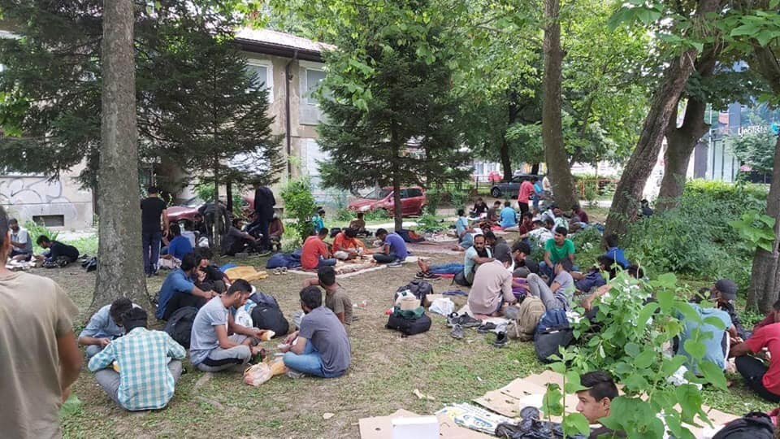
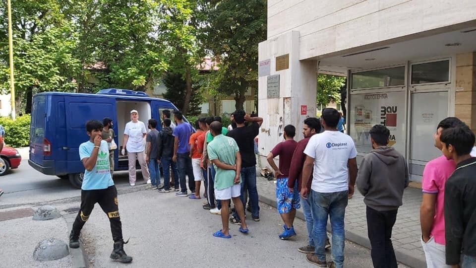
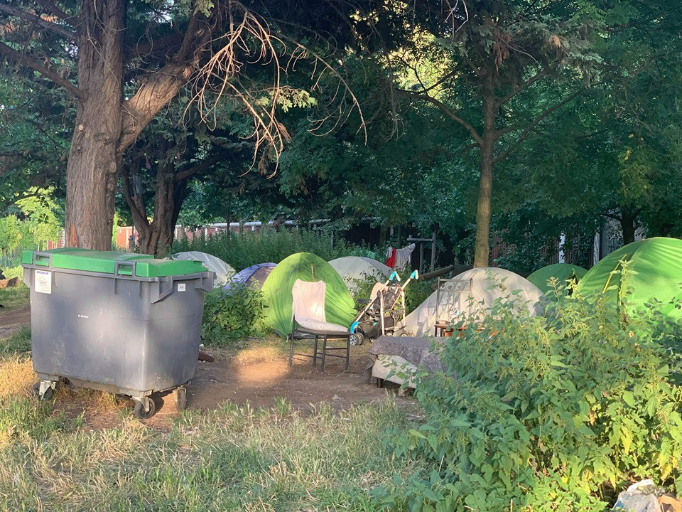

### AYS Daily Digest 5/7/2019 — Crocodile tears over Tajoura attack

More lives saved in the Med by \#AlanKurdi /// Mediterranea blocked by political games between Malta and Italy /// Updates from Paris /// New arrivals in Tuzla

](assets/33365ee75a36/1*Ld5sA9EjVyqyjH7wQeQHjQ.jpeg)

\#Noborder — By [Mikail Çiftçi](https://mikailciftci.com/)
### Who cares about people dead in Libyan centre?

It has been four days since the deliberate attack against Tajoura detention centre\. The best European governments and international agencies have come up with is some shameful statements and a lot of crocodile tears\.

The [EU continues to be blind](https://twitter.com/JFCrisp/status/1146462254143082497?ref_src=twsrc%5Etfw%7Ctwcamp%5Etweetembed%7Ctwterm%5E1146462254143082497%7Ctwgr%5E393039363b636f6e74726f6c&ref_url=https%3A%2F%2Fmedium.com%2Fmedia%2F2470d5f948969b0f6d9aa6018484be33%3FpostId%3D98888fce39fd) to its own responsibilities for the death toll of the attack\. A death toll that risks being much higher than the figures so far published\. As Italian activist and journalist [Sarita Libre](https://twitter.com/Sarita_Libre/status/1147266813434191872) points out:

> Do you know how many poeple died in Tajoura? It is not known even in Tajoura\. In the bombed cell there had been for years around 130 people\. Two managed to flee despite guards shooting at them, 18 are wounded\. Everybody else is dead\. Without a name\. 

The US [vetoed](https://www.thenational.ae/world/mena/un-renews-bid-for-libya-ceasefire-resolution-after-migrant-deaths-1.883060) a resolution of the UN Security Council condemning the attack\.

As usual, the Italian government stands out in supporting the Libyan authorities in their criminal actions against migrants in the country\.

Less than 48 hours after the attack, a vast majority of Italian MPs [voted to continue Italy’s mission in the country](http://www.ansa.it/sito/notizie/politica/2017/08/02/libia-in-senato-si-vota-la-risoluzione-sulla-missione-navale-la-diretta_3153feb1-180c-45eb-89a4-2abd77fe84ae.html) , extending the economic support for curbing migration from 1\.7 million € \(as agreed in the deal originally signed by the previous ‘left\-wing’ government\) to 7 million €\.

And the UNHCR? It has been four days from the massacre and still no one have seen them in Tajoura\.

■■■■■■■■■■■■■■ 
> **[urbanauta lowreso@mastodon.social](https://twitter.com/lowresoOk) @ Twitter Says:** 

> > Three day after the bombings the refugees (I should write inmates) in #Tajoura, Libya are still refusing to enter in the detention center and ask for evacuation https://t.co/xFMkMZezjX 

> **Tweeted at [2019-07-05 20:03:41](https://twitter.com/lowresook/status/1147234613456187394).** 

■■■■■■■■■■■■■■ 

In the meantime, international media and far too many politicians have spread moral panic due to the possibility that the Libyan authorities will release all migrants in detention, describing it as a threat to Europe, as the new invasion…

There are 7,000 people detained without having committed any crime in the country\. Divided by the 28 EU countries alone, it is 250 people per country\.

By now, it should be clear that the release of all migrants in detention in Libya and their evacuation through safe and legal routes is the only way to stop deaths in the Libyan centres and at sea\. Also, it is the only humane policy that EU countries can choose\.

LEBANON
#### Authorities increase pressure on Syrian refugees to leave the country

The Lebanese Armed Forces [demolished about 20 Syrian refugee shelters](https://www.nrc.no/news/2019/july/demolition-of-homes-in-arsal/) on July 1, 2019, contending they did not comply with long\-existing, but largely unenforced, housing codes, Human Rights Watch [report](https://www.hrw.org/news/2019/07/05/lebanon-syrian-refugee-shelters-demolished?fbclid=IwAR0TuLKPRSw2GLe1Oa6uDZnNOjntngFFsGMfgZgsyCECD7M9IB22Gie6yF8) \.

> This crackdown on housing code violations should be seen for what it is, which is illegitimate pressure on Syrian refugees to leave Lebanon \[…\] Many of those affected have real reasons to fear returning to Syria, including arrests, torture, and ill\-treatment by Syrian intelligence branches” _\( [Bill Frelick](https://www.hrw.org/news/2019/07/05/lebanon-syrian-refugee-shelters-demolished?fbclid=IwAR0TuLKPRSw2GLe1Oa6uDZnNOjntngFFsGMfgZgsyCECD7M9IB22Gie6yF8) , refugee rights director at Human Rights Watch\)_ 

The 2004 housing code, which rarely — if ever — been enforced so far is now being used against 3,500 to 3,600 refugee families in Arsal \(about half of the shelters in the region\) and also in the Bekaa Valley, Baalbek, and Hermel\.

MOROCCO
#### The problem with statistics

AMDH Nador [report](https://www.facebook.com/AmdhNador/?__tn__=%2CdkCH-R-R&eid=ARDPBmC0DT6r_UkzYV3hLH2733kBctJ8WQ8Px9tP_FYIQXwlxF-sUUTNC9z9dNNI6XgoKCjjpamo3f8N&hc_ref=ARQKYDTuyHGvpOYappPmHm0DrGAbZ5Rg6eX7eHCjVCyfn-FCXFnu7CfifbJn7bCykHU&fref=nf&hc_location=group) about two different statistics on arrests and prosecution in Morocco, recently published by the Interior Ministry and the General Prosecutor’s Office \( _parquet général_ \) \.

According to the general prosecutor’s data, foreigners in Moroccan prisons number only 1,046, on a total prison population of 80,000 people\.

This number doesn’t take into account the 70,571 migrants and 229 traffickers, who are comprised in the ministry’s statistics\.

> “Where are the 70571 migrants once arrested by the Moroccan authorities? They are neither brought before a judge nor locked in a legal place of confinement\.
 

> So these are illegal administrative arrests in places of illegal confinement\.” _\( [AMDH Nador](https://www.facebook.com/AmdhNador/?__tn__=%2CdkCH-R-R&eid=ARDPBmC0DT6r_UkzYV3hLH2733kBctJ8WQ8Px9tP_FYIQXwlxF-sUUTNC9z9dNNI6XgoKCjjpamo3f8N&hc_ref=ARQKYDTuyHGvpOYappPmHm0DrGAbZ5Rg6eX7eHCjVCyfn-FCXFnu7CfifbJn7bCykHU&fref=nf&hc_location=group) \)_ 

SEA

As reported yesterday, the sailboat \#Alex, operated by Mediterranea — Saving Humans has rescued 54 people and it is now stuck at 12 miles from Lampedusa and over 100 miles from Malta\.

Media sources reported yesterday about an agreement between the Italian and Maltese governments to bring the rescued people to Malta\. In exchange Italy would take 55 people from Malta… Another political game\.

Being a sailboat, the travel to Malta with 54 people \+ crew on board could prove to be dangerous, as Mediterranea [inform](https://twitter.com/RescueMed/status/1147428989063041024) , but so far no Italian or Maltese boat has offered help\. Moreover, it has been revealed by media outlets that an agreement has also been reached between the Italian and Maltese authorities to seize the Italian NGO ship\.

Oscar Campos [offered](https://twitter.com/campsoscar/status/1147048608858025984) to use the OpenArms vessel to bring the people from the \#Alex to Malta, but Maltese officials refused for political reasons… Or maybe because this would prevent them from seizing the Mediterranea sailboat?

After having published posts, tweets and an official statement about how foreign NGOs should bring rescued people to their own countries, now Italian interior minister Salvini is refusing a safe port to a vessel with an Italian flag\.

At the same time, the \#AlanKurdi vessel operated by SeaEye has rescued 65 people and it is now in international waters, off the coast of Lampedusa\.

■■■■■■■■■■■■■■ 
> **[sea-eye](https://twitter.com/seaeyeorg) @ Twitter Says:** 

> > We are waiting in int. waters off the island of Lampedusa. The Guardia di Finanza came by in person to deliver Salvini’s decree:
The port is closed.

In Germany, however, more than 70 cities are willing to welcome the rescued persons.
We urgently need a safe port. #AlanKurdi https://t.co/VlSBYSCW6x 

> **Tweeted at [2019-07-06 08:36:13](https://twitter.com/seaeyeorg/status/1147423996008456192).** 

■■■■■■■■■■■■■■ 

GREECE
#### Arrivals

Aegean Boat Report has published [inform](https://www.facebook.com/AegeanBoatReport/posts/606324766557298) ation that two boats carrying a total of 52 people has arrived in Lesvos and Farmakonisi\. They also report about unconfirmed arrivals in Kos\.
#### Volunteer needed in Velos Youth Centre, Athens

Velos Youth Centre are looking for a cultural mediator who can translate Urdu and Farsi to English\. It is a volunteer position with some expenses covered\.
Applicants must be over 21\. — If you are interested, read [HERE](https://www.facebook.com/groups/AthensVolunteersInformation/permalink/1747895098676113/?hc_location=ufi) for more information\.

BOSNIA
#### Vucjak, Europe’s most dangerous refugee camp

[Balkan Stories](https://balkanstories.net/) published a video on the Vucjak ‘camp’:

#### Media whitewash conditions in Bosnian centres

Referring to a [story](https://www.slobodnaevropa.org/a/30029940.html?fbclid=IwAR3KdIRyTAd9qzqBkgJa8Rs5_gy4WDneQ2pj9vWIsMauJtXdPQ8LruZwxDg) that is circulating in Bosnian media about the ‘Sedra’ vulnerable centre in Cazin, in the Una\-Sana canton, which currently holds 328 people, half of whom are children, it is impossible not to note that the press insists on representing the situation for migrants in the country as being far better than it actually is\.

In the words of a [local activist and volunteer](https://www.facebook.com/groups/144469886266984/permalink/375125273201443/) :

> In some strange way, the reporter did not notice that there was no drinking water, did not notice the conditions, humidity …\. Nothing\. And worst of all, I do not think she had bad intentions, but she did not look around, I guess\. She did not really talk to the people she was talking to\. True, at one point it can be seen that an IOM worker stands above a man who makes a statement, which is unacceptable\. They are not even free to speak\. 

#### New arrivals in Tuzla

A local volunteer [report](https://www.facebook.com/groups/144469886266984/permalink/374667353247235/?hc_location=ufi) s about new arrivals in Tuzla\.

 \)](assets/33365ee75a36/1*0xZ4iqubkmYNDL6yiX-2yg.jpeg)

New arrivals in Tuzla \(photos by [Senad Cupo](https://www.facebook.com/groups/144469886266984/permalink/374667353247235/?hc_location=ufi) \)

Many are minors, and many also resort to asking for money in the streets, because they have no more funds to keep travelling\. The support provided is not enough: the Red Cross is active only during the morning, and local volunteers provide help and food in the evening\. The NGO ‘Zemlja djece’ provides basic support for children and minors\. All the people sleep rough and have no other choice but to wash in the river where the sewer ends\.

Following earlier [reports](https://medium.com/are-you-syrious/ays-weekend-digest-22-23-06-2019-slovenian-authorities-publish-countrys-first-strategy-on-54f0a063bbe6) from AYS volunteers, the local asylum office [insists](https://www.facebook.com/groups/144469886266984/permalink/374667353247235/?hc_location=ufi) on prohibiting people queuing outside from charging their phones in the building\. Already in June all the sockets from the common areas of the buildings had been removed\. Now people have been threatened with having their phones taken away if they try charging them in the remaining sockets\.

FRANCE
#### Crime of solidarity: a guide

A guide to the criminalisation of solidarity has been published in France by the collective ‘ [delinquants solidaires](http://www.delinquantssolidaires.org) ’\. It was published yesterday to mark the first anniversary since the French Constitutional Council, the highest judiciary court of the country, recognised the ‘ [principle of fraternity](ays-daily-digest-6-07-2018-solidarity-is-not-a-crime-b22bf179695a) ’ on the 6th of July 2018, regarding the case of Ceric Herrou, farmer near the border between Italy and France, whose house had become a sanctuary for people crossing borders\.

A year since that date, things have only gotten worse\. The verdict of the constitutional court has been contradicted a number of times, as happened in the case of the ‘ [Briancon 7](ays-daily-digest-08-11-2018-hundreds-demonstrate-as-7-activists-face-10-years-in-prison-in-france-404bf48d3949) ’, which saw the defendants charged for ‘aiding illegal migration’\.

Find the guide [HERE](http://www.delinquantssolidaires.org/item/delit-de-solidarite-le-guide?fbclid=IwAR2ltiFCu95BUlnUFc7VVnsZIhv1WPlTAxh-DDxSqjvJyp5SE_RwvQYA8gQ) \(in French\)
#### Updates from Paris

From a volunteer in Paris:

 \)](assets/33365ee75a36/1*kCnvZ6-19h6ivwTMWNqWSw.jpeg)

Paris \(photo by [Danika Jurisic](https://www.facebook.com/permalink.php?story_fbid=2361845847475374&id=100009499466124&hc_location=ufi) \)

> The heat is past \[…\] and temperatures are back to something we can all live with\. There is still need for water in the camps, but also other necessities : tents, toiletries, sunblock cream for kids, summer clothes, diapers, medications… 
 

> But this is far from over\. 
 

> Porte de l’Aubervilliers and Porte de la Chapelle are again , as every summer, saturated with refugees, and now it is with refugee families who have children not older than 2, 3 years — with babies who are really threatened by rats and insects one might find in the camp\. 
 

> Heat has caused not only a rise in air pollution but also speeded up the rotting of all the garbage around the camp, so the smell rising from piles of thrash was unbearable\. 

 \)](assets/33365ee75a36/1*LUG3B6Bf4U7t8zFxNZOKSg.jpeg)

Paris \(photos by [Danika Jurisic](https://www.facebook.com/permalink.php?story_fbid=2361845847475374&id=100009499466124&hc_location=ufi) \)

> There are still many food distributions around the camps, but due to the large number of refugees that have recently arrived, and the growing number of French Parisian homeless and poor people , this is never sufficient and it barely covers the needs\. Conflicts, fights, even thefts and more serious violence are very common\. Robberies at knifepoint are an almost daily frequent abuse that refugees suffer\. 
 

> This is my 5th summer in the camps\. I can’t say anything has really changed\. The location and faces yes, but the conditions and abuse and despair are the same\. \[…\] 

Read the full post [HERE](https://www.facebook.com/permalink.php?story_fbid=2361845847475374&id=100009499466124&hc_location=ufi) \.

Also, the group [Watizat](https://www.facebook.com/guideasile/?fref=gs&dti=177642579245883&hc_location=group_dialog) has published the July edition of ‘The asylum seekers’ guide in Paris’\. It is available in French, English and Arabic on their website: [www\.guideasile\.wordpress\.com](https://l.facebook.com/l.php?u=http%3A%2F%2Fwww.guideasile.wordpress.com%2F%3Ffbclid%3DIwAR0e1XtuBfaRU3tJp7afRCrhihr65AM9012yyZKK0zBFnAJS4FhxkMxQstk&h=AT3KEvw9b16d6cEKZGItga8HJjao3rIS_3okk6Rsg5LZecPttzVarTw8sPKYEMGqkEZSbUq3lPVFyKFb0U1fknEjklciSeezI3KXdt1Cbv6_prU1Q8uEVif--ZDZlXDxqGHQmGrT34572MI)
#### AYS and the Daily News Digest — how to get involved

**We strive to echo correct news from the ground through collaboration and fairness\. Every effort has been made to credit organizations and individuals with regard to the supply of information, video, and photo material \(in cases where the source wanted to be accredited\) \. Please notify us regarding corrections\.**

**Apart from daily news in English, we also publish weekly summaries in Arabic and Persian\. Find specials in both languages on our [medium page](https://medium.com/are-you-syrious/ays-weekly-in-arabic-and-persian/home) \.**

**If there’s anything you want to share or comment, contact us through Facebook, Twitter or write to: areyousyrious@gmail\.com\.**

**We’re open to expanding our team of volunteer researchers, editors, and info gatherers\. Please get in touch\!**

_Converted [Medium Post](https://medium.com/are-you-syrious/ays-daily-digest-5-7-2019-crocodile-tears-over-tajoura-attack-33365ee75a36) by [ZMediumToMarkdown](https://github.com/ZhgChgLi/ZMediumToMarkdown)._
