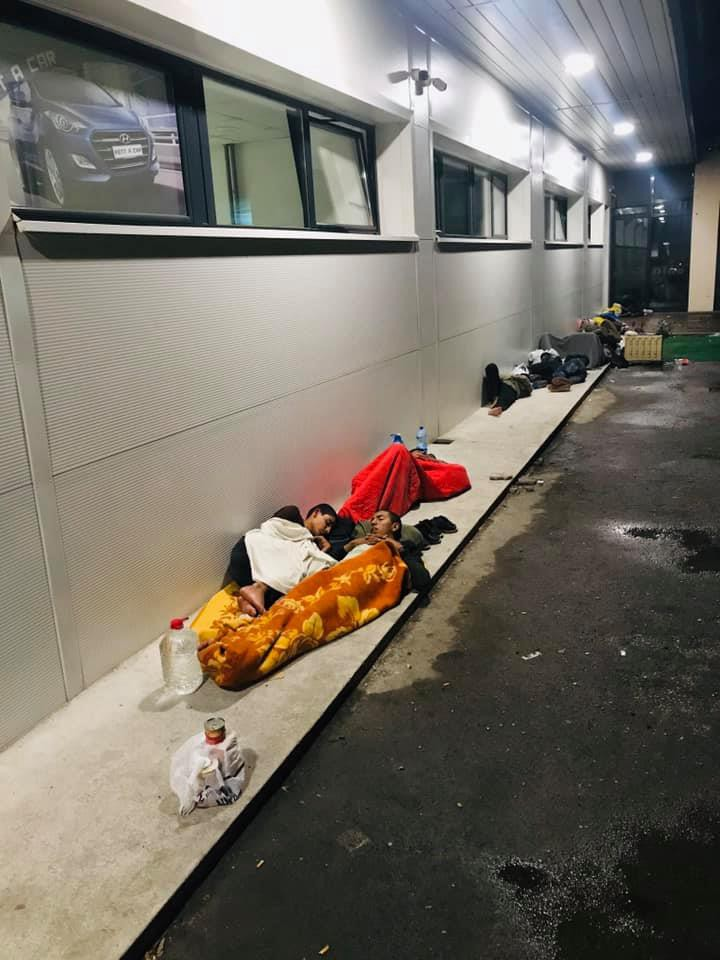

### AYS News Digest 7\-8/7/19: Abused young man dies in Italian CPR
#### Hunger, despair and violence that goes unreported in the detention centres of Italy / Still no organized official assistance to the people outside the ‘system’ in Bosnian towns along the ‘route’ / Six boats arrived on the Greek Islands / two boys collapsed after two days on the Alan Kurdi off Malta

A night at the bus station in Tuzla \(Photo: Senad Cupo\)
#### FEATURED
### Rage and desperation within the lethal detention centres in Italy
#### A death in Torino

A young man died in the night between July 7 and 8 in one of the isolation cells of the CPR \(Center for Permanence and Repatriation, established by the Minniti\-Orlando law \(L 46/2017\), detention facilities where foreign citizens without a regular residence permit are detained\) in Turin, where he had been held for 22 days, it is [reported](https://anarresinfo.noblogs.org/2019/07/08/sahid-stuprato-e-morto-in-isolamento-al-cpr-di-torino/?fbclid=IwAR2VGQo4Iivbx6BPBPOAoa8DbYuSbYjo7yp22uK1VocbCQJbzaEoHLoAc6E) \. It is not excluded that the great heat of these days may have played an important role in his death, and of course, the conditions in which he was detained should be taken into account: the 32\-year\-old had been in solitary confinement for 15 consecutive days and the witnesses from the CPR claim that that he suffered a sexual assault within the facility and that he was isolated from others\.

The police claims they have not received any emails or other types of information that there might have been an attack or a rape within the facilities, but an email dating from June 25 confirms otherwise\.

email screenshot obtained from fanpage\.it

The agencies broke the news that the 32\-year\-old immigrant Sahid’s death was due to natural causes\. In the evening protests continued and the police intervened with tear gas in the CPR\.

There was reportedly no official communication from the CPR, the Italian news agency reported nothing and the daily newspapers claim the person who died was a 32\-year\-old Bengali homeless\.
#### Rome

On Friday evening, following a protest, some of the residents of the Ponte Galeria [reportedly](https://roma.repubblica.it/cronaca/2019/07/08/news/migranti_rivolta_nel_cie_di_ponte_galeria_fuggita_una_dozzina_di_persone-230706567/?ref=fbpr&fbclid=IwAR0y-zLCoN47_YW3ThOYgAVqnoBrwXxlvVuvhSTdWBJ_Nnw7NFlv-Y8z5qM) managed to escape from the centre by smashing doors and climbing over fences, disappearing later into the surrounding countryside\. They had previously complained that the food was very low quality, and even expired in most cases and that the conditions were really bad inside the centre\.

Twelve were apprehended shortly after the escape, thirteen were still in circulation\.

Depriving people of their basic right to move, without previous legal grounds for such measures, once again puts more restraints on people in search of a just process in their applications for international protection\. Regarding the official reactions — “Once again, we’re seeing that it is impossible to equalize conditions and placement among people with very different histories and experiences, and the few radicalized individuals under the attention of the counterterrorism unit”, Lazio’s regional councilor said afterwards\.
### Life\-threatening conditions for people stuck in Bosnia

Bosnia and Herzegovina keeps witnessing a dramatic increase in the number of people entering the country\. A large number of people, after crossing from Serbia, arrive in Tuzla with severe health problems, injuries and infections\. Many have infectious diseases, and are still only assisted by volunteers, individuals from the town who are willing to help in any way needed\. A few of them are medical staff, and they tirelessly try to provide basic assistance to the injured and those suffering from various illnesses\.

Photos from the station in Tuzla by Senad Cupo

Many are still staying in and around the bus station, in the parks and other public spaces, while they are still allowed to do so\.

The politicians, dreading the scenario they have seen in Bihać, refuse to provide even the basic structures for these people, such as a toilet, not to mention showers, a provisional clinic, a place for people to rest, etc\. According to the statements of the mayor, the place would slowly but surely become ‘the next Bihać’\. In the meantime, those who do not succeed in reaching the Una\-Sana canton within two weeks of having their documents issued in Tuzla are being arrested and placed in police custody\. However, given the dreadful situation in the city, in some instances, arrest by the police ironically presents the only option for them to have a roof over their heads, though the entire situation is bizarre, to say the least\. The federal government still has not taken full responsibility in assessing the situation and concretely stepping up to do something\.

> In the meantime, the international community and organisations present in Bosnia and Herzegovina speak of human rights as if they are available to everybody\. 

If the people manage to leave Tuzla on one of the bus lines going towards the Una\-Sana canton, they are still taken off the buses in Ključ, where Red Cross volunteers, individuals who are putting all their strentgh and capacities into doing what is possible given the extremely difficult circumstances, are assisting them\.

Being forbidden to put up any structures for people to hide from the sun and the rain, the volunteers provide some food and basic medical assistance, along with assessing the age of minors and establishing contact with the officially responsible organisations and institutions for placing unaccompanied minors in a supposedly more secure environment, so\-called sectors for minors within a few of the existing camps in the region\.

Photo: local Red Cross volunteers in Ključ

They have no toilets \(or showers\) and this, along with the other conditions in which they travel, which have been mentioned many times, presents a serious health hazard\.

If anyone has the means or the influence to move something in the right places, now is the time to do so\.

#### GREECE
### Weather warning

**Please, share this with all potentially concerned:**

Temperature increases further on Monday, July 8, as one more heat wave strikes Greece\. According to the weather forecast, the new heat wave will push the thermometer up to 42 and even 43 degrees Celsius locally in the next couple of days\.

6 boats have arrived on the Greek Aegean Islands during Sunday, carrying 186 people, four boats on Lesvos and two on Chios\.

### Attika Human Support’s Weekly report 30th June — 6th July

1572 people arrived on Lesvos island in the month of June and 357 more during this week, Moria camp hosts around 6,000 people, children, men and women, much more than its capacity of 2,500 people, in inhuman living conditions\.

1236 persons live at Kara Tepe and 80 in Pikpa camps\.

1000 asylum seekers are living in Mytilini or other villages at Lesvos, making a total of more than **8,000 [p](https://www.facebook.com/hashtag/8000people?source=feed_text&epa=HASHTAG) eople living on the island** \!
#### SERBIA

No Name Kitchen is still present in Serbia, in the midst of a really difficult situation in which people are stuck in Šid, a border town with Croatia\. 
The team reports:

> For several weeks now we are offering 60 meals per day at the train station and a further 80 meals at the abandoned building where dozens of people \(and sometimes, many more\) have been living for a long time\. This totals 15 kg of food per day\. 

> The people we join are very diverse\. Some move from place to place, while others stay in the same one for months\. Many of these people have been three years in a legal limbo — since the closure of the European borders and due to the lack of legal access routes to claim safe protection\. 

> We have been in Šid for 765 days now — since May 28, 2017 — and we only stopped our tasks for a few days, forced by the police\. Being here so long has been possible thanks to over 250 volunteers who have stayed for some time in this city with us\. Their work has represented distributing over 120,000 meals, tens of thousands pieces of fruit and of other items we have available\. 

> We also distribute clothes, water \(for washing and drinking\) and electricity through a generator to allow charging mobile phones, as well as all the donations we receive \(shoes, razor blades, soap, slippers, etc\) \. 

#### SEARCH AND RESCUE

Alan Kurdi announces: ‘Let’s go back to the rescue area\.’ There was a second mini landing in a matter of hours in Lampedusa, ANSA r [eported](https://l.facebook.com/l.php?u=https%3A%2F%2Ftwitter.com%2FAnsaSicilia%2Fstatus%2F1148119195080634368%3Ffbclid%3DIwAR0WNbsZWo_4syTq5zmR2_NIu5x31AA56RSDAU6_3HAiEjCT8sXo5WnSMQA&h=AT0eC9N6bxj6mMrDQabuq_mXPMhayR1QqUkBuJgkrp8SLlL3z3qZHV1UdNwvYrw_dBWvwUO6k0-3TGETIEhRXu7ZuZZ21w5fU6V_CvUKjijaa0o1berxtu7ZlxNgkNo9EQ) \.

> To the people we cared for: The two boys \(16\) collapsed after two days on the Alan Kurdi off Malta\. They had no strength\. There’s nothing wrong with these guys\. 

> I stood with you in the hospital ward and was ashamed to the point of tears\. 

■■■■■■■■■■■■■■ 
> **[Gorden Isler](https://twitter.com/gorden_isler) @ Twitter Says:** 

> > Zu den Menschen, die wir versorgt haben: Die beiden Jungs (16) kollabierten, nach zwei Tagen auf der #AlanKurdi vor Malta. Sie hatten keine Kraft mehr. An diesen Jungs ist nichts mehr dran. Ich stand bei Ihnen auf der Krankenstation und schämte mich, bis ich weinen musste. https://t.co/fKPrkkcrtn 

> **Tweeted at [2019-07-08 07:52:16](https://twitter.com/gorden_isler/status/1148137710835720193).** 

■■■■■■■■■■■■■■ 

> “It is not only Salvini, it is a European attitude\. The Spanish government threatens us with a fine of up to 900 thousand euros if we were to rescue people” 

■■■■■■■■■■■■■■ 
> **[Local Team](https://twitter.com/localteamtv) @ Twitter Says:** 

> > La #OpenArms in sosta davanti Lampedusa. Parla il capo-missione Riccardo Gatti: "non è solo Salvini, è un atteggiamento europeo. Il governo spagnolo ci minaccia con una multa fino a 900mila euro se dovessimo soccorrere delle persone" https://t.co/8EYB1SBQ0b 

> **Tweeted at [2019-07-08 09:11:01](https://twitter.com/localteamtv/status/1148157531681886208).** 

■■■■■■■■■■■■■■ 

19 more people arrived on Lampedusa, with [\#OpenArms](https://www.facebook.com/hashtag/openarms?hc_location=ufi) anchored in front of its port\. More than 100 arrived this week and more than 80 drowned\. Denying and silencing reality\.

■■■■■■■■■■■■■■ 
> **[Oscar Camps](https://twitter.com/campsoscar) @ Twitter Says:** 

> > Hoy también llegaron 19 personas más en una patera a Lampedusa, estando #OpenArms fondeado frente a su puerto. Esta semana llegaron más de 100 y se ahogaron más de 80. Negando y silenciando la realidad.
¿El efecto llamada de las ONG? o ¿la nefasta criminalización x salvar vidas? https://t.co/2r1kZKv91P 

> **Tweeted at [2019-07-08 08:36:12](https://twitter.com/campsoscar/status/1148148767121715201).** 

■■■■■■■■■■■■■■ 

■■■■■■■■■■■■■■ 
> **[Jugend RETTET - IUVENTA](https://twitter.com/jugendrettet) @ Twitter Says:** 

> > Wir freuen uns auch, dass die Geretteten gestern in #Malta an Land dürfen. Keine Frage.

Aber es sollte in der #EU zur Normalität gehören, dass Gerettete schnell und ohne Geschacher an Land gehen können.

Menschen sind keine Verhandlungsmasse.
#AlanKurdi #Seenotrettung 

> **Tweeted at [2019-07-08 08:36:50](https://twitter.com/jugendrettet/status/1148148927667036162).** 

■■■■■■■■■■■■■■ 

#### GERMANY

In over 60 cities in Germany, more than 40,000 people protested against the criminalization of maritime rescue and for the right to refuge\.

■■■■■■■■■■■■■■ 
> **[SOS Humanity](https://twitter.com/soshumanity_de) @ Twitter Says:** 

> > Heute sind deutschlandweit viele tausend Menschen auf die Straße gegangen, um ein Zeichen für Menschlichkeit zu setzen: für Solidarität mit Geflüchteten und für die zivile Seenotrettung! DANKE &amp; #TogetherForRescue https://t.co/ITMmrwA8Ic 

> **Tweeted at [2019-07-06 18:09:02](https://twitter.com/sosmedgermany/status/1147568150566854658).** 

■■■■■■■■■■■■■■ 

#### UK

Based on the Right to Remain Toolkit, with translations by Refugee Info Bus and with stunning animation by Sara, these videos will help people understand their rights at crucial stages of the asylum process\.

These videos cover four key stages: an introduction to claiming asylum, the asylum screening interview, the asylum substantive \(big\) interview; and after a refusal of your asylum claim\.

#### AYS and the Daily News Digest — how to get involved

**We strive to echo correct news from the ground through collaboration and fairness\. Every effort has been made to credit organizations and individuals with regard to the supply of information, video, and photo material \(in cases where the source wanted to be accredited\) \. Please notify us regarding corrections\.**

**Apart from daily news in English, we also publish weekly summaries in Arabic and Persian\. Find specials in both languages on our [medium page](https://medium.com/are-you-syrious/ays-weekly-in-arabic-and-persian/home) \.**

**If there’s anything you want to share or comment, contact us through Facebook, Twitter or write to: areyousyrious@gmail\.com\.**

**We’re open to expanding our team of volunteer researchers, editors, and info gatherers\. Please get in touch\!**

_Converted [Medium Post](https://medium.com/are-you-syrious/ays-news-digest-7-8-7-19-previously-molested-young-man-dies-in-italian-cpr-6e61cf3e9a97) by [ZMediumToMarkdown](https://github.com/ZhgChgLi/ZMediumToMarkdown)._
