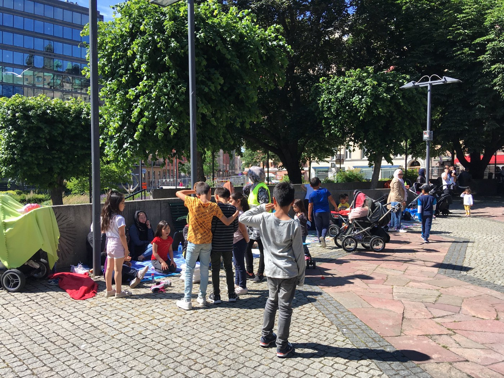
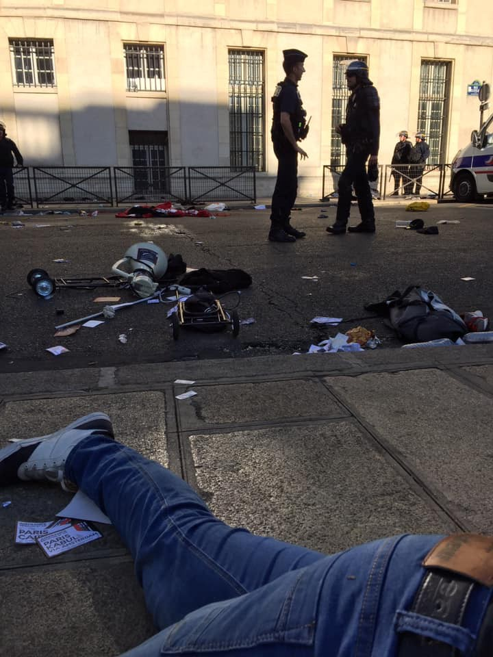
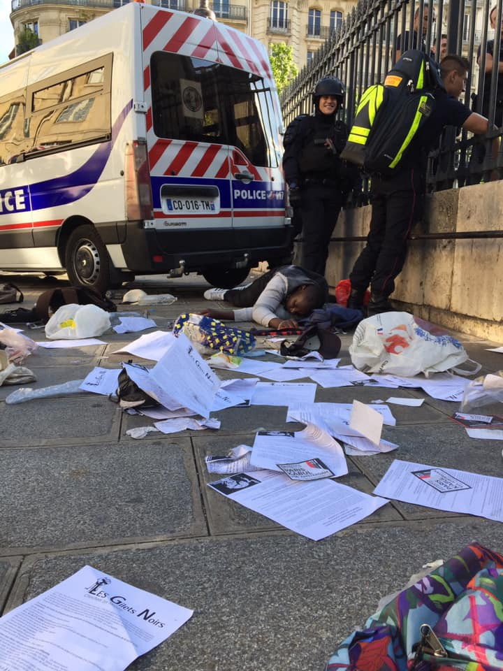

### AYS Daily Digest 12/7/19: Sweden continues deporting people to danger
#### Life without borders initiates a sit\-in against deportations from Sweden to Afghanistan / People disembarked from the Sea\-Watch 3 still illegally detained in Italy / The effects of Greece’s new conservative government are becoming readily apparent / A surge in arrivals in Bosnia and Herzegovina continues, no humane solution in sight / & more news

#### FEATURED

Sweden — Afghan families have been protesting against deportations at Norra bantorget in Stockholm city since the 9th of July\. Most of the families on site are facing deportation and have gotten their final rejection and some are still in the process of appeal\. The network Liv utan gränser \(Life without borders\) and two women from it has initiated the peaceful sit\-in\. It is not easy to do an action like this one with kids, but they feel as if they have to in order to be listened to\. For now no political party or organization is speaking up for them, a woman told AYS\. Almost all of the families live in the north of Sweden, in Junsele in Ångermanland\. They are here only for the strike and are currently sleeping in a mosque in the city\. They encourage the public to stop by and show their support, play with the kids or bring food\.

AYS spoke to several people on site: some have never even been to Afghanistan but lived in Iran before arriving in Sweden in 2015, some have childen born in Sweden and some faced serious persecution back in Afghanistan\.

An [activist](https://www.facebook.com/profile.php?id=100014165134189&__tn__=%2CdC-R-R&eid=ARAy_OKIgI_Y-J3aigcCHkBUZFPtfOEKlXOz9_QPxbHs0Fhu9Ihm05kZuocZGVN5qHaaCQddJo-gCLj0&hc_ref=ART-4msu_bfKq7FYSeyhnPdt8hX0HOcu3_I_TSnBUp3QT5tz4pIQgDKeaLppvw5gEpk&fref=nf) from Sweden posted:

> Imagine you are working as an activist for women’s and children’s rights in Afghanistan\. You get threats from the Taliban, they want to kill you\. Your father also gets death threats because he works for the American forces\. You have just finished your bachelor in university but all of a sudden you have to leave the country\. You lose your family on the way and struggle all the way to Sweden\. In the meantime the Taliban make a video only about you\. They show your photo, mention your name and say that they are offering 500\.000 Afghani \(two year’s income\) for the person who finds or kills you\. The video is distributed all around the country\.
 

> You are scared to death, but you trust the asylum policy in Sweden\. They will understand that you risked your life for the fight for human rights in your country\.
 

> You learn the Swedish language fluently and start to work\. And then Sweden suddenly wants to deport you\. You contact Amnesty Sweden\. They confirm that you are totally in danger and write to the Swedish Migration that deporting you would be extremely risky\. 

> You wait one more year and you get more threats over messenger from the Taliban: they have not forgotten you, they say\. They are waiting for you and they will find you\. 

> And then you get an answer from the Swedish Migration\. They do not care about death threats or letters from Amnesty\. They are going to deport you anyway\. 

Some people who were participating in the big sit\-in during the summer of 2017 are also here, to show their support\. Back then, the protest started at Mynttorget next to the parliament, moved to Medborgarplatsen at Södermalm and almost two months later it finished at Norra bantorget — where the families are now sitting\.

Liv utan gränser demands that:
- **The Swedish interpretation of the UN child convention will apply also to Afghan children\.**
- **That all Afghan families be allowed to stay in Sweden\.**
- **No woman who could become a victim of honour\-related violence will be sent back\.**

The protest has permission to continue until the 19th of July but they will apply for a prolonged permit\.

### The EU must issue a clear call to close down detention facilities in Libya

EU member states should ensure that those evacuated from detention centers are offered safe routes and regular pathways out of Libya, including by increasing resettlement pledges and expediting processes to allow the UNHCR to ramp up evacuations to its transit center in Niger or directly to EU member states, Human Rights Watch [urges\.](https://www.hrw.org/news/2019/07/12/european-union/libya-act-now-save-lives?fbclid=IwAR0zbJeZ6syTIQhQrSphvzVu5HP5vyqnbaY2ljpd8NvrcPk5cCWx_9K83O8)

> “EU governments should offer concrete support to Libyan authorities to close all migrant detention centers and take immediate action to help evacuate those most vulnerable and at risk\.” 

EU governments have never made their support to Libyan authorities conditional on closing the detention centers and releasing the thousands of people unlawfully detained\. Instead, they have continued to aid the Libyan Coast Guard in returning people intercepted at sea to indefinite detention in Libya\.

3800 people are detained in migrant detention centers near conflict areas, according to UNHCR estimates, while the total detainee population is estimated at 5,800 as of June 21\.

**Under Libyan law, any undocumented migrant, asylum seeker, or refugee may be detained without an opportunity to challenge the lawfulness of the detention, making the detention arbitrary\.**

As HRW recalls, the responsibility for both recent attacks remains unclear and should be established through credible and independent investigations\.

This comes after events have confirmed the [statements](https://twitter.com/Medhope_FCEI/status/1149700215810723840) of the survivors of the shipwreck of last week, which took place not far from the Tunisian coast of Zarzis: 72 bodies have washed up so far on the North African shore\. The survivors had stated that 80 people were on board\.

■■■■■■■■■■■■■■ 
> **[Sally Hayden](https://twitter.com/sallyhayd) @ Twitter Says:** 

> > @[guardian](https://twitter.com/guardian) @[IrishTimes](https://twitter.com/IrishTimes) @[nytimes](https://twitter.com/nytimes) @[melissarfleming](https://twitter.com/melissarfleming) Analysts I'm speaking to say closing the centres post-Tajoura would reduce the pressure on both the EU &amp; Libyan authorities, because human rights abuses committed against returnees would be less obvious. It doesn't mean they will stop. [twitter.com/sallyhayd/stat…](https://twitter.com/sallyhayd/status/1149657054539182080?s=20) 

> **Tweeted at [2019-07-12 12:56:28](https://twitter.com/sallyhayd/status/1149663818215112704).** 

■■■■■■■■■■■■■■ 

#### SEA

At least 160 people were [risking their lives](https://twitter.com/HelenaMaleno/status/1149683726584025089?fbclid=IwAR06VECD4HlkqfI5VTi3g3tH2ES2RuNuqARtatYCI_d9BqoLt7uGFO_qB8I) in the Alboran Sea in the night between Thursday and Friday\. A total of 120 were later rescued and disembarked in Almeria, [according](https://twitter.com/CGTsalvamento/status/1149792463797850113?fbclid=IwAR0924xBFlbF6sOfv-ROKGzEUpIIgfyPfs7TpDiOIiA5a3nhVDQzxQ9EZxU) to Salvamento Maritimo, the Spanish coast guard\.
#### TURKEY

[Watch The Med — Alarmphone](https://www.facebook.com/watchthemed.alarmphone/?__tn__=%2CdkCH-R-R&eid=ARAVU72tkXp02rnGwAggnf2DN6Uaug_cWbWERPEyppRKXtoMIt8eLhqnmTNQsv7grZZPHqXti24JFTYZ&hc_ref=ART6mtAuAGpGJml_tcmf18UarGQkMatIwqaMXLXg5bYx-02f_8AeO4LMGtqCsR69edI&fref=nf&hc_location=group) report they have received a call from a boat in distress in the Aegean Sea with 39 people on board, including four women and 15 children\. According to them, **Turkish authorities shot at them, beat them up, took their engine away and pulled them back to Turkey\.**

■■■■■■■■■■■■■■ 
> **[Alarm Phone](https://twitter.com/alarm_phone) @ Twitter Says:** 

> > @[LighthouseRR](https://twitter.com/LighthouseRR) @RefugeeRescueUK Refugee Rescue &amp; Lighthouse Relief published the video evidence of the illegal #pullback carried out by the #Turkish CG. We demand the immediate investigation of this case! The Turkish CG must be held accountable for their violent actions! https://t.co/fLvUuijfET 

> **Tweeted at [2019-07-12 08:11:23](https://twitter.com/alarm_phone/status/1149592075991601153).** 

■■■■■■■■■■■■■■ 

#### GREECE
#### Arrivals

According to Aegean Boat Report, three boats and 72 people have arrived through the day\. Two on Lesvos, one in Kastelorizo\. For more information, go [here](https://www.facebook.com/AegeanBoatReport/posts/610700246119750?hc_location=ufi&_rdc=1&_rdr) \.

> According to the Greek meteorological services the weekend is expected to be incredibly stormy\. 

For a more detailed weather breakdown, go [here](https://www.keeptalkinggreece.com/2019/07/12/greece-weather-forecast-storms-july13-14/) \.
#### Baseless charges of trafficking widespread in Greece as much as in Italy

■■■■■■■■■■■■■■ 
> **[Community Peacemaker Teams](https://twitter.com/cpt_intl) @ Twitter Says:** 

> > MT @LesbosLegal Baseless smuggling charges not only in Italy, but  a regular occurrence in Lesvos, where drivers of boats arriving from Turkey are often convicted of smuggling&amp;imprisoned after being denied a fair trial.   #refugeesgr
[legalcentrelesvos.org/2019/07/02/bas…](http://legalcentrelesvos.org/2019/07/02/baseless-smuggling-charges-not-only-in-italy-but-are-a-regular-occurrence-in-lesvos/) https://t.co/QtnCpctC8s 

> **Tweeted at [2019-07-12 18:38:13](https://twitter.com/cpt_intl/status/1149749822074839040).** 

■■■■■■■■■■■■■■ 

The effects of Greece’s new conservative government are becoming readily apparent\.
### The effects of the political change in Greece are already very visible

The most shocking turnabout happened after the new Minister for Labor and Social Affairs withdrew a circular that recently went into effect \(in June of 2019\) whose express aim was to simplify the process for immigrants, applicants for international protection, and unaccompanied refugees to get clear access to health care services, education, and labor department services\. The confusing bureaucratic procedures were hampering people’s ability to access these services, putting additional hurdles in the way of experiencing integration and inclusion in Greece\.

> _According to [Left\.gr:](https://left.gr/news/erotimata-gia-ti-spoydi-vroytsi-katargithike-i-egkyklios-gia-tin-apodosi-amka-se-xenoys)_ “We remind you that the Mitsotakis government has already implemented the abolition of the independent Ministry of Migration Policy, integrating this responsibility into the Ministry of Citizen Protection, triggering strong reactions\. This is a sign that, for this government, migrants and refugees are a danger, a threat or, in any case, a matter subject to public security\.” 

In a similar vein, the new government has published their plan to put more Greek police onto the streets, ostensibly for the “protection of the public” but it seems that priority is more likely to be given to the trend of increased police repression, as the term “zero tolerance” for crime was invoked\. Of course increased “migration management” and “border monitoring” is part and parcel of this increase\. For more, go [here](https://greece.greekreporter.com/2019/07/12/new-greek-government-to-deploy-more-police-on-the-streets/) \.

As an example of the first steps in this ongoing restriction, [the residents of the Notara 26 squat](https://www.facebook.com/permalink.php?story_fbid=1454968304643111&id=645186555621294&hc_location=ufi&_rdc=1&_rdr) \(of which many are refugees\) woke up to their power being cut by the authorities\. On Saturday at 17h, there will be an open assembly at the squat to protest\. Come and show your solidarity\!

Yet another example of what future we can expect comes from reports of a sudden and sharp increase in racial profiling by authorities

■■■■■■■■■■■■■■ 
> **[Anek Flouz](https://twitter.com/CitKrmer) @ Twitter Says:** 

> > Effect of new right wing government in #greece is an increase in #racialprofiling which are #refugeesGr mainly targeted with. In #Thessaloniki first reports of random racial controls are heard 

> **Tweeted at [2019-07-12 11:14:25](https://twitter.com/citkrmer/status/1149638137515167745).** 

■■■■■■■■■■■■■■ 

#### BOSNIA AND HERZEGOVINA

**More than 10,000 people have entered Bosnia and Herzegovina in 2019** , according to the official estimates that also state about 400 to 600 people enter the country per week\.

In **Tuzla** , more and more people keep arriving, exceeding the official numbers, among them, alarmingly, a lot of minors and families with young children\.

 ‎](assets/e60c06d93a8a/1*RbZl6PQAMEv-CE_baMN8-Q.jpeg)

Photo: [Alma Džinić\-Trutović](https://www.facebook.com/alma.dzinictrutovic?fref=gs&__tn__=%2Cd%2AF%2AF-R&eid=ARDW2CYvv9F0ooMthBtM997CCL1VOz8-xOBHbU0pYQGYkCNAlfwQgB0ypAN9ULEmSaedgndSHlVJPnJd&tn-str=%2AF&dti=348461619200701&hc_location=group_dialog) ‎
#### ITALY
#### Arrivals

■■■■■■■■■■■■■■ 
> **[Flavio Di Giacomo](https://twitter.com/fladig) @ Twitter Says:** 

> > -Fact checking-

In 2019, out of over 3100 arrivals by sea to Italy, less than 250 #migrants actually arrived to land on #NGO ships.

Nel 2019, su oltre 3100 arrivi via mare in Italia, i #migranti arrivati a terra a bordo di navi di #ONG sono stati meno di 250. 

> **Tweeted at [2019-07-10 07:32:39](https://twitter.com/fladig/status/1148857552538689536).** 

■■■■■■■■■■■■■■ 

### 48 people intercepted on the Italian\-Slovenian border

Local media [report](https://www.ilgazzettino.it/nordest/trieste/trieste_migranti_carso-4612565.html) about 48 people being intercepted on the morning of Thursday 11th of July near the northeastern border with Slovenia by Italian border police\. Among them there were 10 minors\. All have asked for asylum and were transferred to local reception centres\.
### People disembarked from the Sea\-Watch 3 are still illegally detained in Italian hotspots

A number of grass\-roots associations and NGOs published a note on Thursday denouncing the illegal prolonged detention of those disembarked on June 29th from the Sea\-Watch 3, Melting Pot Europa [report](https://www.meltingpot.org/Da-un-confinamento-all-altro-Il-trattenimento-illegittimo.html?fbclid=IwAR3R5q3XGDtb_Ulsca8bwbi7iYDVYRsZMtlhVKXTCOWoStlcyMrMx4w87wA) \. After having been forced to drift at sea for 17 days, they are now at their 14th day of arbitrary detention\.
Between the 29th of June and the 4th of July they were held in the hotspot in Contrada Imbiacola, in Lampedusa\. The gates of this hotspot are always closed\. People held inside are never allowed outside, transforming it into a ‘de facto’ detention centre\. On the 5th of July, they were transferred to the hotspot in Messina, Sicily, and have been held there since without being able to leave\.

Read more \(in Italian\) [HERE](https://www.meltingpot.org/Da-un-confinamento-all-altro-Il-trattenimento-illegittimo.html?fbclid=IwAR3R5q3XGDtb_Ulsca8bwbi7iYDVYRsZMtlhVKXTCOWoStlcyMrMx4w87wA) and [HERE](https://www.borderlinesicilia.org/da-un-confinamento-allaltro-il-trattenimento-illegittimo-nellhotspot-di-messina-dei-migranti-sbarcati-dalla-sea-watch/) \.
#### People’s wall in Rome against evictions and the Security Decree Bis

](assets/e60c06d93a8a/1*dAf8zwFzIb-x5PB7HAEklg.jpeg)

by [Coordinamento Cittadino Lotta Per La Casa](https://www.facebook.com/Coordinamento-cittadino-Lotta-per-la-casa-116048408492166/?__xts__%5B0%5D=68.ARD24uLDnRdL37U-fVtX9vBZ_TSeq-02NujB0-KrvXvxolw0z8f7uO061OQntmB4NcXC-BhfCmlZ2l-RAl7YqB2LwqFUAb16eV_VBot1ORIrxhOrJaEg3Lcjuc4H9MHoy6j3u-e34LAH_BTveEhNh8d870Zdu3UZm5b2zTyRoL61lg5I3gT6SlIU0g5dEij_fWHvbaPYqJkzmd5VkEg5MnuwkvK7UKQv6iHwIZWsy5oHrzJa3PWw4nS-86oN42iNbFqbWWZoU_QrkgAUbc2n4AUDR4gL1rx0xcLIOb7QzrqyKYlbK9XP8DTK3xQzzCUKFDCDKH-65LJN52PyKHo8U4QOJTH8U_b98IjjAdIWEJD0bzxLzZTcMY4C-JLVOE8mRQ4D-p9KpwyvKVmM49JsVRSoXHZFbpy0_1cGoZwvAjobnqbOd88PTY2VVMxVpqyxaXrr_k4Z_NL35D0kS8E-cFV498VoJdBPxnaALLoJBmXIcZNjdMJ4yHSd5rMjNV3y&__tn__=k%2AF&tn-str=k%2AF)

On Monday 15th of July there will be a protest against the scheduled eviction in Cardinal Capranica in Rome and then in front of the Parliament\.

In Cardinal Capranica, several families had to suffer months of threats of evictions, pushed by the city council, the prefect and local fascists\.

At 5 AM a people’s wall will defend the families from eviction, and at 3PM the protest will move to Montecitorio, in front of the Parliament, joining forces with the Restiamo Umani network against the new security decree\.

If they touch one, they touch all\.

Find more info \(in Italian\), [HERE](https://www.facebook.com/events/388552811789630/) \.
### Works for opening the CPR in Gradisca go on

Local newspapers [report](https://www.facebook.com/permalink.php?story_fbid=2342696899156596&id=1245970425495921&hc_location=ufi) that the works to set up the CPR \(Centre for Repatriation\) in Gradisca di Isonzo \(North Eastern Italy\) will end in July\. But it will have to wait for the conclusion of the management notices\. Probably about 2000 asylum seekers will be transferred from Friuli\-Venezia Giulia to other regions of North Italy\.
### Released after three years in jail — Man was mistaken for a human trafficker kingpin

International newspapers [report](https://www.theguardian.com/world/2019/jul/12/eritrean-man-released-from-jail-in-italian-mistaken-identity-case) about the case of Medhanie Tesfamariam Berhe, whose arrest in 2016 was presented to the press as a brilliant coup by Italian, British and Sudanese authorities, who mistook him for one of the world’s most\-wanted human traffickers\.

It took three years for a judge to recognise what the man’s lawyers had been saying from the first moment: “we had a farmer in jail and a smuggler at large”\.

Despite a large number of witnesses, medical tests, and journalist investigations in favour of the release of the wrongly jailed man, Italian prosecutors and British authorities criticised the decision of the court\.

Read more [HERE](https://www.theguardian.com/world/2019/jul/12/eritrean-man-released-from-jail-in-italian-mistaken-identity-case) \.
#### FRANCE

[Collectif La Chapelle Debout](https://www.facebook.com/CollectifLaChapelleDebout/?tn-str=k%2AF&hc_location=group_dialog) report the ‘Black vests’ are in danger due to their activist movements —

](assets/e60c06d93a8a/1*Z2nUiuCTHFVKRsc5GPgLhA.jpeg)

Photos: [Collectif La Chapelle Debout](https://www.facebook.com/CollectifLaChapelleDebout/?tn-str=k%2AF&hc_location=group_dialog)

**We strive to echo correct news from the ground through collaboration and fairness\. Every effort has been made to credit organizations and individuals with regard to the supply of information, video, and photo material \(in cases where the source wanted to be accredited\) \. Please notify us regarding corrections\.**

**Apart from daily news in English, we also publish weekly summaries in Arabic and Persian\. Find specials in both languages on our [medium site](https://medium.com/are-you-syrious/ays-weekly-in-arabic-and-persian/home) \.**

**If there’s anything you want to share or comment, contact us through Facebook, Twitter or write to: areyousyrious@gmail\.com\.**

**We’re open to expanding our team of volunteer researchers, editors, and info gatherers\. Get in touch\!**

_Converted [Medium Post](https://medium.com/are-you-syrious/ays-daily-digest-12-7-19-sweden-continues-deporting-people-to-danger-e60c06d93a8a) by [ZMediumToMarkdown](https://github.com/ZhgChgLi/ZMediumToMarkdown)._
