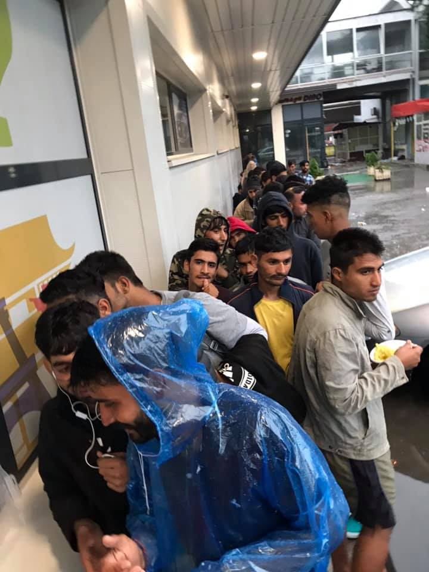

### AYS Weekend Digest 13–14/7/2019: New minister positively impressed by Moria Camp

Busy weekend at sea in Greece, Italy and Spain /// More people returned to Libya /// French police brutally attack Gilet Noirs’ peaceful occupation, sending people to hospital /// Tension rising in Exarchia, Athens due to government’s plan to evict squats /// Spanish government’s plan to criminalise sea rescue …

\[edited: 22/7/2019, thanks for the correction\! \]
#### FEATURE: New minister positively impressed by Moria Camp

 \)](assets/fb37dd0e2055/1*TM3D7Cvre5AcMJnEx1l22Q.jpeg)

\( [Σειμώνας Μπολίβαρ Ουλιάνοφ](https://www.facebook.com/profile.php?id=100009870279212&__tn__=%2CdlC-R-R&eid=ARALaNypRCKg2t9EDqI-KASNmUhHiu4WVP8g7d3PURANJlKNmB3droT6ZkGVLgglZ3HCexnqGss60DmG&hc_ref=ARQK3YSxUZ1OsKZOgZ--Jy3sUPq2WFLC-gBov3Bv0Mw71i2WJXVcj5Y8pe4gV7ATF5w) \)

Decency has never been a priority for most politicians and government officials, but on Saturday the visit of the new Citizens’ Protection Minister Michalis Chrysochoidis \(which now is also responsible for migration\) was an insult to years and years of grass\-roots reports on the condition of the people detained on the Greek islands\.

Photos of the event show the barbwire of the camp’s fences being covered with flowers, a kind gesture of an [NGO](https://www.facebook.com/Becausewecarry/) misappropriated for the visit of the minister\. Chrysochoidis claimed to be positively impressed by “the comprehensive management of the refugee problem by the country’s services here on the island” and also by the “responsibility, modesty and completeness with which the representatives of the local community conveyed their concerns over the island’s crucial refugee and migration problem\.”
#### Libya

A boat that had previously been in contact with [Alarm Phone](https://www.facebook.com/watchthemed.alarmphone/posts/2409247109349518?hc_location=ufi) which was carrying 54 people has been returned to Libya\. [Local media report](https://www.libyaobserver.ly/inbrief/libyas-coast-guard-rescues-23-illegal-migrants-mellitah-shores?fbclid=IwAR1AkhiJ7e_ktv8mjaPY0JGepjnVWLRPyba3v5HXof1SKq8D2FihTw1RHH8) another 23 people have been returned and taken to the notorious Al\-Nasser detention centre, while the [UNHCR reports](https://twitter.com/unhcrlibya/status/1150099372945891334?s=21&fbclid=IwAR0PytG6QFQcBEYRaxkuLgqq_OHRbE2WNOv1VSojxrx8co_TL3WIWvJMD3E) that a boat carrying 53 people was also intercepted and that those on board received medical attention on arrival\. However, many still question the UNHCR’s stance and the work they do in Libya\.

The have [officially stated](https://twitter.com/Refugees/status/1150059054611542016) that the support to the Libyan coast guard should be conditional to the closure of the detention camps, but human rights violations in Libya go much beyond detention centres, as Sally Hayden repeatedly [reports](https://twitter.com/sallyhayd/status/1149663818215112704) about\.

[IOM also reported](https://twitter.com/iom_libya/status/1150105245692944385?s=21&fbclid=IwAR0fWQPEk68xOZt5zCOG8LzBY5kiTGbnrG4LsjrrbMgyUDiGsksxwL3A1zA) on the returns and stated they opposed the detention of refugees, strange then that they operate in some of the worst Greek refugee camps which if not closed are usually far from town and inaccessible\.

■■■■■■■■■■■■■■ 
> **[Jeff Crisp](https://twitter.com/JFCrisp) @ Twitter Says:** 

> > It's only happening because the EU wants it to happen. Which puts UN agencies that receive significant amounts of funding from the EU to work in Libya in a difficult (to put it mildly) position. 

> **Tweeted at [2019-07-13 18:43:45](https://twitter.com/jfcrisp/status/1150113600322908160).** 

■■■■■■■■■■■■■■ 

TURKEY
#### Racism against Syrians continues in Turkey

[A banner against Syrian](https://www.facebook.com/10.posta/photos/a.137213939782715/947087865461981/?type=3&eid=ARCkIPTO3xu6DbYS9IRLchTGxqcI4MU8uSMqm0Bc2mmzaonI5Mle7bHTPlm2Ob-MvBCwM-HCdm-pS9nL&ifg=1) refugees has been placed at a beach in Sinop, Turkey: “Those who do not fight for their country may not use our beach\. Long live the Turkish race”\. An increase in racist acts such as this once again brings into question the EU\-Turkey deal which sees millions of Syrians trapped in the country\.

MOROCCO
#### People left sleeping outside at the CETI of Melilla

 \)](assets/fb37dd0e2055/1*VY6M5MSH-2YXAeEBHlFSYQ.jpeg)

CETI Melilla \(photo by [AMDH Nador](https://www.facebook.com/AmdhNador/posts/2371771849701743) \)

AMDH Nador [report](https://www.facebook.com/AmdhNador/posts/2371771849701743) about the unbearable conditions suffered by people at the CETI \(Temporary Reception Centre for Immigrants\) in Melilla\. Minors and adults sleep rough outside, “without the authorities of Melilla taking any provision to accommodate migrants in a proper way”\.

SEA
#### Rescue in the Mediterranean

Helena Maleno Garzón [reports](https://twitter.com/helenamaleno/status/1150072855238983680?s=21&fbclid=IwAR2hfVBFyMq6bgp-hHClUXiU40ig7-V7R5dNECuxflpgYJ_LBavYOoO3GJM) that 39 people came close to drowning over the weekend when their boat began to sink\. A family member of someone on\-board managed to call the controllers of Maritime Rescue and the twenty\-seven men, eleven women and two babies survived even though some people were already in the water when Salvamento Marítimo Almería arrived\.

> We must be aware of how difficult it is, with so many cuts, so much workload and pressure; work as controllers and rescuers of @salvamentogob \. They are in the political spotlight for doing something as wonderful as defending the \#DerechoAlaVida _— Helena Maleno Garzón_ 

#### 82 Deaths at Sea

The number of bodies washed up on the Tunisian coast after last week’s shipwreck rose to 82\. Read more [here\.](https://www.middleeastmonitor.com/20190714-more-bodies-found-in-tunisia-migrant-ship-sinking/?fbclid=IwAR0et5-kHoIklSGXvy0gN5jlumWR5_73nKs1TYaeC7XYj9IV283mFIq4whI) This remains the most deadly migration route in the world\. The deaths of 682 people have [been recorded](https://missingmigrants.iom.int/) in the Mediterranean so far this year although actual figures could be much higher\.

Our thoughts, as ever, are with their families and our anger is directed firmly towards the EU\.
#### Boat in Distress

Another source, [Caminando Fronteras](https://twitter.com/walkingborders/status/1149992325894090752?s=21&fbclid=IwAR2HUo1l3r3z89zFG6USNvqpxqfEcPR3jxulOLNldluBzvd61xSQkHCMW90) , report that a further 42 people are currently in distress at sea\.
#### Alarm Phone Report

Alarm Phone have published their [8\-Week Report](https://alarmphone.org/en/2019/07/13/ap-8-week-report/?post_type_release_type=post&fbclid=IwAR3IsH2VnGWMxr4Acoq9MqgSTmYW0LjIr8EXn5D-eJ7oovRvZiCsQS2Itrs) \(13 May — 7 July 2019\) \. During this time they have been in contact with 2,000 people on 54 Boats\.

GREECE
#### Arrivals

At least 12 boats have arrived during the weekend on the Eastern Aegean Islands\. \( [via Aegean Boat Report](https://www.facebook.com/AegeanBoatReport/) \)

UNHCR Greece published their [Sea arrivals dashboard for June 2019](https://reliefweb.int/sites/reliefweb.int/files/resources/70269.pdf) \. “So far in 2019 a total of 12,870 refugees and migrants arrived in Greece by sea”\.

3,122 people arrived in June 2019\. Lesvos received the majority \(39%\) of all new arrivals, during the first six months of 2019, followed by the Dodecanese islands \(29%\), Samos \(20%\) and Chios \(12%\) \.
#### Mare Liberum e\.V\. Monitoring back in the Aegean

On April 23, the German federal Transportation ministry halted the activity of the NGO Mare Liberum\. The Mare Liberum vessel has been operating to monitor human rights abuse in the Aegean Sea\.

> The crew on the Mare Liberum ship observe and report to the wider public and pressure groups any action that might be considered as a breach in international law\. In spite of this, the suspension order issued by the German authorities alleged that Mare Liberum is a rescue ship which should be classified in the same category as a commercial freightliner, even though the vessel’s main purpose is conducting human rights monitoring, not search and rescue operations\. 

This decision of the ministry comes after a directive which imposed restrictions on civil rescue ships acting in the Mediterranean Sea\. Despite the loud critiques against the actions of the Italian Government, this shows actually that EU governments agree on the limitation and criminalisation of sea rescue and monitoring activities throughout the area\.

It took Mare Liberum 3 months to prove in court that the suspension was unlawful and the ship is now back on the water\.

Read more [here](https://sarobmed.org/mare-liberum-human-rights-monitoring-at-peril-in-the-aegean/?fbclid=IwAR1Bw78cfEbZvPvojCuOgRXakpBsfA3rjSmKH24QuU-ApP_2E7cQbXjWzhA) \.
#### First week of the new right\-wing government

As we already reported, Nikos Vroutsis cancelled a ministerial decision regarding the issuing of social security numbers \(AMKA\) to all non\-EU nationals, including refugees and asylum seekers\. The social security number is essential to access services in health, education and labour\.

■■■■■■■■■■■■■■ 
> **[Bruno Tersago](https://twitter.com/BrunoTersago) @ Twitter Says:** 

> > #Greece - Vroutsis blocks simplified AMKA issuance for non-EU nationals [tovima.gr/2019/07/12/int…](https://www.tovima.gr/2019/07/12/international/vroutsis-blocks-simplified-amka-issuance-for-non-eu-nationals/) The move has refueled fears that the conservative New Democracy government will institute harsh policies on services provided to refugees and migrants living in Greece. 

> **Tweeted at [2019-07-13 06:11:54](https://twitter.com/brunotersago/status/1149924394606702593).** 

■■■■■■■■■■■■■■ 

Justifying his decision to block the issue, Vroutsis said that the issue of AMKA to non\-EU nationals will be re\-examined and new directives will be published\.

Human Rights Watch wrote an open letter to the new Greek PM Mitsotakis, pointing out the human rights challenges he’ll be facing\. Read more [here](https://www.hrw.org/news/2019/07/10/human-rights-watch-letter-greek-prime-minister-kyriakos-mitsotakis?fbclid=IwAR3oDkSPkdenzUbTbfClba42bojwiQiOVVGtDs7W0QnqHsBtmlqBoB8Yv08) \.
#### Police shot an anarchist refugee in Exarchia on Sunday

[The anarchist union of Afghanistan and Iran](http://asranarshism.com/1398/04/23/anarchist-refugee-abtin-parsa-was-injured-by-bullet-of-greek-cops/?fbclid=IwAR27QZEBUsmWmQOHwTSpGyAd2KPR6dJkRcy5mRmzUYJ-2n-GPs-tuiZDAjk) and other grassroots media sources report of the injury suffered by an anarchist activist and refugee in Exarchia on Sunday morning, who was hit by a bullet fired by a policeman during clashes in the neighbourhood\.

The attack of the new government has already started against the Exarchia neighbourhood in Athens, a symbol of the resistance against the austerity and border regime, and against the self\-managed housing projects which hosts thousands of people in the neighbourhood\.

■■■■■■■■■■■■■■ 
> **[Exiled Arizona 🎃](https://twitter.com/exiledarizona) @ Twitter Says:** 

> > For English speaking audiences regarding the situation in Exarcheia.

Last week the right wing swept to full power in Greece. One of their main promises is to defeat the anarchist area of Exarcheia. Unlike prior years, the threat is taken more seriously. 

> **Tweeted at [2019-07-14 10:59:51](https://twitter.com/exiledarizona/status/1150359245713498113).** 

■■■■■■■■■■■■■■ 

[Support is coming from both Greece and the international community](https://www.facebook.com/photo.php?fbid=2221846968125918&set=a.1386628864981070&type=3&theater) \. Activists, solidarians and supporters are coming to Exarchia from all over Europe\.

> “By threatening the rebel district of Athens, the power has succeeded only one thing: unite against him all the collectives of exarcheia and generate immediate support beyond borders\.” 

Last week, electricity was cut off to the Notara26 squat\. Since then, they are organising anti\-eviction breakfast, everyday from 5AM to 7AM, dubbed ‘ [mornings of resistance](https://www.facebook.com/645186555621294/photos/a.651281361678480/1455699934569948/?type=3&theater) \.”, a solidarity and free breakfast to generate even more presence at the most delicate hours\.

 \)](assets/fb37dd0e2055/1*Ab7g-mTghDnsakWV9bBzPQ.jpeg)

Notara will never die \(photo by [Notara26](https://www.facebook.com/645186555621294/photos/a.651281361678480/1455699934569948/?type=3&theater) \)

Also [Refugees’ Refuge](https://www.facebook.com/RefugeesRefuge/posts/2442398639114795?hc_location=ufi) reported of an increased police presence in town, with more stop and search activities and more ID controls\.

ITALY
#### Arrivals

](assets/fb37dd0e2055/1*pMcIMv4_clSURu3MIVA_WA.jpeg)

Photo by [Watch the Med — Alarm Phone](https://www.facebook.com/watchthemed.alarmphone/photos/a.1526182797655958/2409249962682566/?type=3&theater)

Alarm Phone [reported](https://twitter.com/alarm_phone/status/1150373230139576320) of one boat being rescued to Lampedusa on Sunday morning, carrying 12–14 people on board\. They had left Tunisia the day before and had spent the night at sea, having run out of fuel\. Alarm Phone alerted MRCC Rome and the boat was then rescued and brought to Italy\.

One more boat was rescued to Lampedusa on Saturday, with 7 people on board\.
#### 50 people intercepted after crossing from Slovenia

On Saturday police intercepted two groups of people around Basovizza, on the north\-eastern border, local media [report](https://www.triesteprima.it/cronaca/rotta-balcanica-trieste-13-luglio-2019.html) \. They were brought to the local police station\.
#### British agencies played an important role in the mistaken identity case of Medhaine Tasfamariam Berhe

International media published [updates](https://twitter.com/martinplaut/status/1149768417496444934) on the case of Medhaine Tasfamariam Berhe, who spent three years in Italian prisons after being mistaken for a human trafficking kingpin, underlining the role played by British intelligence and agencies in the case\. We reported about this case in our [last digest](ays-daily-digest-12-7-19-sweden-continues-deporting-people-to-danger-e60c06d93a8a) \.

SPAIN
#### Arrivals

A total of 141 people were rescued by Salvamiento Maritimo during the weekend, local media [report](https://www.tvn-2.com/mundo/Rescatados-migrantes-mar-Espana-Marruecos_0_5349215075.html) \.
#### The militarisation of Salvamiento Maritimo

The national authorities are [attempting to transform the search and rescue agency Salvamiento Maritimo into a military corp](https://twitter.com/stopmaremortum/status/1150352034564116480) \(as other countries’ coast guards are\) \. Unions and workers of the SAR agency are protesting against it, reminding the authorities that SAR activities are and have to remain a public service\. Please follow the [Salvamiento Maritimo’s unionised workers Twitter account](https://twitter.com/CGTsalvamento) to stay updated\.
#### The _Carovana Abriendo Fronteras_ is in Granada

The solidarity convoy _Abriendo Fronteras_ \(Opening borders\) has arrived in Granada on the weekend\.

 \)](assets/fb37dd0e2055/1*R9r4INya0SWZCj7zP6-y1A.jpeg)

No one is illegal \(photo by [Abriendo Fronteras](https://abriendofronteras.net/2019/07/13/granada-acogida/?fbclid=IwAR1jNeXr8afrFC1MbO2yHGIlPyoKAUhYByoAYedljzvgwmEngoqhJ4uZ7t8) \)

They reminded the local authorities that since 2018 Andalusia is the European region with the highest number of arrivals from the sea: 51,711\. This situation brings to light the serious deficiencies of the 
institutional reception system in both Andalusia and Spain\.

> “Although many continue on their way, there are also many who remain in 
 

> Granada and the local authorities have to improve their actions for humane and adequate reception”\. _\(Sylvia Koniecki, director of Granada Acoge\)_ 

Koniecki has described the poor reception options for people arriving at the southern border: arrested for 72 hours without access to legal assistance, translation or information about their options, they may end up in a CIE \(identification centre\) or, if lucky, in host resources may end up in a CIE or, with good luck, in an emergency appeal for 3 months\. After that, authorities try to expel them, or leave them on the streets, without support and with the only option to resort to the citizens\-led hosting network\.

Andalusia is also a region where slave\-like labour for migrants is commonplace, especially in the countryside, and where children and young people are “forced to survive in any way” they can\.
#### Protest in Barcelona against the criminalisation of sea rescue

In the same days that Salvini was threatening to arrest the Sea Watch captain Carola Rakete, [the socialist\-led Spanish government was sending a letter](https://www.heise.de/tp/features/901-000-Euro-Strafe-fuer-Seenotrettung-4469705.html) to Spanish search and rescue organisations \(among which are Open Arms and Aita Mari\) imposing them to sop any SAR activity off the Spanish coast, threatening them with up to 900,000 € fines and with the decommissioning of the vessel if they carried on\.

On Saturday a large demonstration moved through the streets of Barcelona, against the criminalisation of solidarity\.

■■■■■■■■■■■■■■ 
> **[Open Arms](https://twitter.com/openarms_fund) @ Twitter Says:** 

> > Sobre el día de ayer.❤️
Gracias a todxs lxs que salisteis a la calle a nuestro lado, y a los que nos enviasteis vuestra fuerza desde la distancia.
Hoy más que nunca os necesitamos. Porque en el mar sí estamos SOLOS y sin vuestro apoyo nada es posible. Seguimos https://t.co/kPV8PMbABw 

> **Tweeted at [2019-07-14 08:48:52](https://twitter.com/openarms_fund/status/1150326284872036352).** 

■■■■■■■■■■■■■■ 

Also Italy\-based NGO Mediterranea joined the protestors:

 \)](assets/fb37dd0e2055/1*ZqywjzwO70dvCXgvn3a8xg.jpeg)

Mediterranea — Saving Humans in Barcelona \(photo by [Pietro Bertora](https://www.facebook.com/Mediterranearescue/photos/a.275129016441663/397523410868889/?type=3&theater) \)

BALKANS
#### Border Violence Report for June

No Name Kitchen and Border Violence Monitoring have collected testimonies of all the illegal pushbacks and violence towards refugees in the last month\. Read the report [here](https://www.facebook.com/NoNameKitchenBelgrade/posts/754387178292902) \.

_Thanks to all the volunteers that are working hard on this report every day\. And that they do not want to let this part of our history get forgotten\._

BOSNIA HERZEGOVINA
#### Updates from Tuzla

The number of people coming to Tuzla is increasing\.

 \)](assets/fb37dd0e2055/1*D5IqwvXWzOWQPLy85zjSLQ.jpeg)

Tuzla \(photo by [Senad Cupo](https://www.facebook.com/photo.php?fbid=10217064699382967&set=pcb.379134052800565&type=3&theater&ifg=1) \)

A local volunteer published updates \( [1](https://www.facebook.com/photo.php?fbid=10217064699382967&set=pcb.379134052800565&type=3&theater&ifg=1) , [2](https://www.facebook.com/groups/144469886266984/permalink/379007519479885/?hc_location=ufi) , [3](https://www.facebook.com/groups/144469886266984/permalink/378760246171279/?hc_location=ufi) \) from Tuzla, reporting of large numbers of children and minors without any protection and support\. Human rights of adults are also violated\.

 \)](assets/fb37dd0e2055/1*jyIi8JqGzyLdY8M1fGfC6g.jpeg)

Tuzla \(photos by [Senad Cupo](https://www.facebook.com/photo.php?fbid=10217064699382967&set=pcb.379134052800565&type=3&theater&ifg=1) \)

“Today there were about a hundred new ones in town\. I believe in the city there are around 200\. \[…\] Every one of them sleeps outside and they’re on their own\. Every one of them needs everything”\. With local authorities refusing to provide any service at all, people are sleeping in the bus station, in some mosques, in parks, etc\.

 \)](assets/fb37dd0e2055/1*pMfVsou7CM96VJMDGxo6xA.jpeg)

Tuzla bus station \(photo by [Senad Cupo](https://www.facebook.com/groups/144469886266984/permalink/378760246171279/?hc_location=ufi) \)

GERMANY

A deportation is scheduled for today Monday 15th of July from Berlin Ariport\.

Authorities intend to deport Mr\. E\. G\. to Iran, via Moscow\.

“In Iran, a long prison sentence or even death awaits him due to his Christian faith and because he left the country illegally\. His wife has been in Germany \(Rostock\) since last year and now she fears losing her husband forever\.

Please follow the [Stop Deportation Group](https://www.facebook.com/stopdeportationgroup) to keep updated\.

FRANCE
#### Extreme police violence in Paris

[Solidarité migrants Wilson report](https://www.facebook.com/permalink.php?story_fbid=1178512122349558&id=598228360377940) on the situation in Paris as several dozen people were hospitalised, including two in a coma, after the police attacked the Pacific Occupation of the pantheon which had been squatted by the gilet noirs \(black vests\), a migrant movement that fights against racism and for ‘papers for all’\. Nearly 40 people were arrested on Friday\. People remained in front of the police station located at 4, Rue de la Montagne Sainte Genevieve, next to the exit of the metro Mutualité throughout the weekend\. 19 people now face deportation\.

 \)](assets/fb37dd0e2055/1*iVYhOum1bLewS6dDyQOg7A.jpeg)

\(Photo by [Solidarity migrants Wilson](https://www.facebook.com/598228360377940/photos/pcb.1178512122349558/1178519645682139/?type=3&theater&ifg=1) \)

More info and live updates can be found on the page of the [Collectif La Chapelle Debout](https://www.facebook.com/CollectifLaChapelleDebout/?__tn__=K-R&eid=ARCA4j1oW03yovgiMkcfXSoLJ2iNRZ3qOy3y6ICDp4NA4QjOB9IippPShajEjucliQyM2GukB0VPQDxM&fref=tag&__xts__%5B0%5D=68.ARDvQdpcWCOuEReWxk5XnlfnTVhQAxY4EnPwrlyzgia7YEh_0CGjFJtmrgku6crVuL0kP6jWDpUfJgfsFMBZ0jZRNm64ktao-zDQXrZDc3peBPBhrd7Sd33Vrg5lXipl6lBcMl3h4zeTAuwAmGcLKNfrwhWEKoCkAO-plyZUZ2hRDNe3w-CAxVuAU2EBLdUSVv6_PS25bIz0vwPCHmXi_IL_MAT249cUJTci2iJcI182_AALds5W_GrR_RQt2qiQBcIcZVlK6nvslAHTe7adQIPt8wwW-yO-74JTal2DWlYuwYnbGyjAGhMAAydZTH2wBInBjTiw8OkVIDhwh7SCysJ1Aw) as well as an explanation of how to donate money to support those imprisoned\.

■■■■■■■■■■■■■■ 
> **[Moving Europe](https://twitter.com/MovingEurope) @ Twitter Says:** 

> > After the #GiletNoirs were attacked, by the police, several of them had go to hospital, 36 of them were arrested and 19 are still in prison waiting for their deportation. To support them legally, there is a campaign: [lepotcommun.fr/pot/v346wpgn](https://www.lepotcommun.fr/pot/v346wpgn) #France #Paris 

> **Tweeted at [2019-07-14 16:57:04](https://twitter.com/movingeurope/status/1150449141861928961).** 

■■■■■■■■■■■■■■ 

#### Further Police Violence at border

[Oxfam have reported](https://www.repubblica.it/cronaca/2018/06/15/news/oxfam_polizia_francese_bambini_migranti-199062256/?fbclid=IwAR2cUB_yOJCKQTGMjsS7SkewBrhJAUvWsIDS9TozfOlobFC09IjZDvHi7ko) that 12\-year\-old boys in Ventimiglia are having their shoes and sim cards stolen and are often detained in cells without food and blankets\.

> Forced to return to Italy on foot, or loaded on trains falsifying their age and their their willingness to remain beyond the Alps\. 

Unfortunately, by this point the fact that the French police systematically abuse homeless children is no longer shocking\. The report is titled ‘If this is Europe’, it is\.
#### Volunteer call

[Ghent for Humanity](https://www.facebook.com/VZWBelgiumGent4Humanity/posts/2337442093240270?hc_location=ufi) are looking for nurses, medical doctors, students, or first aiders who live in or near Ghent and are free on Saturdays to make medical visits to refugees in Paris and Dunkirk\. For more info email them — [gent4humanity15@gmail\.com](mailto:gent4humanity15@gmail.com) \. A report from a recent volunteer can be read [here](https://www.facebook.com/VZWBelgiumGent4Humanity/photos/a.1625929201058233/2337243526593460/?type=3&theater) \.

**We strive to echo correct news from the ground through collaboration and fairness\. Every effort has been made to credit organizations and individuals with regard to the supply of information, video, and photo material \(in cases where the source wanted to be accredited\) \. Please notify us regarding corrections\.**

**Apart from daily news in English, we also publish weekly summaries in Arabic and Persian\. Find specials in both languages on our [medium site](https://medium.com/are-you-syrious/ays-weekly-in-arabic-and-persian/home) \.**

**If there’s anything you want to share or comment, contact us through Facebook, Twitter or write to: areyousyrious@gmail\.com\.**

**We’re open to expanding our team of volunteer researchers, editors, and info gatherers\. Get in touch\!**

_Converted [Medium Post](https://medium.com/are-you-syrious/ays-weekend-digest-13-14-7-2019-new-minister-positively-impressed-by-moria-camp-fb37dd0e2055) by [ZMediumToMarkdown](https://github.com/ZhgChgLi/ZMediumToMarkdown)._
