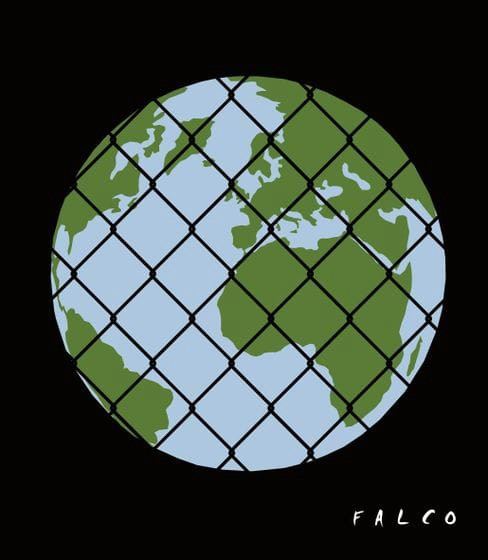

### AYS Daily Digest 16\.07\.19 — “A little force is needed”: Croatian PM defends illegal border pushbacks

“Prisoner World” by Alex Falcó Chang

_Water cuts on Chios // Volunters needed in Bosnia // “Gilets Noir” protestors freed // Update from Calais // Report from Deportation Monitoring Aegean //and more…_
#### Feature: Croatian PM acknowledges pushbacks

Illegal and often violent pushbacks of refugees has been going on along the Croatian border for many years\. Many independent media and activist groups, including AYS, [have documented](https://www.cms.hr/system/article_document/doc/504/Fourth_Report_on_Illegal_Pushbacks.pdf) these abuses [with film](https://www.facebook.com/watch/?v=2080967588882638) and photo evidence and testimony from people on the move\. Despite all the evidence, the government has always maintained ignorance of these pushbacks\. As a [recent report by Amnesty](https://www.amnesty.org/download/Documents/EUR0599642019ENGLISH.PDF) found, Croatian authorities have argued “that the practice at the borders constituted a “refusal of entry”, rather than a pushback”\.

Yesterday Croatian PM Grabar\-Kitarović broke this rule when she was questioned [by a Swiss reporter](https://www.srf.ch/play/tv/tagesschau/video/kroatiens-praesidentin-grabar-kitarovi-zur-balkanroute?id=68ae3d79-230b-4af6-a318-717b9aa8a514&fbclid=IwAR024wAVzVMe37JlMrmGWeQa_tM-Vx-LgAVW65skJc6VDhUgQgxo0BPsi1g) about video evidence of police violence during a pushback, for the first time formally acknowledging the practice of illegal pushbacks in Croatia\.

> Reporter: My colleagues filmed illegal push backs of the Croatian police\. How do you react to this report? 

> Kolinda Grabar\-Kitarović: “Illegal push backs? Why do you think they are illegal? We are talking about illegal migration, people trying to cross into Croatia illegally and the police pushing them back into Bosnia\-Herzegovina\. Because there are actually border crossing that are open for anyone who wants to cross into Croatia and ask for asylum\.” 

> Reporter: “What about the injuries of the refugees, we see in reports by international organisations, when they come back they are talking about violence by the Croatian police is this wrong?” 

> Grabar\-Kitarović: “I have made inquiries and I am being reassured time and time by the Minister of the Interior, by the Chief of Police and by the police on the ground whom I’ve seen, that they do not use force that would be too much\. Of course when you are pushing people back a little force is needed\. 

What Grabar\-Kitarović describes as a “little force” are in fact brutal assaults\. Refugees who have been pushed back by Croatian police describe gauntlets of batons, punches and kicks, cracked ribs, teeth and cellphones\. These assaults are carried out on people who are simply trying to find their way to safety\. Minors and even children have been assaulted too\. So we ask PM Grabar\-Kitarović, is it really fair to call this “a little force”? Was a “little force” really needed [against the family of little Madina](ays-special-when-governments-turn-against-volunteers-the-case-of-ays-81fcfe0e80e7) , the six year old Afghani girl who was struck and killed by a train after being chased across the border in an illegal push back?

The EU must stop condoning this violence at the border by funding Croatian border police\. While the EU officially condones the practice of pushabcks without allowing people to apply for asylum, it implicitly encourages them by funding the Croatian border police\. These illegal push backs are at least partly motivated by Croatia’s desire to prove to the EU that it can maintain a “strong” border in order to enter the EU Schengen zone\. As interior minister Davor Božinović boasted last year, [Croatia](https://www.theguardian.com/world/croatia?fbclid=IwAR0omgLoh2j1pPF28PqIyKwPDEteVQSXUz92eP9C9Gu-eDl9aopHOsc2UII) has “the strongest border police in this part of Europe”\.

In order to enter the European zone of free movement Croatia is not asked to demonstrate its commitment to human rights, but the ability to keep refugees out through violence\.
### Sea
#### Over 200 people crossing the Alboran sea

There are at least 218 people currently attempting to cross the Albertan sea, accoridng to Spanish journalist Helena Garzon\.
#### Request for donations from Volunteer Pilots

> ✈️ During our daily missions aboard our plane the “Hummingbird” we are often the only witnesses of the shipwrecks\. Thanks to your support we will continue to be able to call in the rescue before it is too late\.
 

> [Click here](https://www.pilotes-volontaires.org/fr/donations/formulaire-de-don-1/) to support\. 

■■■■■■■■■■■■■■ 
> **[Matteo de Bellis](https://twitter.com/matteodebellis) @ Twitter Says:** 

> > Regretful statements by @[AbelaCarmelo](https://twitter.com/AbelaCarmelo) at #FAC yesterday, calling on #EU to strengthen cooperation w Libyan Coast Guard. As if 53 people hadn’t died just 10 days earlier as a result of that cooperation. [independent.com.mt/articles/2019-…](https://www.independent.com.mt/articles/2019-07-16/local-news/Migration-EU-Foreign-Affairs-Ministers-review-progress-achieved-recent-developments-6736210939) 

> **Tweeted at [2019-07-16 08:41:44](https://twitter.com/matteodebellis/status/1151049264279277568).** 

■■■■■■■■■■■■■■ 

### Greece
#### New Arrivals \(via [Aegean Boat Report](https://www.facebook.com/AegeanBoatReport/posts/612933659229742?hc_location=ufi) \)

> Four boats have so far today arrived on the Greek Aegean Islands\. 

> First boat landed on Therma Beach, Kos south east 05\.50\.
 

> 30 people \(Numbers not confirmed\. \) 

> Second boat was picked up outside Chios, taken to port Chios 07\.35\.
 

> 47 people — 20 children, 15 women and 12 men\. 

> Third boat landed on the north east tip of Simi 11\.30\.
 

> 12 people \(Numbers not confirmed\. \) 

> Fourth boat was a drop off on Korakas, Lesvos north 17\.55\.
 

> 22 people \(No breakdown so far\. \) 

#### Water cuts on Chios and no shelter for newly arrived refugees

How is that Greek authorities, in concert with the UNHCR, are unable to even provide tents for refugees who are arriving on the Aegean islands? Today when a group of refugees arrived on Chios, this was the situation\. Independent volunteers and NGOs including the Attika Human Support group scrambled to find tents and tarpaulins for newly arrived children and families\.

Another NGO working on Chios, [Action for Education](https://www.facebook.com/ActionforEdu/?__tn__=kC-R&eid=ARBPQWQyxNNJf4rlBgg66BhqfyZR-CCQMsuDOnQoyZ-5PfzY6g625bQjGt6ZK1CYPnvJs91SCZoi8XLl&hc_ref=ART76zXTVg1gWOto3_CJUxxuw6uK6Qq44c3p6g_ED7bhMmWSDv-EcDu7UsWWXzSiMWw&fref=nf&__xts__%5B0%5D=68.ARAzYrJjvqxhN7kpph_P1r6sJTmss5eT7ckk2d5F7bk6aWoeUqpwRqgALrrisp0WTsxVGdSL6pCH3XI1Ykz-g3BYM8WBKOcH9ZDCbav7d_L0nny9POQO_XiiIuJDF0DbO90feNRJp1mrarqWG8BgVkU4AIKBF7-5EVzrx9d87Nd9oBzGAxjkzXe7x-eXyHULn3Lovf1oj_vJNSe8-ca4GTvbpAAQTwRvwuK8t8GkTduvUssh-pOm3QgLG7iPxj5Wel4-j8vAPcOFr5mhrh-Bx1j-CJYEbh_-0FQAolP1rJ3mnbMMrE_lQarpNiV4mN-UnSLIgz_U4YXSkLr5RBYH-gyK_73LRFM) , described how frequent water cuts are making an unbearable situation even worse on the island\.

> The lack of availability of clean, running water is not only an inconvenience, but a cause for very real medical concern in a camp where children and families live\. 

> Whilst water cuts aren’t infrequent during summer months on the islands, most domiciles have storage systems in place to deal with these cuts\. The camp on the other hand, where over 2000 asylum seekers are forced to live, doesn’t have this kind of provision at all\. 

“It’s so hot and people are really suffering,” wrote one independent volunteer\.

> “People are saying their drinking water rations have been reduced and as for showering; again there is a lack of clean, running and regular water\. 

> Every nook and cranny by the containers is taken due to the over spill of people\. They sleep with festival tents and tarpualin on top if lucky and completely without if not\. 

> This is how our new arrival children sleep\!” 

](assets/839284a9abed/1*HWYW2jxumkQKsglvBcIoiA.jpeg)

Photo Credit: [Ruhi Loren](https://www.facebook.com/ruhi.akhtar.7?__tn__=%2CdCH-R-R&eid=ARBHO5AwmbAx7H9PuQXJyi-GcMAPE-xslQsgjFi86oioD4mPVntnKmSrula7z2bFbtNkMnFfS9JAgs-6&hc_ref=ARQkIvGuD-1C-oLm5cJcyORxFvhB1DJln2HUOLXGFp7qXJeD22_6XpBiYLpo45KTisM&fref=nf&hc_location=group)
#### “Incarcerating the marginalized”: new report by Deportation Monitoring Aegean\.

Deportation Monitoring Aegean released a new report this week detailing the effects of the agressive EU focus on people smuggling\. Their report found that the EU’s tactics often resulted in refugees who were merely directed to steer boats were often arrested as “smugglers”\. The report also discusses how the emphasis on people smugglers ignores the wider reasons for forced migration, and the failure fo the EU to provide safe and legal passage\. From the report:

> For the majority of the worldwide population, there is no safe passage and no legal way to enter an EU country and seek asylum or receive a working visa\. People are forced to embark on illegalized deadly routes and have no other option but to use the service of facilitators that are in many cases excessively overpriced and risky\. The facilitation of people’s journeys is illegalized even if their right to stay is approved through an asylum decision afterwards\. Destroying smuggling networks will not save lives — people rely on them to save their own lives\. 

See the full report [here](https://dm-aegean.bordermonitoring.eu/2019/07/15/the-war-against-smuggling-incarcerating-the-marginalized/?fbclid=IwAR0I2XrC3RRkl_6m0NT1UctrBkbrDtfTvUnIUKmeEGaFQ66k7KJ8E8jssGY)
#### Weather Alert in Greece

> Greece’s National Meteorological Service has updated the weather warning of July 15, 2019 to a Red Alert warning of Dangerous Weather Phenomena\. 

> According to the Red Alert warning issued by EMY on Tuesday, July 16, main features of the weather are strong rainfalls and storms that will be locally accompanied by hailstorms and powerful winds\. 

Family of man who died in Moria camp sues Greek gov\.

A lawsuit was filed this week by the family of Mustafa Mustafa, a 46 year old man who died of carbon monoxide posioning on Lesvos in 2017\. Mustafa was using makeshift stove in his camp, and passed away in the night\. A 20 year old Egyptian man named Ahmed Mohamed Abdelaziz Elgamal died just four days before Moustafa on Lesvos in the same way, and is family has filed a suit as well\.

The Mobile Info Team in Greece has posted some information on the consequences for refugees caught trying to leave the counry with a fake passport\. See more \(Arabic and English\) [here\.](https://www.facebook.com/mobileinfoteam/photos/a.1800063030222418/2485330955028952/?type=3&__tn__=-R&hc_location=ufi)

> ✨VOLUNTEERS NEEDED ✨
 

> We are looking for experienced long terms volunteers to help us open our new ECHO HUB in Athens in September\. Follow the link for more details [https://bit\.ly/2XEYsyc](https://bit.ly/2XEYsyc?fbclid=IwAR20HWnkvO2HHtW9chnG3GTnIeUAd6xESgEp01WDfqTuGn0cvcuabh8s8tM) 

### Balkans
#### Refugees suffer from trench foot in Tuzla

 \. “They escape these wars, from a forced enlistment, from almost certain death; they cross Iran Turkey Greece Bulgaria Serbia Montenegro to arrive in Bosnia, after months and months of path, in inhuman conditions\. This is the savagery of borders\.”](assets/839284a9abed/1*3PMIdFNyUoF-fFOxC7JThg.jpeg)

Photo Credit: [Lorena Fornasir](https://www.facebook.com/lorena.fornasir?__tn__=%2CdCH-R-R&eid=ARCxTsJ7SvvXdxNdP1x94hzCcnq6dJ7_6DP1S4TuBj5zMNN7euh0C3nQ_SvdLXrnRH824rWhNgT1PwT5&hc_ref=ARQbhDPCOuGuBKy78cYDoVND-2okRHzRDY4Wf0z_L8wgJF4-6HoHLKnjdrr_vaWcvOI&fref=nf&hc_location=group) \. “They escape these wars, from a forced enlistment, from almost certain death; they cross Iran Turkey Greece Bulgaria Serbia Montenegro to arrive in Bosnia, after months and months of path, in inhuman conditions\. This is the savagery of borders\.”

“We need long\-term volunteers in Bosnia\! \! No name kitchen continues its work in velika kladuša, but to be able to do it in the best possible way we need volunteers who can work with us for two or three months, starting in half or by the end of August\.”
### France
#### 8 “Gilets Noirs” protestors released from jail

Over the weekend, [police in Paris broke up a peaceful protest](ays-weekend-digest-13-14-7-2019-new-minister-positively-impressed-by-moria-camp-fb37dd0e2055) of “Gilets Noirs” with extreme violence that gave at least two people serious injuries and left one in a coma\. In the aftermath of the police violence, 16 protestors were arrested\. On Monday, 8 of them were released\. French are calling for their immediate release\. To learn about upcoming demonstrations to support those still in jail, [click here](https://www.facebook.com/events/2341143026203620/?acontext=%7B%22source%22%3A4%2C%22action_history%22%3A%22%5B%7B%5C%22surface%5C%22%3A%5C%22group%5C%22%2C%5C%22mechanism%5C%22%3A%5C%22surface%5C%22%2C%5C%22extra_data%5C%22%3A%5B%5D%7D%5D%22%2C%22has_source%22%3Atrue%7D&source=4&action_history=%5B%7B%22surface%22%3A%22group%22%2C%22mechanism%22%3A%22surface%22%2C%22extra_data%22%3A%5B%5D%7D%5D&has_source=1&__tn__=%2CdKH-R-R&eid=ARCM3TvdMtuO4eq8lQn9xR-AqXYZYJTVOMwAW9j_XAViRgEdjWAlfN3joYkMwXHcxDkm_E3qFMd5M5Ck&hc_location=group) , and [click here](https://www.lepotcommun.fr/pot/v346wpgn?fbclid=IwAR3hdM6iWT88AXg7YNMKAfUhZ1SdbbmcxokBA02q6ZLYQe8JIHyFGHQ_I1w) to learn more about the Gilets Noirs and how to support the movement\.
#### Update from Calais and Paris

An independent volunteer gave an account of ongoing evictions in Calais:

> The area between rue Garennes and rue Verrotieres seems to have been permanently evicted\. More police operations expected tomorrow from 8 am \. There are still hundreds of people in the area including families and many unaccompanied minors\. They are being pushed out of the area in conditions of even greater invisibility and danger\. 

](assets/839284a9abed/1*c4KyByXWj-npVKBKBmGYFA.jpeg)

Photo Credit: [Gent4Humanity refugee support\.](https://www.facebook.com/VZWBelgiumGent4Humanity/?__tn__=kC-R&eid=ARAhb_bagfffaNpHLBXWMU-HovVPKoVNXGhpN8iqk9DjpvxceFRloNLc9bQ2o_STpsXUAOrXI8MKuPYb&hc_ref=ARQHQqtwIyRE-rzQgHGDDiUXPypyrE0p1l1PC8e0PzQf9RYCtppYXsYN4WHYgeClJkk&fref=nf&__xts__%5B0%5D=68.ARBzb1DtmSg2IrukqFNIvHNM61EGgIxXLCWax-H6x-qGNOO_KkNGDb9nDi6ALTSeu10ptw2xrzfrrTJzDNGn71cmQrYPDNIRKKFbQ9SR5ZeOyzXlBxwaHs7zrMBMakeCStBesSC9o4UZIcwC5lmygycHvB3RVQwQZOGtSCXzftcI9sfSAxs44wdtfgPSZmV3zrqkvHFlI_G8c7IbDjbUmgxIQi1va3CysVmW5AvRh2G30tkZIG5jMd5xy-QleZLnlv_qUUe2pPEZQQGRkeTRrd3I53uyEen1ezJCO1GZE_eOmAmeArrBO_7fwMI-n7vQ29LmAR7t6TfFyl_4mTK2l3vFL78k)

A [Belgian volunteer group](https://www.facebook.com/VZWBelgiumGent4Humanity/posts/2338884956429317?hc_location=ufi) working in Paris reported on conditions in the makeshift camp at d’Aubervilliers:

> We saw them living in disgusting conditions in makeshift tents alongside rubbish, rats, cars thundering past, and the smell of urine from uncleaned portable toilets made stronger in the 25 degree heat\. Far too many of them had medical and dental conditions going untreated, and there were chesty coughs, scabies and stomach problems\. There were small children with coughs and colds, and some of the refugees were clearly suffering from stress and anxiety as they wait for a decision on their papers so they can settle in France\. 

### Spain

Today the Parliament of Catalonia announced that it would award the Medalla d’Honor to [Carola Rackete](https://www.facebook.com/hashtag/carolarackete?hc_location=ufi) , the captain of the Sea\-Watch vessel who was arrested for entering the port of Lampedusa to disembark refugees\.

A boat with thirty people landed on the beach of La Barrosa in Chiclana, Spain\.
### UK

 ”](assets/839284a9abed/1*yvTGAIcPOgNwa_QC4OXdPw.jpeg)

“RRE is calling on the Home Office to urgently introduce Youth Welfare Officers in asylum accommodation in the UK\. It is vital that these young people are given the care and support that they need\. Write to your MP: [http://ow\.ly/a9dn50v0QPp](http://ow.ly/a9dn50v0QPp?fbclid=IwAR1psjwvV6ZHKm1DarNCOuPSepWDCCLdFFiYSqhx1qibu_P0nKWNQKI9MYk) ”

**We strive to echo correct news from the ground through collaboration and fairness\. Every effort has been made to credit organizations and individuals with regard to the supply of information, video, and photo material \(in cases where the source wanted to be accredited\) \. Please notify us regarding corrections\.**

**Apart from daily news in English, we also publish weekly summaries in Arabic and Persian\. Find specials in both languages on our [medium site](https://medium.com/are-you-syrious/ays-weekly-in-arabic-and-persian/home) \.**

**If there’s anything you want to share or comment, contact us through Facebook, Twitter or write to: areyousyrious@gmail\.com\.**

**We’re open to expanding our team of volunteer researchers, editors, and info gatherers\. Get in touch\!**

_Converted [Medium Post](https://medium.com/are-you-syrious/ays-daily-digest-16-07-19-839284a9abed) by [ZMediumToMarkdown](https://github.com/ZhgChgLi/ZMediumToMarkdown)._
