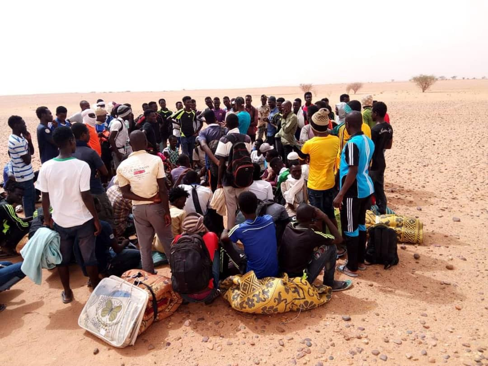
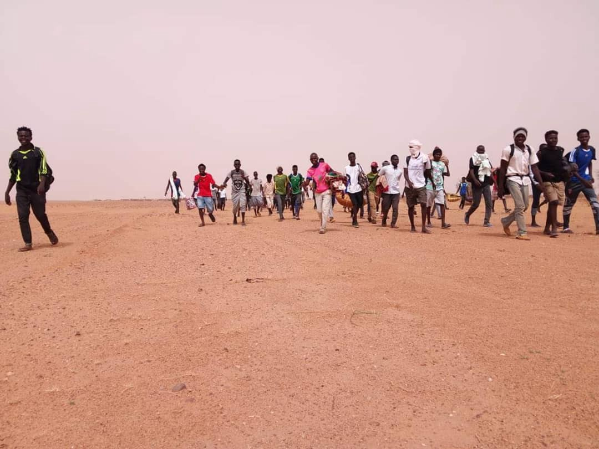

### AYS Daily Digest 19/7/19: People marching from Niger to Libya to escape limbo, including minors
#### Activists and NGOs contesting decision to transfer powers to Citizen Protection Ministry in Greece//New deadlines for permit renewal applications//Water shortage in Chios//Medical conditions of people on the move worsening after fights in BiH//Frontex possibly deployed soon at Croatian\-Bosnian border//More news from Austria, Italy, the UK, Sweden…

Credit: Alarme PHONE Sahara
#### FEATURED

Sudanese minors who had been at the UNHCR refugee camp in Agadez/Niger have left the refugee camp yesterday, 18th of July, and are presently marching towards Libya\. The are now on their way through the desert, [Alarme PHONE Sahara](https://www.facebook.com/AlarmePHONESahara/?__tn__=%2CdkCH-R-R&eid=ARAyAAIcoD7Tcwd9FGMWbrUH1eti3UCtYw7vGvqXgxXq5xHsuWXJTJh_xzBywUCbpowarU0TTf5apedw&hc_ref=ARQbs5xGOUYXD6vHn7maF4b58l9nyMfJBT8vOFbSu68ke5eCXPiRpr7hLaj3wjT3RUg&fref=nf&hc_location=group) reports\. Their criticism is that their asylum procedures are not advancing and the UNHCR representative so far has not kept her promises to provide solutions\. Meanwhile, some of them have been brought to hospital\.

■■■■■■■■■■■■■■ 
> **[Sara Creta](https://twitter.com/saracreta) @ Twitter Says:** 

> > #Niger Asylum seekers evacuated from #Libya are living in a desert @[UNHCRNiger](https://twitter.com/UNHCRNiger) camp 15 km from #Agadez called “humanitarian centre”. A group of Sudanese, including minors, who since 1 year seen no progress in their asylum processes, decided to leave. They have no where to go. https://t.co/Mga07METmc 

> **Tweeted at [2019-07-19 06:22:23](https://twitter.com/saracreta/status/1152101359270998016).** 

■■■■■■■■■■■■■■ 

> The Sudanese minors are part of the numerous refugees and migrants who are presently blocked in Niger as a result of European policies to close down borders to force people to stay on African soil at any cost\. 

Only a small number of people have been evacuated from Libya under the Emergency Transit Mechanism program\. While there are more 57,000 registered refugees and asylum seekers in Libya, only 2,911 people have been brought to Niger so far\. Around 1/3 of them have been resettled to third countries\. Others have been waiting for months, even years, in limbo\.

](assets/1f5176715958/1*i8lc7eiurxgXe4VtRii1bg.jpeg)

Photos: [Alarme PHONE Sahara](https://www.facebook.com/AlarmePHONESahara/?__tn__=%2CdkCH-R-R&eid=ARAyAAIcoD7Tcwd9FGMWbrUH1eti3UCtYw7vGvqXgxXq5xHsuWXJTJh_xzBywUCbpowarU0TTf5apedw&hc_ref=ARQbs5xGOUYXD6vHn7maF4b58l9nyMfJBT8vOFbSu68ke5eCXPiRpr7hLaj3wjT3RUg&fref=nf&hc_location=group)
#### EASTERN MEDITERRANEAN

According to InfoMigrants, the preferred route for people from Syria is to go via **_Cyprus_** \. Although the numbers are still low, Cyprus has the highest ratio of arrivals compared to the population\. According to people fleeing, they would rather [die at sea](https://www.infomigrants.net/en/post/18271/divided-cyprus-has-become-new-route-for-migrants-prepared-to-die-at-sea) than in Syria\. Keep in mind that in spite of the news of Syria being “pacified” dozens if not hundreds continue to be killed on a monthly basis in airstrikes in northern areas\.

> During 19 days, between the 1st and 19th of July, [3000 people were intercepted by the Turkish Coast Guard](http://www.memleket.com.tr/egede-19-gunde-3-bin-multeci-yakalandi-1812613h.htm) and returned to Turkey, while trying to cross to Greece\. 

**_Greece_**

The deadline for the application of residency permit renewals has been extended until October 31st\. Find [here](http://asylo.gov.gr/en/?p=4750&fbclid=IwAR0jftA9z1Z38BpYJKQGL1q08ePY4T92G9EpVFuRBjYWc05mZ0Iz_vDG2sI) information in different languages\.

Humanitarian NGOs and activists have expressed [their concern](https://www.telesurenglish.net/news/Greece-Refugees-Activists-on-Alert-Amid-New-Migration-Acts-20190718-0008.html?fbclid=IwAR09U8bUkH66GPqrcNB2wsWWEkHEF1Rmyjp0DooVqXiKjAIHS54N7B0miEE) about the new change in dealing with immigration issues in the country and the transfer of power to the Citizen Protection Ministry, the planned acceleration of asylum procedures and the returns to Turkey\.

■■■■■■■■■■■■■■ 
> **[RSA](https://twitter.com/rspaegean) @ Twitter Says:** 

> > Τα ζητήματα ασύλου και μετανάστευσης δεν είναι ζητήματα δημόσιας τάξης  και ασφάλειας, αλλά ζητήματα διεθνούς προστασίας, υποδοχής κοινωνικής  ένταξης και κράτους δικαίου #abackwardstep #migrationisnotasecurityissue #RefugeesGR
 
[rsaegean.org/el/ksana-to-as…](https://rsaegean.org/el/ksana-to-asylo-kai-i-metanasteysi-sto-ypoyrgeio-prostasias-toy-politi/) 

> **Tweeted at [2019-07-19 09:19:48](https://twitter.com/rspaegean/status/1152146005611175937).** 

■■■■■■■■■■■■■■ 

Follow this page for information on [arrivals](https://www.facebook.com/AegeanBoatReport/photos/a.285312485325196/614658599057248/?type=3&theater) ; 29 people landed in **_Lesvos_** early on Friday morning\.

The constant lack of water supplies in **_Chios_** has been met with a vague answer from the authorities\.

[Conditions](https://twitter.com/samosvolunteers/status/1152170669674831872?fbclid=IwAR1L0WmRVNdvlhMdRZVak1DaVjlHcahBbiLJNcXxrUScIVVFyLkD4d3ZqFM) on the island of **_Samos_** \.

**_Recruiting & volunteering possibilities_**

Moria, Lesvos: Becky’s Bathhouse is looking for an [assistant coordinator](https://www.facebook.com/groups/informationpointforlesvosvolunteers/permalink/1162265210647591/?hc_location=ufi) for their activities\.
#### WESTERN BALKAN ROUTE

As pressure piles up on those still stuck in the border region of **_Bosnia and Herzegovina_** close to Croatia, it affects people waiting to move on\. The many fights are just a result of the escalated feeling of hopelessness, fear and insecurity over their situation\. After yesterday’s fight in Velika Kladuša, reportedly involving about 150 people, some have received wounds that required medical attention and a young man ended up in the cantonal hospital in Bihać\.

The **_Slovenian_** minister of interior affairs highlighted the possibility of Slovenian cooperation and contributions to FRONTEX’s border enforcement at the Croatian\-Bosnian border\. The minister said this as part of a meeting with Matteo Salvini, head of the ministry of the interior of Italy\.

Both ministers agreed that although there is increased cooperation at the Slovenian\-Italian border, the “problem” does not lie there, but that there should be more efforts to “protect the EU’s outer frontiers\.”

“Together, Italy, Slovenia and Croatia will ask the EU for control of the external borders and will put together the three police forces to guard the internal and external borders” translated by [L’ALTRA VOCE](https://web.facebook.com/permalink.php?story_fbid=2355141264578826&id=1245970425495921) from [ASKA NEWS](https://www.askanews.it/cronaca/2019/07/18/rotta-balcanica-salvini-stretti-rapporti-con-slovenia-e-croazia-pn_20190718_00560/) \.

Read more [here](http://hr.n1info.com/Regija/a420432/Slovenski-ministar-spomenuo-mogucnost-slanja-Frontexa-na-granicu-Hrvatske-i-BiH.html) \.

According to [No Border\. No Nation\. Stop Deportation\.](https://web.facebook.com/stopdeportation/?__xts__%5B0%5D=68.ARCQkk3K366ivld3w5UD3iALAH-kDxu4l5VHz-C4yfNEsxBHICUJCZe_rcSkhwp5qutAFIYtZBtr6zSbIGacYNr05k4hMKqJ89ON921orjGbp0Alhcrpz3y1pzXp6n7DcJsVt76H3EIgjSXU6LQuOi3lUpQ8QI1-mKrv3kAcx1hXj_qTpfe1wv7Bkpe2iwHE0bWkphExtTuGC1H75VM_49zNugx6tOhVfzR4NeWYONCT2iZJ6VbEQ4g37I2QOceFupucPzL3QBS_lTNcB_aNtDQPitf8XCSIfuVC9PjzdAc2uYm0JWRH0HNV69AyZQL1hCacIM6MC-Vow6YH_C0Lz3PyVg&__tn__=k%2AF&tn-str=k%2AF) A man at the Bürgl detention/deportation facility in **_Austria_** who engaged in a hunger strike to prevent his will still be deported\. Additionally on the 17th, another man was picked up and deported in handcuffs\.
#### CENTRAL AND WESTERN MEDITERRANEAN

News from **_Libya_** is reaching us from MSF’s head of mission in the country:

> To add insult to fatal injury, despite the outrage following the attack, there are still 193 people detained in the graveyard of Tajoura, with the number growing every day\. 

See more and original source [here](https://twitter.com/sallyhayd/status/1152175240329539584?fbclid=IwAR1XLZu_YVOqiXLNfxiTJGBt5DIFgdVPB0EUSW81pJ7temcc94sEGuBq4Ns) \.

[L’ Altra Voce reports](https://www.facebook.com/permalink.php?story_fbid=2354692751290344&id=1245970425495921) that in Pordenone, **_Italy_** , 50 people from Pakistan and Iraq were moved from the camp where they were residing, together with people moved from their apartments and from second level reception centres\. These 50 people are part of the 2000 who will be moved from the region, with no clear plan of what will follow afterwards\.

Meanwhile, in **_Lampedusa and_** in **_Siculiana_** \(Agrigento\), around [100 new people landed today](https://twitter.com/LuigiCorsaro1/status/1152294679087632384?fbclid=IwAR3_Jf4sfKpQ-8XmiZiQ1fLZo1bdducVI0jT052fggXHgqb0-juwElm_aLQ) , among them also unaccompanied minors\. Of those who landed in Siculiana, eyewitnesses report having seen some fleeing in a white car; only [27 were caught along the main road](https://twitter.com/AngiKappa/status/1152287848701267969?fbclid=IwAR0Ejf8sTvHT4uo9Ra9SKJYhwhBxL0RvPsTKRbdTXJ_uyxSnOZTECaXRUi0) by the GdF and the Carabinieri\.

See more in Italian [here](https://www.lastampa.it/cronaca/2019/07/19/news/a-lampedusa-arrivano-44-migranti-sotto-scorta-sulla-spiaggia-di-agrigento-uno-sbarco-fantasma-1.37132719?utm_source=dlvr.it&utm_medium=twitter&refresh_ce) \.

A total of 683 people lost their lives in the Mediterranean since the beginning of 2019, [according to IOM](https://missingmigrants.iom.int/region/mediterranean) , with a worrying [increase of deaths reported](https://www.lavanguardia.com/vida/20190719/463586739258/oim-cifra-en-683-las-muertes-en-el-mediterraneo-alerta-del-aumento-en-espana.html) in the **_Western Med_** , where 204 people died trying to reach Spain, in the first half of the year\.

Salvamento Maritimo and Frontex have been out in the Western Med to reach [a boat in distress with 58 people](https://www.publico.es/sociedad/migraciones-buscan-patera-deriva-58-migrantes-mar-alboran.html?utm_source=twitter&utm_medium=social&utm_campaign=publico) \.

Meanwhile, [174 people are risking their lives in the Alborán](https://twitter.com/HelenaMaleno/status/1152222477902389249?fbclid=IwAR1GkxwVH-o4rTgyaIVMeUQN8avG-MR4bli95dCnb-yBk4Fr9xj6m0M_PI0) , as there are no means to rescue them and a very strong wind; among them, 35 women and 5 babies\.

The **_Spanish_** Government has promised [30 million euros](https://elpais.com/elpais/2019/07/19/inenglish/1563521682_999175.html?id_externo_rsoc=FB_CC) to Morocco to help Morocco prevent people from reaching Spain\. This is in addition to the 140 million already promised by the EU\. For more information on the kinds of entities that often profit from these funding programs, check out this [article on Border Management and Arms Manufacture](http://www.stopwapenhandel.org/sites/stopwapenhandel.org/files/Border-Wars-Report-web1207.pdf) \.

■■■■■■■■■■■■■■ 
> **[Charlie Yaxley](https://twitter.com/yaxle) @ Twitter Says:** 

> > Population of the EU: 512,000,000

Arrivals to Europe across Mediterranean Sea in 2019: 31,947

In other words, 0.01%

The numbers are few. The situation is manageable. 
 
#portichiusi We Stand #WithRefugees https://t.co/d8mUasCBWw 

> **Tweeted at [2019-07-19 07:54:37](https://twitter.com/yaxle/status/1152124567646867457).** 

■■■■■■■■■■■■■■ 

However, as expected, the meeting of interior ministers from across Europe remained in deadlock, with Salvini rejecting a plan proposed by Germany and France for distribution across Europe as it would involve some going to Italy\. For more, [go to InfoMigrants](https://www.infomigrants.net/en/post/18267/eu-interior-ministers-fail-to-find-compromise-on-mediterranean-refugee-rescue?ref=tw) \.
#### UK

Help Refugees is drawing attention to the fact that children of migrant or asylum seeking families who no longer have access to public funds or social support are not eligible for school lunch programmes\. They are partnering with NELMA to put pressure on institutions to ensure this is not the case\. Lunch is not a luxury\. For more, go [here](https://web.facebook.com/HelpRefugeesUK/photos/a.123267671367248/898944427132898/?type=3&theater) \.
#### SWEDEN

Just like young boys, young girls are also still being deported back to an oppressed life in their countries of origin\. Sweden has been expelling a large majority of the young Afghans who have asked for protection in the country\. The security situation in Afghanistan has deteriorated in the last few years, but the practice of refoulement continues\. In 2014, a third of people’s asylum requests ended in deportation, now two thirds do, [FARR — Flyktinggruppernas Riksråd](https://www.facebook.com/flykting/) reports\. Children’s rights are also at stake here\.

This Saturday a protest is scheduled in order for this to change\.
 [Liv utan gränser](https://www.facebook.com/Liv-utan-gr%C3%A4nser-418779852278740/?__tn__=K-R-R&eid=ARAyzl4HJJhomQ494x093HrrGhQjzp8wZ-NLY0g0uZq9w8Kqpk_Qxr5mR0sVu-3JdzpmlPhWLZJYGn8-&fref=tag&__xts__%5B0%5D=68.ARCbgPz31_jalnAJmFDJvb5yWCCf4SIljFLcFZMm2PbxkY75ABg4-ptY0AFAd5GHmNZSy89F3fNxQ_h6sDDdFY--ONzuL2v2flprvTUwFdwkAPrfjrzTAVCgVq80DwgrXcC-ToaRHK3UjJpvDNvfB1kZple75Xqg_uZmzq-zgOUgahoB-7ok7m2-7pBkraCiJ-lS3yNXr4DTEdNU) is holding a march in Stockholm for the Afghan families at risk of deportation due to the questionable deportations to Afghanistan\.

[](https://www.facebook.com/events/431500837444092/?acontext=%7B%22ref%22%3A%223%22%2C%22ref_newsfeed_story_type%22%3A%22regular%22%2C%22action_history%22%3A%22%5B%7B%5C%22surface%5C%22%3A%5C%22newsfeed%5C%22%2C%5C%22mechanism%5C%22%3A%5C%22feed_story%5C%22%2C%5C%22extra_data%5C%22%3A%5B%5D%7D%5D%22%7D&__xts__%5B0%5D=68.ARBZuAxa5T5vc3XT067VZClIR8tje_b7Vb51lHN2NzCdZNcMHdy9EwbYGIhMLszCYDiMifo0unpKaA7wp6QqUTwqlh9xlFWm6B26cUiRCYNLLOqGg8gJ2EFszglJCCLUFUrArlL8ySIzAAXuiijiQreZhIV8g92zjaly4JHRI4iZkSdbnRJprXJpFO8cuR4hzTWL7a0otXq-W_BRvkQf1aSynhfUG24VIhi9-VbmlNlN-C7o0cmVYOtaSOHt67TB1zbCqiOxAz2H4KWEFPCupSyphvsZTqpxSTcgMq9Jr2qPpoCoF9tBjB0KghEMZz7gtN0B38Ec5v7A2yYYbXXiwshkow&__tn__=HH-R)

**We strive to echo correct news from the ground through collaboration and fairness\. Every effort has been made to credit organizations and individuals with regard to the supply of information, video, and photo material \(in cases where the source wanted to be accredited\) \. Please notify us regarding corrections\.**

**Apart from daily news in English, we also publish weekly summaries in Arabic and Persian\. Find specials in both languages on our [medium site](https://medium.com/are-you-syrious/ays-weekly-in-arabic-and-persian/home) \.**

**If there’s anything you want to share or comment, contact us through Facebook, Twitter or write to: areyousyrious@gmail\.com\.**

**We’re open to expanding our team of volunteer researchers, editors, and info gatherers\. Get in touch\!**
#### [Are You Syrious?](https://medium.com/are-you-syrious?source=post_sidebar--------------------------post_sidebar-)
#### Daily news digests from the field, mainly for volunteers and refugees on the route, but also for journalists and other parties\.

_Converted [Medium Post](https://medium.com/are-you-syrious/ays-daily-digest-19-7-19-people-marching-from-niger-to-libya-to-escape-limbo-including-minors-1f5176715958) by [ZMediumToMarkdown](https://github.com/ZhgChgLi/ZMediumToMarkdown)._
