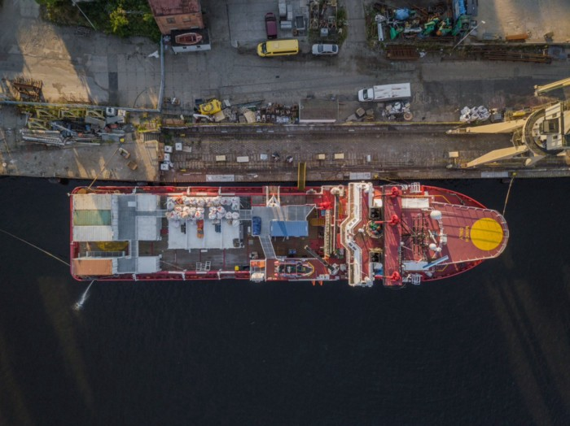

### AYS Daily Digest 20–21/7/19: Back at Sea
#### SOS Mediterranee starts next mission in the Mediterranean // Greece continues illegal push\-backs // Turkey reportedly sends Syrians back to Idlib

The Sea Viking\. Photo: [SOS Mediterranee/Twitter](https://twitter.com/SOSMedIntl/status/1152826825762136064?fbclid=IwAR1nzSEMOBtEACRIVlizATKW-w3RuUQG1RQxJSsmvI87zPMcQoZNU3JqTBw&source=post_page---------------------------)
### SOS Mediterranee Back at Sea

SOS Mediterranee and Doctors Without Borders \(MSF\) started a new rescue mission in the Mediterranean sea\. _“For a year now we have been witnesses of a deterioration in the European Union’s response in the evolving human tragedy in the central Mediterranean”_ , says Frédéric Penard, SOS Mediterranee’s Head of Operations\.

For this, both NGOs chartered the Ocean Viking, which carries a Norwegian flag\. The ship is now equipped to perform search and rescue with four high speed rescue boats, as well as a medical clinic with consultation, triage and recovery rooms\. “ _The Ocean Viking appeared as the best option: the vessel was originally conceived as a rescue vessel and had great potential for SOS MEDITERRANEE and MSF to add all the necessary elements to rescue people in distress, to provide care and to protect survivors when operational at sea”_ , says Frédéric Penard\. The crew will consist of 31 people\.

SOS Mediterranee ended its last mission in December 2018, as political pressure increased against them\. With the Aquarius ship the crews saved some 30,000 people\.
### Greece: Two men swim across the sea

Two men swam from Turkey to Greece today, a journey of at least eight kilometers, volunteers [report](https://www.facebook.com/groups/421759534684819/permalink/1082004815326951/?source=post_page---------------------------) \. They spoke about strong waves and cold water temperatures, before reaching the shores of Chios\.

Meanwhile, a Maltese cruise ship rescued 111 people in distress, 33 among them were children\. They were taken to the port of Kalamata, according to [DW](https://www.dw.com/en/cruise-ship-rescues-111-migrants-off-greece/a-49678519?fbclid=IwAR3BdwVxeLEOcNolRmole6sj1Qkk9ohpVYzpIx6hyVn94qIGxFjRO3TrFIU&source=post_page---------------------------) \. Two of the boat operators were arrested\.
### Pushbacks continue

59 people were not so lucky and illegally pushed back from Greece to Turkey, journalist [Zübeyir Koçulu](https://twitter.com/zubeyirkoculu?source=post_page---------------------------) revealed:

> The Greek police collected the group soon after their arrival and took them into custody at Tychero police station for 4 hours\. After seizing their phones, security officers pushed 59 people through the river near Soufli by force, perpetrating violence, according to the witnesses\. 

Some of them were arrested by Turkish security forces\.

Also at sea the illegal practice of push\-backs has not yet changed\. The Aegean Boat Report published a video documenting how the Greek Coast Guard handed over a boat with 34 people to the Turkish Coast Guard\. _“We can clearly see that Greek Coastguard is driving alongside the rubber dingy, very dangerous maneuvering, trying to force it to change direction,”_ ABR says\. According to their info, the boat was already in Greek waters\. Therefore, the Greek authorities were responsible for the rescue and to offer the possibility to ask for asylum\.
### March returns to camp

Following the attempted March from Niger to Libya \(we [reported](https://medium.com/are-you-syrious/ays-daily-digest-19-7-19-people-marching-from-niger-to-libya-to-escape-limbo-including-minors-1f5176715958?source=post_page---------------------------) \), the protestors returned to the camp on Saturday\. _“UNHCR promised to anticipate their interviews as to speed up their asylum process”,_ Alarmphone [stated](https://twitter.com/alarm_phone/status/1152852292670033922?fbclid=IwAR3e0MFrEtRPWZ3B06h-AbAROmtM3_Za-GGYzM_ilcno9j0c0ALHAELyUUQ&source=post_page---------------------------) on Twitter\.
### Syrians in Turkey fear deportations

Amid a rising number of raids in Istanbul, Syrians in Turkey fear deportations from the country\. Gerry Simpson from Human Rights Watch [says](https://twitter.com/GerrySimpsonHRW/status/1152877540501049344?ref_src=twsrc%5Etfw%7Ctwcamp%5Etweetembed%7Ctwterm%5E1152877540501049344&ref_url=https%3A%2F%2Fahvalnews.com%2Fsyrian-refugees-turkey%2Fistanbuls-syrian-refugees-fear-deportation-officials-step-raids&source=post_page---------------------------) , that apparently mass deportations from Istanbul have begun\. Since 2017, ten provinces have suspended the registration of asylum seekers in Turkey\.

Authorities are especially targeting the ones who are not registered or registered somewhere else\. The raids and the alleged deportations are a new development\. In earlier times usually these people were just sent back to the city where they were registered\. Since the election, this practice has been used increasingly\.

Journalist Assad Hanna [speaks](https://twitter.com/AsaadHannaa/status/1152546757739470849?source=post_page---------------------------) about 400 people who were send to Idlib in just 48 hours\.

The raids and deportations leave people in fear and makes them stay at home as much as possible: _“When they have to step out, they use the sub streets to avoid the price patrols\. Waiting for a new resolutions to sort out their legal situation here to don’t be deported to Syria\.”_

**We strive to echo correct news from the ground through collaboration and fairness\. Every effort has been made to credit organizations and individuals with regard to the supply of information, video, and photo material \(in cases where the source wanted to be accredited\) \. Please notify us regarding corrections\.**

**Apart from daily news in English, we also publish weekly summaries in Arabic and Persian\. Find specials in both languages on our [medium site](https://medium.com/are-you-syrious/ays-weekly-in-arabic-and-persian/home?source=post_page---------------------------) \.**

**If there’s anything you want to share or comment, contact us through Facebook, Twitter or write to: areyousyrious@gmail\.com\.**

**We’re open to expanding our team of volunteer researchers, editors, and info gatherers\. Get in touch\!**
### [Are You Syrious?](https://medium.com/are-you-syrious?source=post_sidebar--------------------------post_sidebar-)
#### Daily news digests from the field, mainly for volunteers and refugees on the route, but also for journalists and other parties\.

_Converted [Medium Post](https://medium.com/are-you-syrious/ays-daily-digest-20-21-7-19-back-at-sea-352b9e67dbe2) by [ZMediumToMarkdown](https://github.com/ZhgChgLi/ZMediumToMarkdown)._
