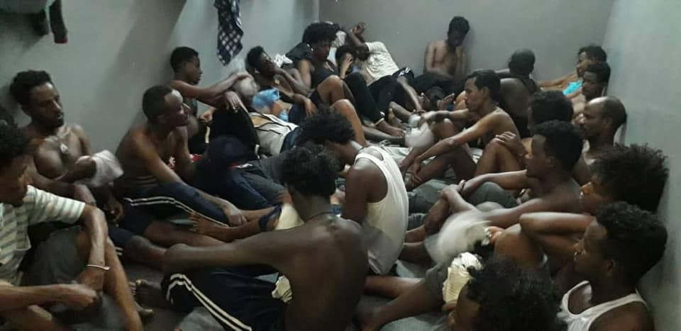
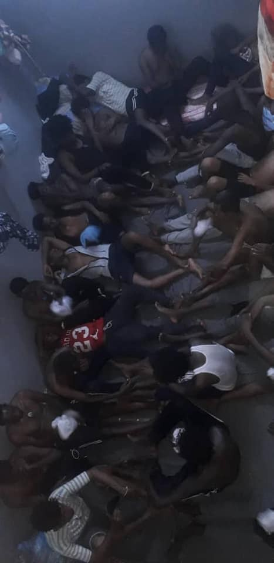
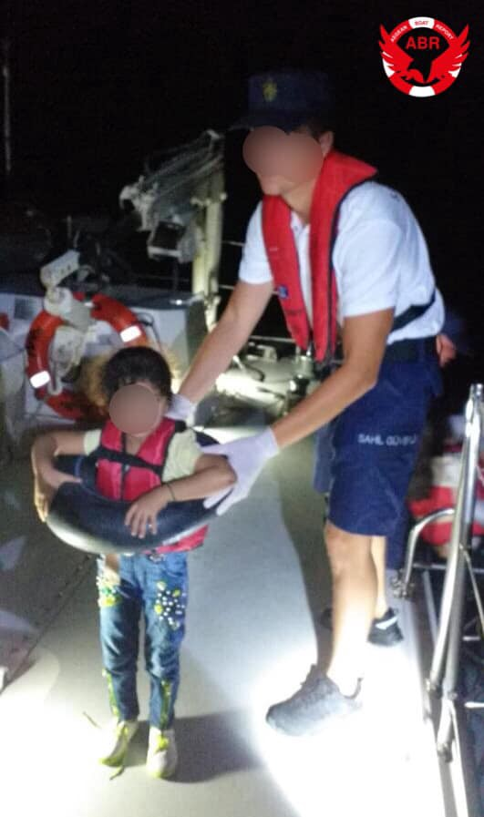

### Are You Syrious Daily Digest 23/7/19 No more EU\-Turkey Deal says Ankara

_Horrible conditions in Libya and LCG trouble // number of refugees doubled in Tunisia // Germany deporting in Afghanistan // France deporting to Iraq // new EU redistribution plan // and more…_

 , found in The Economist May 26, 2016](assets/6bf23a4a2e96/1*6DXsoyUkdOzL6lxQqSa_6Q.jpeg)

Photo by [Peter Schrank](https://www.economist.com/europe/2016/05/26/europes-murky-deal-with-turkey) , found in The Economist May 26, 2016
### Feature

> No more EU\-Turkey Deal? 

[Ankara](https://www.dailysabah.com/eu-affairs/2019/07/23/readmission-agreement-with-eu-no-longer-functional-ankara-says?fbclid=iwar3bkygisvmcresrr2dirlpq0ctp4vlaahafuyxnjaa9ayzb2lfmx5vaadm) announced on Monday that the readmission’s deal signed with the EU in April 2016 **\(aka the EU\-Turkey Deal\)** is no longer functioning due to the EU’s inability to guarantee visa\-free travel for Turkish citizens\.

“We will not wait at the EU’s door\. The readmission agreement and visa\-free deal will be put into effect at the same time,” Foreign Minister Mevlüt Çavuşoğlu said in a TV interview on Monday\. He also stated that Turkey will suspend its commitments to the deal\.

This deal has taken a toll on the functionality of Greece’s asylum procedures and the people stuck in between\. Refugees and asylum seekers must prove why Turkey is not a safe third country for them, more than explaining why they fled their country of origin, in order to stay in Europe\.

The EU\-Turkey Deal was criticized from the start, considering the multitude of human rights abuses and modern slavery tactics used in [Turkey’s informal labor market](https://www.refugeesinternational.org/reports/refugeesemploymentinturkey) \. Racists attacks on Syrian neighborhoods in Turkey have only increased with [the growing racist political rhetoric](http://www.yeryuzupostasi.org/2019/07/22/call-for-solidarity-against-increasing-attacks-on-syrian-migrants/) used against them\. Along with the intensity of [Syrians being forced to leave Turkey](https://twitter.com/InfoMigrants/status/1153645314764627968?fbclid=IwAR2t4593ZuM4lroW7o3s5HKQBnxwJ1jLVLzBYUnmGTCsilIYpG5judPhfN8) \( _more in yesterday’s AYS Digest_ \), Turkey remains as an **unsafe** third country for many people fleeing warn torn parts of the middle east and elsewhere\.

The Turkish government is making this decision from their critical foreign policy perspective of being the country hosting the most refugees in the world: [3\.7 million](https://www.amnesty.org/en/what-we-do/refugees-asylum-seekers-and-migrants/global-refugee-crisis-statistics-and-facts/) \. Yet this could also be a sign to European countries that their most self\-acclaimed deterrence policies, are not actually working\.
### Lebanon

 \. Photo by Marta Zecin](assets/6bf23a4a2e96/1*jV-Fe0r9MjbrKG243DWlIQ.jpeg)

“Dental Mavericks are looking for two volunteer translators from 5–9th August to be fluent in English and Arabic\. Lunch is provided and transportation covered if needed\.” Find out more [here](https://www.facebook.com/photo.php?fbid=10157265806839014&set=gm.2374575786121411&type=3&theater) \. Photo by Marta Zecin

For an other volunteer opportunity: _“SB OverSeas is looking for enthusiastic & capable volunteers to help support our non\-formal schools and women’s training centres in Lebanon: in Beirut and Saida \(45 minutes south of Beirut\) \. As a volunteer you will be mainly in charge of teaching two or more classes of English, Maths or Science per day\.”_ Find out more [here](http://sboverseas.org/volunteer/lebanon/?fbclid=IwAR3GzUiURpJgIoD_5Lnsa7hqZQclmsJs3mkYMpbU_Hm0mxDp7-OXD8hReEs) \.
### Libya

 , have been abandoned again in horrific overcrowded and unsanitary conditions, forced to sleep on top of each other, many sick with TB, suffering from severe malnutrition, anemia and other consequences of the horrible abuse and deprivation they are suffering at the hands of the Libyan police\. **22 have died of TB and starvation in \#Zintan only over the last 8 months\.** UNHCR or IOM are not visiting, evacuating or bringing any aid\. They are all registered with UNHCR from years as they have genuine entitlement to protection\. They have been detained for over 2 or 3 years in these conditions by the Libyan police funded and helped by Europe\.” Photos by [Giulia Tranchina](https://www.facebook.com/rastajuly/posts/10156816002943621)](assets/6bf23a4a2e96/1*2O5ejBOqwJcUW6fPwdbsgw.jpeg)

“Over 600 people in [\#Zintan](https://www.facebook.com/hashtag/zintan?source=feed_text&epa=HASHTAG&__xts__%5B0%5D=68.ARD5tTvsN58InFM_c8Ppp6T9_eZwLyr0ES9AmEZbpFyYgKnP2YKl-ZQtEvo2g34PT5AijiDl1bFDBNLRnGzDGntp9va8PRXaMTW4RVMVqYTI_Ey5UUS1QPiteLiXT94QmgD2nnDtoFwEFBzwfRATf0EGtnLV-T0dQ5HQmb8u1Url9sJyvtf-hfyocxuS4CYdeJaDUT6QPaK4-ulpFQ&__tn__=%2ANK-R) , have been abandoned again in horrific overcrowded and unsanitary conditions, forced to sleep on top of each other, many sick with TB, suffering from severe malnutrition, anemia and other consequences of the horrible abuse and deprivation they are suffering at the hands of the Libyan police\. **22 have died of TB and starvation in \#Zintan only over the last 8 months\.** UNHCR or IOM are not visiting, evacuating or bringing any aid\. They are all registered with UNHCR from years as they have genuine entitlement to protection\. They have been detained for over 2 or 3 years in these conditions by the Libyan police funded and helped by Europe\.” Photos by [Giulia Tranchina](https://www.facebook.com/rastajuly/posts/10156816002943621)

From UNHCR, [“we need action not words\.”](https://twitter.com/saracreta/status/1153551853151563778?fbclid=IwAR2y4aAYlOv_kZ1fUs8nsPlXiSqGCbyiZEKlIMSHGnvZKHeTZaFYbkIJpl0)

An Italian fishing boat was seized by the Libyan Coast Guard on Tuesday\. People are emphasizing that this news details how criminal gangs ruling Libyan waters are using EU money to fund their own monetary and pirating benefits\. Find out more [here](https://www.repubblica.it/esteri/2019/07/23/news/libia_sequestrato_peschereccio_italiano-231854383/) \.

It just keeps happening…

■■■■■■■■■■■■■■ 
> **[IOM Libya](https://twitter.com/IOM_Libya) @ Twitter Says:** 

> > 🚨Happening now: 37 migrants were returned to Libyan shore, where they will also end up in detention. https://t.co/2P344r8Ufn 

> **Tweeted at [2019-07-23 14:17:11](https://twitter.com/iom_libya/status/1153670396429897729).** 

■■■■■■■■■■■■■■ 

### Tunisia

[An update](https://www.lexpress.fr/actualites/1/monde/la-tunisie-peine-a-enterrer-les-migrants-morts-en-mediterranee_2091046.html?fbclid=IwAR3TznDBnB3E0B327L5x5kb0DOFXiCfXYg7nazOxNgGJOW5SyOc90eK4qUc) on Tunisia’s coast:

> “In recent weeks, more than 80 bodies have been recovered on the Tunisian coast, between the port city of Zarzis and the tourist island of Djerba in the south of the country, a few tens of kilometers from the border with Libya\. All of these bodies were sent to the Gabes hospital, the only one in the region capable of taking DNA samples\.” 

This comes with the news that the number of refugees in Tunisia has doubled in just one year, according to a Tunisian NGO\. Most of the new arrivals have crossed over from Libya\. Find out more [here](https://www.infomigrants.net/fr/post/18296/tunisie-le-nombre-de-migrants-a-double-en-un-an?ref=tw_i) \.
### Turkey

](assets/6bf23a4a2e96/1*MFAVMLFWqUrrajUDLOy08Q.jpeg)

Photo by [Aegean Boat Report](https://www.facebook.com/AegeanBoatReport/posts/617050355484739?__xts__[0]=68.ARAakV4Vllbs7fw2_wGHGB7u63quy2ASnTt7geBjeX2oLfxZlnyebTqbh3r3qkO5XBF8DUaDIEAAJYW6c6bGWKKU6y35S-uoDd-YkQ-r6mHiGkWK5zMUzCsE0lyu7qvcTuz8NCBvcYcIU3jlQLTuRxg-IqrSjCFWk7Wtp2f5GcXrGM8bLKTkblf6TWyNbk_auQIh-jcGoPMbyN63zh_EBkvmJge09KQNPKXBqOXobrrUUKE9vYfinNLvp4j_pQb79k4ieivHJrcPcGvQAj8zivhdKj6BsfRGEfeBqQaP1LhrRjxdO-qrdpTv4jIDpexxTG5nyITcJ3aocYfaLsNLSoE&__tn__=-R)

[Inhumane reports](https://bianet.org/english/women/210765-harmandali-removal-center-told-from-inside-battery-attempted-suicide-illness-death?fbclid=IwAR34yxcYZdQl7yrWbkBoVkogBoH539yDpRNECAokrg2I3xQcPOsI7gL5vYY) are coming from a security guard from the Harmandalı Removal Center about what really goes on in this space meant for 750 people, containing 1500 people:

> “As we were informed about the inspections beforehand, we would tidy up the place\. We would remove the blankets of the ones sleeping on the floor\. The number of refugees kept in that center is well above the normal\. 

> “They were keeping a woman with AIDS on a floor that they call ‘high\-security floor’\. No one wanted to give her food because of her illness…She was not allowed to meet or see anybody, either\. They deported her afterwards, but I do not know which country she was sent to\. 

> “But, generally, wardens would batter refugees in places where there were no cameras\. The battery could not be proven there, either\. The working hours of wardens are quite bad as well\. As they would work for long hours, they also became mentally depressed\.” 

There were many attempted suicides\. Some deaths were never investigated\.
### Sea

■■■■■■■■■■■■■■ 
> **[MSF Sea](https://twitter.com/MSF_Sea) @ Twitter Says:** 

> > #MSF is resuming search and rescue operations in the #Mediterranean in response to the worsening situation in #Libya and #EU’s inaction. #BackAtSea

"It's a simple act of humanity" @JoanneLiu_MSF https://t.co/xIfPnIdVii 

> **Tweeted at [2019-07-23 09:38:56](https://twitter.com/msf_sea/status/1153600371731968001).** 

■■■■■■■■■■■■■■ 

### Greece

![“A massive increase of boats towards the Greek Aegean Islands\! So far this month 217 boats have been stopped by Turkish Coastguard and Police, 6878 people have been arrested\. This is the highest number registered, in one month, since 2015, and it’s still 9 days left of July\. This is an increase in boats stopped by 334% compared to the same period last year, and 74% compared to last month\. **And so that you don’t forget** , that we are talking about people, not only numbers, her are some of the boats stopped so far inn July\.” Photo by [Aegean Boat Report](https://www.facebook.com/AegeanBoatReport/posts/616953432161098?__xts__[0]=68.ARC3WTZJeUXtrICnB4skpJdahqs52MA7PWYuxJ9kVIIQ37NFSvCunAPEE_aM7pG5n4HlJzmQMxYxSyZ-eWf9nmHsFfJwe5owkINh_s3GeIlVMe860nJ2xpZnnqNLf8HI1lx2K6ZzHUroUgjGE8pyGvuVpa0zU4JAbpiE9dtYqMUCiNAPCLOgNRrN9Jgsmq7T4cOQgbvrNrrPsRzcCRReeJJ-eDkkZ96a80CUV_WV8Lfl2S604x7vzAf3Y8a5_JYzT2FxDQnsv96Lw5N5NOL4x8Q8vJeBLA_C10ZueUnOApy8iVKiT12H6spMfCqi6lluCiU79DDqDkAr27zbnjCUOG0&__tn__=-R)](assets/6bf23a4a2e96/1*zbfrRxCe25M4-8a4TiB4HQ.jpeg)

“A massive increase of boats towards the Greek Aegean Islands\! So far this month 217 boats have been stopped by Turkish Coastguard and Police, 6878 people have been arrested\. This is the highest number registered, in one month, since 2015, and it’s still 9 days left of July\. This is an increase in boats stopped by 334% compared to the same period last year, and 74% compared to last month\. **And so that you don’t forget** , that we are talking about people, not only numbers, her are some of the boats stopped so far inn July\.” Photo by [Aegean Boat Report](https://www.facebook.com/AegeanBoatReport/posts/616953432161098?__xts__[0]=68.ARC3WTZJeUXtrICnB4skpJdahqs52MA7PWYuxJ9kVIIQ37NFSvCunAPEE_aM7pG5n4HlJzmQMxYxSyZ-eWf9nmHsFfJwe5owkINh_s3GeIlVMe860nJ2xpZnnqNLf8HI1lx2K6ZzHUroUgjGE8pyGvuVpa0zU4JAbpiE9dtYqMUCiNAPCLOgNRrN9Jgsmq7T4cOQgbvrNrrPsRzcCRReeJJ-eDkkZ96a80CUV_WV8Lfl2S604x7vzAf3Y8a5_JYzT2FxDQnsv96Lw5N5NOL4x8Q8vJeBLA_C10ZueUnOApy8iVKiT12H6spMfCqi6lluCiU79DDqDkAr27zbnjCUOG0&__tn__=-R)
#### SAMOS

[A local community assembly](https://voreioaigaio.ert.gr/eidiseis/kaloyn-se-laiki-syneleysi/?fbclid=IwAR028TjE6dzFGh_z0jb8pWgCMPJGsv1SF9j4gunnAQ965ovE2XNgjD55QSE) will happen on Wednesday at 7:00 in Karakostas square \(opposite the community shop\) in order to discuss the ramifications of the decision to open a new reception and identification center at the site of Zervou, Samos by the Ministry of Immigration Policy\. [Many citizens](https://twitter.com/rspaegean/status/1153568775645671424?fbclid=IwAR2l_nh35S11G4cmcvUSOHUrJuA2F3VOLKC6y1P1c5wRQAOvJx7f43RP8D0) are opposed to this new plan\.

The Ministry of Education and Religious Affairs has announced the prerequisites third country nationals must meet for the admission to higher education\. Higher levels of Greek language prerequisites are required\. Find them [here](https://g2red.org/admission-to-greek-universities-for-third-country-nationals-who-have-graduated-from-foreign-lyceums-in-greece-and-elsewhere/?fbclid=IwAR2dbP9FPK39Pi6M7K89phzazR6CttmkK5YD_bz2SNyMZ3qDyAQdDNpZ-Rw) \.
### Bosnia

[In IOM’s](https://reliefweb.int/sites/reliefweb.int/files/resources/Flows%20Compilation%20Report_final_0.pdf?fbclid=IwAR1n9KRKJyCFsKN96eBeSMoHU-EcrVdmJX-KvofywFMRAMcFq0erhnjBgQI) new report entitled _**Mixed Migration Flows in the Mediterranean: Compilation of Available Data and Information May 2019:**_

> “Authorities in the Western Balkans, namely Bosnia and Herzegovina, Albania and Montenegro, have observed a significant increase in arrivals in 2019 and have registered a total of 11,461 migrants and refugees as of May 2019\. This is 40 per cent more than the 8,242 registered in 2018 in all three coutnries and nineteen times the 578 registered between January and May 2017\.” 

[A key source](https://www.facebook.com/groups/144469886266984/permalink/383852178995419/?hc_location=ufi) also tells us:

> “Challenges continue with regard to access to asylum\. After entering BiH, migrants have the right to register their intention to seek asylum — doing so allows them to stay legally in the country for 14 days before they either formally apply for asylum or leave the country\. So far, since the beginning of 2016, only 1,600 asylum seekers have managed to register their claim, less than 5% of total arrivals\. \(Source: UNHCR in BiH\) \. The requirement of registering a temporary address in BiH is a key obstacle to this\.” 

### Germany

Bavarian Refugee Council issued that there are many hints that the next deportation to Afghanistan will take place on Tuesday, July 30, 2019\. They advise everyone to see a lawyer ASAP\. Find out more [here\.](https://www.facebook.com/Bayerischer.Fluechtlingsrat/photos/a.111278812226514/2500742619946776/?type=3)
### France

France is starting to deport people back to Iraq and breaking the law by doing so\. Find out more [here\.](https://www.facebook.com/asso.utopia56/photos/a.1080057285359396/2559945167370593/?type=3&theater)

> “by this forced return, the french state endangers the life of azeez and is affected by the principle registered in article 3 of the European convention on human rights \(Echr\) by exposing it to inhuman and degrading treatments\. The responsibility of France is committed to this title\.” 

### EU

The EU is closer after a late meeting on Monday in coming up with a redistribution plan, being over seen by France’s Macron\. Italy’s Salvini still detests the tentative agreement, which according to Macron, 14 countries have signed off on\. Find out more [here](https://www.theguardian.com/world/2019/jul/23/eu-countries-agree-plan-to-handle-migrants-and-refugees?fbclid=IwAR138-E856qOyig3y4WM7POlCcFGX__V9ZvGeeA9u1Kl4kjH2FChO8v6f_0) \.
### AYS and the Daily News Digest — how to get involved?

**We strive to echo correct news from the ground through collaboration and fairness\. Every effort has been made to credit organisations and individuals with regard to the supply of information, video, and photo material \(in cases where the source wanted to be accredited\) \. Please notify us regarding corrections\.**

**Apart from daily news in English, we also publish weekly summaries in Arabic and Persian\. Find specials in both languages on our [medium site](https://medium.com/are-you-syrious/ays-weekly-in-arabic-and-persian/home?source=post_page---------------------------) \.**

**If there’s anything you want to share or comment, contact us through Facebook, Twitter or write to: areyousyrious@gmail\.com\.**

_Converted [Medium Post](https://medium.com/are-you-syrious/are-you-syrious-daily-digest-23-7-19-no-more-eu-turkey-deal-says-ankara-6bf23a4a2e96) by [ZMediumToMarkdown](https://github.com/ZhgChgLi/ZMediumToMarkdown)._
