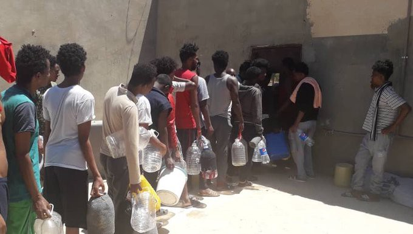
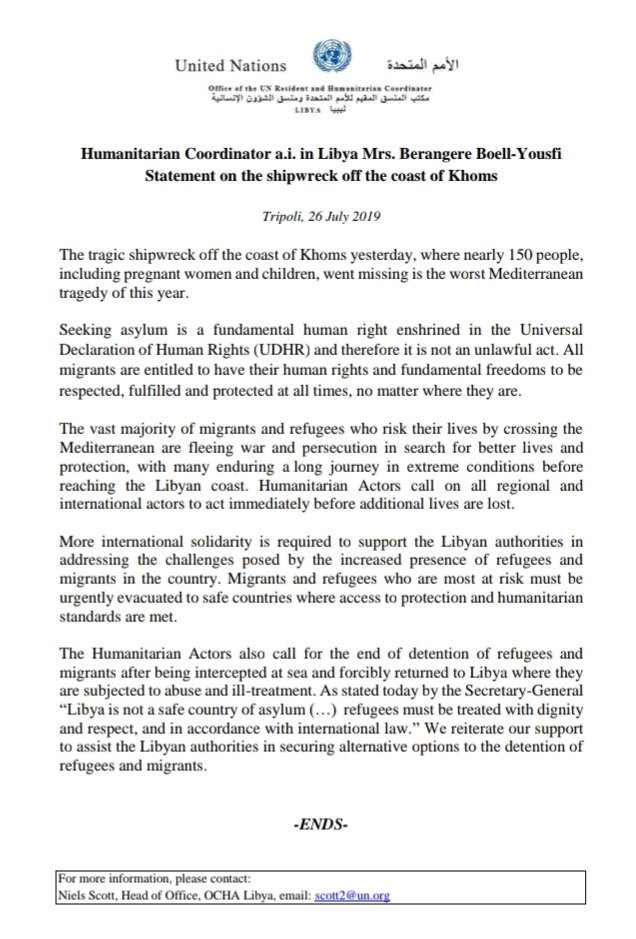

### AYS Daily Digest 26/7/19: With each death, the soul of Europe dies a bit more
#### Reactions and UN statement on the shipwreck off the coast of Khoms / International indifference to the attacks in Syria / Sweden ignores its responsibility over the deaths in the Mediterranean as a EU member state / deportation warnings / & more news

Detainees in Zintan dc say the centre’s manager has threatened to kick them out in ten days if UNHCR doesn’t evacuate or relocate them\. They’re weak & sick & far from any aid\. — Photo and report from Sally Hayden
#### FEATURED

A fundamental human right enshrined in the Universal Declaration of Human Rights, not an unlawful act, that’s what seeking asylum is\.

As we have been warning many times, dressing up camps and areas where even the basic human rights are not respected with international organisations’ logos will not erase the fact that the international community is letting some of the most horrid injustice unravel in front of their eyes, be it in Libya, Bosnia and Herzegovina, the EU border, or in the most harrowing scenarios in countries where war is raging\.

More than 100 people, including 26 children, have died in air strikes on hospitals, schools, markets and bakeries in north\-western **Syria** in the past 10 days, but the rising death toll in Idlib had been met with a “collective shrug” and the conflict had fallen off the international radar, while the UN Security Council was paralysed\.

In **Libya** , following the worst Mediterranean tragedy of this year, it should be clear that securing a humanitarian corridor is the only option for people to be safely evacuated to safe countries where access to protection and humanitarian standards are met\. The bodies of 62 migrants have now been retrieved off the Libyan coast, according to the Red Crescent\.

The Humanitarian Actors, as the UN calls them, also call for the end of detention of refugees and migrants after being intercepted at sea and forcibly returned to Libya where they are subjected to abuse and ill\-treatment\.

As stated today by the Secretary\-General, “Libya is not a safe country of asylum \(…\) refugees must be treated with dignity and respect, and in accordance with international law\.”

However, although this has been said many times over, instead of either providing stronger protection to people or arguing for a solution that would get them out, the UNHCR keeps providing \(unclear what exactly\) aid to people whom they know will later end up in detention, slavery and torture\. What the purpose of this is and whom they are ultimately helping in this way, we don’t know\.

■■■■■■■■■■■■■■ 
> **[MSF Sea](https://twitter.com/MSF_Sea) @ Twitter Says:** 

> > "One man from Sudan, who was literally pulled out of the water, told our team that he had seen his wife and kids drown. He seemed aghast, just sitting there in shock"

The testimony of a #MSF nurse who assisted survivors of  the shipwreck off  #Libya 

[msf.org/lybia-shipwrec…](https://www.msf.org/lybia-shipwreck-there-are-no-words-describe-their-suffering) 

> **Tweeted at [2019-07-26 20:38:15](https://twitter.com/msf_sea/status/1154853459654533120).** 

■■■■■■■■■■■■■■ 

In a reaction to the same disaster, Massimo Moratti, Research Director for Europe at Amnesty International, said:

> This high number represents a new low for European leaders\. They have done everything they can to pull up the drawbridge to Europe; withdrawing Search and Rescue Operations; criminalising NGO rescue boats; cooperating with the Libyan coastguard, and yet people are still risking their lives to come to Europe\. 

“Despite the increasingly risky journey and the unspeakable obstacles, people attempting the crossing to Europe demonstrate enormous hope in a better future and enormous courage to make it happen\. We need to see European leaders show some courage too and shift their approach to a humane one which saves lives and doesn’t condemn those who survive to detention in Libya\.”
### More voices against criminalisation of solidarity

The number of individuals criminalised for humanitarian activities in Europe has grown tenfold since 2015\. It includes volunteers, activists, NGOs, crew members of rescue ships, migrants’ family members, and also journalists, mayors and priests\. Caritas now warns that stigmatisation of help to refugees creates a “chilling effect on solidarity”\. In a joint statement with over one hundred other social organisations on the Old Continent, their European branch, development and social services arm pleaded with EU institutions “to reform the EU Facilitation Directive, which currently allows Member States to criminalise humanitarian aid”\.

Many of the misguided investigations fuel the negative image of migrants as criminals and perpetuate the perception of chaos at Europe’s borders, leaving the people uninformed, full of mistrust and closed to a life with those around them\.

Criminalising solidarity also distracts the public from the **real issues in EU** migration and asylum policies:·
- lack of protected entry and regular migration channels,·
- inadequate reception conditions,·
- violations of international obligations in Search and Rescue operations,·
- pullbacks to Libya and other EU neighbouring countries as well as pushbacks amongst MemberStates, and·
- lack of clear agreements on disembarkation arrangements\.

#### TURKEY

In the morning of July 26, a boat was stopped outside Salihler Alti, Dikili, by the Turkish Coastguard\.

**A total of 16,763** refugees were arrested in the Aegean Sea by Turkish coast guard teams within the past seven months, it is reported\.

#### SEARCH AND RESCUE

In the week from 15–21 July, the Alarmphone received information about five cases\. In two cases, the boats involved were saved by the Spanish Salvamento Maritimo and in three cases, the people were intercepted by the Moroccan Navy and brought back to Morocco\. For one of the cases, we received information about the trip only afterwards — the boat was intercepted by the Moroccans\. Unfortunately, they were also informed about the death of one woman in one of the cases\.
#### ITALY

Salvini said on Friday that he had ordered that no Italian port be assigned to a Coast Guard ship with 140 rescued migrants on broad until an agreement has been reached on their redistribution among European states\.

[Melting Pot Europe](https://www.facebook.com/meltingpoteuropa/) reports about the state in CPRs, saying that in some CPRs it is not allowed to have a telephone, and in others the camera is broken at the time of entry\. And then there are those, such as the one in [Turin](https://www.meltingpot.org/+-Piemonte-Torino-C-so-Brunelleschi-+.html) , where a telephone is allowed, but if you testify and provide evidence of abuse to journalists and activists, you are [transferred, beaten and silenced](https://www.meltingpot.org/Diritti-calpestati-La-verita-zittita-dal-manganello.html#.XTqv2fxS_Tc) \. As happened to I\. after yet another [avoidable death](https://www.meltingpot.org/CPR-di-Torino-Muore-un-cittadino-bengalese-proteste-e.html#.XTqv7vxS_Tc) \.

[](https://l.facebook.com/l.php?u=https%3A%2F%2Fwww.meltingpot.org%2FGabbie-Voci-dal-CPR-di-Torino.html%3Ffbclid%3DIwAR2MEXlOX6AHGZ7mXT0IYTs4zLAIxBHhvqdVRgaO5cXG3d5DX1dpZoOPYdY&h=AT3GwYY5x4fHmc4UouJDjRGMH2wZJPT8lngYaS2iisl77kirKaAs_arIJ1AySoQ4rd_LcSGo83F5r1F4PBWvZXW1NG4iLkdXt5fNN5V9yvay1VhkAhVpRojfvvAU_Q8W2xE-_1QA9DH3Nx5To9pCsIWVgi89GVNRNLj8F2a3uSL3QrMlDWFU8pc2XM2tJ9Oo9jv-WePMHC7PRDP0Pcac0TOh-nLpymQ24spuIhtOtQRqeuqyAKVELihLHDd7tONmf1BzHURv8_Brra_egVuNSkD1mKxjkInAzLm7OLeysGSr0jSP7ACgBSyNVQnsnVIy1wshgGRklzahTMIfq-JelexrOx8ws306neeVnfPKXu1FFKxlEnR6FmANSYKGSnuoTw50NpfTs6KvWQnM5Bs18fMIfMWjM7_8WSxVleU-06wl4ZwQqKQInGQTBHEmYYRQTRBdv-DhgCaEOhTC8OWvqQA81OF8mTqlKFLdYH3ByawQiNQz9MpiXbq-5bRNLLSRRiL7ecQB7OVD81vbMlHYDNqTEVZSVGjv0NxpE1YgD0cXIzch2ZGf02oAOC68HOxVoRQST84BSqRHgig_xvKgvUPUyK56TPfSAqHgJHMSCOQ1NQ-SllJ_gpO-yzxPZi_6wA)

#### DEPORTATIONS

[Refugee Protest Camp Vienna](https://www.facebook.com/RefugeeCampVienna/?__tn__=%2CdkCH-R-R&eid=ARBGurohLArrmvdxJttkgclUm-EYA3fF6CkDjPL5gNcTyaJUq01BgiMiv5gWQm7qu73-ylv16qRdeNkP&hc_ref=ARTvOETCaF67SlSadCrNtzFIGj_xpxe4PpmSshmbGIrx7e7Mpt0jrFYaOqE1UIaJJik&fref=nf&hc_location=group) reported there are strong hints towards a chartered mass deportation from **Austria** to Afghanistan on July 27th\.
The police is quoted as saying: currently Afghans are being arrested for a flight soon\.

In Belgium, it is reported that the first stage of a test, the aim of which was to train some aviation police officers to be in position at Charleroi airport, was completed a few weeks ago in a single deportation from Charleroi\. “Because this kind of repatriation must be carried out in total security in everyone’s interests”, the officials said\. [Reportedly](https://www.brusselstimes.com/all-news/eu-affairs/61525/trump-said-boris-johnson-will-be-a-great-pm/) , in 2018, a total of 6,096 persons were deported under orders from the Immigration Office, most of them voluntarily\. A total of 767 forced repatriations with a police escort were carried out\. Since the beginning of January 2019, a total of 340 people have been repatriated under escort\.

[Refugee Black Box — Break the Deportation DNA Chain](https://www.facebook.com/RefugeeBlackBox/?ref=gs&__tn__=%2CdkCH-R-R&eid=ARAwg314i52AawcrTqfqGnX3hyc0bbnU9bKFRqtr3zdLUCoijqhXCrUwGTAHYbz1LEwRF488f0Yhfunf&hc_ref=ARQY4qtQtfoczVCs135FNl0NBmDMvfVLYuhKux9iv19MLcpdMLqW7pXw5lHog13nH1Y&fref=gs&dti=1069548796439789&hc_location=group) are organising a protest against deportations on the 10th of August in **Germany** :

#### SWEDEN

> “At the meetings, Sweden has participated at an official level, during Monday’s meeting in Paris, Sweden’s ambassador to France also participated\. 

> We’re welcoming the efforts and the initiative that are being made to resolve the issue and we look forward to participating in the upcoming discussions\. This was communicated at the meeting this Monday but no decisions were made and there is no detailed suggestion to decide on for now\.” 

Sweden is [reportedly](https://tidningensyre.se/2019/26-juli/kris-pa-medelhavet-sveriges-roll-annu-oklar/) not one of the eight countries Macron named which have already said that they will actively support an upcoming, potential mechanism for responsibility sharing\. It seems that Sweden is not one of the six other, still unnamed, countries which said they would support an emergency mechanism for sharing migrants rescued on the Mediterranean sea\.

The [spokesperson further wrote](https://l.facebook.com/l.php?u=https%3A%2F%2Ftidningensyre.se%2F2019%2F26-juli%2Fhotande-epidemier%2F%3Ffbclid%3DIwAR3LdP-G6mGV-JJKNdCZq3PwAmbMTGXEWpl8i46N1MzKhkGxhujcMpHhB3I&h=AT165crGf5X4hJH4T5eBKEy50GFt8pukvbmRChxCJmsrADiYNyetN1ZjXN3JHt_a8cviFeRUmhU0D1SsJx0-oypS2vKucj81xH2mjOn0Aab7XXOrh326GUBocgnQKe_Lpg) that Sweden has the most places available \(per capita\) in the EU to resettle people through the UNCHR quota programme: 5,000 people\. Of those places, 1,000 will be filled by people along the central Mediterranean route who have been suffering in Libya\. In Libya there are 50 000\+ refugees and migrants registered with the UNHCR\.

Given the numbers of people in need of this help it is not much to be proud of, though\. According to the Migration Agency’s prognosis, Sweden will receive approximately 21,000 asylum claims this year, and the trend is similar in the upcoming years\.

**We strive to echo correct news from the ground through collaboration and fairness\. Every effort has been made to credit organisations and individuals with regard to the supply of information, video, and photo material \(in cases where the source wanted to be accredited\) \. Please notify us regarding corrections\.**

**Apart from daily news in English, we also publish weekly summaries in Arabic and Persian\. Find specials in both languages on our [medium site](https://medium.com/are-you-syrious/ays-weekly-in-arabic-and-persian/home?source=post_page---------------------------) \.**

**If there’s anything you want to share or comment, contact us through Facebook, Twitter or write to: areyousyrious@gmail\.com\.**

_Converted [Medium Post](https://medium.com/are-you-syrious/ays-daily-digest-26-7-19-with-each-death-the-soul-of-europe-dies-a-bit-more-2136848d9cec) by [ZMediumToMarkdown](https://github.com/ZhgChgLi/ZMediumToMarkdown)._
