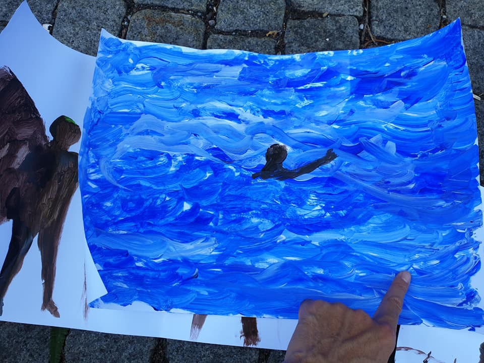

### AYS News Digest 27\-28/7/19: Next ship of survivors in Italy denied disembarkation
#### Confusion about EU\-Turkey deal // Salvini refuses disembarkation of survivors from Italian coast guard ship // 430 unaccompanied minors and children in Moria // Severe conditions in Vučjak, Bosnia, continue to satisfaction of the EU?\!

With sit\-in and demonstrations, a network of afghan families is demonstrating against deportations to Afghanistan\. Children painted this shocking image\.
#### FEATURED

**Confusion about alleged suspension of EU\-Turkey deal** 
After several newspapers and Friday’s AYS digest reported about the Turkish foreign minister Çavuşoğlu’s statement indicating a withdrawal of Turkey from the EU\-Turkey deal of 2016, it is not yet clear what the statement actually meant\.

According to a Danish newspaper, a spokesman of the EU Foreign Service explained that it was in fact another agreement from 2013/2014 that was being addressed by the Turkish minister\. A spokesman of the Turkish foreign ministry apparently confirmed this information, and, according to a German newspaper, the German foreign ministry also stated that both sides adhere to the 2016 deal\.

At the same time it is obvious that anti\-refugee sentiments grow in Turkey\. In Istanbul, according to Human Rights Watch and media sources, Syrians have been detained, coerced to sign documents stating their voluntary return and deported to northern Syria\.
#### GREECE

According to the Aegean Boat Report, 10 boats in total reached the Greek islands over the weekend, with 198 people arriving on Saturday and another 101 on Sunday\. At least three of the boats were picked up by Frontex\.

Meanwhile, the situation on the islands is once again growing worse due to overcrowding and the hot weather conditions\. In Moria, according to Stichting Bootvluchteling, there are currently around **6,250 people,** including **430 unaccompanied minors and children** \. The camp has an official capacity of 3,100 people\.

An activist on the ground reported of a situation outside Eleonas Camp in Athens, where apparently a family with three young kids and a pregnant mother were refused entrance\. They were left alone without any medical support or food and told to contact NGOs instead\. A video shows the family in an exhausted condition, with flies surrounding the kids\.
#### Volunteering

[Attika Human Support](https://www.facebook.com/AttikaHumanSupport/?ref=gs&__tn__=%2CdkC-R-R&eid=ARC1oEa1vVHgqUp7FILnwr4V8iP27eQXi5SbNt0jxIsljjFIU_8nM5HEauGqaYgv_0oys880GcpoSOVl&hc_ref=ARSrZ-aMlnKxaHMTpPiP3kv0PEqMSfvL4hu8v_SdZazzrWj2P1CGSwRYF0Dc7ylBRyI&fref=gs&dti=459777764229676&hc_location=group) are looking for new volunteers, contact them directly if interested\. If you can’t come, but would like to help:

> Maybe you can make a shipment of the most\-needed items you can check in our need\-list pinned at Facebook\. 

#### BOSNIA AND HERZEGOVINA

In Bosnia, for almost two months now about 800 people are living in severe conditions on a former garbage dump in Vučjak\. Volunteers recently installed a small ambulance\. Still, in spite of those sporadic efforts by individuals, there is a lack of food, water, and medical supply\.

> Sanitary conditions are completely insufficient, scabies and inflammations of wounds and insect bites are prevalent\. 

The situation is worsened by violence of both Croatian and Bosnian police\. Dirk Planert, a journalist who is trying to support as good as he can on his own expenses is deeply in need of donations to buy food items, medical supply and shoes\. Contact him directly on [Facebook](https://www.facebook.com/dirk.planert?__tn__=%2CdlC-R-R&eid=ARBJmoBmKV8sQdlyll08a2FajIesJRvDwxD2Z8ddTe1TwZ7Luoui2C8mcqdl0P-s36Iom_4chLjHU0jg&hc_ref=ARSAYtzba0Plxuat7A7z7vTBRLyhTaH47BvTphmbo88MeXq7jGNdTvpI5Z3CxZpImdE) if you can help\.

#### Call for Help

There is a number of teams, individuals and small grassroots organisations from Bosnia active in providing _all_ sorts of help to the people on the move in Bosnia and Herzegovina\. These people have been doing this for far too long, in spite of the ignorance and lack of responsibility for making political decisions from the local, cantonal and federal politicians, but also with the awareness of the international organisations who aren’t covering some of the most prominent ‘points’ on the so called Route within the country\. 
If you are in a position to help these people help others, please contact us \(or them directly, if you know them\) and we will put you in touch with those in need of the kind of help/aid you can provide\. We encourage financial donations so that the needed items could be bought by those who know what’s needed in the local shops\. Medical help and donations are needed in several places, so if that’s something you can help with, many will benefit\. Until something moves and things change, this is the only thing that can be done — along with putting some hard pressure to our MEPs across Europe\!
#### SEA

■■■■■■■■■■■■■■ 
> **[Sara Creta](https://twitter.com/saracreta) @ Twitter Says:** 

> > About the last days in the med (24-26 July)

- 115 dead/missing (62 bodies recovered so far)

- 315 people disembarked in #Khoms (82+53+180) &amp; 176  in #Tripoli (89+87) #Libya 

- 143 rescued at sea (67+76) &amp; taken to #Malta

- 140 brought to #Italy but not allowed to disembark 

> **Tweeted at [2019-07-28 01:01:15](https://twitter.com/saracreta/status/1155282032869683202).** 

■■■■■■■■■■■■■■ 

Sara Creta further reports that the people who disembarked in Khoms, Libya were left without protection from the UNHCR\. One group of people was apparently left next to dead bodies for many hours\. The Special Envoy of the UNHCR for the Central Mediterranean situation instead reports that according to IOM 84 of those people were transferred back to Tajoura camp, where their lives are at risk\. It is not even a month ago that 60 people died in Tajoura camp after an air raid\.

■■■■■■■■■■■■■■ 
> **[Sea-Watch International](https://twitter.com/seawatch_intl) @ Twitter Says:** 

> > The civilian search aircrafts #Moonbird and @[PVolontaires](https://twitter.com/PVolontaires) Colibri flew missions again this week, covering 1110 NM yesterday alone to find boats in distress. They document human rights violations and try to ensure that military and merchant ships fulfill their rescue obligations. 

> **Tweeted at [2019-07-27 17:57:58](https://twitter.com/seawatch_intl/status/1155175509942296582).** 

■■■■■■■■■■■■■■ 

#### ITALY

Meanwhile, Salvini still does not allow more than 130 survivors of the devastating shipwreck rescued by an Italian coast guard ship to disembark\. The ship landed in Sicily, but Salvini says people will only disembark after the EU decides which countries will take them in\.

■■■■■■■■■■■■■■ 
> **[SOS MEDITERRANEE](https://twitter.com/SOSMedIntl) @ Twitter Says:** 

> > Maritime Law must prevail over any other consideration. The 131 people rescued by the @[guardiacostiera](https://twitter.com/guardiacostiera) vessel #Gregoretti must be allowed to disembark as soon as possible and not after another unnecessary standoff. 

> **Tweeted at [2019-07-28 15:06:52](https://twitter.com/sosmedintl/status/1155494841800937473).** 

■■■■■■■■■■■■■■ 

#### FRANCE

Mobile Refugee Support is once again reporting about growing numbers of people in Dunkirk and fears of an imminent eviction of the camp currently holding over 500 people\. People are additionally suffering from hot temperatures followed by heavy rain\. MRS is in search of donations and volunteers\. Same goes for FAST, a first aid support team that is also operating in Dunkirk and Calais and is in urgent need of medical volunteers\.

](assets/f79d3fb23b53/1*C8wX7isw7281bfrDQEp3bQ.jpeg)

Photo: [Mobile Refugee Support](https://www.facebook.com/MobileRefugeeSupport/?tn-str=k%2AF&hc_location=group_dialog)

800 people, mainly families and unaccompanied children are planned to be evacuated from the main temporary shelter in August\. It is likely that these people will end up in the camps and we need your help to provide them with much needed first aid, FAST team reports\.

> We particularly need healthcare professionals with either paediatric or ‘women’s health’ experience \(doctors, nurses, physiotherapists, dentists, paramedics and students all welcome\) \. If you have even a couple of days to give, we would be very grateful\. 

To find out more about how to get involved, and how to donate please see their website [https://www\.f\-a\-s\-t\.eu/](https://www.f-a-s-t.eu/?fbclid=IwAR1fT-hoGgEiAiz1edMqSsPCec5iXSpuaPQGI_OwruQ8ddVeAhQl12OsBkA) \.

](assets/f79d3fb23b53/1*XVz6m900heVzxGUcrKdc-g.jpeg)

Photo: [First Aid Support Team — FAST](https://www.facebook.com/FASTFirstAidSupportTeam/?tn-str=k%2AF&hc_location=group_dialog)
#### SWEDEN

Since mid July, Afghan families in Sweden have been protesting against imminent deportation to Afghanistan\. They now formed a network called Liv utan gränser \(Life without Borders\) demanding the fulfilment of women and children’s rights and an immediate end of deportations of families to Afghanistan\. On Tuesday, 30th July, a demonstration will take place in Norra Bantorget, starting at 4\.30 p\.m\.
#### AYS and the Daily News Digest — how to get involved?

**We strive to echo correct news from the ground through collaboration and fairness\. Every effort has been made to credit organisations and individuals with regard to the supply of information, video, and photo material \(in cases where the source wanted to be accredited\) \. Please notify us regarding corrections\.**

**Apart from daily news in English, we also publish weekly summaries in Arabic and Persian\. Find specials in both languages on our [medium site](https://medium.com/are-you-syrious/ays-weekly-in-arabic-and-persian/home?source=post_page---------------------------) \.**

**If there’s anything you want to share or comment, contact us through Facebook, Twitter or write to: areyousyrious@gmail\.com\.**

_Converted [Medium Post](https://medium.com/are-you-syrious/ays-news-digest-27-28-7-19-next-ship-of-survivors-in-italy-denied-disembarkation-f79d3fb23b53) by [ZMediumToMarkdown](https://github.com/ZhgChgLi/ZMediumToMarkdown)._
