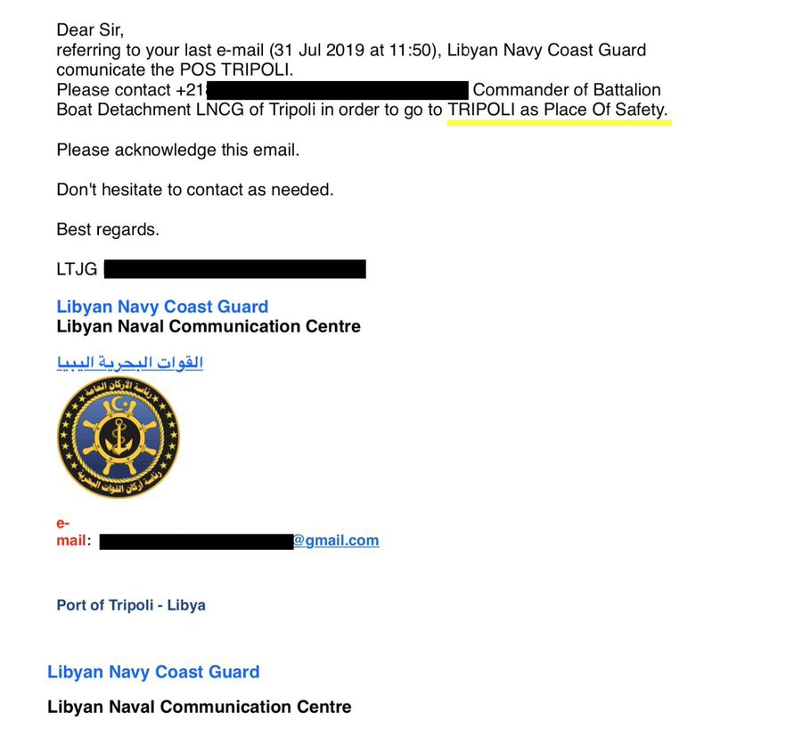

### AYS Daily Digest 31/7/19: Conditional disembarking
#### One hundred thirty one people on the Gregoretti allowed to disembark / More than 100,000 civilians displaced as a result of airstrikes and clashes in Libya / In BH, funds earmarked for Vučjak to be redirected for police infrastructure / In Denmark, shift in focus from integration to future repatriation / New trends in asylum policies in the EU

 , via ArtAgainst](assets/753038ed2c62/1*RyXqR-HvdEcFqFW7ogaN3w.jpeg)

Athens, Greece 31 July 2019
After the protest march against the court’s decision to release the policeman who murdered the 15 year old Alexis Grigoropoulos\.
Photograph by [Nikos Christofakis Photography](https://www.facebook.com/Christofakisphotography/?__xts__%5B0%5D=68.ARDwTD9Xowsiw5nMP1xIHO_LyIJW7OUpc1if6vxvclz_obEaL8yp3m2X78y8AIc1O-iUBNWL1Qd13kqIshBRkBGRawjEZUYlHHgJ6ioKX3SV_xeuA8xWuww9TtDM_mzlyBGSOjaXwUxThUSjjquhx0W0AfFSaDi6jz7JzHU0hDR8rXuvgGaQH5u4avxHpJYy5IWD9J2NFjoJScHjtjmvHaAnYuWPqy9FFcHQchrtuTWf7PXOsT3s1ugoEbiMy92PtTbz0und6VQ62Fbns3axLroDoltyClcO6mCXY38nODLv3ZM2TID9j8PXGcE9pyw_rE6X1wmFiVBrVKkDezHEmxx0nQ&__tn__=%2CdK%2AF-R&eid=ARAA8wqfp6EjEy0Ge3zgLXURLzXmDPqYhuYvR785qrAEJ5Go0u9VcSPeYZfAOtNlIROre4SulIYhuggL) , via ArtAgainst
#### FEATURED

One hundred thirty one people, rescued, who have been on the Italian Coast Guard’s vessel the Gregoretti have finally been given permission to disembark “within hours” to Italian soil\. France, Germany, Ireland, Luxembourg and Portugal will join the Italian Roman Catholic Church in taking care of the people rescued in the Mediterranean, who have, until now, been on board the Italian Coast Guard’s Gregoretti\. They have been forced to remain docked on the boat in Sicily for five days\.

■■■■■■■■■■■■■■ 
> **[Alarm Phone](https://twitter.com/alarm_phone) @ Twitter Says:** 

> > After 5 days of being kept hostage onboard the #Italian coastguard vessel #Gregoretti, the remaining 131 people are allowed to disembark in #Sicily. These cynical political games that unnecessarily prologue the suffering of the survivors have to end! 
[dw.com/en/migrants-on…](https://www.dw.com/en/migrants-on-italian-coastguard-vessel-gregoretti-to-disembark-following-eu-deal/a-49828369) 

> **Tweeted at [2019-07-31 16:42:29](https://twitter.com/alarm_phone/status/1156606066525970432).** 

■■■■■■■■■■■■■■ 

Fourteen EU member states had approved a permanent plan to redistribute refugees rescued in the Mediterranean, said President Macron, although a long\-term solution for the distribution of people saved from distress is not in sight, in spite of the obvious recurring scenarios\.

> Libya is not safe\! 

Euro\-Med have [documented](https://euromedmonitor.org/en/article/3038?fbclid=IwAR2tuGniHNC_bKgM-SCC-LO5n8GTNMK6F7-4985wi92FXposXlCiScmjczs) the deaths of more than 1,000 people, the wounding of 5,500, and the displacement of more than 100,000 civilians as a result of airstrikes and clashes in the country\.

> The deliberate targeting of the field hospital and the killing of doctors reflects the warring factions’ total disregard for the rules of international humanitarian law and highlights the absence of any accountability 

Targeting medical personnel is a flagrant violation of the rules of international law, according to Article 21 of the Fourth Geneva Convention of 1949, which criminalizes attacks on medical institutions and staff\.

#### SEARCH AND RESCUE

Forty people in a boat, including a baby and two children, were rescued by the teams of Proemaid\.

■■■■■■■■■■■■■■ 
> **[sea-eye](https://twitter.com/seaeyeorg) @ Twitter Says:** 

> > "Bevor sie nach Libyen zurückgebracht werden, würden sie lieber auf dem Meer ertrinken."

Einsatzleiterin Barbara Held fasst den Mittwoch zusammen, an dem wir 40 Menschen vor dem Ertrinken retten konnten.

#SeemeilenSpenden auf [sea-eye.org/spenden](http://sea-eye.org/spenden) https://t.co/gsox08gTfr 

> **Tweeted at [2019-08-01 06:01:19](https://twitter.com/seaeyeorg/status/1156807099692867584).** 

■■■■■■■■■■■■■■ 

Seven boats with 239 people on board have safely landed on the Greek Aegean islands in a single day\.

#### EU
### Asylum trends

There have been 287,500 asylum applications submitted since the beginning of the year, up by 14 % from the same period in 2018, according to EASO statistics\. Furthermore, more persons were seeking asylum at the beginning of 2019 compared to the end of 2018, despite the fact that applications usually peak during the summer and autumn months\. Overall, asylum trends in 2019 are a continuation of a surge in the number of asylum applications submitted in the EU in the autumn of 2018, particularly by certain citizenship groups\.

Three % of all applications in May were submitted by self\-claimed unaccompanied minors\. Such a high number of UAM applicants from Afghanistan has not been seen for the past two and a half years, EASO reports\.

Unlike the general notions among Europeans, the most common countries of origin of applicants in May were Syria, Afghanistan and Venezuela\.

On their interactive map you can see that the overwhelming majority of decisions are negative and have remained so\.
#### GREECE
### Strong protests and clashes with police in Exarcheia tonight

A demonstration was held in the downtown Athens district of Exarchia on Wednesday at the memorial of teenager Alexis Grigoropoulos, who was shot and killed in 2008 by a police special guard who was released from prison on Tuesday, Ekathimerini [reports](http://www.ekathimerini.com/243187/gallery/ekathimerini/in-images/protest-held-over-korkoneas-release?fbclid=IwAR1EjfItsIbn0Tz0I6d6bL6S1vm8B9LFruemP7YRigBpBEry68Jv7Aj-VWw) \.

■■■■■■■■■■■■■■ 
> **[Çağdaş Kaplan](https://twitter.com/KaplanCagdas1) @ Twitter Says:** 

> > A fire broke out at a hotel in Athens where refugees stayed under the supervision of the IOM. According to the statements of the refugees, the fire started when an external substance was thrown into the hotel's warehouse.Police argue that the incident was not a racist attack https://t.co/85csmKiOk7 

> **Tweeted at [2019-07-30 12:38:52](https://twitter.com/kaplancagdas1/status/1156182372041273345).** 

■■■■■■■■■■■■■■ 

More signs of a general increase in the police presence in central Athens are reported\. Four teams of five police officers have [reportedly](https://www.keeptalkinggreece.com/2019/07/31/black-panthers-greece-police-patrol-athens) already been set up, each with heavy weapons, bulletproof vests, night vision binoculars, flash and sound grenades\.

_The officers will “constantly be out of the police vehicles, with the aim of serving as a deterrent and instilling a sense of security in those who see them\.”_
#### BOSNIA AND HERZEGOVINA
### Four million convertible marks to be used for building a police station?\!

The four million convertible marks earmarked for refugees in Vučjak by the federal government were supposed to be fully directed to local Red Cross aid active in the field, but reportedly the county has decided part of the funds might be redirected to building a police station in Bužim\. The Red Cross at the same time asked for donations of food from the Bosnian citizens\. The Una Sana county has been demanding more engagement from the federal government, who now say they intend to make their spending plan\. The mayor of Bihać said to the Bosnian media that he would hope the funds would be transferred to those bearing the biggest burden in the situation, the citizens and cities of Velika Kladuša and Bihać\.
#### FRANCE
### Calais

In Calais, everyone seems accustomed to repeated evictions\.

“Why do they start with the tents? They could have started with garbage cans\!”, some of the local activists complain\. “When the police come, we leave for an hour or two\. The police destroy everything and we come back,” they say\.

■■■■■■■■■■■■■■ 
> **[Thom Davies](https://twitter.com/ThomDavies) @ Twitter Says:** 

> > An old shoe part-buried on the site of the #Calais “Jungle” which was destroyed in October 2016.

What will future archaeologists say about the times we are living in?
#RefugeesWelcome https://t.co/CiXGQv5VDr 

> **Tweeted at [2019-07-31 12:22:39](https://twitter.com/thomdavies/status/1156540675929849857).** 

■■■■■■■■■■■■■■ 

However, unlike before, the associations no longer gather some of the two to four tons of tents that the police throw away, as that might give the impression that they work with the police, and would deprive them of the people’s trust\.
### Nantes

[L’Autre Cantine Nantes](https://www.facebook.com/lautrecantinenantes/?tn-str=k%2AF&hc_location=group_dialog) needs donations for preparing meals:

Oil — Potatoes — Onions — Garlic — Tomato sauce and tomato paste — Peanut paste — Spices: salt, pepper, paprika, pepper, ras el hanout, turmeric, cumin

Along with these, they also need more equipment for hosting people and helping them feel safe\.

\-> if you can provide any of those things, please contact them and donate directly\!
#### GERMANY

Forty\-five Afghan refugees were deported from Leipzig / Hall airport to Afghanistan on Saturday, 30 July\.

Germany has welcomed almost 9,000 relatives of refugees to the country since August 2018 as part of a family reunification programme, reports say\. However, the number of permits to be issued to family members since the law change last year [has been limited](https://www.thenational.ae/world/europe/just-9-000-refugees-granted-reunification-with-families-in-germany-1.892776?fbclid=IwAR1EjfItsIbn0Tz0I6d6bL6S1vm8B9LFruemP7YRigBpBEry68Jv7Aj-VWw) at 1,000 and the UN has called the process too complex and too slow\.

> The World Bank puts the number of refugees currently in Germany at just over one million\. 

There are a lot of online language courses, websites and apps that can help refugees learn German\.

[](https://l.facebook.com/l.php?u=https%3A%2F%2Ffluechtlingshelfer.info%2Ffuer-engagierte%2Fdetail-info-ea%2Fueberblick-online-hilfen-zum-deutschlernen-1%2F%3Ffbclid%3DIwAR1RyyDyJVZwrXJ0efQWom5JugJMExBuf50_M-yVduEmxAyai2GfahPlK3g&h=AT1OxyZ_6-aeFs6jL7-woo1EoI_cc4-ELnBL1YIqICNLkQcTcIyuZan83VF72BezKbdFnrJwbm6QTFOoJgy1oTMuW7otlCtGTvFppWu-nBFoYzGNtH4nqlDl4MMCSpx4ucngIP0j0LTAvULFjVnNAGiqGm4c02VhwNXoNDcPGQjpiqozJGQiD3gVWc4vd-fbqW35HnEd-WgsV_AKqBCDKUfYUvEU6rZjx0tQr0HZCEk5aTCv6-OvATLjexiizHqv93tm5-BpWrIq_EIMBbNpBUKmYEe1OXs0pWxwQ_9PpcqVnyz0v8DwK6dtvmjPl8Njp1dLHTND0MkS0GAG4twUYW-M2CQYXONEFb311FrGFDf_PINVU40kF1JKC_H-ljYP8Y2M_PtC7TcnZe5miVNqNk9iWCbBAuYZttQeLRnSRjulKwJ04vchT9AT3VVdaeup2CipPhuirwysxVumTZ9jHqEqOFP3lv5sk3WUD7HK9l4sQpOYxHO8RQnbVSyAOhnJA0UUSw7-i0z0r90-Qsic644Fy569YqqkxA7YLKkXBLY0Zzz8Qwhfs0-_xlNzYpVVUX_8fKpiTaQFjM9qk3hTzm6WatFcKcB1DVCfkEKWx_isF5EunCEgTCTNpiohVbTRvZj8SA)

#### DENMARK

The stance by the newly elected Danish government might still turn out to be problematic to implement under the new, so\-called “paradigm shift” with a change in focus from integration to future repatriation\.

Denmark will r [eportedly](https://www.thelocal.dk/20190730/well-take-quota-refugees-denmark-to-un?fbclid=IwAR1IC5eUo-RDXof6wIrt5Mcz6hw9E6thUB51nDldRKy_DopGhdfQgL6Qp50) take in refugees protected under the UNHCR quota system from this year\. The immigration ministry has also informed UNHCR that it will accept general quota refugees from 2020\.

“Frontiers, the streets for Europe” is a documentary that weaves together the stories of migrants and volunteers, stories they meet every day on the routes to Europe\.

> The Syria\-Lebanon border and the stall in the country of the cedars\.
 

> Lesbos, Samos, Leros, Salonicco, Idomeni and the “Balkan Route”\.
 

> The Central Mediterranean, those who run away from Libya and the NGOs that carry out relief despite the ongoing war against them\.
 

> Ceuta, Melilla and the route from Morocco to Spain\. 

**We strive to echo correct news from the ground through collaboration and fairness\. Every effort has been made to credit organisations and individuals with regard to the supply of information, video, and photo material \(in cases where the source wanted to be accredited\) \. Please notify us regarding corrections\.**

**Apart from daily news in English, we also publish weekly summaries in Arabic and Persian\. Find specials in both languages on our [medium site](https://medium.com/are-you-syrious/ays-weekly-in-arabic-and-persian/home?source=post_page---------------------------) \.**

**If there’s anything you want to share or comment, contact us through Facebook, Twitter or write to: areyousyrious@gmail\.com\.**

_Converted [Medium Post](https://medium.com/are-you-syrious/ays-daily-digest-31-7-19-conditional-disembarking-753038ed2c62) by [ZMediumToMarkdown](https://github.com/ZhgChgLi/ZMediumToMarkdown)._
