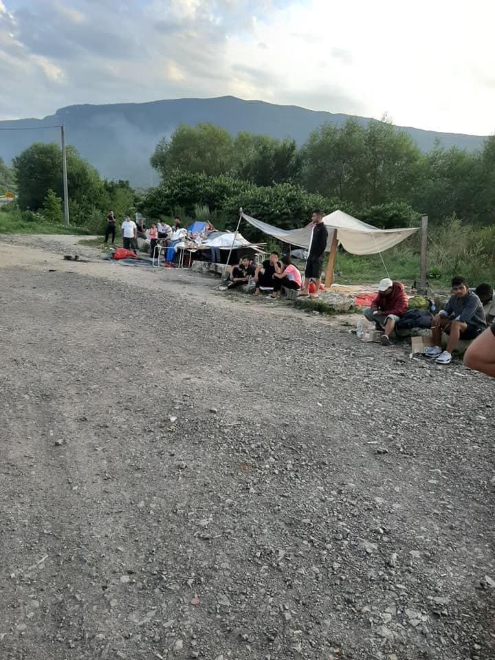
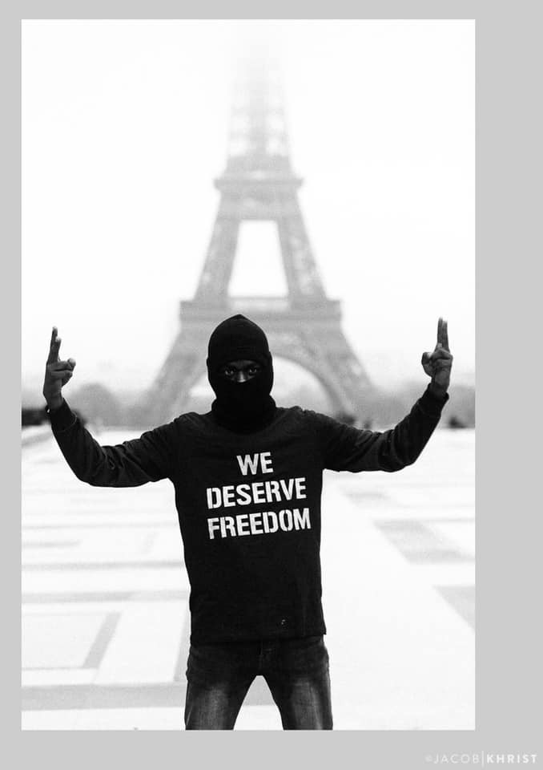

### AYS Daily Digest 2/8/2019\-Iceland, 2 more families in risk of deportation

Sea:163 people waiting for a safe port /// France:deportations to Sudan /// More bodies wash up on Libyan shores /// BiH:Updates from Vucjak, Tuzla and Kljuc /// Hungary: people starved in transit zones

](assets/61cd6094cab9/1*rH-LVUmt3vh3on8gvw9ogg.jpeg)

Two years ago, on the 2nd of August 2017, the Iuventa vessel, of the organisation Jugend Rettet was seized by Italian authorities\. [\#FREEIUVENTA](https://twitter.com/jugendrettet/status/1157233928887054337?fbclid=IwAR2yRdTkDHDTNt33Q32r-lSsxlU44O-4IcJ5ICTUhZ6OcZAJqXKyeNML0SA)
#### FEATURE STORY: Iceland, two more families in risk of deportation to Greece

AYS reported in the last months about the protests against deportations in Iceland\.

Now two families are risking deportation to Greece\. Both families have been granted protection in Greece and arrived autonomously in Iceland in the last 12 months\. The government intend to deport the families, despite the Red Cross has deemed living conditions in Greece unfit for refugees\. The Icelandic Review have [published a long\-read](https://www.icelandreview.com/society/in-focus-asylum-seeker-deportations/) on the case:

> Icelandic authorities have twice denied reviewing the families’ cases\. \[…\] However, a new legal amendment implemented recently by Minister of Justice Þórdís Kolbrún Reykfjörð gives both families some hope\. The amendment requires the Directorate of Immigration to process asylum applications of children, even if they have already gained international protection status in another country, when 10 months have passed from the date the application was received by Icelandic authorities\. 

This new amendment is a resposne to the widespread criticism for Icelandic handling of deportation cases\. One of the children have received widespread support from her fellow students, who collected 6,000 signatures in her favour and organised a march in her support\.

> Authorities’ handling of the cases has been met with severe backlash from people from all walks of life\. Surveys have repeatedly shown that the majority of Icelanders are in favour of receiving more refugees to the country\. There is mounting pressure on authorities and government to stop the deportations, and to abide by international laws\. UNICEF in Iceland released a statement reminding authorities that the deportations are in violation of the UN Convention on the Rights of the Child, which Iceland is party to\. Along with this, Red Cross officials have called on the government to rescind the decision to deport the families, as well as the Office of the Ombudsman for Children asking to discuss the matter with authorities\. 

The authorities have commented in favour of the revision of the cases of the two families, but at the same time have — in the last months — drafted a bill which would “weaken the position of asylum seekers such as the Safari and Sarwari families”, making it very hard to prevent their deportation\.

Read more [HERE](https://www.icelandreview.com/society/in-focus-asylum-seeker-deportations) \.

LIBYA
#### More messages from Zintan detention centre

Sally Hayden published more messages she received from inside Zintan detention centre:

■■■■■■■■■■■■■■ 
> **[Sally Hayden](https://twitter.com/sallyhayd) @ Twitter Says:** 

> > More messages from Zintan dc yesterday. After the last inter-agency trip, there the UN called for the centre to be closed, but nothing much seems to have been done since. One aid official told me the number of deaths due to neglect is a "major scandal." https://t.co/lBsco3woA0 

> **Tweeted at [2019-08-01 07:27:22](https://twitter.com/sallyhayd/status/1156828753999343617).** 

■■■■■■■■■■■■■■ 

TURKEY

In the last couple of weeks, news about mass deportation of Syrian refugees from Turkish cities, especially Istanbul, to Northern Syria have increased exponentially\. Authorities have allegedly targeted both documented and undocumented people and have forced them to sign ‘voluntary leave’ papers prior to their deportation\. [HERE](https://www.facebook.com/Syria.violations.monitoring/photos/a.1761072347242971/3141797249170467/?type=3&permPage=1) is the last case we heard of\.

As reported by [Infomigrants](https://www.infomigrants.net/en/post/18545/istanbul-expels-more-than-15-000-undocumented-migrants?fbclid=IwAR1s3E8uBHEdArpiUE1uBd4H_jlTYjTjYW8g0ge8UxnRQ0VQjdT6gL-GUxw) , Turkish officials reject these claims, but [boasted](https://www.infomigrants.net/en/post/18545/istanbul-expels-more-than-15-000-undocumented-migrants?fbclid=IwAR0SH_q2eSaGXo9qKI_3ExyENWMQe4aXiEjJe7aiR7xm4RVMIxn132bT0tQ) recently that they had “expelled 15,000 undocumented migrants from Istanbul in the past 20 days, among them 2,630 Syrian nationals”, who are said to be teken to detention centres outside the city\.

SEA — Central Med
#### 163 people await for Europe to decide of their lives

In the last few days both the Sea Eye’s Alan Kurdi and Open Arms rescue vessel have responded to a number of distress calls, rescuing 163 people\.

Infomigrants [report](https://www.infomigrants.net/en/post/18558/two-ngo-boats-with-over-160-rescued-migrants-stuck-in-mediterranean-looking-for-safe-harbor?fbclid=IwAR0hH5QIk7HOL_mxSeQ5cfTrkutI6ic6VhIFSy0EmSHrTquKsDn332Gswmo) that one of the two pregnant women on the Open Arms ship has gone into labour\.

Like a clock, Italian authorities have started their usual ‘game’\. As we reported yesterday, the Alan Kurdi has been requested to head to Malta, despite being only a few miles off Lampedusa\. Open Arms [report](https://twitter.com/openarms_it/status/1157306703504969728?fbclid=IwAR27WikWqAkgshumt17sUedq8EzfZVzOP7-CwCbPILQgmLfIkU3iuIWEz9E) that they received a communication from the Italian government threatening them with a 50,000€ fine if they enter territorial waters\. This goes with the 900,000 threatened by the Spanish government if the vessel head back to Spain\.

At the time of writing, the Alan Kurdi was heading to Malta, while the Open Arms was on her way towards Lampedusa, as reported by [Radio Popolare](https://www.radiopopolare.it/indice-dei-podcast/) \.

In the meanwhile no further information are available about 35 people on a boat off the Libyan coast who launched a [distress call to Alarmphone](https://www.facebook.com/watchthemed.alarmphone/photos/a.1526182797655958/2421721974768698/?type=3&theater) yesterday and corpses keep washing up on the Libyan shore, after the shipwreck of last week\.

■■■■■■■■■■■■■■ 
> **[AJ+](https://twitter.com/ajplus) @ Twitter Says:** 

> > The bodies of 20 more people killed in a migrant shipwreck washed up in Libya. They are among over 100 people feared dead after the wooden ship capsized.

The UN says it is the worst Mediterranean tragedy this year. https://t.co/NzxymoN0ip 

> **Tweeted at [2019-08-02 16:18:28](https://twitter.com/ajplus/status/1157324798617366531).** 

■■■■■■■■■■■■■■ 

On good news the Mare Ionio boat of Mediterranea — Saving Humans has been released:

■■■■■■■■■■■■■■ 
> **[Mediterranea Saving Humans](https://twitter.com/RescueMed) @ Twitter Says:** 

> > The Public prosecutor's Office in #Agrigento just ruled to end the confiscation of #MareJonio ship. We are already preparing our next mission back at sea. #Mediterranea #SavingHumans https://t.co/4iYhM70roU 

> **Tweeted at [2019-08-02 12:17:04](https://twitter.com/rescuemed/status/1157264045986254849).** 

■■■■■■■■■■■■■■ 

SEA — Western Med

Local media [report](https://twitter.com/EPAndalucia/status/1157320542493581313?fbclid=IwAR0iSC_bJODi70QFZnuQ_J0KoovOH0k3ZeKVMzSMoXdznMF9aPfCz5-mevA) of a boat rescued by Salvamento Maritimo near the Alboran Island\. It carried 46 people\.

ITALY
#### Donations for Ventimiglia’s Foodbank needed

Kesha Niya, [report](https://www.facebook.com/KeshaNiyaProject/posts/963667683978099) about the changes in Ventimiglia

> The situation in Ventimiglia is constantly changing\. Many people are still arriving to Italy by boat or by foot, it’s then also the same in Ventimiglia\. The numbers of people we provide with food is slowly rising and we see many new faces everyday\. \* \* 

> Since a long time some members of the [Roya Citoyenne](https://www.facebook.com/royacitoyenne/) are taking care of the Foodbank, which supplies everyone with free food who is supporting migrants here in the valley\. The Foodbank runs on donations of big and small tin cans of all sorts, tea, coffee, cookies, sugar, water, oil, bread, jam, or whatever other products you can think of … But in the last couple of months there were almost no donations coming in and so the Foodbank is struggling to keep it going\. 
 

> But not only this, the Roya Citoyenne are one of our main supporters\. Not only through the Foodbank, also with money donations, which are also getting way less\. 

If you can, check [HERE](https://www.facebook.com/KeshaNiyaProject/posts/963667683978099) how to support\.

GREECE
#### Arrivals

Aegean Boat Report [inform](https://www.facebook.com/AegeanBoatReport/posts/622997744890000) that 2 boats landed on the Greek Islands today\. One in Lesvos \(with 50 people\) and one in Chios \(24 people\) \.
#### Situation on the islands

](assets/61cd6094cab9/1*BXyJnNhF7ztOWEIgIceLsw.png)

[National Situation picture regarding the islands at Eastern Aegean Sea \(1/8/19\)](https://infocrisis.gov.gr/5136/national-situational-picture-regarding-the-islands-at-eastern-aegean-sea-1-8-2019/?lang=en)

According to government data 19,810 people are on the Greek eastern islands\. 16,131 are held in the 5 hotspots, despite a capacity of 6,338\.

Lawyers to offer Pro bono legal advice in Lesvos

Five firms from the US have partnered with European Lawyers in Lesvos \(ELIL\) and Refugee Legal Support \(RLS\) to send teams of lawyer since the beginning of August to Lesvos\.

Read more [HERE](https://www.law.com/legal-week/2019/08/02/five-firms-send-lawyers-to-give-pro-bono-advice-to-refugees-in-greece/?slreturn=20190702183621) \.

BOSNIA AND HERZEGOVINA

Cars of Hope — Wuppertal is [supporting](https://www.facebook.com/carsofhopewtal/photos/pcb.2158185511147012/2158182014480695/?type=3&theater) a team of local volunteer providing medical care in Vucjak, because there is no other medical service in the area\.

 \)](assets/61cd6094cab9/1*JBHIknEdvGCRiBa6BX1jng.jpeg)

Vucjak camp \(Photo by [Cars of hope — Wuppertal](https://www.facebook.com/carsofhopewtal/photos/pcb.2158185511147012/2158182014480695/?type=3&theater) \)

> Getting in the medical tent every day smth\. 70–120 people\. Most of the injuries are small wounds that will be affected under the hygiene conditions\. But there are also more serious incidents, like this morning a young man with 40\.6 degrees fever\. This camp needs doctors\! 

They are asking for donations\. If you can, support them [HERE](https://www.facebook.com/carsofhopewtal/posts/2158185511147012) \.

Also the local red cross [report](https://www.facebook.com/groups/144469886266984/permalink/388238258556811/?hc_location=ufi) about the increase in numbers in the camp\.

A local volunteer report about a big group of families and single adults \(around 25 children and 30 adults\) left to sleep outside in Kljuc, because there is no space in the camps and buses from and to Bihac are constantly searched here\.

](assets/61cd6094cab9/1*SafiX04hdPlN72pgx6cF8A.jpeg)

Photos by [Sanella Lepirica](https://www.facebook.com/sanela.lepirica/posts/2564673443583870)

Anti\-migrant behaviour of Tuzla authorities and Asylum officers has been increasingly more appalling\. We reported in last weeks about the ban from using toilets and electric plugs in the asylum office building\. Now, in front of the building, [lime has been sprinkled](https://www.facebook.com/photo.php?fbid=2564515010266380&set=a.742693779115188&type=3&theater) to stop people from sitting down while they wait \(up to days\) for their turn\.

FRANCE
#### Risk of deportation to Sudan

From [Calais migrant solidarity](https://calaismigrantsolidarity.wordpress.com/2019/08/02/risques-de-deportations-vers-le-soudan-risks-of-deportations-to-sudan/?fbclid=IwAR2bUaAmYGgvqlJNqKQ4j5qx4WiEO2-ZwrntpTxYoDtOFrASPdZeE7qxbHs) :

> In spite of the terrible situation in Sudan, where [more than a hundred people were killed](https://www.nytimes.com/2019/06/04/world/africa/sudan-war-facts-history.html) during a protest not more than 2 months ago, where acts of violences are commited on a daily basis, like those 5 students [killed while protesting in Al\-Obeid](https://www.aljazeera.com/news/2019/07/sudan-school-children-shot-dead-el-obeid-massacre-190729184528614.html) , or the [4 persons shot in Omdurman](https://www.aljazeera.com/news/2019/08/protesters-killed-live-ammunition-sudan-omdurman-190801190332665.html) , **France continues to deport to Sudan\!** 

Photo by Collectif Asuad

> At the moment, 2 men from Sudan are held in Coquelles detention center, and risk deportation to Sudan\. Alaib and Hassan are afraid for their lives in their country\. They want support and want their situation to be known\. 

> Rami, an other sudanese man, held in Rennes detention center, had already had to refuse a flight to Sudan, after only 18 days of detention\! His friends lauched [a petition](https://www.change.org/p/la-pr%C3%A9fecture-d-indre-et-loire-non-aux-expulsions-vers-le-soudan?utm_content=bandit-starter_cl_share_content_fr-fr%3Av5&recruited_by_id=54ef1f20-b045-11e9-91c3-0dbb3ef3ebdb&recruiter=987172953&utm_source=share_petition&utm_medium=copylink&utm_campaign=share_petition&fbclid=IwAR0qCgG4Ekj1LIYFRYSikmhEztlFeJc4e-ZvnnQucvTxUa3NinEtNux-nYU) online to support him\. 

HUNGARY
#### 17 cases of people left without food in Hungarian Transit Zones

■■■■■■■■■■■■■■ 
> **[Lydia Gall](https://twitter.com/LydsG) @ Twitter Says:** 

> > Despite @[EU_Commission](https://twitter.com/EU_Commission) legal action against #Hungary for starving asylum seekers, the practices continues. @[hhc_helsinki](https://twitter.com/hhc_helsinki) had to go ECtHR again for an emergency order to force authorities to resume feeding people. 17th case so far. Outrageous. 

> **Tweeted at [2019-08-02 09:21:47](https://twitter.com/lydsg/status/1157219934528839681).** 

■■■■■■■■■■■■■■ 

UK
#### Lift the Ban campaign is growing

Sisters United, organisation based in Halifax, has recently [joined](http://www.migrantsorganise.org/?p=28729&fbclid=IwAR3iSjGb3cORMjBLAo-12TGANXGX6Ram0288dldwUGffn2JnwE4YQ-YlsJg) the Lift the Ban campaign\. The campaign demands the lifting of the ban to work for asylum seekers in the UK\.

> Imagine that you’re not permitted to get a job\. Then imagine that you only have £5 a day to survive on\. 

### AYS and the Daily News Digest — how to get involved?

**We strive to echo correct news from the ground through collaboration and fairness\. Every effort has been made to credit organisations and individuals with regard to the supply of information, video, and photo material \(in cases where the source wanted to be accredited\) \. Please notify us regarding corrections\.**

**Apart from daily news in English, we also publish weekly summaries in Arabic and Persian\. Find specials in both languages on our [medium site](https://medium.com/are-you-syrious/ays-weekly-in-arabic-and-persian/home) \.**

**If there’s anything you want to share or comment, contact us through Facebook, Twitter or write to: areyousyrious@gmail\.com\.**

**We’re open to expanding our team of volunteer researchers, editors, and info gatherers\. Get in touch\!**

_Converted [Medium Post](https://medium.com/are-you-syrious/ays-daily-digest-2-8-2019-iceland-2-more-families-in-risk-of-deportation-61cd6094cab9) by [ZMediumToMarkdown](https://github.com/ZhgChgLi/ZMediumToMarkdown)._
