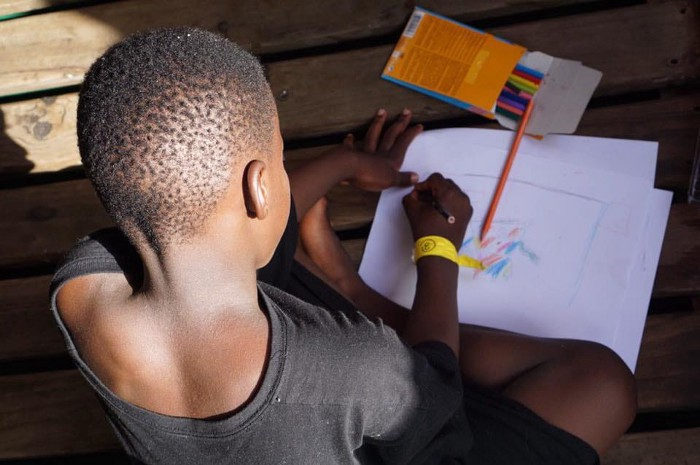
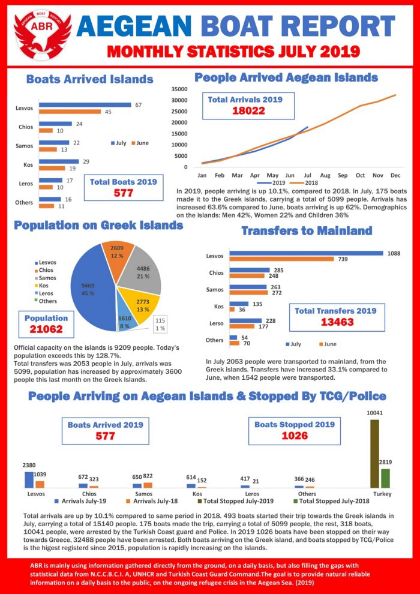
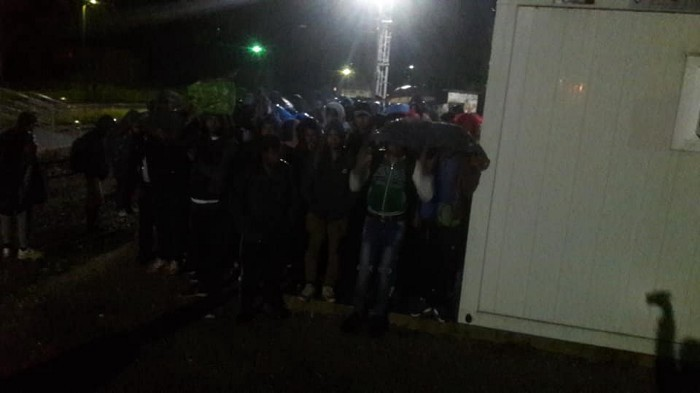
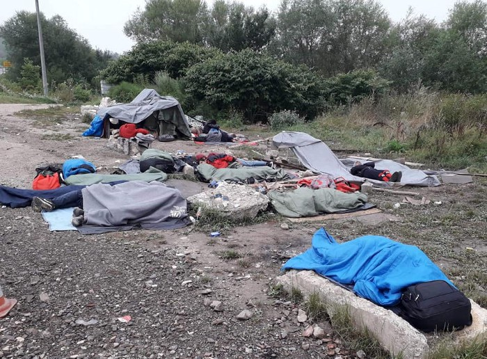
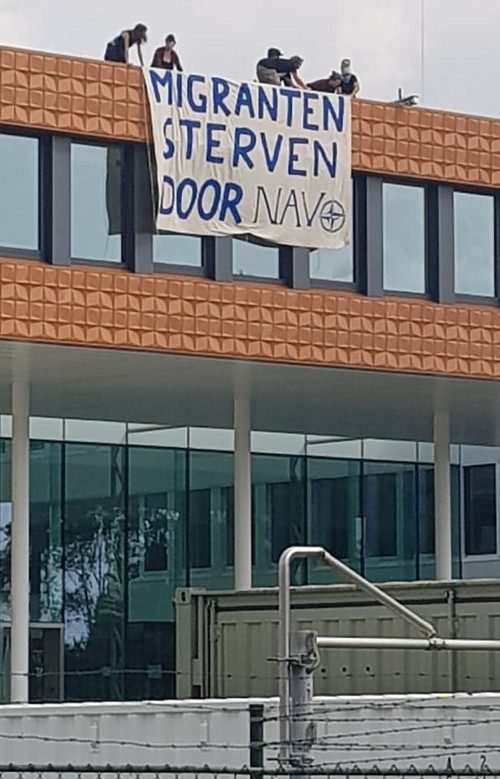
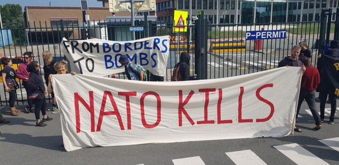

### AYS WEEKEND DIGEST 03–04\.08\.2018: Boat Arrivals and Interceptions to Greece highest since 2015

_Proactiva Open Arms allowed to port in Valencia Spain // Alan Kurdi allowed to dock in Malta // More people anxious and more movement throughout Greece // Police action removing people from trains from Sarajevo to Bihac, Bosnia resulting in escalating situation Kljuc // Major actions in Netherlands_

[Photo Credit, Proactiva Open Arms](https://web.facebook.com/2088704344683209/photos/a.2155566397997003/2470014036552236/?type=3&theater&ifg=1)

The new conservative government in Greece has made it clear in no vague terms that it plans to get “tough” on the rights of people who have arrived there\. Between scrapping legislation enabling refugees and asylum seekers to better access their social and work rights to increasing the strength of the police force, it is obvious the direction it is taking\.

The strengthening government in Turkey has also made migration and refugee hosting a central tenant of their political platform, arguing that its hosting of millions of refugees is jeopardising the wellbeing of its citizens\. There are not only increased push backs to Syria, but the EU\-Turkey agreement has been effectively suspended\. In spite of this, the minister of the interior argues that it is the EU that has not been complying with the agreement, repeating the “not a threat, but just a comment” that 30,000 refugees would pass to Europe per day [if the Izmir route were opened](https://balkaneu.com/soylu-if-we-opened-the-izmir-route-30000-refugees-would-escape-in-a-single-day/) \.

However as the Aegean Boat Report \(ABR\) has noted, the arrivals to the Greek Islands and the number of boats stopped by the Turkish Coast Guard were the highest recorded in July since 2015\.

Aegean Boat Report

ABR further notes that on Sunday five boats landed on the Greek islands — [with a total of 131 people\.](https://web.facebook.com/AegeanBoatReport/posts/624405724749202?hc_location=ufi) Additionally one boat was picked up by the [Greek Coast Guard](https://web.facebook.com/AegeanBoatReport/?__tn__=kC-R&eid=ARC2GLLwAtVS61PSw3v_4HqITDmY8F14FgpCAKskZN_V-v0dpo7A8qXiDMExfn29wN9jsYoWlPVo-DJz&hc_ref=ARS7N7oFFfXCVLHRzQDCDNYbJFd8KOYEQ1eJT6itWSZo6f3b3VRGhnG-bgdo_hxHvkI&fref=nf) carrying 38 people on Saturday\. \(In a side note: big thanks to Aegean Boat Report, and [please consider donating to their fundraiser](https://web.facebook.com/donate/493847507854590/?fundraiser_source=feed) to keep their important work going\. \)

Although a variety of factors influence people’s decisions to move, it can be noted from this that it appears that “tough on migration” reforms do not provide any disincentive to go\. Furthermore, the increased tension and anxiety only worsens the conditions for people there and sows fertile seeds for people to resort to more desperate means\.

In an [article in a Greek newspaper](https://www.documentonews.gr/article/karabani-me-21-prosfyges-entopise-h-frontex-sta-ellhnoalbanika-synora#.XUdGanvGFmo.facebook) , 21 people were apprehended at the Greek Albanian border by FRONTEX\. We’ve noted before that FRONTEX has been strengthening its presence in Albania\. There is very little information coming out of Albania, \(there has never been much\), however in the article there is information from Albanian authorities,

> _“Albanian Interior Minister Sander Leshi said that in 2018 the number of immigrants was six times higher than in 2017 and that this phenomenon, though less pronounced, continues to exist this year\. At the same time, the only organised refugee and migrant reception centre in Albania is in Tirana, with a capacity of 130 people\._ 

> _A total of fifty FRONTEX executives have been deployed at the Albanian border with Greece, by land and sea, with the aim of controlling and preventing the movement of migrant and refugee flows through Albania to the countries of the EU, as well as to combat cross\-border trafficking\._ 

> _In addition to live\-action, the mission also includes 16 patrol cars, thermal cameras and other tracking equipment\._ 

> _On the Greek territory, in the region of Epirus, there are 15 European FRONTEX border guards, who are under the command of ELAS and have joint ventures with Greek officers\.”_ 

To read more, in Greek, go [here](https://www.documentonews.gr/article/karabani-me-21-prosfyges-entopise-h-frontex-sta-ellhnoalbanika-synora#.XUdGanvGFmo.facebook) \.

In this vein Mobile Info Team for Refugees in Greece reports that they have received many questions about a new relocation scheme from Greece to other EU countries\. They published a report explaining that this is not true and is a misreading of recent news:

_“Mobile Info Team has received a lot of questions lately about whether there is a new Relocation program\. At the moment there is no new Relocation program\. There were only negotiations between several EU countries\. It is true that 14 EU countries, including France and Germany, have generally agreed that that there should be a “temporary solidarity mechanism” to relocate people rescued in the Mediterranean Sea\. But nothing has been signed yet and a lot of details still need to be negotiated\. Also, this agreement most likely will only cover migrants who have been rescued at sea\. Migrants or asylum seekers who are already in Greece will not be included\. If and how migrants rescued in front of the Greek coast will be covered by this new “solidarity mechanism” still needs to be seen\. Negotiations about the agreement will continue in September\. We will keep you updated when there is further news about it\.”_

The original post is [here](https://web.facebook.com/groups/478293189015540/permalink/1246239912220860/?hc_location=ufi) \.

It’s readily apparent that in spite of the wishes of those in power, this persecution will do little to “stabilise” the situation\. The situation in Greece and across the route will become harder and individual action, away from the influence and malevolent neglect of official bodies will come under pressure\. Support small scale initiatives that you trust wherever you can\. Hope Cafe is providing 200 meals per day in Victoria Square in Athens and delivering another 44 to surrounding areas\. Consider [donating](https://www.gofundme.com/f/homelessAthens?sharetype=teams&member=2197684&utm_medium=social&utm_source=facebook&utm_campaign=p_na+share-sheet&rcid=5409ee908e14432984bcc0826f55cc11) \.
### CENTRAL AND WESTERN MEDITERRANEAN

The Mayor of Valencia has officially stated that the port of **Valencia, Spain** will be opened to the [Spanish SAR ship Proactiva Open Arms](https://twitter.com/EFEnoticias/status/1157655080394473472) , which currently sails with 121 rescued people onboard\. Open Arms was previously stranded in international waters outside of Lampedusa, facing Salvini’s threats to keep the ports closed\. Several pregnant women who were in life\-threatening conditions were taken off the Open Arms ship by the Italian Coast Guard\.

Before being notified about a safe port, the situation continued to deteriorate on the Open Arms Ship,

Additionally, according to reports, it appears there were up to three ships in the Alboran Straight\. [One report came around 5AM CET,](https://twitter.com/HelenaMaleno/status/1157623217504346112) noting two ships, with a total of 127 people\. Another report came in hours later of another ship, carrying 55 people\.

There was follow up reporting of one ship being rescued, carrying 59 people\. It remains unclear if this boat is one of those reported above\.

After much deliberation, the ship Alan Kurdi was allowed to dock in **Malta** , carrying 40 people\. Shortly after receiving the notice of being allowed to port in Malta, Gorden Isler of the [Alan Kurdi sarcastically tweeted](https://twitter.com/gorden_isler) at Salvini: “The child in this photo is named after Novak Djokovic, a European tennis player, can we bring him back there? \[Italy\]”

The Maltese government is allowing the docking of the ship with the expectation that the individuals aboard will be immediately taken into a relocation scheme, [mostly going to Germany as it was Germany who called for the ship to be allowed to port](https://www.newsbook.com.mt/artikli/2019/08/03/watch-sea-eye-asks-muscat-to-find-a-merciful-solution-for-survivors/?lang=en) \. For more, go [here](https://www.globalist.it/world/2019/08/03/la-alan-kurdi-ferma-al-largo-di-malta-con-40-migranti-a-bordo-2044800.html) \.

Activists from all over including Melting Pot Europa met in **_Zarzis, Tunisia_** arguing for freedom of movement\. See a video [here](https://web.facebook.com/watch/?v=727386471035587) \. 
Part of their statement can be seen below:

_“We are in Zarzis, in the South of Tunisia, and we have just concluded the meetings promoted by “Europe Zarzis Afrique” \( [https://europezarzisafrique\.org/](https://europezarzisafrique.org/?fbclid=IwAR2vEqHQatpMhtNG11suMFl8oLrXYukTADah1l68KHieIIGYBJqV4TJqFy8) \) with a demonstration at the port for freedom of movement\._

_Right now, four of our Italian activists are at the border with Libya to verify a serious violation of human rights\. Tunisian human rights associations have denounced that a group of 36 Ivorian migrants \(21 men, 11 women, 1 pregnant and 4 very young children\) were deported from the city of Sousse on the border with Libya and abandoned there without any food and water\. Our informants told us they are located in a prohibited military area at high risk\.”_

An activist has posted a video of their current condition, warning — it is quite distressing\. Please view [here](https://web.facebook.com/antonio.manganella.94/videos/10156999839670091/?hc_location=ufi) \.

The activists denounce this brutal deportation and call upon governments to remedy this horrific situation\. For more, go [here](https://web.facebook.com/meltingpoteuropa/photos/a.700935699938160/2582830155082029/?type=3&theater) \.

Activists continue to document the horrific and demeaning media treatment of people on the move in **Italy** \.

Recently several men from Afghanistan were caught on tape bathing and washing in the harbor in Trieste\. They were roundly mocked by many members of the Italian media for washing their clothes and for mistakenly calling the harbor “a pool\.” Swimming, bathing and washing items is prohibited in the harbor\.

Salvini didn’t hesitate to take to twitter to express his derision\. However, as other media outlets point out, many tourists themselves also jump in without any sort of backlash\. For an excellent breakdown of the situation, [please go here](https://www.open.online/2019/08/02/trieste-scandalo-per-il-bagno-dei-migranti-ma-silenzio-su-tutti-gli-altri-che-lo-fanno/) , in Italian\.
### BALKAN ROUTE

Reportage from Bernt Koschuh highlights the ongoing practice of police removing people from trains travelling from Sarajevo to Bihac\. According to the report, people are taken off about an hour before reaching Bihac\. This is right around the border between Republika Srpska and the Bosnian Federation, which are separately administered\. People here face humiliating conditions and are not allowed to sleep under the shelter of the gas station \(technically a structure\) and must be in the rain\.

Photo Credit [Bernt Koshuh](https://web.facebook.com/photo.php?fbid=1085494428508075&set=pcb.1085502581840593&type=3&theater)

Also here are the signs of the dark economy that is being fed by the absurd border policy with vans offering 20–30 Euro per head to take people to Bihac\. Other locals also appear and offer secret paths through back roads to Croatia, on a much shorter, much less patrolled route\. For more information, go [here](https://web.facebook.com/permalink.php?story_fbid=1085502581840593&id=100011425859529&hc_location=ufi) \.

Watch a video of a forced disembarkation here:
### [Bernt Koschuh](https://web.facebook.com/100011425859529/videos/pcb.1085502581840593/1085497961841055/?type=3&theater=&source=post_page---------------------------)
### [Edit description](https://web.facebook.com/100011425859529/videos/pcb.1085502581840593/1085497961841055/?type=3&theater=&source=post_page---------------------------)
#### [web\.facebook\.com](https://web.facebook.com/100011425859529/videos/pcb.1085502581840593/1085497961841055/?type=3&theater=&source=post_page---------------------------)

Local people recently brought awareness to the horrifying hygienic conditions of people having to sleep rough around Ključ\. The local community is trying to support the people passing here as best they can, but the devastating conditions make it impossible to keep up\. They are also calling on local authorities to get involved\. Local media highlights the untenability of the situation and points out that many local people continue to try and help those passing through; several interviewed noted that they had no problems with the people on their way\. For more, in BCS, go [here](http://ba.n1info.com/Vijesti/a360525/Nepremostiva-prepreka-za-pojedine-migrante.html) \.

Photo Credit: [Sanella Lipirica](https://web.facebook.com/sanela.lepirica/posts/2567379986646549?hc_location=ufi)

Recently, member of European Parliament Erik Marquardt visited the area around Vucjak and the green border between Bosnia and Croatia, seeing the conditions faced by people there\. He was horrified and ashamed at the situation faced by people in Bosnia,

> _“What can I say to an 11\-year\-old boy at the Vucjak dump on the EU when he tells me that he twice tried to go to Croatia to seek asylum and was illegally deported from there? What to say to a person with cancer who was illegally deported?_ 

> _“When EU Member States are acting illegally, then the President of the European Commission must criticize it and not cover it up, pretending that there is nothing wrong,” says Marquardt\._ 

For more, in BCS, go [here](http://ba.n1info.com/Vijesti/a360597/Europarlamentarac-u-sumi-na-granici-Hrvatske-i-BiH-sa-gradonacelnikom-Fazlicem.html) \.
### NETHERLANDS

No Border Camp literally camped out on the roof of NATO and TNO facilities in the Hague this weekend\. Six of the activists were arrested for climbing atop the buildings and hanging banners describing the role of NATO and TNO in humane border enforcement, deportations, and the terrorizing of people on the move\.

NATO in The Hague\. Credit: [Gert\-Jan Van de Vaate](https://web.facebook.com/gertjan.vandevaate?__tn__=%2Cd%2AF%2AF-R&eid=ARA9cxd_KBTleTvCpPi6owi0X8rSLr3r7Kr7SZaoNORhpf3uXIAzJ9czJ9KLpjUqVVZ_uwrZKe4HSAVx&tn-str=%2AF)

Earlier in the week, there were protests at the Red Cross \(on Thursday\), in order to protest their collaboration with Airbus, which is one of the largest weapons manufacturers in the world\. Additionally another protest happened\. There was also an action at a work centre on Thursday to bring awareness to the situation of Polish workers in the Netherlands, and another action at a detention centre on Saturday\.

> _“Saturday, the 3rd of August 2019, a noise demonstration took place at the deportation centre of The Hague/Rotterdam Airport\. 45 people attending the No Border Camp traveled to the deportation centre to show their solidarity with all those locked up inside\.”_ 

For more go [here](https://web.facebook.com/freefighters/posts/2355735697847207?hc_location=ufi) \.

The full press release for Sunday’s action can be read below, translated into English

> _2019 Successful no border camp action on grounds NATO and TNO in the Hague today\._ 
 

> _The action on and around the area of TNO and NATO communications and information agency in the Hague \(old waalsdorperweg 61–63\) \. The actions are a protest against the involvement of NATO and TNO militarizing the EU borders and contribute to reasons why people should flight\. There is demonstrated by the main entrance of NATO\. Besides the gates banners were shown \(with lyrics as: NATO kills, refugees welcome and from borders to bombs\) \. Also the sound of the nearby clock on waalsdorpervlakte was played over a mobile audio sound system, interspersed with reading the long list of refugees who died as a result of the European migration policy\. While people for the gate demonstrated and slogans yelled, a group of eleven other activists climbed over the fence and reached the roof of NATO office\. From the roof, they had two banners lowering, which was “migrants die by NATO” and “no human is illegal”\. From a nearby bicycle bridge over the way people have a banner hung that the police after a few minutes removed has\. This was “migrants die by NATO and TNO”\. The police came very repressive and has so far 18 people arrested\. Already in the early morning are some people arrested standing on or around the area of TNO found\. Demonstration for the gate was summing is there to remove, would otherwise they also arrested be\. This group is surrounded and eventually under police escort of grounds removed\. The people on the roof of NATO are very harsh arrested by a SWAT team, a masked and heavily armed team\. There can looking back on a very successful action\. NE border camp is outraged about the hard police and requires immediate release of all arrested, without indictment\. The action today is conducted was a just demonstration against the murderous European grensbeleid where TNO and NATO complicit by their involvement in the militarize borders and contribute to reasons why people should flight\._ 

For more information, go [here](https://nos.nl/artikel/2296269-activisten-demonstreren-bij-navo-tegen-fort-europa-18-opgepakt.html) \(in Dutch\)

Protest in front of NATO\. Credit: [Gert\-Jan Van de Vaate](https://web.facebook.com/gertjan.vandevaate?__tn__=%2Cd%2AF%2AF-R&eid=ARA9cxd_KBTleTvCpPi6owi0X8rSLr3r7Kr7SZaoNORhpf3uXIAzJ9czJ9KLpjUqVVZ_uwrZKe4HSAVx&tn-str=%2AF)

A float titled “Not Gay Enough” was given permission to participate in this year’s Amsterdam Pride — the float is sponsored/managed by the Green Left/Pink Left collaboration\.

[LGBT Asylum Support](https://web.facebook.com/LGBTAsylumSupport/?tn-str=k%2AF&hc_location=group_dialog)

In a statement by a member of rozelinks \(pink left\), the importance of centering the plight of LGBTQIA\+ refugees and migrants was highlighted, this is a part of the ongoing purpose to keep Pride a protest, not simply let it be turned into a pinkwashable celebration\.

> _“Over the past few years, many LGBTQIA\+asylum seekers have been incorrectly rejected because they did not give enough insight into the ‘awareness process’ of their attitude and their ‘self\-recognition ‘\. Since June 2018, there has been a change in the procedure and an asylum application should no longer be judged by these terms\. But that’s still what happens\. Still a lot of LGBTQIA\+ are being turned down\. Officially, they are not allowed to stay in the Netherlands, but going back to their country of origin is extremely unsafe\._ 

> _An example of an LGBTQIA\+ asylum seeker who has been unjustly rejected is Justine from Uganda\. This lesbian refugee ended up in an emergency shelter in Amsterdam after her requests for asylum were turned down\. She was put on the street when they heard she was seen on the Rozelinks float\. Justine asked for asylum again\. And fortunately, thanks to the support of LGBT asylum support, because last week she finally got her status and can start building up her life in the Netherlands\. Her story and that of others who are in the same situation deserves extra attention, sending this vulnerable group back to the country of origin means a death sentence for many of them\._ 

> _During the pride Amsterdam 2018 we put Turkish LGBTQIA\+ \-activists of the Istanbul pride at the heart of our float\. This year, we wanted to do the same for the LGBTQIA\+ refugees and also give them an unforgettable experience\. Because we are not allowed to join us, we now treat them to a party along the route\._ 

> _The theme of pride Amsterdam this year is ‘remember the past, create the future’\. We are taking this pride action for LGBT Asylum seekers and asking everyone for the petition [\#nietgaygenoeg2](https://web.facebook.com/hashtag/nietgaygenoeg2?source=feed_text&epa=HASHTAG&__xts__%5B0%5D=68.ARCi3HDeDWnLeFUC6wF1Qr1VXpfU3BAyooyn7WGVna0mjhBd7r2OHK_g55AjNzj4BdyjcGLN-giQ8vJzxYGX6yVj3wVD7JsDwXQ7tH-HZP5qs7M-0NeVsyX0F5S5udhCexOr-XP8qrIJBdeEmN90rK4DkQgW-IAsU5stZtEetaemclR34JmKDqI4Nr0&__tn__=%2ANK%2AF) \. Pride is protest\.”_ 

Translated from [here](https://web.facebook.com/photo.php?fbid=10214057595264664&set=a.1472536584135&type=3&theater) \.
### AYS and the Daily News Digest — how to get involved?

**We strive to echo correct news from the ground through collaboration and fairness\. Every effort has been made to credit organisations and individuals with regard to the supply of information, video, and photo material \(in cases where the source wanted to be accredited\) \. Please notify us regarding corrections\.**

**Apart from daily news in English, we also publish weekly summaries in Arabic and Persian\. Find specials in both languages on our [medium site](https://medium.com/are-you-syrious/ays-weekly-in-arabic-and-persian/home) \.**

**If there’s anything you want to share or comment, contact us through Facebook, Twitter or write to: areyousyrious@gmail\.com\.**

**We’re open to expanding our team of volunteer researchers, editors, and info gatherers\. Get in touch\!**
### [Are You Syrious?](https://medium.com/are-you-syrious?source=post_sidebar--------------------------post_sidebar-)
#### Daily news digests from the field, mainly for volunteers and refugees on the route, but also for journalists and other parties\.

_Converted [Medium Post](https://medium.com/are-you-syrious/ays-weekend-digest-03-04-08-2018-boat-arrivals-and-interceptions-to-greece-highest-since-2015-db385d2cd390) by [ZMediumToMarkdown](https://github.com/ZhgChgLi/ZMediumToMarkdown)._
