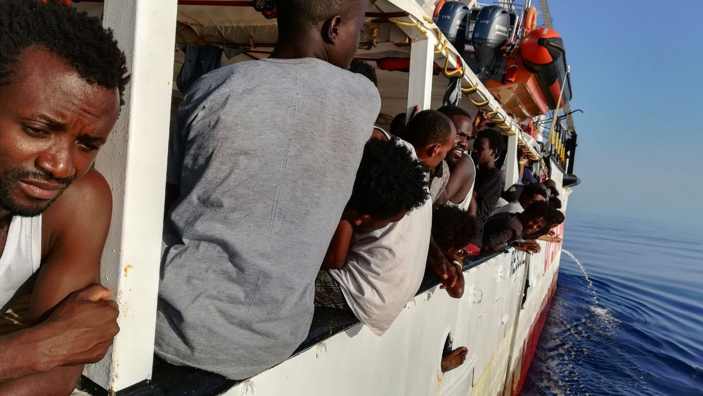

### AYS Daily Digest 05/08/2019: Frontex being a silent witness of human rights violations at European borders
#### Situation of people deported into desert in Tunisia still unclear // Decreto Sicurezza Bis approved in Italy // Another vessel waits for permission to dock // New rescue boat on its way // More news from Turkey, Malta…

Credit: Open Arms
#### FEATURE

British and German media reported on Monday that Frontex knew about and tolerated human rights violations and violence committed by national border guards in Bulgaria, Hungary and Greece\. Internal documents show that Frontex knew about boarder guards using pepper spray, dogs being used to chase people, violent attacks against migrants and the taking of their personal belongings\. Although it could have, Frontex did not take any measures against these violations of basic human rights\. In some cases, Frontex staff even committed violations of human rights themselves, especially in deportation flights\. For example, Frontex has deported unaccompanied minors\.

See original source [here](https://www.keeptalkinggreece.com/2019/08/05/frontex-migrants-greece-bulgaria-hungary/) \.

Frontex is rapidly growing in size\. It is scheduled that by 2024 the number of staff will increase from 1,500 to 10,000\. At the same time, the budget will increase by approximately 500%\. Frontex has few democratic means of control\. A German article concerning this new information, and the general lack of oversight of Frontex, can be found here:

On Twitter, Frontex has denied all accusations:

■■■■■■■■■■■■■■ 
> **[Frontex](https://twitter.com/Frontex) @ Twitter Says:** 

> > #Frontex categorically denies any involvement of its officers in violations of fundamental rights. We condemn any form of inhumane treatment, unprocessed returns and any other form of violence which are illegal under the European Charter for Fundamental Rights. 

> **Tweeted at [2019-08-05 15:05:42](https://twitter.com/frontex/status/1158393650356920322).** 

■■■■■■■■■■■■■■ 

Updates from the situation of the people at the **_Tunisian\-Libyan border_** \.

As of Monday 1\.30 p\.m\. a group of 36 people, among them four children and a pregnant woman, were still left alone somewhere in the desert at the border with Libya\. According to activists that are in the area trying to locate the group, they have received some bread and milk by now, but are remain in unbearable conditions\. Apparently, they are under the control of the Tunisian military\. _Infomigrants_ reports that IOM are aware of the situation, but were not allowed to go there as they are held in a border zone\.

On Tuesday morning, there was a demonstration in front of the UNHCR headquarters in Tunis, which demanded that the organisation take a clear stand against the Tunisian government and to act immediately to safeguard those dumped at the border\.

Here is the original [source](https://m.facebook.com/story.php?story_fbid=2585287241502987&id=137210956310640) \.

For more updates, follow [Melting Pot Europa](https://www.facebook.com/meltingpoteuropa/) \.
#### EASTERN MEDITERRANEAN

In **_Turkey_** , a group of about 26 NGOs, amongst them RSA \(Refugee Support Aegean\), signed a joint statement denouncing the on\-going practice of deportations of Syrian citizens from Turkey to Syria\. The NGOs call on the EU to no longer regard Turkey as a safe country and end all returns to Turkey under the EU\-Turkey deal\. In order to respect the non\-refoulement principle and avoid chain\-refoulement, the EU must stop the returns and grant protection for those fleeing war and persecution\.

The joint statement can be found here:

As of the end of July 2019, [1,892 people have been returned to Turkey](https://reliefweb.int/sites/reliefweb.int/files/resources/70662.pdf) from **_Greece_** under the framework of the EU\-Turkey deal\. 38% of them are Pakistani nationals, 18% Syrians, followed by Algeria, Afghanistan, Bangladesh and Iraq\. For 41%, a negative decision in the 2nd instance of their asylum claim was the reason for being returned\.

According to Aegean Boat Report, two boats [carrying a total of 64 people](https://www.facebook.com/AegeanBoatReport/photos/a.285312485325196/624658414723933/?type=3&theater) have arrived on Lesvos and Samos respectively, as of Monday morning\. Another source claims that two boat operators were [arrested on charges of smuggling](https://twitter.com/Refugees_Gr/status/1158326839321997317?fbclid=IwAR0rbFO-j8VhkjhsT61FS247Gcw1O2n84IcTX5_jLr8fewmW1_jslDTpTcc) , last Saturday morning\.

According to NoBorders Greece, [two young men were arrested](https://twitter.com/Refugees_Gr/status/1158325962431483904?fbclid=IwAR1ZY_1RqQ9_C1mTAecmrB3MVpmewJfcVTHDEydFc1accm34FC7X9POI1YA) on Saturday at Kavala airport for trying to leave the country with fake documents\.

A list of courses, activities and services offered for refugees in Athens in August can be found here:

#### CENTRAL AND WESTERN MEDITERRANEAN

The Ocean Viking, the new rescue boat operated by SOS Mediteranean and MSF \(Doctors Without Borders\), is [on its way to the SAR zone off Libya](https://www.infomigrants.net/en/post/18602/sos-mediterranee-msf-launch-new-migrant-rescue-boat-in-mediterranean?fbclid=IwAR2zlZbMHwHbhM_y23Yw1Cb8hli6E-Q0oDVZ46fl95YOF9ygsSpOjkmol-Q) \. Until it arrives there, the crew are busying themselves with training and preparations for emergency responses\.

Meanwhile the Spanish Open Arms rescue vessel is still waiting to be allowed to dock in a safe harbour and let the 121 rescued persons disembark\. Only two heavily pregnant women have been allowed to disembark, thus far\.

Sea Eyes’ ship, Alan Kurdi, was allowed to dock in **_Malta_** \. The 40 people who were rescued last Wednesday off the Libyan coast were able to disembark\. They will be distributed among EU member states following a deal negotiated by Germany\.

[Here](https://www.infomigrants.net/en/post/18592/rescued-migrants-land-in-malta-under-eu-deal?fbclid=IwAR0Ob7TXE5gCajUjNbwbhX2U9CYZ2dznKVPiuLs--dCuG6LA64UcoCbG0hE) you can find more information\.

[According to Mediterranean Hope](https://www.facebook.com/rastajuly/posts/10156845065288621?hc_location=ufi) , a ship carrying 48 people mainly from Ivory Coast, landed autonomously on **_Lampedusa_** \. An unknown number of people did not survive the crossing, amongst them a 5 month\-old child and a young boy\. Survivors say they have been at sea for over 2 days\. Many of them were dehydrated and had respiratory problems, caused by the engine fumes\.

The new Security bis decree was passed by the **_Italian_** Senate and now only needs to be ratified by the Italian President in order to come into force\. The decree is targeting rescue boats operated by NGOs\. It would increase the maximum fine for a boat entering Italian ports with rescued migrants on board, without any prior authorization from the authorities, to €1 million\. It also provides for rescue boats to be seized by the navy and for their captains to be arrested\. Open Arms has already stated on Twitter that they will continue their operations\.

Original source \(in Italian\) [here](https://www.repubblica.it/politica/2019/08/05/news/governo_parte_al_senato_l_iter_del_decreto_sicurezza_bis_attesa_per_i_numeri_della_maggioranza-232830416/?ref=fbpr&fbclid=IwAR0DhLPo1_guXZyrXbfKffHu9yCZ3-jzcIfsV7YOGCq_WZAlVK5l9MILGZQ) \.

UNHCR published a weekly report for **_Spain_** in regards to the week from 22–28\.7\.

According to Europa Press Comunitat Valenciana, six boats have arrived in Spain since last Sunday\.

See original source [here](https://www.europapress.es/comunitat-valenciana/noticia-crucero-avista-otra-patera-alicante-tercera-24-horas-costa-alicantina-20190805183919.html) \.

**We strive to echo correct news from the ground through collaboration and fairness\. Every effort has been made to credit organisations and individuals with regard to the supply of information, video, and photo material \(in cases where the source wanted to be accredited\) \. Please notify us regarding corrections\.**

**Apart from daily news in English, we also publish weekly summaries in Arabic and Persian\. Find specials in both languages on our [medium site](https://medium.com/are-you-syrious/ays-weekly-in-arabic-and-persian/home?source=post_page---------------------------) \.**

**If there’s anything you want to share or comment, contact us through Facebook, Twitter or write to: areyousyrious@gmail\.com\.**

_Converted [Medium Post](https://medium.com/are-you-syrious/ays-daily-digest-05-08-2019-frontex-being-a-silent-witness-of-human-rights-violations-at-european-cb216f70954c) by [ZMediumToMarkdown](https://github.com/ZhgChgLi/ZMediumToMarkdown)._
