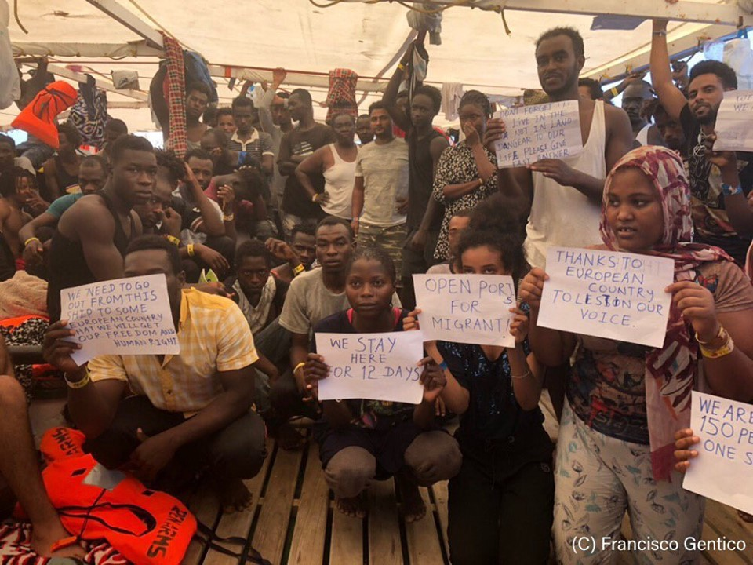

### AYS Daily Digest 14/8/2019: Open Arms receives permission to dock in Lampedusa
#### Arrivals skyrocketing in Greece, with islands hosting more than 21,000 people// List of NGOs closed during holidays in Athens// Information on the procedure for an appeal when asylum rejected in Greece// Desperate situation in Ključ, BH// 137 people in distress in the Mediterranean, unknown situation for those on board// Horrible news coming from UNHCR — Libya// More news from Germany, Denmark, UK…

Credit: Francisco Gentico for Proactiva Open Arms
#### **FEATURED**

Open Arms finally has a safe port to dock and disembark the 147 people trapped on board for 13 days\!

Today the TAR \(Regional Administrative Court\) of Lazio has [suspended the infamous Decreto Sicurezza Bis](https://www.internazionale.it/bloc-notes/annalisa-camilli/2019/08/14/open-arms-tar-sospende-decreto-sicurezza-bis?fbclid=IwAR1vPbCxVOIzlV7l6aaDyyWk2zYMYBeT8djWItbPBj4Gvx7ePGNCYnKUByY) , allowing the boat to enter Italian waters and head toward Lampedusa \(in the morning, the boat has reached the island, but is still waiting to dock\) \.

The NGO had appealed to the very same court yesterday against the decision taken by Salvini \(Ministry of Interior\), Trenta \(Ministry of Defense\) and Toninelli \(Ministry of Transports\) to impede the entry into territorial waters\.

The decision taken by the Court cites the “exceptional urgency and seriousness” of the case, due to the “prolonged stay offshore of the boat”, lifting the ban to facilitate the assistance of the people on board\.

Among the 147 people, 31 are minors\. Few days ago, also the Juvenile Court had expressed the need to safeguard the wellbeing of the children onboard\.

The decision of the TAR underlines that the Decreto Sicurezza Bis violates international laws regarding SAR operations and the law of the sea, therefore it ruled in favour of the entry into territorial waters, suspending sanctions and the seizure of the vessel\.

Nevertheless, even though the boat received the permission to sail to Lampedusa, it is still unclear whether they will be able to disembark the people quickly\.

This decision could represent a positive example to follow for Ocean Viking, which is still struggling to take care of the 356 people on board, with deteriorating weather conditions and no safe port on the horizon\.

■■■■■■■■■■■■■■ 
> **[MSF Sea](https://twitter.com/MSF_Sea) @ Twitter Says:** 

> > UPDATE: Weather conditions are deteriorating as the #OceanViking heads north, with the #MSF medical team now treating a number of the 356 rescued people onboard for seasickness. 

We can only provide temporary relief: we need a place of safety as soon as possible. https://t.co/mR4mNufJxz 

> **Tweeted at [2019-08-14 12:27:10](https://twitter.com/msf_sea/status/1161615242478182401).** 

■■■■■■■■■■■■■■ 

But to offset the good news coming from the Mediterranean, are other situations that are worrying, as [Greece expressed its concern](https://www.infomigrants.net/en/post/18819/migration-greece-wants-eu-to-share-the-burden?fbclid=IwAR18rXm-of4RIWCgNoI2TljN6sQUowCcqcGW07wPS69m_gpqcMn1CsJ2bFw) over the increased number of arrivals to the Aegean islands in the past weeks\.

> \[…\] since July 7, “there has not been a single day without arrivals\.” 

There are approximately 20,000 people stranded on Greek islands to the current day, thanks also to the opening of a new corridor “between the Greek island of Samothraki and Alexandroupoli in the north, near the Turkish border”\.

Giorgos Koumoutsako, alternate minister for citizens’ protection, calls the EU authorities for a fairer division of the number of arrivals “on the basis of concrete solidarity”\.

Frontex has also published [data](https://frontex.europa.eu/media-centre/news-release/migratory-situation-in-july-arrivals-in-europe-up-slightly-from-previous-month-rlBoYl) , comparing the different areas of entry and number of arrivals\.

**EASTERN MEDITERRANEAN**

**_Lesvos_**

Police are supposedly threatening to close the women and children centre outside Moria, more updates will follow\.

Salam Aldeen has published [a call for help](https://www.facebook.com/sk.aldeen.3/videos/1436454423179716/?hc_location=ufi) \.

One Human Race has compiled a list of Athens\-based EU\-funded, major NGOs that will be closed throughout the month of August\.

See original post [here](https://www.facebook.com/groups/onehumanraceorg/permalink/2458068474251117/?hc_location=ufi) \.

However, the list is still in the process of being updated, as information from other NGOs are missing\. See [here](https://www.facebook.com/groups/AthensVolunteersInformation/permalink/1786695218129434/?hc_location=ufi) , the updated version of the original post, published by Athens Volunteers Information and Coordination Group\.

> ORGANISATIONS OPEN IN AUGUST 
 

> \[…\] 

> CARITAS : Open apart from Greek National holidays 

> GREEK COUNCIL OF REFUGEES : opens again 26 August 

> DCR : OPEN 

> SOLIDARITYNOW : OPEN \(apart from Greek National holiday\) BUT NOT ACCEPTING ANY NEW CASES 

> REFUGEE LEGAL SUPPORT: OPEN apart from Greek National holiday \(operating from SolidarityNow premises\) : NOT TAKING ANY NEW CASES 

> CATHOLIC RELIEF SERVICES \(CRS\) 
 

> Cash Card provider : Open apart from Greek National holiday 

> FORGE4HUMANITY open 

> CRIBS INTERNATIONAL FREESHOP open 

> STEPS open 

> BRIDGES open 

> ORANGE HOUSE open
 

> CHEERing still providing a service 

> Medical Volunteers International still providing services 

> Echo Refugee Library Open 

> Equal Rights Without Borders reopens on 21 August\. 

> Jafra reopens on 19 August 

> Do Your Part open 

> Goodwill Caravan — open for existing caseload \(with a lawyer on call\) but not open for new cases until 2 September 

If you have any further information on NGOs opening times during the month, please get in touch with the above mentioned groups\.

Mobile Info Team has published a [series of information](https://www.facebook.com/mobileinfoteam/posts/2506179562944091?hc_location=ufi) on possible actions to be taken if you have been rejected for asylum in Greece and want to appeal the decision\.

Also in [Athens Volunteers Information and Coordination Group](https://www.facebook.com/groups/AthensVolunteersInformation/?epa=SEARCH_BOX) , you can find useful information if you need to appeal during holiday season in August\.

> TIME FRAMES TO APPEAL NEGATIVE ASYLUM TO COURT \(2ND DECISION\) OVER AUGUST HOLIDAY PERIOD 

> Please note that in all administrative procedures \(not penal or civil\) the month of August does not count in the deadline\. 

> Where the courts are closed over the holiday period, the number of days therefore start counting again on the day the courts re\-open\. 

> Refugees still need to see a lawyer/legal team with their documents and the decision to confirm whether or not they fall into this category \(i\.e\. of August not counting\) \. Each case is different and should be examined on its own merits\. 

Warning for [weather conditions](https://www.keeptalkinggreece.com/2019/08/14/greece-weather-aug-15-16/) has been issued for mainly **_Northern Greece_** \. Rain, storms, hail and powerful winds are to be expected on 15–16 August\.

Engineers installed a portable wifi router in **_Vučjak_** , **_Bosnia and Herzegovina_** , today\.

> Thanks to good friends who recognize the value of being connected, an engineer from Ericson and the Red Cross in Bihać, we installed the first portable wifi router at the refugee camp in Vučjak\. The need for internet in crisis situations is a major need so people can be in touch with their loved ones\. We sincerely hope this router will serve the refugees while they are in this camp — which we hope will not be a long time because the conditions in Vučjak are getting worse\. We hope that we at least brought some moments of joy to the people living in these conditions\. 

Original post from Elvis Dzafic \(Croatian Baptist Aid\) \.

Meanwhile, if there is good news coming from the horrible camp at Vučjak, we can not say the same for other areas of BH, in particular **_Ključ_** , where people are still transiting with no support at all, except that of tireless locals\.

Tonight, around 50 people arrived and spent the night sleeping rough in cold and wet weather\. Of this 50 people, 18 of them are minors\.

#### CENTRAL AND WESTERN MEDITERRANEAN

■■■■■■■■■■■■■■ 
> **[Alarm Phone](https://twitter.com/alarm_phone) @ Twitter Says:** 

> > Yesterday we were alerted to 3 boats in distress in the central #Med, coming from #Libya &amp; #Tunisia. Boat 1 (32ppl) from Zuwarah was most likely intercepted by LibyanCG. Boat 2 (80ppl) came from Garabuli &amp; boat 3 (25ppl) from Zarzis. We do not know what happened to boats 2 &amp; 3. 

> **Tweeted at [2019-08-14 12:11:00](https://twitter.com/alarm_phone/status/1161611173369929728).** 

■■■■■■■■■■■■■■ 

UNHCR in Tripoli is allegedly offering money to people they can not resettle, to find alternative solutions \(namely, the street\) \. Among them, many survivors of the Tajoura detention centre bombing\. If they don’t receive support from UNHCR, they will likely [be arrested or taken by smugglers](https://twitter.com/sallyhayd/status/1161561630976696321?fbclid=IwAR1eUx9j3J1OIezLNLEvxrVu_rWRIrhuQ63mP2c_HIS_LaFqM8Oi0zxgWOo) \.

■■■■■■■■■■■■■■ 
> **[Sally Hayden](https://twitter.com/sallyhayd) @ Twitter Says:** 

> > Multiple refugee sources in Tripoli's UNHCR GDF centre saying UNHCR has told them they can't resettle all of them &amp; are trying to encourage them to go outside on the streets by offering money. This comes after weeks where they're not getting enough food &amp; water. 1/ https://t.co/lty1wRnhwy 

> **Tweeted at [2019-08-14 08:51:32](https://twitter.com/sallyhayd/status/1161560977441284096).** 

■■■■■■■■■■■■■■ 

Meanwhile, the 36 people \(21 men, 11 women, four children\) who were stranded at the border between Tunisia and Libya since Sunday 4 August, are now apparently [safe in Tunisia and receiving assistance](https://www.infomigrants.net/en/post/18823/ivorian-migrants-stranded-at-libya-border-safe-iom-says?ref=tw&fbclid=IwAR2yOVJq8OZ_Lv0KxyCy1QDJIbj5_4K2RlhqVvf3RISZETIdi_Q6ttNLZ5w) \.
#### GERMANY

According to the Court of Munich, [“readmissions” to Greece at the German\-Austrian border are illegal](https://www.equal-rights.org/post/decision-of-court-of-munich-refusals-at-the-border-are-illegal-and-thus-the-seehofer-deal?fbclid=IwAR2BBkUv1nNaLjv2dXOqXAL3YmnSWKNAf8rF8ouIlY6rD0n7MNZyRRe7dcg) , and so is the “Seehofer Deal” with Greece and Spain\.

The legal case was begun in specific when an Afghan citizen crossed this border by train in May and, when checked by police, it was found that the man had been fingerprinted in Greece, therefore eligible for return, according to a “Pre\-Dublin procedure”\.

> The Federal Police did not carry out any further examination\. Nor did a hearing in the proper sense took place\. In its action, the Federal Police referred solely to the German\-Greek Arrangement and sent only a “Notification of refusal of entry” to Greece\. 

After the man was deported on the same day \(and imprisoned in Greece immediately after his arrival\), a legal file was opened on the case\.

Today the Court of Munich ruled that the man has to be brought back to Germany \(at Germany’s expenses\) and granted temporary entry to the country, citing as one of the major reason, the interruption of the man’s asylum procedure in Greece after his return\.

On Dublin III, the judge said:

> “Moreover, the Court has considerable doubts as to the legality and existence of a so\-called “pre\-Dublin procedure”\. By assuming a so\-called “pre\-Dublin procedure” in the case of an applicant actually staying in the territory of a Member State, the subjective procedural rights of the applicants under the Dublin III Regulation and its objective could be bypassed\. This clarifies, that even in a “refusal of entry” situation, in order to transfer an applicant from Germany to Greece, a Dublin procedure \(take back request — acceptance — possibility for legal remedies with suspensive effect\) needs to be carried out\. As part of this procedure, it is necessary to examine potential human rights violations in Greece, which could lead to a responsibility of Germany for the asylum procedure according to Art\. 3 para 2 or Art\. 17 para 1 Dublin III Regulation, which was not done by the acting authorities\. 

#### DENMARK

Changed signals from the new Social Democrat government after statement from the Minister of Integration, Mattias Tesfaye, today concerning the UN quota refugees\.

Counter to his previous statements before parliament, Tesfaye now — in accordance with the so\-called “shift of paradigm”, adopted by the previous center\-right wing government — claims that government policy is that quota refugees will be able to obtain a temporary residence permit only, and that this will be subject to possible withdrawal as is the case for all other refugees\.

The minister intends to order the Immigration Service that when assessing the need for protection in Denmark, quota refugees must be assessed on a par with all other refugees\.

The new position is expected to raise disagreement with the political parties supporting the minority government, as it is seen to oppose the recent agreement that made the new government a reality\.

See original source [here](https://politiken.dk/indland/art7333443/Efter-halvanden-måned-som-minister-har-Tesfaye-ændret-holdning-til-kvoteflygtninge?fbclid=IwAR3vBifcpnOvN2SlPv5qCu0tckn5UFL91_NnSVhoF095d0rhZqp5mxFBw4k) \.

A longer background account on the prison\-like deportation center Ellebæk and the planned Camp Action weekend in the end of this month\. Also some points to the context of Ellebæk as a part of the Danish immigration policy and asylum system \(in Danish — follow\-up on previous Digest stories\) \.

See [here](https://konfront.dk/det-glemte-faengsel) \.
#### UK

**We strive to echo correct news from the ground through collaboration and fairness\. Every effort has been made to credit organisations and individuals with regard to the supply of information, video, and photo material \(in cases where the source wanted to be accredited\) \. Please notify us regarding corrections\.**

**Apart from daily news in English, we also publish weekly summaries in Arabic and Persian\. Find specials in both languages on our [medium site](https://medium.com/are-you-syrious/ays-weekly-in-arabic-and-persian/home?source=post_page---------------------------) \.**

**If there’s anything you want to share or comment, contact us through Facebook, Twitter or write to: areyousyrious@gmail\.com\.**

_Converted [Medium Post](https://medium.com/are-you-syrious/ays-daily-digest-14-8-2019-open-arms-receives-permission-to-dock-in-lampedusa-5865f2d88401) by [ZMediumToMarkdown](https://github.com/ZhgChgLi/ZMediumToMarkdown)._
