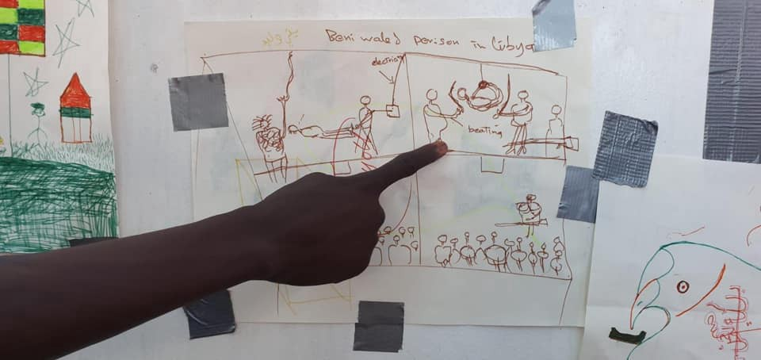
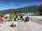
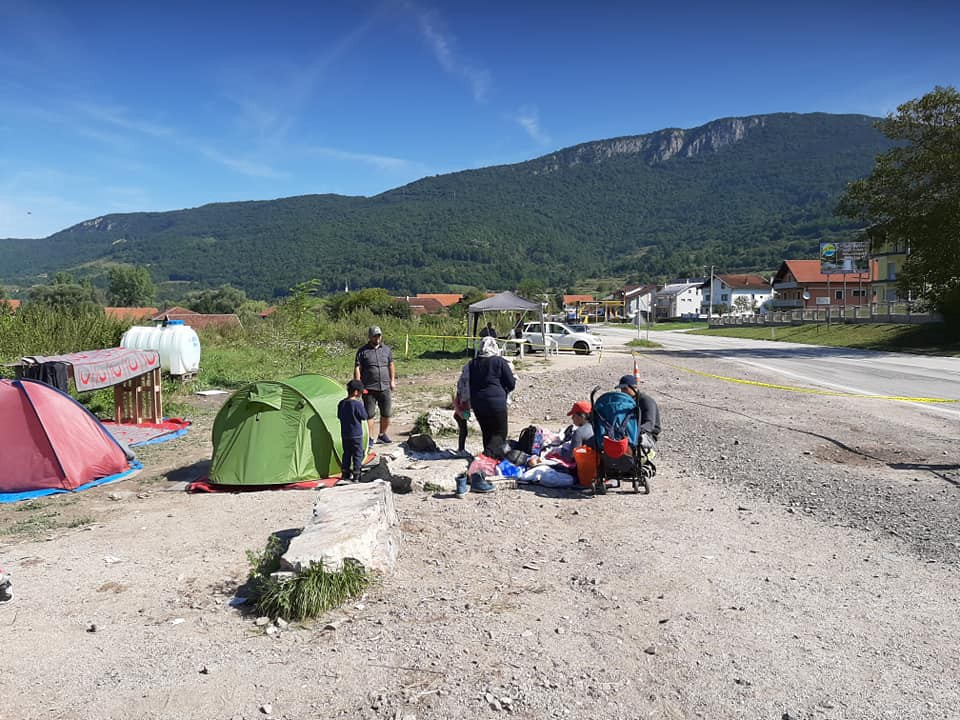

### AYS Weekend Digest 17–18/08/2019: “Rescued”vs\. “Captured” and Salvini’s forked tongue…

[Are You Syrious?](@AreYouSyrious?source=post_page-----2466906663f8----------------------)

[Aug 19](ays-weekend-digest-17-18-08-2019-rescued-vs-captured-and-salvinis-forked-tongue-2466906663f8?source=post_page-----2466906663f8----------------------) · 7 min read

Beatings in Libya drawn aboard the Ocean Viking, [Photo Credit SOS Mediterranee](https://www.facebook.com/sosmeditalia/photos/pcb.2324438834472764/2324438737806107/?type=3&theater)

Many pages have been dedicated to the strategic use of “Migrant” versus “Refugee” in broader discourse, but little attention is paid to the concept of “Rescue” versus “Capture\.” Arguably, considering the deplorable condition of most of the “camps” that people who are fleeing are required to go to, one could make the argument that most rescue is in some way a form of delayed capture or at least interception\. However, this could be definitely strategically used to play into the further demonization of humanitarian rescue efforts\. The situation is much more clear cut when it comes to the Libyan Authorities’ EU Endorsed interception and return of people to Libya\. On the weekend, many noted that 278 people were “rescued” off the coast of Tripoli\.

However, many have pointed out that these are better termed “Interceptions” or “Capture”, as all of those on board will be returned to horrific detention centres in Libya\. The photo story posted by AFP of drawings of those aboard the Ocean Viking highlights the trauma of those coming to Europe\. Read more [here](https://news.yahoo.com/migrants-drawings-depict-nightmares-best-memories-204724289.html;_ylt=AwrC1jE9zlldskYAhirQtDMD;_ylu=X3oDMTEyODAwZXF2BGNvbG8DYmYxBHBvcwMxBHZ0aWQDQjc1MDZfMQRzZWMDc3I-?guccounter=1&guce_referrer=aHR0cHM6Ly90LmNvL2NTNWphYUtsQ1Y_YW1wPTE&guce_referrer_sig=AQAAANg21n3MHLSVPeLgYEclQ-twjGlkMyvRIuVEtEJrPNLyLOF2yWg6LVjWXRz9jh3UOFFSsDOBwlIRO3GCriPvpRAiEAUro3pxW3RnqkXrG6LX6M8gH0LjoR6WPW8ic-cpQbaCMKao4p6t0U_eZi3hBy9KCnQAiXZTh8tTko9SMitI) \.

One can hear more of the in\-depth report from the **Khoms, Libya** detention centre by listening to this podcast\. But the horrifying details of bodies washing ashore while others languish and slowly die in detention centres highlights the horror of the situation\.

Please listen to the podcast [here](https://podcasts.apple.com/us/podcast/special-episode-sami/id1475643750?i=1000446991392) \.

In other news from the Western Mediterranean, around 47 people have landed on the **Chafarinas Islands on Spain** \. There is no update on their condition\.

[It is unclear if this landing is related to the five people who called for assistance for a boat in the Alboran straight, at which time there was no rescue response for hours\.](https://afrofeminas.com/2019/08/08/ahogadas-en-el-racismo/)

On a similar note, the actual goal of the big talk of Salvini, which is shared by all of the anti\-migration politicians, is to direct all attention onto civil actors and private citizens\. Open Arms remains stranded, banned from landing at Lampedusa, [although 27 minors were allowed to disembark](https://www.facebook.com/2088704344683209/photos/a.2155566397997003/2481455112074795/?type=3&__xts__[0]=68.ARCapQB6Vvtc63k8jWr2V8qjE0Zn7M10Gi4zuReiyvrs9P7QF1o5UUR1d_WEHz5E7sdaaOp_8pfanhic3O7DLg8R2hIPPqxXX15wZDu0mcKtNuEwrTrYh1eYEI79vfszCr5dphJo2Sjc9_tL__su6LVMXVfSSxyqrSxtNVIoL6fwQ32hlBAnkEJNWhCy-zGwvFL6nwV0xheJE2V8xQpBJyomtkcXc7J9PkgpEsSbYlu407T3xKdtRFvv1cF_5MZnXWJpXRqDbe9Qq5QKlyVu0KL-X9v2ksUhjuNnWJJuW7wP-hxCqWjUBu-arQNbo1t_eqQ219q5LcuWt3HYd2BWjYGw64ON&__tn__=-R&hc_location=ufi) \. Salvini is very proud of this, purporting to “defend” Italy from nefarious “invaders\.” However, what he doesn’t note is that in the dead of night at the weekend, people landed without a problem, just not with the assistance of search and rescue organizations apart from the **Italian coast guard\.**

> _“If you see a patrol boat with 15 migrants arriving in Lampedusa, do not worry\. They are not Open Arms hostages, those that a vulgar political propaganda is condemning to stay on board, it is the Tunisians who have come straight\. For them open ports …” translation\._ 

The condition on board the Open Arms ship continues to deteriorate\. Already four people have tried to make a break for Italy by jumping overboard, and were rescued again\.

[Although several Spanish authorities have given permission for the Open Arms to dock in Spain](https://www.repubblica.it/cronaca/2019/08/18/news/open_arms_l_ispezione_a_bordo_conferma_l_emergenza_soluzione_nelle_prossime_ore-233852835/) , this would be in violation of [several treaties and laws and they are unable to do so](https://twitter.com/andreatornago/status/1163197675661070337) \. [They cannot travel to Spain in view of the condition of the people on board, as they would not be safe\.](https://www.france24.com/en/20190818-open-arms-migrants-italy-salvini-spain-humanitarian-emergency-rescue-ship?ref=tw) They must go to Italy\. [France has agreed to take 40 of those on board once they land](https://twitter.com/afpfr/status/1163084632931352576) \. Needless cruelty on behalf of the administration\.

This is a good time to be reminded that with regard to Salvini’s squawking, [92% of landings in Italy, as of July, happened WITHOUT the assistance of SAR NGOs](https://twitter.com/AlviseArmellini/status/1163001388055638016) \. Facts are disposable, however, when it is more politically expedient to target all ire on essentially straw men — those who are not contributing to any pull factor, who are not bringing people, just saving lives\. These are easier targets to whip up sentiment against and this allows Salvini to maintain his personal political brand and prance around as the defender of Europe\.

The use of NGOs, civil society actors, grassroots organizations, and simple citizen humanitarianism as straw men onto whom to deflect all anger and public opinion is common practice in the right\-populist governments\. It is now a sadly common tactic in Croatia and Hungary in other areas\. Make sure to stand with each other\.
### EASTERN MEDITERRANEAN \+ BALKAN ROUTE

Aegean Boat Report notes that the number of arrivals on the Greek islands is higher than in many recent years, and has written an excellent text on it\.

> _“ We have seen a steady increase in boats since June, numbers from July were the highest since 2015, and it seems that August will be even higher\. So far this month 115 boats have reached the Greek Aegean Islands, 42 of them on Lesvos, 25 on Samos\. In July a total of 175 boats arrived on the islands\._ 

> _What nobody is writing about is that the boats that are stopped on their way towards Greece by Turkish Coastguard and police\. So far this month a staggering 225 boats have been stopped, this in only two weeks\. This shows the magnitude of the situation, so why is nobody writing about it? So far this year 1250 boats have been stopped, 40,000 people arrested\._ 

> _Governments and EU funded organizations are spending millions to produce statistical reports, reports that only tell a part of the story, the part they want you to know about\._ 
 

> _They desperately want you to believe that the situation is under control, that fewer people are trying to reach Europe, that their strategy on building fences and walls is working\._ 

> _The number of boats stopped isn’t mentioned anywhere, 40,000 people erased by the stroke of a pen, amongst them 15,000 children\. All these children, equivalent to 500 school classes, are denied their right to seek asylum, denied the chance to live a life without war, suppression, persecution and horrible living conditions\.”_ 

For the whole text, please go [here](https://www.facebook.com/AegeanBoatReport/posts/631673624022412?hc_location=ufi) \.

In the meantime, 238 people arrived on the Aegean Islands **\(Lesvos, Chios, and Leros\)** on Saturday\. Another 98 people arrived on **Lesvos** on Sunday\. This is nearly 350 people over the course of two days\.

In a chilling revelation, people who were set to land in a harbour on Lesvos had to land on a rocky beach instead, so as to not disrupt tourists\.

The Greek Government continues to crack down on solidarity in the name of saving tourism\. In a predicted move, as the historic neighborhood of Exarchia in Athens was long known for its anarchist community, after years of increasing gentrification and exploitation of the heritage of the area, the government is moving to sweep out squats to make room for more lucrative guests\. Join us on a twitter storm on Tuesday to \#SaveExarchiaSquats

In this vein, European Lawyers in **Lesvos** have received some more funding and will be able to work in the Olive Grove\. To continue supporting their important work, go [here](https://www.facebook.com/EuropeanLawyersInLesvos/photos/a.1917504088570340/2370901406563937/?type=3&theater) \.

Every day people continue to help those displaced in Bosnia, with the local community of **Kljuc, Bosnia** giving their all\. See all of the families stranded along the way\.

Photo Credit Sanella Lepirica

[The weather in Bosnia can be very harsh](https://www.facebook.com/photo.php?fbid=2592805044104043&set=pcb.2592807027437178&type=3&theater) , please support these local communities as people continue to come\.
### NORTHERN EUROPE

First Aid Support Team in **Calais, France** is in desperate need\!

> _Recently FAST volunteers have been working harder than ever and our equipment stocks are currently running low\. Simple first aid supplies which we use daily: Ibuprofen, saline, and blister packs are all out of stock\. These materials are cheap and often taken for granted, but for displaced people in Calais they can make a huge difference\._ 

> _Please take a look at our needs list and see if you can support us with physical donations\. FAST relies entirely on donations from generous supporters\. If you are unable to make a physical donation please consider a financial donation\. Monetary donations allow to buy materials in larger quantities\._ 

> [_https://docs\.google\.com/…/1ifrkvKXTyWMXIicMtXPegkthZG…/edit…_](https://l.facebook.com/l.php?u=https%3A%2F%2Fdocs.google.com%2Fdocument%2Fd%2F1ifrkvKXTyWMXIicMtXPegkthZGg6ES_rwct-t0qzClk%2Fedit%3Fusp%3Dsharing%26fbclid%3DIwAR1SF4miiqJ79QEWP63vHPWhqrnGOCUB678AkKeDF38GF0BPgwSp9XJdAsY&h=AT3cQSGR5L1UiNtsNbDfOlCzx58D3iPUlfdkGOzQTi756qD-yh-ukI1HONWu7BFRcBJjoHDQcqG33WMijfIFqi7ZVL0VMALLvHRoPhajLyRRQb1at5lLq4MzDrEts8UeL404sLHMCXOLrXd2H4_vzNQlp9ZZJdPm49befbU53w) 

> _Please Note — We are a certified charity dedicated to delivering the highest quality care, and so are unable to accept medications that are not available over\-the\-counter or equipment/medication that is out of date\._ 

> _Pictured: FAST volunteers taking stock of equipment earlier this year_ 

> _To find out more about how to get involved, and how to donate please see our website [https://www\.f\-a\-s\-t\.eu/](https://l.facebook.com/l.php?u=https%3A%2F%2Fwww.f-a-s-t.eu%2F%3Ffbclid%3DIwAR0UKVfOiJD51SWMnau0Fjslyc54JZi4gmQ075hBHZFExZaG3pFQd1S19zA&h=AT2I4QW1Qry2Bnw9sXoNrFxoF7fpegZ1dfhqwKobAKFopdyuie5u-QdmeLlOVZGJDv8EwYMFn21vQr8UMS93Rv1_9-89QvC9Qq1VAocqskjeRAp72X0lPZyUINyOA_s9dF3TMBnAgDd5ELA18S0NqCaBCjoBOkOPJk2GpP1Kww) \. If you have any specific questions please message us\._ 

In **Germany** two upcoming deportations\!

> _“Hello, there is a confidential indication that a collective deportation to Pakistan, Islamabad is to take place on 21 August\. People from Berlin and Brandenburg are to be deported\. Starting tomorrow, they will be collected and taken into deportation custody\. On railways, in homes and at workplaces\. People should be careful\.”_ 

From [Stop Deportation Group](https://www.facebook.com/stopdeportationgroup/?__tn__=%2CdkCH-R-R&eid=ARD1m1UsW6JJYVWVhn18oMOESiDnPvH49VMOzC3IUR9JQiq_2-pyJSMUJcimhxAwjwkirntu_LbjdfO6&hc_ref=ART1hvxsvkMOiQJLsJg0bc2EiMWB1mtNh8MAiDSgB1MG6m8fUE4l99zVNAZI-dzHnCQ&fref=nf&hc_location=group)

Another group of Nigerians is being deported today from Frankfurt\. For more information go [here](https://www.facebook.com/RefugeeBlackBox/posts/950737728598292?hc_location=ufi) \.

In a bit of very good news, however, a German court has ruled that TURKEY IS NOT A SAFE THIRD COUNTRY\! This is patently obvious by now, but this small step can help significantly\!

> _“A regional court in Germany ruled to suspend the transfer of a Syrian national to Greece due to the risk being he would be returned to Turkey, which it said did not meet the safe third country requirements set for asylum seekers, Deutsche Welle Turkish [reported](https://www.dw.com/tr/alman-mahkemesi-t%25C3%25BCrkiye-g%25C3%25BCvenli-de%25C4%259Fil-itiraz%25C4%25B1n%25C4%25B1-kabul-etti/a-50058102) on Friday\._ 

> _The German authorities apprehended the applicant following a border police check on June 13 and placed him detention\. Proceedings were then launched to return the Syrian, who had previously applied for asylum on the Greek island of Kos in 2018\. His application was declined as Turkey was considered the first country of asylum\._ 

> _The Bavarian court which examined the man’s appeal against his transfer to Greece said the Syrian might be returned to Turkey which did not meet the requirements of a safe country described in an EU directive on asylum seekers\.”_ 

For more, go [here](https://ahvalnews.com/syrian-refugees/german-court-rules-turkey-not-safe-third-country-return-syrian-refugee) \.

**We strive to echo correct news from the ground through collaboration and fairness\. Every effort has been made to credit organisations and individuals with regard to the supply of information, video, and photo material \(in cases where the source wanted to be accredited\) \. Please notify us regarding corrections\.**

**Apart from daily news in English, we also publish weekly summaries in Arabic and Persian\. Find specials in both languages on our [medium site](https://medium.com/are-you-syrious/ays-weekly-in-arabic-and-persian/home?source=post_page---------------------------) \.**

**If there’s anything you want to share or comment, contact us through Facebook, Twitter or write to: areyousyrious@gmail\.com\.**

_Converted [Medium Post](https://medium.com/are-you-syrious/ays-weekend-digest-17-18-08-2019-rescued-vs-captured-and-salvinis-forked-tongue-5acf0feb9c6b) by [ZMediumToMarkdown](https://github.com/ZhgChgLi/ZMediumToMarkdown)._
