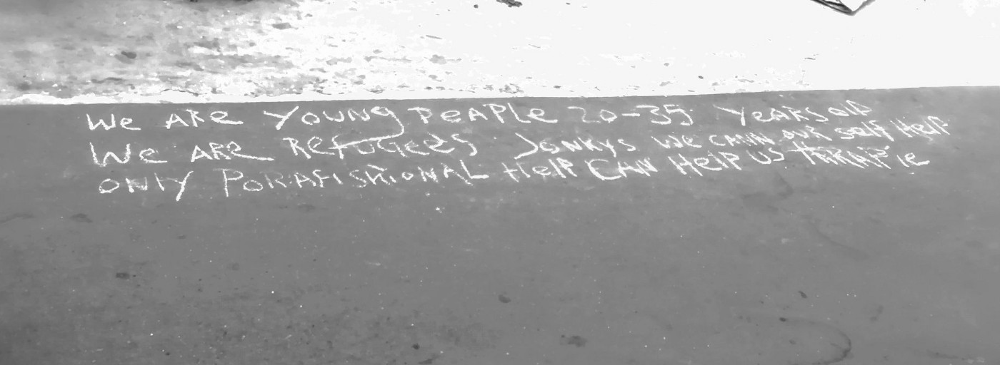

### **أسوأ مأساة هذا العام**
#### AYS Weekly News Summary in Arabic, July 22–28

### **ليبيا**

حدثت مأساة أخرى في وسط البحر المتوسط ​​، حيث انقلب قاربان قبالة الساحل الليبي ، حول خوم ، مما عرّض حياة ٣٠٠ شخص للخطر\. ما زال نصفهم في عداد المفقودين ويخشى أن يغرقوا ، بينما تم إنقاذ ١٤٥ ونقلهم إلى الأراضي الليبية\.

هذا يمثل أسوأ مأساة في البحر حتى الآن في عام ٢٠١٩\.

في نفس الوقت الذي وقعت فيه هذه المأساة ، وافق البرلمان الإيطالي على

\(ديكيرتو\) الشهير ، الذي اقترحه \(سالفيني\)، والذي يجب أن يوافق عليه أو يطرده مجلس الشيوخ بحلول منتصف أغسطس\. إذا أصبح هذا المرسوم قانونًا ، فسوف يمثل هجومًا إضافيًا على التشريعات الإنسانية وانجرافًا فاشيًا إضافيًا للبلد وخطرًا على عمليات البحث والإنقاذ\.

■■■■■■■■■■■■■■ 
> **[Jeff Crisp](https://twitter.com/JFCrisp) @ Twitter Says:** 

> > But why did it take so long, so many deaths and such suffering, for this consensus to be reached? 
And - and even bigger question - will that consensus lead to concrete action? 

> **Tweeted at [2019-07-22 18:26:08](https://twitter.com/jfcrisp/status/1153370658027560961).** 

■■■■■■■■■■■■■■ 

### **المغرب**

مزيد من العنف ضد الناس أثناء التنقل في الناظور\. تقوم الشرطة بمداهمة وتدمير اشياء الناس باسم الأمن الأوروبي\.
### **اليونان**
#### ساموس

يجب الإفراج فوراً عن المهاجرين المحتجزين في مقر شرطة خانيا\. قبل أسبوعين ، تم احتجاز المهاجرين الذين كانوا يشاركون في دروس اللغة وغيرها من الأنشطة في مركز محلي ، والذي تضاعف كملجأ لهم ، في مركز الشرطة كخطوة صيفية “لتطهير” المدينة لموسم الصيف\.

[لمزيد من المعلومات هنا\.](http://www.haniotika-nea.gr/to-kinoniko-steki-steki-metanaston-gia-tis-kratisis-metanaston-sto-astinomiko-megaro/?fbclid=IwAR2W6e5R-28RUWyEY139Nt_03U6MD_i4CqIv7JE06fsF0oa5E0PdpPwuPxI&source=post_page---------------------------)
### **طريق البلقان**

### البوسنة

بعد دخول البوسنة والهرسك ، يحق للمهاجرين تسجيل طلب اللجوء — إذ يتيح لهم ذلك البقاء في البلاد بشكل قانوني لمدة ١٤ يومًا قبل أن يتقدموا بطلب رسمي للجوء أو يغادروا البلاد\. حتى الآن ، منذ بداية عام ٢٠١٦، لم يتمكن سوى ١٦٠٠ طالب لجوء من تسجيل طلباتهم ، أي أقل من ٥ ٪ من إجمالي الوافدين\. \(المصدر: مفوضية الأمم المتحدة لشؤون اللاجئين في البوسنة والهرسك\) \. شرط تسجيل عنوان مؤقت في البوسنة والهرسك هو عقبة رئيسية

لا تزال ظروف الجميع في البوسنة مروعة ، داخل أو خارج المعسكرات الرسمية\. يتم نقل العديد من الأشخاص إلى موقع معسكر فوجياك سيئ السمعة عند مواجهتهم في مدينة بيهاتش ، حتى عندما يكون لديهم بطاقة مخيم بالفعل\.

نشجع كل من تحمل العنف على الكتابة لنا حتى نتمكن من الإبلاغ عن مثل هذه الحالات\.
### سلوفينيا

على الرغم من أن سلوفينيا صرحت بأنها لن تبني جدارًا على طول الحدود الإيطالية ، على الأقل قبل أن ترى ما هي نتائج نشر دوريات الحدود المختلطة ، إلا أنها طبقت إجراءين مهمين: نشر ٣٥ جنديًا آخر على طول الحدود الحدود الكرواتية ، للمساعدة في عمل عملاء الحدود ، مع الطائرات بدون طيار والعربات المدرعة وبناء سياج من الأسلاك الشائكة لمدة ٤٠ كم إضافية\.
### **الترحيل**

هناك عدد متزايد من تنبيهات الترحيل من النمسا وألمانيا في الأيام الماضية

ملاحظة :\- من الجيد لك ان تتابع بعض الصفحات على فيسبوك التي تحذر من الترحيل

منذ منتصف يوليو ، احتجت الأسر الأفغانية في السويد على الترحيل الوشيك إلى أفغانستان\. لقد شكلوا الآن شبكة تدعى ليف أوتان غرينزر \(الحياة بلا حدود\) تطالب بإعمال حقوق المرأة والطفل ووضع حد فوري لترحيل الأسر إلى الأفغان

**يتوفر الكثير من الأخبار باللغة الإنجليزية يوميًا على صفحتنا في موقع الميديوم**

**في حال كان لديك أسئلة أو ترغب في نشر معلومات معينة ذات صلة بإجراءات اللجوء أو بلد اخباره مهمة ، يرجى عدم التردد في الكتابة إلينا — إما عن طريق إرسال رسالة إلينا على فيسبوك أو إرسال بريد إلكتروني إلى**

[**areyousyrious@gmail\.com**](mailto:areyousyrious@gmail.com)

_Converted [Medium Post](https://medium.com/are-you-syrious/%D8%A3%D8%B3%D9%88%D8%A3-%D9%85%D8%A3%D8%B3%D8%A7%D8%A9-%D9%87%D8%B0%D8%A7-%D8%A7%D9%84%D8%B9%D8%A7%D9%85-94af02a96114) by [ZMediumToMarkdown](https://github.com/ZhgChgLi/ZMediumToMarkdown)._
