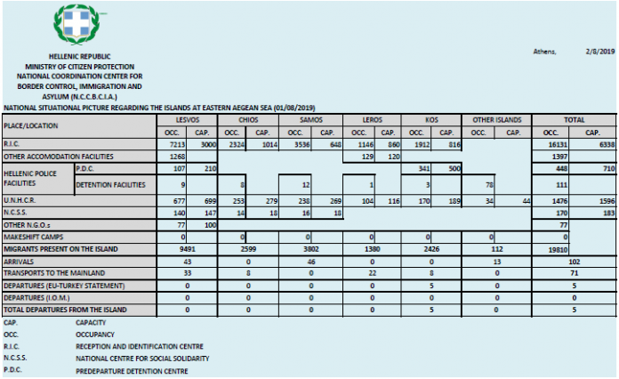

### أن الغالبية العظمى من القرارات هي سلبية وظلت كذلك
#### AYS Weekly News Summary in Arabic, July 29 — August 4

](assets/550885bb3c1a/1*UHVKhXhxeZ-i-zw3wZjB0A.jpeg)

[Fabio Magnasciutti](http://www.cartoonmovement.com/p/5317)
### **البوسنه والهرسك**
#### تحديث من فوتشاك

تم نقل عدد كبير من الأشخاص أثناء تنقيلهم إلى معسكر فوتشاك من قبل الشرطة البوسنية ، وفقًا للمتطوعين الطبيين الذين يعملون في المنطقة\. يوجد الآن أكثر من ١٠٠٠ شخص يعيشون في المخيم\. أفاد الفريق الطبي أنه شاهد أكثر من ١٠٠ شخص في هذا الأسبوع\. أصبح المخيم أكثر اكتظاظًا ، مع وجود مساحة صغيرة بين الخيام\. يقدم الصليب الأحمر الطعام ، لكن لا يوجد في كثير من الأحيان ما يكفي لإطعام المخيم\.

](assets/550885bb3c1a/0*3ztpo9K3Mp50zKgv.jpeg)

Photo Credit: [Dirk Planert](https://www.facebook.com/dirk.planert?__tn__=%2CdCH-R-R&eid=ARAthPMK9L0V_OynZxA4UWI7c-4swZTxu_DgaUj03pMAT0nVw-CHhuW7c5WKp2D87jze_P_-gl94asqH&hc_ref=ARSyC23lBENzPLq6-zX9rIIlL09bBVGrKqAtQE2UYhvEmNvFFOV2liHP8oJ4Q-qV_lE&fref=nf&hc_location=group)
### **ايطاليا**

تم نقل حوالي ٦٠٠ طالب لجوء من فريولي فينيتسيا جوليا إلى مناطق أخرى\. وقد نُقل عدد من هؤلاء الأشخاص إلى غوريزيا ، والبعض الآخر إلى مركز كارا للاحتجاز\.

اكتشفت شرطة أوديني ١١ طالب لجوء يعيشون في قبو بعض المباني قيد الإنشاء بالقرب من استاد المدينة\. تم اعتقالهم جميعًا\.
### **فرنسا**
#### قواعد مجلس الدولة ضد محاولة تجريد “اللاجئين” من حقوق الإقامة والبدل

حكم مجلس الدولة الفرنسي يوم الأربعاء ضد مرسوم مدرج في قانون اللجوء والهجرة\. أعطى المرسوم المذكور مكتب الهجرة والتكامل الحق في رفض مساعدة المهاجرين واللاجئين في الحصول على سكن أو بدل ، وخاصة للأشخاص الذين أعيدوا إلى فرنسا بموجب لوائح “دبلن”\. وجدت المحكمة أن هذا المرسوم “لا يتوافق مع القانون الأوروبي”\.

منظمة \(باص معلومات اللاجئين \) تبحث عن أموال لمشروع الهاتف المحمول الخاص بهم للاجئين في كاليه\. كل أسبوع ، يتم استخدام هواتفهم لإجراء مكالمات عاجلة من قبل عشرات اللاجئين\. يمكنك دعمهم هنا\.
### **تركيا**

في الأسبوعين الأخيرين ، زادت الأخبار حول الترحيل الجماعي للاجئين السوريين من المدن التركية ، وخاصة اسطنبول ، إلى شمال سوريا بشكل كبير\. يُزعم أن السلطات استهدفت كلًا من الأشخاص الموثقين وغير الموثقين وأجبرتهم على توقيع أوراق “الإجازة التطوعية” قبل ترحيلهم\. هنا هي الحالة الأخيرة التي سمعنا عنها\.

كما أفاد انفوميكرنت ، يرفض المسؤولون الأتراك هذه المزاعم ، لكنهم تباهوا مؤخرًا بأنهم “طردوا ١٥٠٠٠مهاجر غير شرعي من إسطنبول في العشرين يومًا الماضية ، من بينهم ٢٦٣٠ مواطن سوري” ، الذين يقال إنهم وصلوا إلى مراكز الاحتجاز خارج المدينة\.
### **الوضع في الجزر**

وفقا لبيانات الحكومة ، ١٩١٠١٠ شخص في الجزر الشرقية اليونانية\. تم حجز ١٣١٦١نقطة في النقاط الخمسة الساخنة ، على الرغم من سعة ٦٣٣٨نقطة\.

### **الاتحاد الاوربي**
#### اتجاهات اللجوء

تم تقديم ٢٨٧٥٠٠ طلب لجوء منذ بداية العام ، بزيادة قدرها ١٤ ٪ مقارنة بنفس الفترة من عام ٢٠١٨ ، وفقًا لإحصاءات \(ي ا س و\) \. علاوة على ذلك ، كان هناك المزيد من الأشخاص الذين كانوا يلتمسون اللجوء في بداية عام ٢٠١٩ مقارنة بنهاية عام ٢٠١٨ ، على الرغم من أن الطلبات عادة ما تبلغ ذروتها خلال أشهر الصيف والخريف\. بشكل عام ، اتجاهات اللجوء في عام ٢٠١٩ هي استمرار لزيادة عدد طلبات اللجوء المقدمة في الاتحاد الأوروبي في خريف عام ٢٠١٨ ،

تم تقديم ٣٪ من جميع الطلبات في شهر مايو من قِبل القُصَّر غير المصحوبين بذويهم\. هذا العدد الكبير من المتقدمين يو ام من أفغانستان لم يسبق له مثيل منذ عامين ونصف العام ، وتقارير \(ي ا س و\) \.

على عكس المفاهيم العامة بين الأوروبيين ، كانت أكثر بلدان المتقدمين في مايو سوريا وأفغانستان وفنزويلا\.

**على الخريطة التفاعلية الخاصة بهم يمكنك أن ترى أن الغالبية العظمى من القرارات هي سلبية وظلت كذلك\.**

### **ليبيا**

يتزايد عدد الأشخاص المصابين بمرض السل في مركز احتجاز الزنتان منذ أن بدأت منظمة أطباء بلا حدود العمل في المخيم ، وفقاً للصحفية سالي هايدن\. تشير التقديرات إلى أن أكثر من ٨٠ في المائة من المحتجزين مصابون بالمرض في الوقت الحالي ، لكن حتى أيام قليلة مضت ، لم تكن هناك إحالات إلى المستشفيات منذ شهور\.

■■■■■■■■■■■■■■ 
> **[Sally Hayden](https://twitter.com/sallyhayd) @ Twitter Says:** 

> > Update from Zintan dc, where TB diagnoses are continuing since MSF started working there. IMC, who were previously responsible for medical care, estimated more than 80% of detainees have TB yet weren’t doing hospital referrals for months. [twitter.com/sallyhayd/stat…](https://twitter.com/sallyhayd/status/1143836312052674563?s=21) https://t.co/PHAr5znJwf 

> **Tweeted at [2019-07-29 14:31:17](https://twitter.com/sallyhayd/status/1155848272319307777).** 

■■■■■■■■■■■■■■ 

**يتوفر الكثير من الأخبار باللغة الإنجليزية يوميًا على صفحتنا في موقع الميديوم**

**في حال كان لديك أسئلة أو ترغب في نشر معلومات معينة ذات صلة بإجراءات اللجوء أو بلد اخباره مهمة ، يرجى عدم التردد في الكتابة إلينا — إما عن طريق إرسال رسالة إلينا على فيسبوك أو إرسال بريد إلكتروني إلى**

[**areyousyrious@gmail\.com**](mailto:areyousyrious@gmail.com)

_Converted [Medium Post](https://medium.com/are-you-syrious/%D8%A3%D9%86-%D8%A7%D9%84%D8%BA%D8%A7%D9%84%D8%A8%D9%8A%D8%A9-%D8%A7%D9%84%D8%B9%D8%B8%D9%85%D9%89-%D9%85%D9%86-%D8%A7%D9%84%D9%82%D8%B1%D8%A7%D8%B1%D8%A7%D8%AA-%D9%87%D9%8A-%D8%B3%D9%84%D8%A8%D9%8A%D8%A9-%D9%88%D8%B8%D9%84%D8%AA-%D9%83%D8%B0%D9%84%D9%83-550885bb3c1a) by [ZMediumToMarkdown](https://github.com/ZhgChgLi/ZMediumToMarkdown)._
