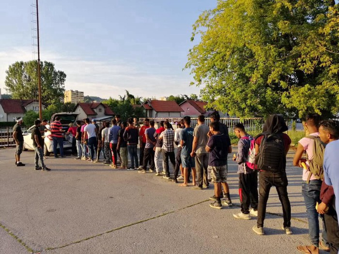

### اروپا نیاز به توقف حمایت و کار در کنار لیبی دارد
#### AYS Weekly News Summary in Persian, July 15–21

](assets/8a2ee7a4107/0*QcXiMDFhWjKJb5Sd.jpeg)

Photo — [**Sara Creta**](https://twitter.com/saracreta)
### **لیبی**

MSF مانند دیگران به این مساله ادامه می‌دهد که مرکز بازداشت تایورا نمی‌تواند به دلیل خشونت و بی‌توجهی کامل به حقوق بشر از طریق بی‌قانونی در لیبی ، وضعیت زندگی انسانی انسانی را از راه دور تشکیل دهد \.

بعد از حمله هوایی وحشتناک در ۲ جولای ، تخمین زده شد که ۶۰ نفر کشته و ۷۰ نفر زخمی شدند \. پزشکان صحنه را با اجساد همه جا توصیف کردند و قسمت‌های بدن که از زیر آوار بیرون‌زده بودند ، صحنه‌ای بود که هفته گذشته در مدیترانه متوقف شده‌بود و مجبور به بازگشت به تایورا شد \.

MSF تاکید می‌کند که چرخه خشونت برای افرادی که در مراکز بازداشت لیبی زندگی می‌کنند نیاز به محکومیت ندارد، بلکه نیاز به اقدام دارد\. اروپا نیاز به توقف حمایت و کار در کنار لیبی دارد \.
### **یونان**

حدود 19,000 نفر در اردوگاه‌های پرجمعیت در جزایر اژه زندگی می‌کنند \. درخواست پناهندگان از استان اژه در روز ورود به جزیره یونانی ، لطفا ً صفحه خود را برای اطلاعات تفصیلی در مورد آن دنبال کنید \.
### **بوسنی**

از ژانویه ۲۰۱۸ ، تقریبا ً 36,000 تن در این حرکت وارد شدند و در بوسنی به ثبت رسیدند \. اکنون تخمین زده می‌شود که ۷۴۰۰ نفر ساکن این کشور هستند که ۴۱۰۰ در محل اقامت آن‌ها در اتحادیه اروپا اقامت دارند \. بوسنی و هرزگوین در همین بازه زمانی ، 24,000,000 را دریافت کردند \.

مقامات اتحادیه اروپا در مورد چالش‌های مهاجرت که بوسنی و بوسنی با آن‌ها مواجه هستند و نحوه واکنش به آن‌ها بحث و تبادل نظر کردند \. طبق متن منتشر شده پس از نشست سطح بالای بوسنی و هرزگوین ، کمیسیون اروپا از تعهد مقامات بوسنی و هرزگوین برای تقویت هماهنگی خود در اداره مهاجرت استقبال می‌کند \. در این زمینه ، کمیسیون یک متخصص ارشد برای پشتیبانی از ساختارهای هماهنگی مربوطه فراهم خواهد کرد \.

در همین حال ، کمیسیون اروپا اظهار تاسف کرد که بوسنی و هرزگوین به رغم آمادگی کمیسیون برای تامین حمایت مالی لازم ، موقعیت‌های مناسبی برای امکانات پذیرش اضافی پیشنهاد نکرده است \. کمیسیون بوسنی و هرزگوین را به شناسایی تسهیلات مناسب بدون تاخیر بیشتر تشویق می‌کند \.

در خبرهای دیگر ، اخبار زیادی ارایه نشد \. شرایط پناهندگان و مهاجران در بوسنی به مراتب کم‌تر از استانداردهای حداقلی هستند \. این نشست به زمستان آینده که در آن نیاز به یک‌بار دیگر حتی بیشتر از ماه‌های تابستان خواهد بود ، توجه کرد \.

 \| [Pomoc izbjeglicama u BiH/Aid to Refugees in Bosnia and Herzegovina](https://www.facebook.com/groups/144469886266984/?ref=nf_target&fref=nf&source=post_page---------------------------)](assets/8a2ee7a4107/0*hPIx5pcH-LOq-4VU.jpeg)

Photos: [Senad Cupo](https://www.facebook.com/profile.php?id=1032645245&source=post_page---------------------------) \| [Pomoc izbjeglicama u BiH/Aid to Refugees in Bosnia and Herzegovina](https://www.facebook.com/groups/144469886266984/?ref=nf_target&fref=nf&source=post_page---------------------------)

علاوه بر این , داوطلبان محلی در توزلا هنوز شکاف را پوشش می‌دهند \. بسیاری از تازه‌ واردها در این شهر وجود دارند و تنها داوطلبان سازماندهی‌شده خصوصی نسبت به جریان واکنش نشان می‌دهند , هیچ استقبال رسمی و استقبال رسمی وجود ندارد و شهردار شهر گفت که هیچ پذیرش سازماندهی‌شده از پناهندگان برای جلوگیری از وضعیت موجود در بیهاچ وجود نخواهد داشت \. در بیهاچ , پلیس هنوز توسط پلیس متوقف می‌شود و در اردوگاه بدنام در حومه ووتسیاک , حتی آن‌هایی که از اردوگاه رسمی بیرا که توسط سازمان بین‌المللی مهاجرت اداره می‌شود , استفاده می‌کنند \. حتی با وجود اینکه صلیب‌سرخ گزارش می‌دهد که مردم از نظر پزشکی مورد معاینه قرار می‌گیرند , باید بگوییم که آن‌ها تنها چند داوطلب هستند که قبلا ً در سراسر یونان فعال بوده‌اند و اکنون برای کمک به اینجا آمده‌اند , اما این کار در برخی روزها به پایان می‌رسد و هیچ کمک پزشکیه پایداری وجود ندارد ; چرا که سازمان‌های بین‌المللی از کل پروژه اردوگاه پشتیبانی می‌کنند\. اگر به اطلاعات بیشتر نیاز دارید با ما تماس بگیرید\.
### **کرواسی**

پس از پیشرفت‌های اخیر، با رئیس‌جمهور این حقیقت را محکوم کرد که دیپورت به عقب همیشه غیر قانونی است و احتمال این وجود دارد که این اولین باری باشد که پلیس گفته‌است که فرماندهان در حال دستور دادن به خشونت و اقدامات غیرقانونی هستند \.

گزارش‌های بیشتری از گروه‌های پناهندگان که چند روز در حال راه رفتن بودند ، توسط پلیس کرواسی جمع‌آوری شده‌است \. اطلاعات بیشتر و اطلاعات بیشتر در اینجا \. این وب سایت با ارزش، برای اطلاعات در مورد پرورشگاه در کرواسی ، اتریش ، ایتالیا و اسلوونی است \.
### **اسپانیا**

دولت اسپانیا قول داده‌است که ۳۰ میلیون یورو به مراکش کمک کند تا از ورود مردم به اسپانیا جلوگیری کند \. این به علاوه ۱۴۰ میلیون یورو که قبلا ً توسط اتحادیه اروپا وعده داده شده‌بود، برای اطلاعات بیشتر در مورد انواع که اغلب از این برنامه‌های تامین مالی سود می‌برند ، این مقاله را در زمینه مدیریت مرزی و تولید سلاح مورد بررسی قرار می‌دهد \.

با این حال ، همانطور که انتظار می‌رفت ، نشست وزرای داخله از سراسر اروپا به بن‌ بست باقی ماند و سالوونی طرحی را رد کرد که توسط آلمان و فرانسه برای توزیع در سراسر اروپا پیشنهاد شده بود چرا که برخی از آن‌ها به ایتالیا خواهند رفت \. برای اطلاعات بیشتر ، بروید به InfoMigrants

■■■■■■■■■■■■■■ 
> **[Charlie Yaxley](https://twitter.com/yaxle) @ Twitter Says:** 

> > Population of the EU: 512,000,000

Arrivals to Europe across Mediterranean Sea in 2019: 31,947

In other words, 0.01%

The numbers are few. The situation is manageable. 
 
#portichiusi We Stand #WithRefugees https://t.co/d8mUasCBWw 

> **Tweeted at [2019-07-19 07:54:37](https://twitter.com/yaxle/status/1152124567646867457).** 

■■■■■■■■■■■■■■ 

### **انگلستان**

کمک به پناهندگان در حال جلب توجه به این واقعیت است که کودکان مهاجر یا پناهندگی که به دنبال خانواده‌هایی می‌گردند که دیگر به بودجه عمومی یا حمایت اجتماعی دسترسی ندارند ، واجد شرایط برنامه‌های ناهار مدرسه نیستند \. آن‌ها با NELMA هم‌کاری می‌کنند تا بر موسسات فشار وارد کنند تا اطمینان حاصل کنند که این مورد نیست \. ناهار تجملی نیست \. برای اطلاعلت بیشتر به اینجا بروید \.

**اخبار بیشتری به انگلیسی در صفحه رسانه ما در دسترس است \. در مواردی که شما سوالاتی دارید و یا مایلید برخی اطلاعات مربوط به روند پناهندگی شما یا کشور مورد نظر را منتشر کنید , لطفا ً برای نوشتن پیغام روی فیس بوک یا نوشتن یک ایمیل به آر\.یو\.س تردید نکنید**

[**areyousyrious@gmail\.com**](mailto:areyousyrious@gmail.com)

_Converted [Medium Post](https://medium.com/are-you-syrious/%D8%A7%D8%B1%D9%88%D9%BE%D8%A7-%D9%86%DB%8C%D8%A7%D8%B2-%D8%A8%D9%87-%D8%AA%D9%88%D9%82%D9%81-%D8%AD%D9%85%D8%A7%DB%8C%D8%AA-%D9%88-%DA%A9%D8%A7%D8%B1-%D8%AF%D8%B1-%DA%A9%D9%86%D8%A7%D8%B1-%D9%84%DB%8C%D8%A8%DB%8C-%D8%AF%D8%A7%D8%B1%D8%AF-8a2ee7a4107) by [ZMediumToMarkdown](https://github.com/ZhgChgLi/ZMediumToMarkdown)._
