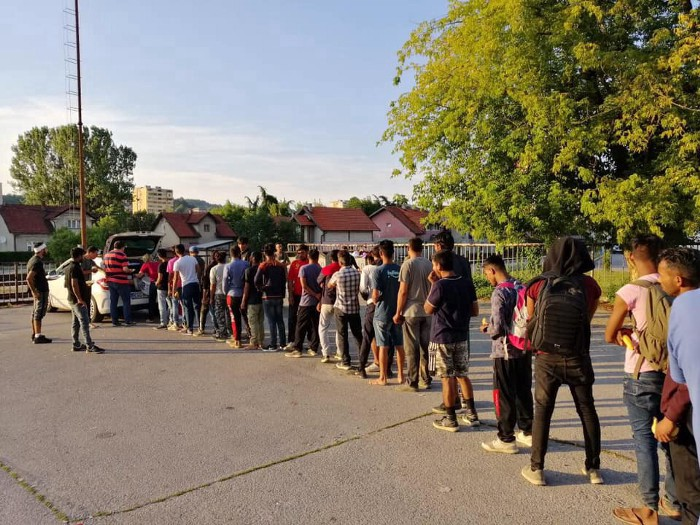

### تحتاج أوروبا إلى التوقف عن الدعم والعمل بجانب ليبيا
#### AYS Weekly News Summary in Arabic, July 15–21

 **\-** Photo](assets/748cbfcad7e4/1*i8lc7eiurxgXe4VtRii1bg.jpeg)

[**Sara Creta**](https://twitter.com/saracreta) **\-** Photo
### **ليبيا**

تواصل منظمة أطباء بلا حدود ، مثلها مثل غيرها ، لتلاحظ أن مركز احتجاز تاجوراء لا يمكن أن يشكل عن بعد حالة معيشية إنسانية بسبب العنف والتجاهل التام لحقوق الإنسان من خلال انعدام القانون في ليبيا\.

بعد الغارة الجوية المروعة في ٢ يوليو ، تشير التقديرات إلى مقتل ٦٠ شخصًا وإصابة ٧٠ شخصًا بجروح\. وصف الأطباء المشهد بأجساد في كل مكان “وأجزاء من الجسم تخرج من تحت الأنقاض”\. لقد كان مشهدًا كان يجب أن يطارد ٩٠ شخصًا تم اعتراضهم في البحر الأبيض المتوسط ​​الأسبوع الماضي ، وأجبروا على العودة إلى تاجوراء\.

تكرر منظمة أطباء بلا حدود أن دائرة العنف ضد الأشخاص الذين يعيشون في مراكز الاحتجاز الليبية لا تحتاج فقط إلى الإدانة ، إنها بحاجة إلى عمل\. تحتاج أوروبا إلى التوقف عن الدعم والعمل بجانب ليبيا
### **اليونان**

يعيش الآن حوالي ١٩٠٠٠ شخص في مخيمات مكتظة في جزر بحر إيجه الآن\. تقدم وكالة دعم اللاجئين إيجة تقارير يومية عن الوافدين إلى الجزيرة اليونانية ، يرجى اتباع صفحتهم للحصول على معلومات مفصلة عن ذلك\.
### **البوسنة والهرسك**

منذ يناير ٢٠١٨ ، وصل ما يقرب من ٣٦٠٠٠ شخص على هذه الخطوة وتم تسجيلهم في البوسنة\. يقدر الآن أن هناك ٧٤٠٠ شخص يقيمون في البلاد ، منهم ٤١٠٠ يقيمون في أماكن إقامة بتمويل من الاتحاد الأوروبي\. خلال نفس الفترة الزمنية ، تلقت البوسنة والهرسك مبلغ ٢٤٠٠٠٠٠٠ يورو\.

التقى مسؤولو الاتحاد الأوروبي وناقشوا تحديات الهجرة التي تواجه البوسنة وكيفية الرد عليها\. وفقًا للنص الصادر بعد الاجتماع الرفيع المستوى للبوسنة والهرسك بشأن الهجرة ، ترحب المفوضية الأوروبية بالتزام سلطات البوسنة والهرسك بتعزيز تنسيقها في إدارة الهجرة\. في هذا السياق ، ستوفر اللجنة خبيرًا كبيرًا لدعم هياكل التنسيق ذات الصلة\.

وفي نفس الوقت ، تأسف المفوضية الأوروبية لأن البوسنة والهرسك لم تقترح مواقع مناسبة لمرافق استقبال إضافية ، على الرغم من استعداد المفوضية لتوفير الدعم المالي اللازم\. تحث اللجنة سلطات البوسنة والهرسك على تحديد المرافق المناسبة دون مزيد من التأخير\.

في أخبار أخرى ، لم يتم توفير الكثير من الأخبار\. ظروف اللاجئين والمهاجرين في البوسنة والهرسك هي أقل بكثير من المعايير الدنيا\. كما أولي الاجتماع بعض الاهتمام بالشتاء المقبل — حيث ستكون الاحتياجات ، مرة أخرى ، أكبر مما كانت عليه خلال أشهر الصيف\.

علاوة على ذلك ، لا يزال المتطوعون المحليون في توزلا يغطون الفجوات\.

 \| [Pomoc izbjeglicama u BiH/Aid to Refugees in Bosnia and Herzegovina](https://www.facebook.com/groups/144469886266984/?ref=nf_target&fref=nf&source=post_page---------------------------)](assets/748cbfcad7e4/0*Nzs3DzWloCmE9a_Y.jpeg)

Photos: [Senad Cupo](https://www.facebook.com/profile.php?id=1032645245&source=post_page---------------------------) \| [Pomoc izbjeglicama u BiH/Aid to Refugees in Bosnia and Herzegovina](https://www.facebook.com/groups/144469886266984/?ref=nf_target&fref=nf&source=post_page---------------------------)

هناك العديد من الوافدين الجدد إلى تلك المدينة ، ويتفاعل المتطوعون المنظمون فقط مع التدفق ، ولا يوجد استقبال رسمي واستقبال ، وقال عمدة المدينة إنه لن يكون هناك استقبال منظم للاجئين لتجنب الوضع الذي تطور في بيهاتش\.

في بيهاتش ، لا تزال الشرطة تُوقف الناس وتُنقل إلى معسكر فويجاك الشهير في ضواحي المدينة ، حتى أولئك الذين يحملون بطاقات من معسكر بيرا الرسمي القريب الذي تديره المنظمة الدولية للهجرة\.

على الرغم من أن الصليب الأحمر يفيد بأن الأطباء يخضعون للفحص الطبي من قبل الأطباء ، إلا أننا يجب أن نقول إن هؤلاء ليسوا سوى عدد قليل من المتطوعين الذين كانوا ناشطين سابقًا في جميع أنحاء اليونان وقد أتوا الآن للمساعدة هنا لفترة من الوقت ، لكن هذا ينتهي في بعض الأيام ، وهناك ليست معونة طبية مستدامة ، لأن المنظمات الدولية لا تدعم المشروع بأكمله للمخيم هناك\.

اتصل بنا إذا كنت بحاجة إلى مزيد من المعلومات\.
### **كرواتيا**

بعد التطورات الأخيرة ، مع إدانة الرئيس لحقيقة أن التراجع غير قانوني دائمًا ، واحتمال أن تكون هذه هي المرة الأولى التي تقول فيها الشرطة إن القادة يأمرون بالعنف والإجراءات غير القانونية — تم ملاحظة المزيد من الوافدين الجدد\.

هناك المزيد من التقارير عن مجموعات من اللاجئين ، الذين كانوا يمشون لعدة أيام ، يتم التقاطهم من قبل الشرطة الكرواتية\. الفيديو والمزيد من المعلومات هنا\.

فيما يلي موقع ويب قيم للحصول على معلومات حول اللجوء في كرواتيا والنمسا وإيطاليا وسلوفينيا
### **إسبانيا**

وعدت الحكومة الإسبانية ٣٠ مليون يورو للمغرب لمساعدة المغرب في منع الناس من الوصول إلى إسبانيا\. هذا بالإضافة إلى ١٤٠ مليون وعدهم الاتحاد الأوروبي بالفعل\. لمزيد من المعلومات حول أنواع الكيانات التي تستفيد غالبًا من برامج التمويل هذه ، راجع هذه المقالة حول إدارة الحدود وتصنيع الأسلحة\.

ومع ذلك ، كما هو متوقع ، بقي اجتماع وزراء الداخلية من جميع أنحاء أوروبا في طريق مسدود ، حيث رفض سالفيني خطة اقترحتها ألمانيا وفرنسا لتوزيعها في جميع أنحاء أوروبا لأنها تنطوي على الذهاب إلى إيطاليا\. لمعرفة المزيد ، انتقل الى انفو ميكرنت

■■■■■■■■■■■■■■ 
> **[Charlie Yaxley](https://twitter.com/yaxle) @ Twitter Says:** 

> > Population of the EU: 512,000,000

Arrivals to Europe across Mediterranean Sea in 2019: 31,947

In other words, 0.01%

The numbers are few. The situation is manageable. 
 
#portichiusi We Stand #WithRefugees https://t.co/d8mUasCBWw 

> **Tweeted at [2019-07-19 07:54:37](https://twitter.com/yaxle/status/1152124567646867457).** 

■■■■■■■■■■■■■■ 

### **المملكة المتحدة**

تسترعي منظمة “مساعدة اللاجئين” الانتباه إلى أن أطفال المهاجرين أو العائلات التي تسعى للحصول على اللجوء والذين لم يعد بإمكانهم الوصول إلى الأموال العامة أو الدعم الاجتماعي غير مؤهلين للحصول على برامج الغداء المدرسي\. إنهم يتشاركون مع نيلاما للضغط على المؤسسات لضمان أن الأمر ليس كذلك\. الغداء ليس ترفا\. للمزيد ، اذهب هنا\.

**يتوفر الكثير من الأخبار باللغة الإنجليزية يوميًا على صفحتنا في موقع الميديوم**

**في حال كان لديك أسئلة أو ترغب في نشر معلومات معينة ذات صلة بإجراءات اللجوء أو بلد اخباره مهمة ، يرجى عدم التردد في الكتابة إلينا — إما عن طريق إرسال رسالة إلينا على فيسبوك أو إرسال بريد إلكتروني إلى**

[**areyousyrious@gmail\.com**](mailto:areyousyrious@gmail.com)

_Converted [Medium Post](https://medium.com/are-you-syrious/%D8%AA%D8%AD%D8%AA%D8%A7%D8%AC-%D8%A3%D9%88%D8%B1%D9%88%D8%A8%D8%A7-%D8%A5%D9%84%D9%89-%D8%A7%D9%84%D8%AA%D9%88%D9%82%D9%81-%D8%B9%D9%86-%D8%A7%D9%84%D8%AF%D8%B9%D9%85-%D9%88%D8%A7%D9%84%D8%B9%D9%85%D9%84-%D8%A8%D8%AC%D8%A7%D9%86%D8%A8-%D9%84%D9%8A%D8%A8%D9%8A%D8%A7-748cbfcad7e4) by [ZMediumToMarkdown](https://github.com/ZhgChgLi/ZMediumToMarkdown)._
