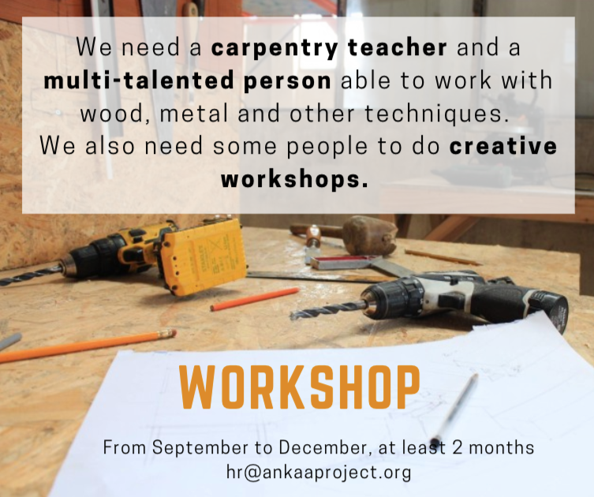
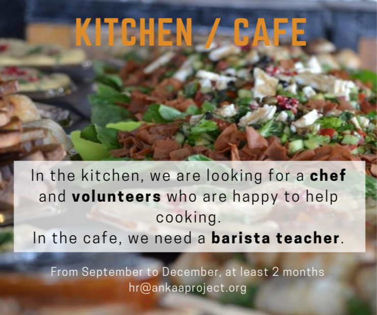
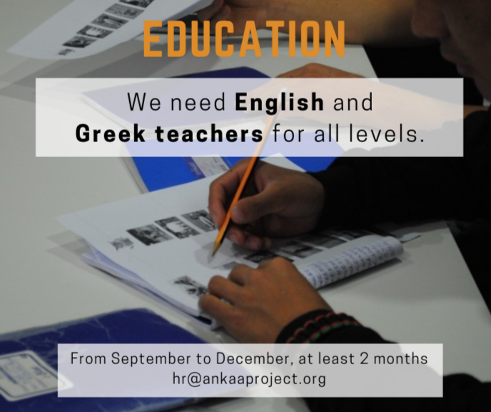
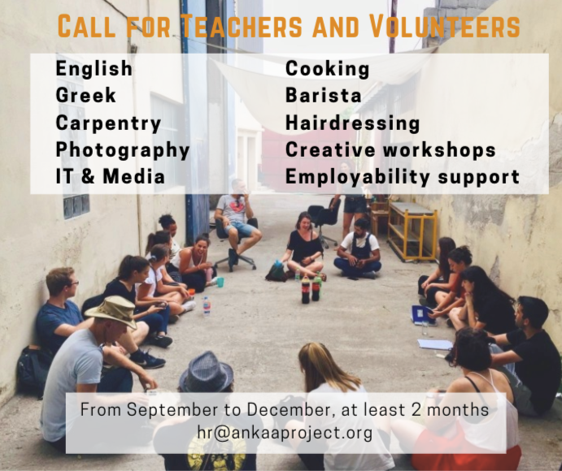
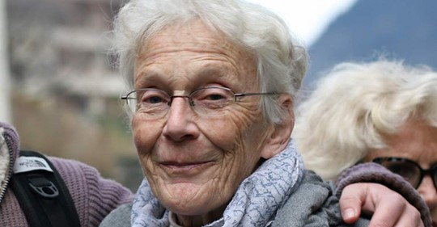

### AYS Daily Digest 19/08/19: Ahead of the Controversial ‘ **Orderly Return Bill’ in Germany**
#### A man rescued off the Libyan coast dies / In Turkey, unregistered Syrians to return to the province they are registered in / 8\+1 people evacuated from Open Arms, the crew urges for disembarkation as they fear navigating 5 more days could be dangerous for people on board / EU allocates €10m more to Bosnia and Herzegovina / Switzerland ahead of a trial to a **73\-year\-old woman convicted and fined in her efforts to help / & more news**

](assets/86eeb00947d9/1*3q89Av0MCrijA1bRvXotkg.jpeg)

Yet another large shipwreck in the Mediterranean? — “A fisherman told us yesterday evening about a capsized boat off the coast of Libya\. He said he rescued 3 people and saw many dead bodies\. The survivors speak of 100\+ people on board\. At this stage we cannot verify this info but fear that another mass tragedy may have occurred\.” — [Watch The Med — Alarmphone](https://www.facebook.com/watchthemed.alarmphone/?tn-str=k%2AF&hc_location=group_dialog)
#### FEATURED

On 21 August 2019, the so\-called ‘Orderly Return Bill’ will come into force and change the life of many refugees and migrants in Germany for the worse\. There might also be some ‘improvements’, but these are mere cosmetic corrections and cannot obscure the fact that the bill is made to get ‘illegal’ migrants out of the country and make the life of those who remain as uncomfortable as possible\. The most serious changes are the following:
#### **1\.** **New Categories of ‘Tolerated Stay Permit’ \(“Duldung”\)**

A “Duldung”, a ‘Tolerated Stay Permit’, is issued to people who are not allowed to remain in Germany, but their deportation is impossible in fact or by law, e\.g\. because he or she doesn’t have a passport and would therefore not be allowed to enter the country of origin\. This ‘Tolerated Stay Permit’ comes with cuts to social benefits, prohibition to work, as well as an even more pronounced level of insecurity such a ‘permit’ gives\.

From this 21 August 2019 on, persons who are perceived by the authorities as ‘responsible’ for the impossibility of their deportation will receive a special ‘ **Tolerated Stay Permit for unidentified people’** For example: the authorities find that the person is reluctant to obtain a new passport from the embassy of their country of origin\. This status has even harsher consequences than the normal ‘Tolerated Stay Permit’: next to shortened social benefits and the prohibition to work, the time holding that status does not count as ‘tolerated stay’ in Germany\. What does that mean? To benefit from some legal opportunities, a certain number of months or years being ‘tolerated’ in Germany is necessary\. An example: juvenile or adolescent foreigners can receive a residence after 4 years of tolerated stay in Germany under certain conditions\. These pathways are not open to those with the ‘Tolerated Stay Permit for unidentified people’\. German lawmakers made sure that those holding this status shall never ever benefit from it on a long\-term perspective at all\.

On the other hand, the provision of the ‘ **Tolerated Stay Permit for the purpose of vocational training’** has been updated and the possibility of a ‘ **Tolerated Stay Permit for the purpose of work’** has been created\. But the requirements to receive such status are extremely high\. To be ‘tolerated for the purpose of work’, you will have to have already been ‘tolerated’ for 12 months, you will need to be employed for 18 months already with 35 hours/week and your livelihood must be secured by this employment\. The question is if someone who accomplished all that really needs a ‘Tolerated Stay Permit’ and is not entitled to be granted a better status than that\. In any case, only a handful of people will really benefit from this newly created status\.
#### **2\.** **Detention Pending Deportation**

The requirements of detention pending deportation have been lowered, so that individuals can be taken into pre\-deportation detention more easily\. One example: the burden of proof about the risk of absconding has been mostly shifted towards the individual\. Certain circumstances, for example an alleged lack of cooperation, can now imply the risk of absconding and hereby justify the pre\-deportation detention\. Another new reason for detention: a person, that is obligated to leave the country, misses a pre\-deportation\-appointment, for example at the embassy or a doctor, can now be taken into detention for up to 2 weeks\. A judicial order is not necessary\! Under the new law, pre\-deportation detainees also can be accommodated in normal detention centers, if they are accommodated separately from the normal detainees\.
#### **3\.** **Cuts to Social Benefits**

The German Constitutional Court held in 2012, that the social benefits for asylum seekers shall not fall short of the minimum subsistence level and that considerations of migration management \(in other words deterrence\) shall not influence the level of social benefits for asylum seekers\. That said, several groups of asylum seekers will face cuts of social benefits under the new law\. It remains to be seen \(in a couple of years time though\), what the German Constitutional Court thinks about the following cuts:

\- Asylum seekers who get a negative Dublin decision \(saying that another country is competent for their asylum request\) will only receive shortened benefits from that moment forth\.

\- Asylum seekers who already have a protection status in another EU\-country but nevertheless ask for asylum in Germany again will only receive shortened benefits as well\.

\- Asylum seekers with a protection status in another EU\-country who were finally rejected by the authorities and are obligated to leave the country will not receive any social benefits anymore\. They might get an interim aid for two weeks, but that’s all\. This even applies to family with children\.

\- And finally: people who live in camps will also receive less benefits, as they are considered to live in a shared household\.
#### **4\.** **18 Months in So\-Called “Anker”\-Centers**

Anker is the German word for anchor\. In this context is an abbreviation for ‘arrival’, ‘decision’ and ‘return’\. The idea is that asylum seekers remain in these isolated facilities until it is decided whether they have a right to stay or they must leave the country\. It means that people shall be prevented from starting a life in Germany until their status is fully approved by the authorities\. With the new law, the federal legal basis has been created to keep the asylum seekers for up to 18 months in these facilities\. For families with children the maximum duration shall remain 6 months\. Find more information about the situation in these “Anker”\-centres here: [https://www\.anker\-watch\.de/en/about\-us/](https://www.anker-watch.de/en/about-us/)
#### **5\.** **Criminalization of Supporters**

The date of a deportation has now been made a ‘secret’ under criminal law\. That means, that state officials who reveal such a date commit the crime of betrayal of state secrets\. Therefore, supporters or counsellors who communicate with the authorities could be liable for aiding and abetting when an official reveals such date to them\. It remains to be seen whether this will be the case, but activists and counsellors are already alarmed\.

As for the World Humanitarian Day, all we can say is that protecting and saving lives shouldn’t be regarded as a political matter, be it in the Mediterranean or in the Libyan official and unofficial detention centres, the French mountains, in the Channel, in the woods of Croatia’s Gorski kotar, on the pavements of Bosnian towns, across Hungary and Bulgaria, or on the Greek islands or the streets of Athens\. There is no speak of humanitarianism at the political level\. As long as we collectively let things continue the way they are now, the situation will continue to get worse\.

Solidarity and support to everyone who has been working and fighting for the people, in whatever way they can\.
#### LIBYA

**One of the people rescued off the coast of Libya has died** , Libya Observer reported\. The victim was together with 277 other migrants intercepted aboard 4 boats off the coasts of Homs, Zawiya and Tripoli\. The people were transferred to the naval base in Tripoli and in the ports of Homs and Zawiya, while some were transported directly to the reception centers left open in the country\.
#### SEARCH AND RESCUE

■■■■■■■■■■■■■■ 
> **[Oscar Camps](https://twitter.com/campsoscar) @ Twitter Says:** 

> > @[carmencalvo_](https://twitter.com/carmencalvo_) la ONG a la que represento, nunca ha puesto en duda la labor del gobierno en materia de Salvamento Marítimo. Ahora uds dicen que (18 días después) hacen un gran esfuerzo, y lanzan un mensaje para confundir a la opinión pública que no puedo dejar pasar: https://t.co/IlZSppm33H 

> **Tweeted at [2019-08-19 19:49:00](https://twitter.com/campsoscar/status/1163538375237873664).** 

■■■■■■■■■■■■■■ 

As the situation begins to resemble that of a Libyan detention center but in Italian territorial waters, 8 more people needed emergency evacuation off the Open Arms ship and the people have been stuck on board for 18 consecutive days\. 99 people now remain on the vessel\.

“The political debate should focus on root causes, war in Libya, asylum and migration management\. But gaining consensus has become more important than solving problems\!”, Filippo Grandi said\.

However, nobody seems to be doing any serious lobbying as we would presumably see the affects if honest efforts had been made by now\.

■■■■■■■■■■■■■■ 
> **[Oscar Camps](https://twitter.com/campsoscar) @ Twitter Says:** 

> > Durante todo este tiempo (repito, 18 dias) hemos pedido a nuestro gobierno que nos acompañe a denunciar al gobierno de Salvini por incumplir las leyes internacionales que ellos mismo se comprometieron a cumplir, y que España si cumple. https://t.co/ROSzpgvduZ 

> **Tweeted at [2019-08-19 19:57:17](https://twitter.com/campsoscar/status/1163540458024443904).** 

■■■■■■■■■■■■■■ 

In the meantime, the Open Arms crew say that they cannot face a trip of 600 miles \(965 km, at least 3 days of sialing\) to the Balear islands in the conditions in which the find themselves, Oscar Camps confirms\. The psychologists who have been onboard also explicitly oppose it\. 
More support arrives:

■■■■■■■■■■■■■■ 
> **[EMERGENCY](https://twitter.com/emergency_ong) @ Twitter Says:** 

> > La situazione su #OpenArms rischia di trasformare la barca in una polveriera che potrebbe scoppiare all'improvviso. Serve assistenza subito, non è pensabile che queste persone possano compiere un altro viaggio. Leggi il comunicato ⬇️ #fateliscendere [bit.ly/33Izz8a](https://bit.ly/33Izz8a) 

> **Tweeted at [2019-08-19 15:38:29](https://twitter.com/emergency_ong/status/1163475331040382976).** 

■■■■■■■■■■■■■■ 

> “Stop wondering what we want or need\. Ask yourself what the 107 people who have been overcrowded for 18 days on the deck of our ship need\. Do you know what they need? Disembark as soon as possible and receive the treatment that a first world person receives” — _Oscar Camps_ 

■■■■■■■■■■■■■■ 
> **[Andrea Tornago](https://twitter.com/andreatornago) @ Twitter Says:** 

> > La capa missione di #OpenArms, @Ani_vegan, fa appello al’”umanità” per chiedere lo sbarco di naufraghi e equipaggio. Sono preoccupato. Vedo un governo che di fatto non c’è, e domani forse non ci sarà più anche formalmente. In questo vuoto di potere in #Italia lo stallo può durare https://t.co/muvW2BzzMS 

> **Tweeted at [2019-08-19 19:44:25](https://twitter.com/andreatornago/status/1163537221141639169).** 

■■■■■■■■■■■■■■ 

#### TURKEY

In Istanbul, reportedly the authorities have told unregistered Syrians to return to the province they are registered in, as part of a bid to relieve pressure on the city\. But some Syrians told [the media](https://www.bbc.com/news/world-europe-49404739?fbclid=IwAR3pGUziWOmSDmBbU0dbmg-3tX21mfJ3INpgX1iEJRpP8eTCF97WUMDm-M4) many were being deported to Idlib, inside Syria, where fighting is escalating\. They say many are being forced to sign voluntary return documents that they cannot read or understand\.
#### GREECE
#### Cash Assistance

In July, 72,290 eligible refugees and asylum\-seekers \(35,862 families\) received cash assistance in Greece, in 113 locations\.
The amount of cash assistance distributed to each household is proportionate to the family size\. It ranges between €90 for an individual in catered accommodation, to €550 for a family of seven members or more in self\-catered accommodation, UN [reported\.](https://data2.unhcr.org/en/documents/details/70845)
#### An NGO Helping Migrant and Refugee Children in Greece has Won the World’s Biggest Annual Humanitarian Award\.

Metadrasi received the $2m \(£1\.6m\) Hilton humanitarian prize for its “innovative approach to welcoming refugees and protecting unaccompanied minors”, the Conrad N Hilton Foundation said\. We look forward to seeing the award money implemented into solving the housing problems of many unaccompanied minors across the country\.
#### Volunteering

[ANKAA Project](https://www.facebook.com/ANKAAPROJECT/?__xts__%5B0%5D=68.ARDKizasg9DdOfPaVzBqu8HBgWz392U9O5tyZWpKKOoYEitT6XIJx0bdhS9t9NJZ-1er4V5RtUug9E1G4GvV7dba3b8j6V1ac-04s7EXj9sGw-yMqAB5TZC38fT7p6OJiXv3FJGhaswUnhj_y7jdQENqgkxIXDKLPVVQiiigTW-vDLKt70gzQGGDuOLHxD3eTSIpBS18io2Hc_rS0zpeEJFM0Z7IfjQ4ZzB5b-5zEXv2iUGIctMZvOdCxcQKvc-mtDq4F0Z5vVnVz2MFnuFAZt6qKioXrf1ilPlddAnXTRLsqLGJx0wTOi_2vXxF6wWslro9M3kmLqG7QR7muTOkRvEulqcD2j3qBEhE-n4FyGm-9Zk&__tn__=k%2AF&tn-str=k%2AF) is looking for volunteers in a number of fields:

### Athens
#### Exhibition

“Throughout the month of August, residents and visitors in Athens will have the opportunity to view a photo exhibition titled “Athens, My New Neighborhood”\. The show, with photographs depicting the lives of refugees in Athens, along with stories about key issues that concern them, is taking place now at the [Kypseli Municipal Market](https://greece.greekreporter.com/2019/08/19/athens-as-seen-through-the-eyes-of-refugees/?fbclid=IwAR1VEdjP-wxx9s6qRfHm88CypWvE-A7WqX5WF4TxRvwwysfdts7tQGuAuEM) \.

…The European pilot integration programs called Curing the Limbo and synAthina, both initiatives of the city of Athens, invite the public to this special exhibition, which aims to introduce refugee participants to the citizens of Athens through their own stories and images\.”
#### BOSNIA AND HERZEGOVINA
### EU to Support Bosnia and Herzegovina with an Additional €10 million

The EU mission to Bosnia and Herzegovina [reported](http://europa.ba/?p=65185) that the European Commission has adopted a decision to allocate €10 million of additional funds to support Bosnia and Herzegovina, “…addressing the increased presence of migrants and refugees\. This additional allocation brings the total EU funding for migration to Bosnia and Herzegovina to €34 million since the beginning of 2018\.”

These funds will be mainly used to set up additional temporary reception centres and provide basic services and protection, including food and accommodation, access to water sanitation and hygiene\.

The EU will also continue to help Bosnia and Herzegovina increase their capacity for identification, registration and referral of third\-country nationals crossing the border, as well as assisting them in blostering their level of border control and surveillance at borders and throughout the country\. 
“…it will also help the authorities of Bosnia and Herzegovina with the voluntary return of migrants to their countries of origin”, an EU spokesperson stated\.
#### ITALY
### Dirty Deal Proposition

The Italian Government proposes to Spain to transfer the rescued from the Open Arms to Mallorca if it withdraws the ship’s permission to navigate with the Spanish flag\.

■■■■■■■■■■■■■■ 
> **[Andrea Tornago](https://twitter.com/andreatornago) @ Twitter Says:** 

> > Il min @[DaniloToninelli](https://twitter.com/DaniloToninelli) chiede al governo spagnolo lo scalpo di #OpenArms come condizione per trasportare i migranti in #Spagna. Altri pretestuosi negoziati sulla pelle di persone disperate. Ministro, ma il suo presidente @[GiuseppeConteIT](https://twitter.com/GiuseppeConteIT) non aveva indicato di eseguire lo sbarco? https://t.co/msIImFWpto 

> **Tweeted at [2019-08-19 20:15:20](https://twitter.com/andreatornago/status/1163545001235820546).** 

■■■■■■■■■■■■■■ 

According to the Frontex statistics, in the first seven months of 2019, arrivals by sea dropped by 30% compared to the previous year\.

According to data released by the ministry, the number of arrivals decreased from 42,700 to 8,691, while expulsions from Italy went up 6\.7%, from 16,425 to 17,531, the Ministry of interior reported on August 15\. Between August 1 last year and July 31 this year, repatriations have decreased by 0\.7%\.
#### SWITZERLAND

Ahead of tomorrow’s appeal against the conviction of Anni Lanz, a **73\-year\-old woman convicted and fined** with 800 Swiss francs \($820 US\) **for giving a rough\-sleeping frost\-bitten Afghan asylum seeker a lift** over the Italian border into Switzerland, Amnesty International’s Senior Campaigner on Migration, Maria Serrano, said:

> “Anni Lanz has done nothing wrong and committed no crime\. By driving across the border to help a young and traumatized man who had been forced to sleep rough in sub\-zero temperatures, she showed compassion, not criminality\.” 

…Anni Lanz was charged with facilitating irregular entry into Switzerland, after she gave a lift to an Afghan asylum seeker she found sleeping outside a train station in freezing conditions in Italy, near the Swiss border\. She had originally met the man in a removal centre in Basel\.

**We strive to echo correct news from the ground through collaboration and fairness\. Every effort has been made to credit organisations and individuals with regard to the supply of information, video, and photo material \(in cases where the source wanted to be accredited\) \. Please notify us regarding corrections\.**

**Apart from daily news in English, we also publish weekly summaries in Arabic and Persian\. Find specials in both languages on our [medium site](https://medium.com/are-you-syrious/ays-weekly-in-arabic-and-persian/home?source=post_page---------------------------) \.**

**If there’s anything you want to share or comment, contact us through Facebook, Twitter or write to: areyousyrious@gmail\.com\.**

_Converted [Medium Post](https://medium.com/are-you-syrious/ays-daily-digest-19-8-19-ahead-of-the-controversial-orderly-return-bill-in-germany-86eeb00947d9) by [ZMediumToMarkdown](https://github.com/ZhgChgLi/ZMediumToMarkdown)._
