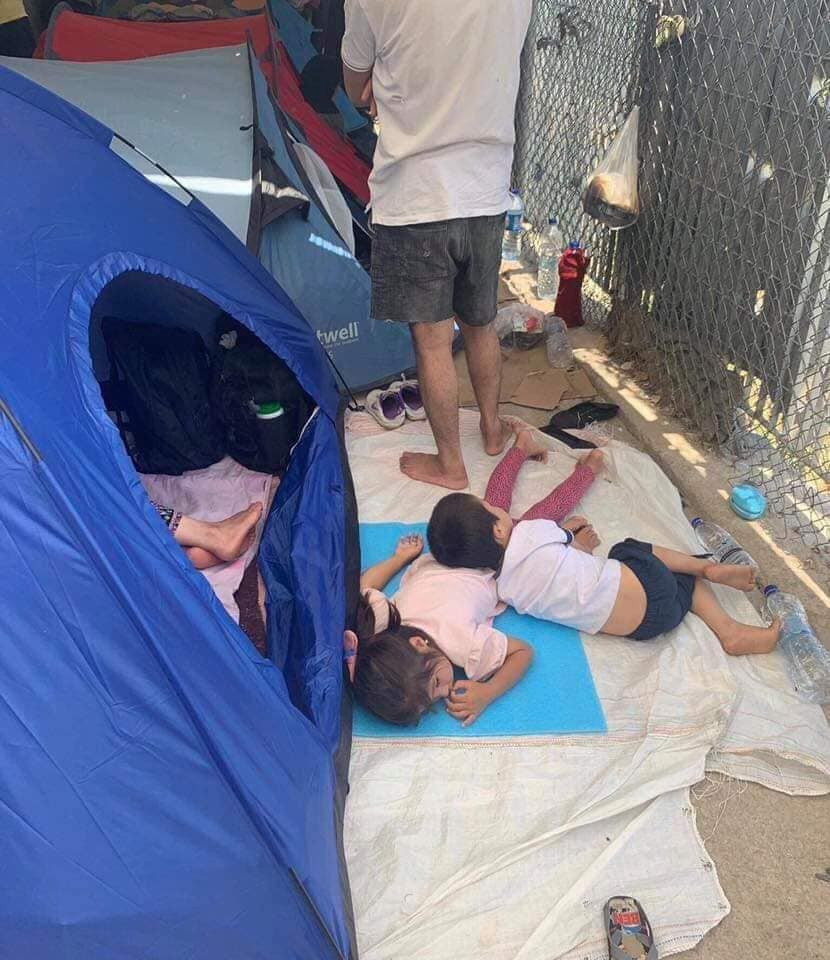
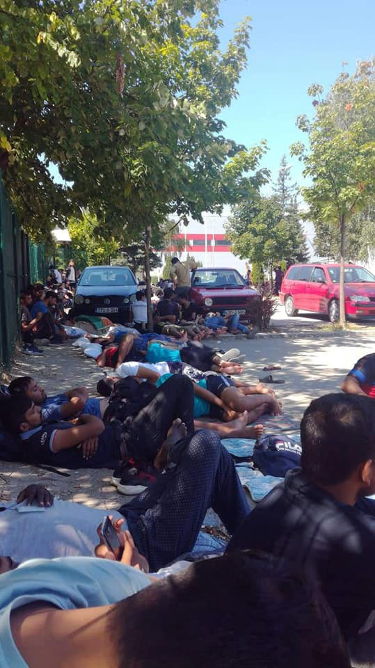

### AYS Daily Digest After 19 days, the people aboard Open Arms finally disembarked

_356 people still on board Ocean Viking for 11th day // Health clarifications in Greece // perhaps 100 people died in shipwreck // deportations from Sweden to Afghanistan // and more…_

](assets/823f99ca97a4/1*fKFf1hbbg2TEPOdKDBmAig.jpeg)

From earlier in the day on Tuesday when a man tried to swim to shore\. Pure desperation\. Photo by [Francisco Gentico](https://www.facebook.com/proactivaservice/photos/pcb.2585523568145145/2585522194811949/?type=3&theater)
### Feature: Outside Lampedusa

[Proactiva Open Arms](https://www.facebook.com/proactivaservice/photos/a.232810050083187/2586440461386789/?type=3&theater) announced around 2pm on Tuesday that:

> “The prosecution of agrigento dictates immediate landing of all people aboard the open arms in the port of Lampedusa and the provisional seizure of the ship\. **Finally, the nightmare is over** and the 83 people on board will receive immediate assistance on earth\. Dignity for all of them\.” 

The [video](https://www.facebook.com/proactivaservice/videos/379756399363209/?__xts__[0]=68.ARBE8kdk8QyEY3SBLimALNUstclhGxGwD41jJ3yBVpqEDMN8xrezHxMdT2cdMqNrJXzStKlVJ5VhFbrOirFnKRm8F5x6SYrYvVKVD10SaOQQAwwbU5OW8_GnFH8Z0QmBbjgRymspAvqwaCWX65hsEoWmS0JsZQOCnCjru0FXgr_lxkkVQkuHU8wrynySYS6K3iw3nTQ1UbjwgXELsoiPXg4CJcffrLqs5PUW3bu4dmlCip_zMZpyQVdzfAMruS6XS6lPFyW2Io2ygcdFR2ch9Me7cYWi9W1uLU-tlZAhKnv-iD0ttxIgCFxANrz4Dm3U9lHB80Zp8HFdTSHtDmE6LLzHIfnz8rbKrYQWZg&__tn__=-R) below shows the reactions from crew members and people rescued alike\. This news comes after a morning where [9 people](https://www.facebook.com/proactivaservice/photos/a.232810050083187/2585676364796532/?type=3&theater) attempted to swim to shore from the rescue ship\. The situation has been out of control for days on end, so this news could not of come any later\.

[On Monday](https://www.globalist.it/news/2019/08/19/il-parroco-di-lampedusa-open-arms-teatrino-politico-giocato-sulla-pelle-di-chi-soffre-2045283.html?fbclid=IwAR01K_Uy08SMhk_LtZW54nETdvrUgF-ggcs2DJwe0cc8ZggHHgWXkKyj7AU) , day 18, a crew member described the scene as

> “For 18 days, 107 people have lived on the deck of a ship with only two baths, exposed by day to the scorching sun of the Mediterranean and at night to the wind and in the cold: an inhuman condition aggravated by the fact that they come from the Libyan hell\.” 

[The ship](https://www.repubblica.it/cronaca/2019/08/20/news/open_arms_migrante_si_getta_in_mare_recuperato-233948936/?fbclid=IwAR1CS2Ji0CE5_5jdMWSkxVUqBg35gaxqQriXSkMcFo627-EnmrN2kU8P6RE&refresh_ce) will be taken to where ships from Mediterranea Saving Humans and Sea watch were seized, but at least for now 80\+ people are safe from dying in the deadliest border in the world\.

■■■■■■■■■■■■■■ 
> **[MSF Sea](https://twitter.com/MSF_Sea) @ Twitter Says:** 

> > We are relieved that the people rescued by #OpenArms will finally reach safety on land after their unnecessary drawn out suffering at sea.

Without delay #OpenArms must be allowed to return to sea where rescue ships are most needed to save lives. 

> **Tweeted at [2019-08-20 21:12:47](https://twitter.com/msf_sea/status/1163921848578519048).** 

■■■■■■■■■■■■■■ 

### Turkey

Police in Istanbul increasingly randomly arrest Syrians in order to deport them back to Syria, sometimes to active war zones\. They say if the Syrians do not have proper Istanbul IDs they are returned to other parts of Turkey, but there are many cases of them being deported instead\. Find out more [here](https://vimeo.com/354813764?fbclid=IwAR0KmVg9AEq01ja1It1fX0LnDkU8YW9UVsuKBloiDxik8jqNoYFgNfvjiys) \.
### Sea

Horrifying to think about, probably 100 people died in the Mediterranean outside of Libya:

■■■■■■■■■■■■■■ 
> **[Alarm Phone](https://twitter.com/alarm_phone) @ Twitter Says:** 

> > Yesterday, we spoke again to the fisherman who had informed us about the possible shipwreck off #Libya. He convincingly re-stated his testimony to us. He said the three survivors were traumatised and he handed them over to an ambulance after disembarkation in #Libya. 

> **Tweeted at [2019-08-20 11:51:01](https://twitter.com/alarm_phone/status/1163780473308557312).** 

■■■■■■■■■■■■■■ 

[MSF](https://twitter.com/MSF_Sea/status/1163850680899002369?fbclid=IwAR3SkaMOLcx6KYWTvsq-UG_CiYhcOXlBaD0aBrwVpbzxFUGDeMHqwqR86JU) re\-enforces that their team in Libya has not been able to contact the survivors yet, but _“we have every reason to fear the worst — that over 100 lives were lost and nobody will ever know for sure\.”_

[The Libyan authorities](https://twitter.com/alarm_phone/status/1163780573502103552?fbclid=IwAR0UdrhsE6nMwpbvmw2pHL4UPQUQaIujjLtkdINk-1gHKyJkvr9ZxUFNneg) have no information on the case and have not conducted a search\. Inside the [Libyan Coast Guard](https://twitter.com/MSF_Sea/status/1163855194318409728?fbclid=IwAR2GTxcBkYKXbS_Z97tHlgejtd0hvPBdp4rZVwixcbTxW2Y0KIaoc9cSnzU) , there are even predictions that half of the boats leaving Libya sink without any survivors\. THIS IS THE DEADLIEST BORDER IN THE WORLD…we cannot even count our dead\.

With the relieving news for the people on board Open Arms, we cannot forget that:

■■■■■■■■■■■■■■ 
> **[Sea-Watch International](https://twitter.com/seawatch_intl) @ Twitter Says:** 

> > 356 people have been waiting for a safe haven on #OceanViking of @msf_sea and @[SOSMedIntl](https://twitter.com/SOSMedIntl)  for 11 days. The situation there is getting more and more tense. Since the weekend the doctors on board are treating a patient in critical condition.
[twitter.com/MSF_Sea/status…](https://twitter.com/MSF_Sea/status/1163040871052402688) 

> **Tweeted at [2019-08-20 13:45:53](https://twitter.com/seawatch_intl/status/1163809381537837061).** 

■■■■■■■■■■■■■■ 

](assets/823f99ca97a4/1*cNcfq_sXZRl2eegzYsmESQ.jpeg)

“Lack of inaction means the Mediterranean remains one of the deadliest migration routes in the world\. \#FortressEurope” Photo by [Safe Passage](https://www.facebook.com/SafePassageInt/photos/a.161524404302318/739189233202496/?type=3&theater)
### Greece

[In a new](https://www.efsyn.gr/node/207838?fbclid=IwAR1ECWDmNxurBNlxzEvV2GvaSRLY4E4s4_R5YvP8iuHBtcBW_F71gPANT2A) announcement from the Hellenic Federation of Public Hospitals Employees \(POEDIN\), they make clear that “lawful refugees and immigrants ‘continue to be entitled to free medical care as provided by law\. Also, emergencies are entitled to access to and access to health facilities without any hindrance\.’” This comes with requests for clarifications on medical treatments refugees may receive\.

](assets/823f99ca97a4/1*kMbYAKxRk1fcz04VsEvo8g.jpeg)

Chios 2019: Photos provided by [Jenny Zinovia Kali](https://www.facebook.com/groups/1508309029486384/permalink/2326663300984282/?hc_location=ufi)
### Italy

In other news on [Lampedusa](https://twitter.com/AneIrazabal/status/1163733911266050051?fbclid=IwAR1jmvCTQcBMGwaMufaHD6f2VZWCGMHGBwrODdtEbGbzhEmMQ_zugl3FwEU) :

> “Another “ghost landing”\. About 40 people have arrived this morning at \#Lampedusa \. All of them have been transferred to this ferry\. They will reach \#Sicilia in the next hours\. Closed ports, sure?” 

### Bosnia Herzegovina

](assets/823f99ca97a4/1*wZrN0wpjJnSIVeszStOEeA.jpeg)

The situation for those in the camp Bira \(Bihac\) is still difficult and getting more dangerous by the hour, due to not enough food, and being prevented to cook meals within the premises, now also reportedly facing direct threats by the locals living nearby\. Photos provided by [Udruženje Solidarnost — Bosnia](https://www.facebook.com/solidarnostbosnia/posts/2886359791375187)
### Sweden

[Afghanistan Migrants Advice & Support Org](https://www.facebook.com/AmasoAfg/photos/a.1419588361404777/2680141768682757/?type=3&theater) reports that:

> “At least 5 Afghan asylum seekers have been deported from Sweden back to Afghanistan today evening\. They will arrive in Kabul during morning hours tomorrow\.” 

The ongoing perception that Afghanistan is safe continues to perpetuate dangerous cycles for refugees\.
### Denmark

There will be a seminar Thursday 22 August 2019, 14\.00–16\.15 in Copenhagen on “The expansion of Europe’s border governance and the humanitarian dilemmas\.” Come on out and hear different scholars discuss this pressing matter\! Find out more [here](https://www.diis.dk/en/event/the-expansion-of-europes-border-governance-and-the-humanitarian-dilemmas?fbclid=IwAR0w-R14b1U2FfGFVB8n5cM7u0f_SIhIUq5J6wrgjdF0iLrXiNY-4CK_-6A) \.

**We strive to echo correct news from the ground through collaboration and fairness\. Every effort has been made to credit organisations and individuals with regard to the supply of information, video, and photo material \(in cases where the source wanted to be accredited\) \. Please notify us regarding corrections\.**

**Apart from daily news in English, we also publish weekly summaries in Arabic and Persian\. Find specials in both languages on our [medium site](https://medium.com/are-you-syrious/ays-weekly-in-arabic-and-persian/home?source=post_page---------------------------) \.**

**If there’s anything you want to share or comment, contact us through Facebook, Twitter or write to: areyousyrious@gmail\.com\.**

_Converted [Medium Post](https://medium.com/are-you-syrious/ays-daily-digest-after-19-days-the-people-aboard-open-arms-finally-disembarked-823f99ca97a4) by [ZMediumToMarkdown](https://github.com/ZhgChgLi/ZMediumToMarkdown)._
