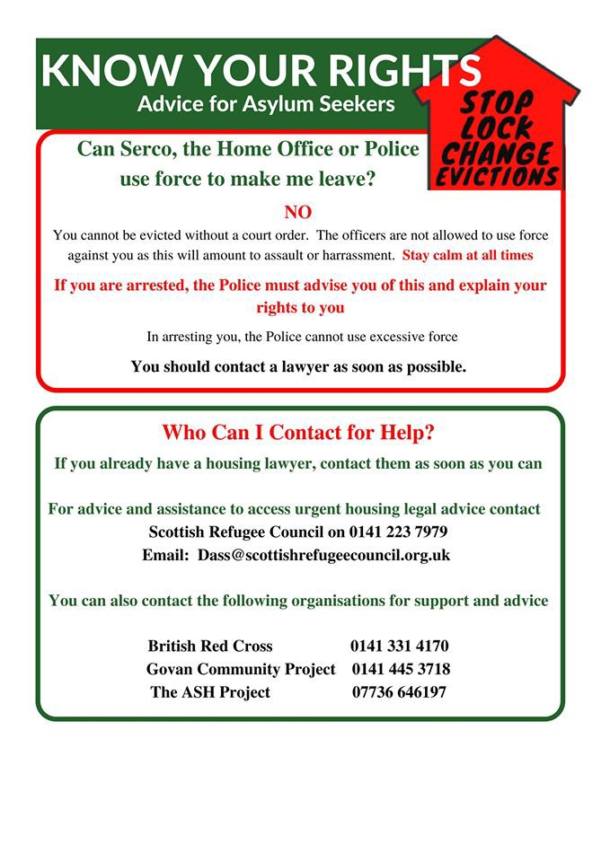

### AYS Daily Digest 21/8/19: Survivors report over 100 drowned in wreck off Libyan coast

_Deadline extended for unregistered Syrians to leave Istanbul / Report on abuses in Greek camps / Greater hurdles for refugee housing in Greece / Update from Vucjak / and more…_

](assets/45df496c4bbd/1*Wwur9Jb-FihgbzHKvwIceQ.jpeg)

Photograph taken during a rescue by Proactiva Open Arms rescue from July of this year\. Photo Credit: [Olmo Calvo](https://www.olmocalvo.com)
### Feature
#### 100 feared dead in shipwreck off Libyan coast

Yesterday the rescue hotline group Alarm Phone reported receiving a call from a fisherman who found three survivors from a shipwreck\. The survivors reported that there were around 100 people on the ship when it had sunk, and the fisherman saw a number of bodies floating amongst the wreckage in the water\. The fisherman told Alarmphone that it was normal for him to see bodies floating in the water, and that Libyan authorities would not retrieve them\.

“We have every reason to fear the worst — that over 100 lives were lost and nobody will ever know for sure,” said MSF in a public statement\.

Alarmphone noted that many shipwrecks in the Mediterranean go unnoticed, as this one might have been had three survivors not been found\. The actual death toll of the Mediterranean migration route may never be known, and is almost certainly higher than the public estimates [provided by the IOM](https://missingmigrants.iom.int/region/mediterranean) \. Italy and the EU have little interest in making this information known as well, as they collaborate with the criminal Libyan Coast Guard and the same groups who kidnap and imprison migrants\.

■■■■■■■■■■■■■■ 
> **[Alarm Phone](https://twitter.com/alarm_phone) @ Twitter Says:** 

> > Yesterday, we spoke again to the fisherman who had informed us about the possible shipwreck off #Libya. He convincingly re-stated his testimony to us. He said the three survivors were traumatised and he handed them over to an ambulance after disembarkation in #Libya. 

> **Tweeted at [2019-08-20 11:51:01](https://twitter.com/alarm_phone/status/1163780473308557312).** 

■■■■■■■■■■■■■■ 

■■■■■■■■■■■■■■ 
> **[Alarm Phone](https://twitter.com/alarm_phone) @ Twitter Says:** 

> > As far as we know, the Libyan authorities did not search for the wreck and the bodies although they had been alerted by us and the fisherman. They told us that they have no information on this case. 

> **Tweeted at [2019-08-20 11:51:25](https://twitter.com/alarm_phone/status/1163780573502103552).** 

■■■■■■■■■■■■■■ 

### Turkey
#### Government extends deadline for Syrians to return to province of registration

Last month, Turkish authorities issued a decree ruling that Syrians who were not officially registered in Istanbul would have to return to the province where they registered for asylum\. The original enforcement date for this ruling was 20 August, but it [has now been pushed back](https://ahvalnews.com/syrian-refugees/turkey-extends-deadline-istanbuls-syrians-return-provinces-registration?fbclid=IwAR0hgVjr8cnaCB6BwVRBFVx8eAyKvy5GkNGKypCcSC0cmIKEdFqWdf10cbI) to 20 October of this year\.

One fear with this new decision is that those who leave Istanbul may be more easily deported back to Syria\. Naturally, many of the provinces where refugees originally registered for asylum are closer to the Turkish\-Syrian border\. Over the past years, [Turkey has deported thousands of refugees](https://www.pri.org/stories/2019-08-06/turkey-denies-deporting-refugees-syria-activists-say-they-ve-sent-back-thousands) back to Syria, including to camps near or in active war zones\. The government officially denies this practice\.
### Greece
#### “No End in Sight”: New report on mistreatment of refugees in Greece

](assets/45df496c4bbd/1*3oVvZTqYbdThYUf5r7-4rg.jpeg)

[Click here for full report](https://greekhelsinki.files.wordpress.com/2019/08/rre_noendinsight.pdf)

A collective of 13 civil society groups and NGOs released [a joint report](https://greekhelsinki.files.wordpress.com/2019/08/rre_noendinsight.pdf) on continued human rights violations against asylum seekers in Greece\. The report was written by European and international rights organizations, including [Refugee Rights Europe](https://refugeerights.org.uk) and the [World Organization Against Torture](https://www.omct.org) , as well as by Greek\-based NGOs and aid groups, such as [Samos Volunteers](https://samosvolunteers.org) and [Still I Rise](https://www.stillirisengo.org) \.

The report described the range of struggles and abuses refugees in Greece face\. Sections of the report detailed the lack of access to the asylum procedure and healthcare, to unjust detention, police violence, and violence and discrimination against vulnerable people, such as women, children and LGBTQ\+ people\.

The authors of the report said that their findings show how “refugees and asylum seekers in Greece continue to confront an extremely hostile environment, one characterized by uncertainty, violence and neglect\.” The report includes many accounts of neglect and abuse by officials on the Aegean and mainland camps\. One unaccompanied minor on Samos described his living situation in the camp:

> We had just two very old mattresses for all of us, 20 people\. We have never had pillows, we made pillows by ourselves with bags done in Alpha Center and putting inside extra clothes… There is a hole on the roof and the water is getting inside of the container when it rains\. The first time it rained all night and in the morning I asked the technician to repair the hole but they told me to wait two weeks, after that maybe they would have fixed it or maybe not\. The hole is still there\. 

#### New government declares rent must be paid through banks, yet asylum seekers still deny accounts

The new right\-wing Greek government has [announced a policy](https://www.efsyn.gr/oikonomia/elliniki-oikonomia/207930_mono-meso-trapezon-i-pliromi-ton-enoikion?fbclid=IwAR1AKvR6EuGbJU0RRP9QZkcFUKSARDd-mdHk47_WZrVasNgq6n7VWjUFB4I) to require all rental payments to be made through banks\. Tenants and landlords who avoid this route will be subject to heavy fines\. While this may be good news for Greece’s economy, it will certainly make life more difficult for asylum seekers in the country, who have virutally no access to the banking system\. The new government has decided to revoke access to AMKA \(national ID\) cards for asylum seekers, and getting a tax account is almost impossible as well for refugees\. Both of these are required to open a bank account\.
#### Metadrasi wins largest humanitarian cash prize

The Greek NGO Metadrasi, which provides translation services and protection for unaccompanied minors, [won the Conrad Hamilton humanitarian prize](http://www.ekathimerini.com/243763/article/ekathimerini/community/greek-ngo-metadrasi-wins-worlds-largest-humanitarian-prize?fbclid=IwAR28pul-ric3t1xuCIK-xvXIfcsVJRj5mvm66FQProIF0npFwRKqIiOZ4RQ) this week\. The prize comes with $2 million in unrestricted funding\.
#### Urgent call for assistance from Attika Human Support

> The islands of Lesvos, Chios and Samos will be considered to be on [\#emergency](https://www.facebook.com/hashtag/emergency?source=feed_text&epa=HASHTAG&__xts__%5B0%5D=68.ARBYzoO2EJJulcaIDY4s6pR5PLZzwH_jZ6ayiYr1Jb-vaocCq0GoydCBhl9nwtStg_jRF0TkFYimHBJPo5Y_0eYp78_Ka-JhIBATpUzFgDXNpG92nVsRJqdL_WgPRHvYckiNSfqUoT3x2EFDpXSZpL8bBJt8Dp6VtB_iN67MzALhWDqa0ROMjKngCYGpC-Wk1fbwNwq9_Mo-F4nEL1qZs0WnYgLpl1JIACo92Ov7XQFfh4exFgXJ4Xs-Ttvw8fdUhGYhaJJF2x-v59EJvzQd28YxjmB0L1MkHAp_xyvOYjSocm-Te8G3a32Wxaw1W4dSO_5CMZngCM2vWss2FQK7XkQ&__tn__=%2ANK-R) status by Attika until further notice\. 

> [\#Lesvos](https://www.facebook.com/hashtag/lesvos?source=feed_text&epa=HASHTAG&__xts__%5B0%5D=68.ARBYzoO2EJJulcaIDY4s6pR5PLZzwH_jZ6ayiYr1Jb-vaocCq0GoydCBhl9nwtStg_jRF0TkFYimHBJPo5Y_0eYp78_Ka-JhIBATpUzFgDXNpG92nVsRJqdL_WgPRHvYckiNSfqUoT3x2EFDpXSZpL8bBJt8Dp6VtB_iN67MzALhWDqa0ROMjKngCYGpC-Wk1fbwNwq9_Mo-F4nEL1qZs0WnYgLpl1JIACo92Ov7XQFfh4exFgXJ4Xs-Ttvw8fdUhGYhaJJF2x-v59EJvzQd28YxjmB0L1MkHAp_xyvOYjSocm-Te8G3a32Wxaw1W4dSO_5CMZngCM2vWss2FQK7XkQ&__tn__=%2ANK-R) with new arrivals over the past 10 days reaching levels in excess of 1,000 people; Moria is sheltering in the region of 10,000 people\. This is more than three times above the official capacity of 3,000 and brings the total to approximately 13,000 refugees on this island alone\.
 

> These numbers include about 700 unaccompanied minors and several vulnerable cases who have less than the basic care, since the state doctors currently are non existent, and no basic hygiene\. 

> [\#Chios](https://www.facebook.com/hashtag/chios?source=feed_text&epa=HASHTAG&__xts__%5B0%5D=68.ARBYzoO2EJJulcaIDY4s6pR5PLZzwH_jZ6ayiYr1Jb-vaocCq0GoydCBhl9nwtStg_jRF0TkFYimHBJPo5Y_0eYp78_Ka-JhIBATpUzFgDXNpG92nVsRJqdL_WgPRHvYckiNSfqUoT3x2EFDpXSZpL8bBJt8Dp6VtB_iN67MzALhWDqa0ROMjKngCYGpC-Wk1fbwNwq9_Mo-F4nEL1qZs0WnYgLpl1JIACo92Ov7XQFfh4exFgXJ4Xs-Ttvw8fdUhGYhaJJF2x-v59EJvzQd28YxjmB0L1MkHAp_xyvOYjSocm-Te8G3a32Wxaw1W4dSO_5CMZngCM2vWss2FQK7XkQ&__tn__=%2ANK-R) with more than 3,000 people, three times more than official capacity and with about the same problems as Lesvos\. 

> [\#Samos](https://www.facebook.com/hashtag/samos?source=feed_text&epa=HASHTAG&__xts__%5B0%5D=68.ARBYzoO2EJJulcaIDY4s6pR5PLZzwH_jZ6ayiYr1Jb-vaocCq0GoydCBhl9nwtStg_jRF0TkFYimHBJPo5Y_0eYp78_Ka-JhIBATpUzFgDXNpG92nVsRJqdL_WgPRHvYckiNSfqUoT3x2EFDpXSZpL8bBJt8Dp6VtB_iN67MzALhWDqa0ROMjKngCYGpC-Wk1fbwNwq9_Mo-F4nEL1qZs0WnYgLpl1JIACo92Ov7XQFfh4exFgXJ4Xs-Ttvw8fdUhGYhaJJF2x-v59EJvzQd28YxjmB0L1MkHAp_xyvOYjSocm-Te8G3a32Wxaw1W4dSO_5CMZngCM2vWss2FQK7XkQ&__tn__=%2ANK-R) with an excess of 4,000 people in a camp with an official capacity of 650\. 

> The boats keep coming and we need urgently : 

> \-Hygiene
 

> \-Shoes
 

> \-Funds to keep the doors open 

> This situation cannot continue anymore and we need all of us to get involved\. 

> Go to [www\.attikahumansupport\.org/donate](https://l.facebook.com/l.php?u=http%3A%2F%2Fwww.attikahumansupport.org%2Fdonate%3Ffbclid%3DIwAR323G-B6UkciFI0anVz2DLPjWEGk-DXjkWxSGPbSqY1YIglYwxQV6crunE&h=AT1HArFAHD0rCsIDTm0v0smi9cNp-dzMAA8r2V9mPJFXmClJsLwWizjnoVt_WepD896C_704Jb6PedoR447IQaz_F7hARxWKeM85p4RkHsToXSgTOtk2jb8KaBCLhAbzr8VGUWbMVQ_cywcmhwLGZxiqaWqVSafNus_shnOgi16O1WFxZrPI5WFl5a019HdVFHhB22fK9OIpHaRnTvtnFlSUU9upX6u0HYXaZPwf_9Z-Gz3IJEDS7kgQN8CL6aTKB8kH3RNSY6AuPLUH80JxY18uP6Qgmeu-Z_3uaXUD1M7NQyorA139QBEXRlz_zzLhV72MA6E06XHjtVq3ieK5w7GpVwHPtorGg0jTIPIXIt-nGlk-qxi7YU8u6X_djKCQFMvzFMKrKK5Byev9F6AZ1NbMVW2tqCNQN-RwWiFoL9O0dZy1b_VzwLQCis5uzw2kKcZuGb7KoxaFet-1Dfzw-xcP7yWZKyS9B0q4giOHNGtWFZI81eaBlGlt7WrZrSlTsHsD1z2n87Yupm_GWZs6d-S6pxVlq71dI_qZMzrrbNGQ7mIFH1K0BgNwtRBvExLKBOZn7NVG9kX8KwBveCX3WitQLckULEUkfJqYK6LRHptQjtFanzoUEFlWHrP72LjZrRYj) to help\. 

### Bosnia
#### Update from Vucjak

The medical volunteer team working in Vucjak posted a brief update\. After a lot of hard work, they have a clinic set up in a large tent and a small waiting room area\. The team will be switching over this week, but fortunately the group will be supported for the coming months by some donors\.

“It’s an absolute absurdity that a private man with a team of volunteers has to do this job because no one else does it\. We do this with all our strength and with all our heart\. But what has become of this world? Where are the responsible politicians — where are UNHCR, Caritas? At least not here,” wrote the founder of the group in a public post\.

 \. “Since this morning, we have a big tent as a clinic, behind it another as a waiting room\. We have beds for the infusions and small surgeries\. The team in the tent was composed of eight people for the last few days\.”](assets/45df496c4bbd/1*DUwVwthVjNVitUhm7_otWg.jpeg)

Photo Credit: [Dirk Planert](https://www.facebook.com/dirk.planert?__tn__=%2CdlCH-R-R&eid=ARDnhz4KWpxlxIhBinDC2PleW6HD10jpGQB1ZjJoHqBDjiVP440Lgs8m8u9rETcNbnXHM5u4_YmV-hea&hc_ref=ARSSDmV9yIU1-XvtwB4uv2EZvA7DEU6yLDXPMFewFM1AxN3WvxvYFW7C5RE3m10mxm8&hc_location=group) \. “Since this morning, we have a big tent as a clinic, behind it another as a waiting room\. We have beds for the infusions and small surgeries\. The team in the tent was composed of eight people for the last few days\.”

 \.](assets/45df496c4bbd/1*Vak3fAYeDb7D4o03d3fqRQ.jpeg)

Photo Credit: [Dirk Planert](https://www.facebook.com/dirk.planert?__tn__=%2CdlCH-R-R&eid=ARDnhz4KWpxlxIhBinDC2PleW6HD10jpGQB1ZjJoHqBDjiVP440Lgs8m8u9rETcNbnXHM5u4_YmV-hea&hc_ref=ARSSDmV9yIU1-XvtwB4uv2EZvA7DEU6yLDXPMFewFM1AxN3WvxvYFW7C5RE3m10mxm8&hc_location=group) \.

 \.](assets/45df496c4bbd/1*IqBUmn2aBfQsA7wMU-QUiw.jpeg)

Photo Credit: [Dirk Planert](https://www.facebook.com/dirk.planert?__tn__=%2CdlCH-R-R&eid=ARDnhz4KWpxlxIhBinDC2PleW6HD10jpGQB1ZjJoHqBDjiVP440Lgs8m8u9rETcNbnXHM5u4_YmV-hea&hc_ref=ARSSDmV9yIU1-XvtwB4uv2EZvA7DEU6yLDXPMFewFM1AxN3WvxvYFW7C5RE3m10mxm8&hc_location=group) \.
### Sweden

Amnesty has written a public petition demanding that the Swedish government take responsibility for people on the move\. This includes stopping the unlawful collaboration with Libya\. Sign the petition to the migration minister Morgan Johansson [here](https://www.amnesty.se/agerahub/sverige-och-eu-maste-ta-sitt-ansvar-manniskor-pa-flykt/?fbclid=IwAR1ExGRWJ3xWhjbmqcklLHGIQymUyi18koqxC6Z50oQfzWJjUYRKowBvg1E) \.
### Scotland

**We strive to echo correct news from the ground through collaboration and fairness\. Every effort has been made to credit organisations and individuals with regard to the supply of information, video, and photo material \(in cases where the source wanted to be accredited\) \. Please notify us regarding corrections\.**

**Apart from daily news in English, we also publish weekly summaries in Arabic and Persian\. Find specials in both languages on our [medium site](https://medium.com/are-you-syrious/ays-weekly-in-arabic-and-persian/home?source=post_page---------------------------) \.**

**If there’s anything you want to share or comment, contact us through Facebook, Twitter or write to: areyousyrious@gmail\.com\.**

_Converted [Medium Post](https://medium.com/are-you-syrious/ays-daily-digest-21-8-19-survivors-report-over-100-drowned-in-wreck-off-libyan-coast-45df496c4bbd) by [ZMediumToMarkdown](https://github.com/ZhgChgLi/ZMediumToMarkdown)._
