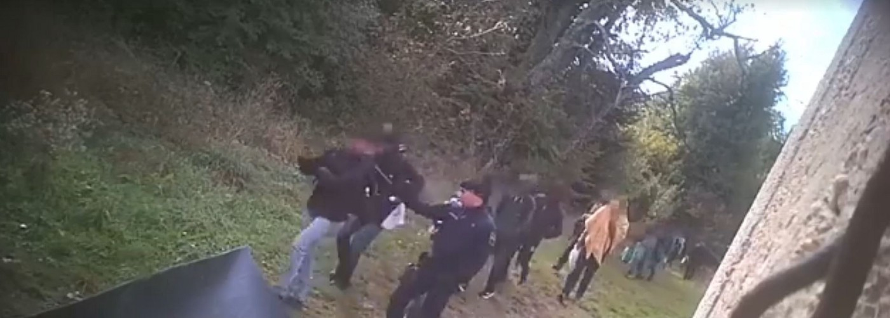
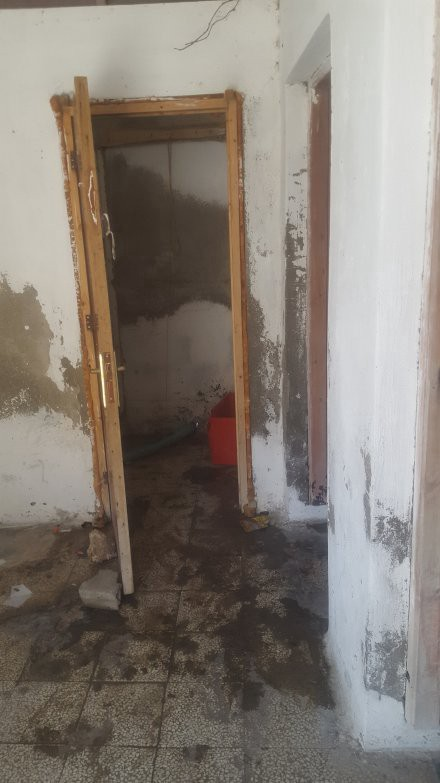
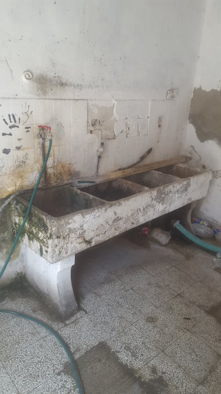

### AYS Daily Digest 23/08/2019: Swiss court suspends Dublin deportation to Croatia
### State Secretariat for Migration did not check the conditions for asylum seekers in Croatia properly / New arrivals in Greece / Dire conditions on Rhodes / Ocean Viking allowed to go to Malta

[Are You Syrious?](@AreYouSyrious?source=post_page-----4abd84c549a4----------------------)

[Aug 24](ays-daily-digest-23-08-2019-swiss-court-suspends-dublin-deportation-to-croatia-4abd84c549a4?source=post_page-----4abd84c549a4----------------------) · 5 min read

Credits: [Border Violence Monitoring Network](https://www.facebook.com/borderviolencemonitoring/)
### FEATURE: Swiss court suspends Dublin deportation to Croatia

The Swiss Supreme Administrative Court has stopped the planned deportation/return of an asylum seeker to Croatia due to concerns about systematic deficiencies in Croatia’s asylum system\. It did not rule about the violations of human rights, but criticized the State Secretariat for Migration \(SEM\) for not doing a proper check\.

The plaintiff said he was deported from Croatia to Bosnia 18 times before he made it to Switzerland and he experienced police violence during the unlawful push\-backs, not being given the opportunity to ask for asylum in the country\. Hence, the lower court should have checked “if there is a general threat for asylum seekers in Croatia of inhumane or humiliating treatment”\. Even if Croatia did not comply with the high threshold of systematic deficiencies, the SEM should have checked if there would be an individual threat for the plaintiff and if Switzerland should have taken care of this case due to the possible violation of the non\-refoulement principle\.

Furthermore, the court criticized the SEM for documenting the plaintiff’s statament only in a “piecemeal” way\. Hence the court did not have enough information to check the credibility of his statement\. Additionally, the SEM only received the plaintiff’s evidence, but did check it properly\. However, the court said, “even without deeper research … the situation in connection with collective expulsions and pushbacks by Croatia into the neighbouring countries” was obvious — also referring to an [AYS report from 2018](ays-special-eu-border-violence-update-from-bosnian-croatian-border-fro-september-3f2a6227d383) \.

The SEM now has to reconsider the situation in Croatia in general and the case of the plaintiff in particular\. The ruling was from July 2019, but has now been reported about for the first time by AYS’ partner organization, Centre for Peace Studies \( [CMS](https://www.cms.hr/hr/azil-i-integracijske-politike/svicarski-sud-suspendirao-vracanje-izbjeglice-zbog-prijetnje-ponavljanja-pushback-a?fbclid=IwAR3PNaHGS94_w3ZxHVn7KuJA3bUSP112dy9tKxZvk_wu6tNyuDvRaHWYCvU) \) \.
### EASTERN MEDITERRANEAN

**_Lesvos\._**

**_Symi\._**

A total of 100 people arrived between yesterday and today in Symi, many women and children\. As volunteers report:

> _There appear to be at least 30 kids who are under 14 years old\._ 

They are in need of food, water, clothes and probably also blankets and/or sleeping bags\. If you can, please contact the volunteers through [this post](https://www.facebook.com/groups/PAMPIRAIKI/permalink/951431955200909/?hc_location=ufi) \!

**_Rhodes_** \.

Pictures and a [brief report](https://www.meltingpot.org/Rodi-e-il-centro-per-migranti-che-non-c-e.html?fbclid=IwAR3W7nM8Ddv6qm-ONSWzOlzAKxBsLa7UWlMmxxppVi37O192lRgue9GsqEA#.XWBH8S2B00o) on the conditions of the reception centre on the island have been published by Melting Pot Europa, making it crystal clear that all human standards are not being met\. The centre is situated in a former slaughterhouse and the conditions of abandonment are not justified, given also the low number of people hosted inside\.

Credit: Nicole Bonfanti\.

The people hosted \(around 70\) are mainly from Palestine, Iraq and Somalia and among them there are women and children\.

**There is no social worker or professional taking care of their medical and legal needs, nor a lawyer indicated to deal with their asylum and family reunification practices\.**

Solidarity comes from locals who are donating clothes and goods for children and every day, from 8 to 10 AM, a local man goes in to check on their condition and bring some humanity into this centre abandoned by all\.

**A girl hosted in the centre says that an employee from UNHCR goes there once a month and gives them 90 €/each person to cover their monthly expenses \(food, clothes, medicines etc\. \)** \.

Children are barefoot and walking on garbage, amidst European indifference\.

Find out about latest **_job positions_** [here](http://socialpolicy.gr/tag/μκο-θέσεις?fbclid=IwAR30omzoElRqedxBJSyMRZ2aWPnakxDsN381m0fKNf7lOZpwQgXGctpvlIs) \.

In more recent news, **_Slovenia_** has started [building the barbed wire extention](https://it.euronews.com/2019/08/22/si-allunga-la-barriera-di-filo-spinato-tra-slovenia-e-croazia?utm_term=Autofeed&utm_medium=Social&utm_source=Facebook&fbclid=IwAR0v9dzwKQ43kBfP49RWTks5ymTqdqx_X64HkG3jyGnfT4c8a1IdB16c2_8#Echobox=1566500677) of the fences at the border with Croatia\. Around 4 km will be added to the already existing fence, mainly along the Kolpa river, in the areas of Vinica and Zunica\.

At present, 179 km of barriers have been built between the two countries, of which 116 with barbed wire\.
### CENTRAL AND WESTERN MEDITERRANEAN

After a 14\-day Odyssey at sea, SOS Mediterranee’s rescue ship Ocean Viking was finally allowed to disembark the 356 rescued people on Malta\. Frédéric Penard, SOS MEDITERRANEE’s Director of Operations, [said](https://sosmediterranee.com/press/press-release-356-rescued-people-onboard-the-ocean-viking-finally-allowed-to-disembark-in-malta/) :

> _“SOS MEDITERRANEE is relieved a European solution was finally found for the 356 rescued people on board the Ocean Viking\. Fourteen months after the first standoff experienced by our previous ship, the Aquarius, we regret that no European predictable mechanism was implemented to prevent the unnecessary prolonged suffering of vulnerable people in the high seas so far\.”_ 

The Ocean Viking will be back at sea as soon as possible, after changing the crew and refuelling and resupplying the ship\. Several countries agreed to take care of the people’s asylum cases\.

Naga Onlus, based in **_Milan, Italy_** , has published today a very useful [leaflet](https://naga.it/2010/08/03/vademecum-dublinati-inglese/) containing information for asylum seekers who are going to be relocated to Milan or who have already been relocated to the city, due to Dublin\.

In the leaflet, you can also find information on who to contact if you are prevented from leaving the airport and the address of an emergency shelter near the Central Station, in case you need immediate help\.

Ex Felandina area, province of **_Matera_** \.

After the fire which occurred on 7th August, where a woman lost her life, the field workers living in the makeshift camp have been served with an evacuation note, despite the local authorities having no alternative accommodation for the people\. The living conditions in the area are obviously degrading, with garbage piling up outside the barracks, one water tank provided per day, the bare minimum to meet daily needs, and the Red Cross providing food once a day, mainly consisting of sandwiches and focaccie\.

Moreover, all the residents are facing difficulties in renewing their permits, as they do not have residency and most of their documents were destroyed in the fire\.

And now the evacuation of the over 500 people in the area, due to an unspecified sanitary emergency and with no clear alternatives for the workers\.

Treating a permanent condition as an emergency underlines the incapacity of the local authorities to solve the situation and their unwillingness to treat migrant workers according to the law, which would mean recognising their rights\.

See original source [here](https://www.globalproject.info/it/in_movimento/basilicata-ai-braccianti-della-felandina-viene-preannunciato-lo-sgombero/22206?fbclid=IwAR0NveeyG_bXls_ZxOWxFkQO-dRg3Y-RGA0rIV73-KxzmChQROMBTx7OMrM) \.
### GERMANY
### [Block für grenzenlose Solidarität: Menschenrechte sind \#unteilbar\!](?source=post_page-----4abd84c549a4----------------------)
### [Causes event by Seebrücke — Schafft sichere Häfen and 9 others on Saturday, August 24 2019 with 287 people interested…](?source=post_page-----4abd84c549a4----------------------)
#### [www\.facebook\.com](?source=post_page-----4abd84c549a4----------------------)

**We strive to echo correct news from the ground through collaboration and fairness\. Every effort has been made to credit organisations and individuals with regard to the supply of information, video, and photo material \(in cases where the source wanted to be accredited\) \. Please notify us regarding corrections\.**

**Apart from daily news in English, we also publish weekly summaries in Arabic and Persian\. Find specials in both languages on our [medium site](https://medium.com/are-you-syrious/ays-weekly-in-arabic-and-persian/home?source=post_page---------------------------) \.**

**If there’s anything you want to share or comment, contact us through Facebook, Twitter or write to: areyousyrious@gmail\.com\.**
### [Are You Syrious?](/are-you-syrious?source=post_sidebar--------------------------post_sidebar-)
#### Daily news digests from the field, mainly for volunteers and refugees on the route, but also for journalists and other parties\.

Following

_Converted [Medium Post](https://medium.com/are-you-syrious/ays-daily-digest-23-08-2019-swiss-court-suspends-dublin-deportation-to-croatia-2752c189e7c3) by [ZMediumToMarkdown](https://github.com/ZhgChgLi/ZMediumToMarkdown)._
