### AYS SPECIAL: Outsiders’ perspective \- The Bosnian Frontier
#### The passage between Bosnia and Croatia is one of the most difficult on the Balkan route\. Usually people cross it on foot, walking and sleeping in the woods, far away from urban centres, invisible and silent\. Because of the continuous and increasingly violent expulsions by Croatian border police, those who arrive in Bihać and Velika Kladuša remain blocked in this area for months in a temporary status, constantly attempting the long mountain walk that connects the two cities to the Croatian border\. ‘The game’ is all a matter of chance and few make it at the first attempt\. We met people who have been trying for a year and could count more than 20 attempts …

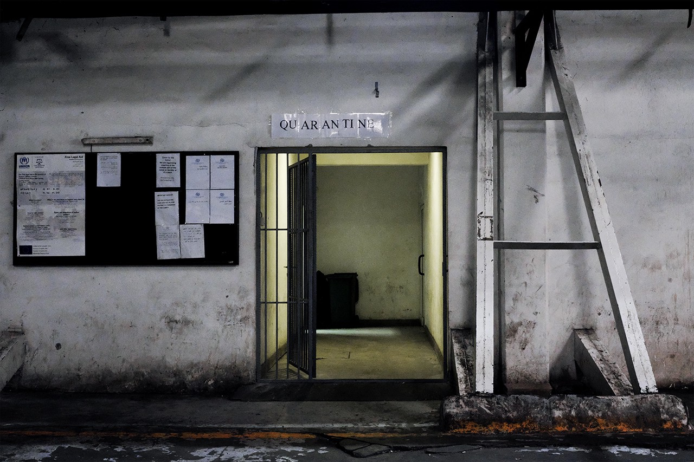

**All photos by: Emanuela Zampa**

In 2016, following an agreement between Turkey and the EU, the Balkan route was officially closed\. Just one year before, Hungarian prime minister Viktor Orban blocked the central corridor to Europe, building a separation barrier between Hungary and Serbia\. These measures did not stop the thousands of migrants heading west, looking for asylum in the European Union\. The route, far from being eliminated, was actually deflected\.

As the path to Hungary became inaccessible, migrant flows turned first to Croatia and then, as the Croatian police copied the Hungarian model of violent push\-backs, shifted again to Bosnia\. An increasingly high number of people found themselves stuck in the north\-western area of the country, a few kilometres from the Croatian border\. We have been monitoring this border for the past six months and have seen the situation escalate dramatically\. What is happening in the area is a real humanitarian crisis, dramatically silenced by media and addressed by short\-term and inefficient solutions\.

The crisis has escalated quickly since April last year\. According to IOM, almost 24,000 people entered Bosnia in 2018, a number 20 times higher than in 2017\. Most of them come from Pakistan, Iran, Syria, Afghanistan and Iraq, but it is not rare to meet people from Maghreb and, in some cases, Sub\-Saharan Africa\.

Last summer, when flows intensified, thousands began to arrive in the northern Bosnian cities of Bihać and Velika Kladuša, in the nearest proximity to the Croatian border\. Most of them have been travelling for months, some even for years across Turkey, Greece, Macedonia and Serbia\.

The passage between Bosnia and Croatia is one of the most difficult on the Balkan route\. Unless you have money to pay the smugglers, it must be crossed on foot, walking and sleeping in the woods, far away from urban centres, invisible and silent\.

Because of the continuous and increasingly violent push backs by the Croatian border police, those who arrive in Bihać and Velika Kladuša remain blocked in this area for months in a temporary status, constantly attempting the long mountain walk that connects the two cities to the Croatian border\. ‘The game’, which is how migrants call the attempt to cross the frontier, is all a matter of chance and few make it at the first attempt\.

We met people who have been trying for a year and could count more than 20 attempts:

> ‘ _I walked ten days\. The last three we finished food and we drank water in the forest\. We almost arrived to the Slovenian border with Italy’_ , says Abdul from Afghanistan, 22 years old\. _‘When they caught us\. It took them one hour and a half to beat us and deport us back to Bosnia\. Ten days we walked\. They only took one hour to destroy all our effort’\._ 

Stories about ‘the game’ are all very similar\. Several men told us that it is easier to travel with families\. _‘If you are all men, they will catch you and beat the hell out of you’_ says Shaneen, 21 years old _\. ‘We were 20 people all together in a van with no air\. Then, one by one they took us outside and beat us’_ We heard this story from Amir, 19 years old, and then it was confirmed by many others who experienced the same situation\.

> However, histories of violence are not limited to male adults\. 

Samira is the mother of two little girls, one and three years old\. She told us that during the game the police broke her phones and stole their backpacks and their shoes before pushing them back on their bare feet\.

The game is violent both in a physical and in a psychological way\. On the one hand, the violence of the police, on the other, the acknowledgment of having struggled for nothing\. Because of the constant pushbacks, people remain stuck in this territory for months not knowing when and how they will succeed in reaching their final destination\. And so they wait, in the towns of Bihać and Velika Kladuša\.

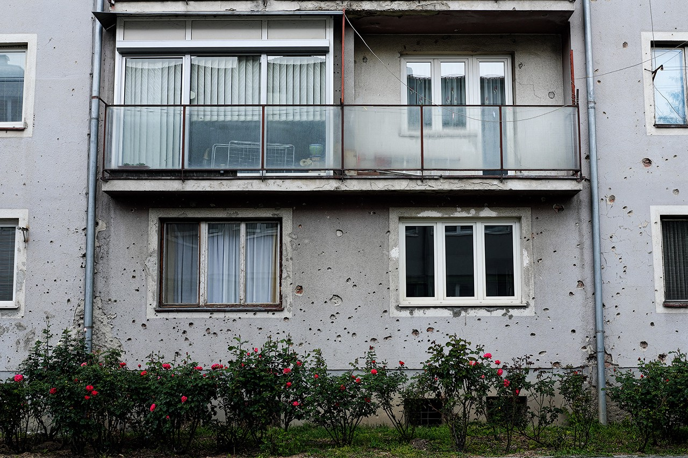

A detail from Bihać

In this general atmosphere of fear and displacement, IOM decided to address the crisis by setting up four ‘camps for migrants’ temporary permanence’\. The situation in the camps is always very dubious\. It is almost impossible to have a clear idea of how many people are actually there\. Sometimes, the camps might look half\-empty because a high number of people are in the game\. It is impossible to understand how many will return, as well as how many new arrivals there will be\.

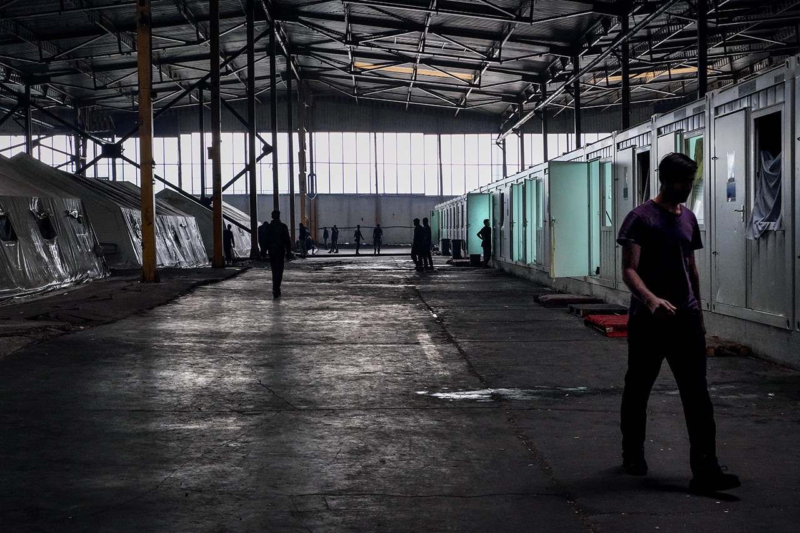

Inside Bira, Bihać

The largest camp, **Bira** , was set up in a former refrigerator factory in Bihać and is still active\. The majority of people hosted in Bira are single men, but the camp also has a section for minors and one for families\. The number of people hosted in this structure varies between 1,500 and 3,000, depending on how many people went for the game\. When we entered the factory, it was immediately obvious that we were entering a place which was not built nor readapted for hosting human life\.

There is neither light nor air\. The smell of urine and sweat immediately pervades your nose\. The high ceiling echoes the voices of the thousands of men walking beneath it\. The voices mingle with the sound of the rain, creating a disturbing and constant background noise\. It never stops, not even at night\. Obviously, Bira never sleeps\. A few rays of sunshine struggle to pass through the few windows that open in the ceiling’s metal plates, but they do not reach the floor, nor the human beings walking on it\. They appear like zombies, de\-humanised shadows that live in a constant state of waiting\.

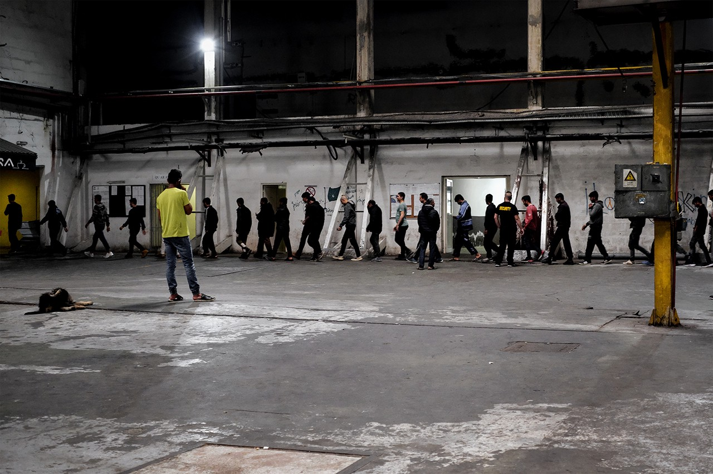

People inside the camp, queueing for lunch

There are dozens of white tents and containers filled with bunk beds\. All of them are marked with the Turkish Red Crescent symbol\. For single men in Bira, there is nothing to do other than sitting, walking and waiting for food\. There is no mechanism of cohabitation or communication between those who live in the camp\. The only activity besides walking, sitting and queueing for lunch is that of the hairdresser\.

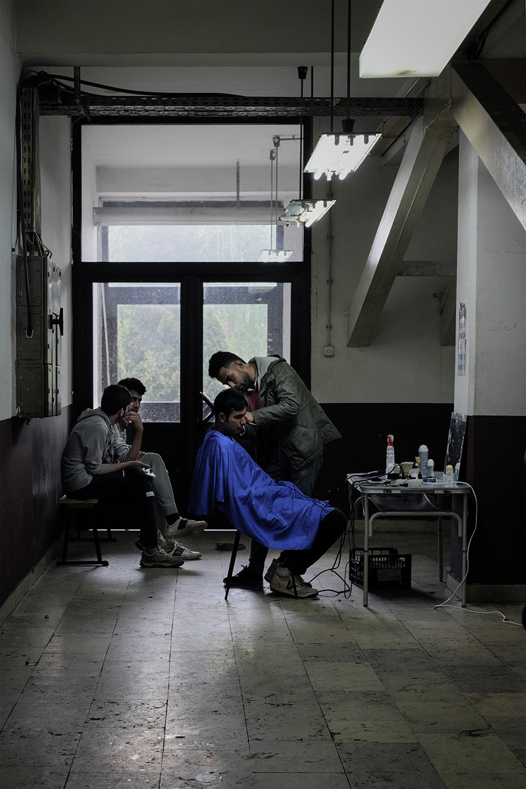

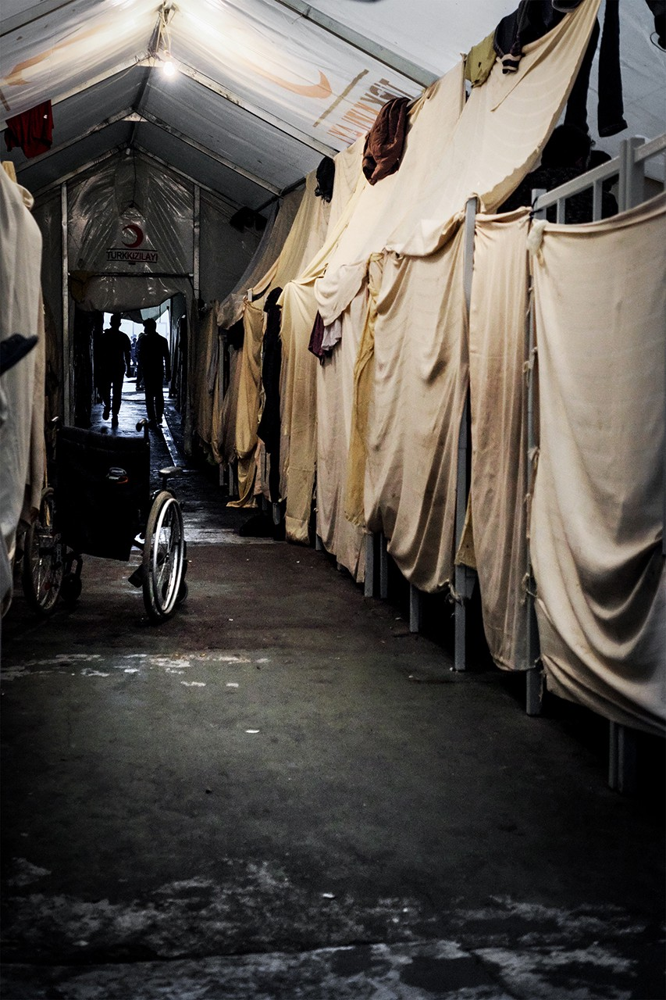

There are two of them, and they organised two working tables on the two opposite sides of the single men’s section\. A small organisation from Italy managed to set up a sort of socialisation corner, where beverages are served, people play table tennis and cards\. Apart from this small space of serenity,

> Bira continues looking like a place that was suited to host refrigerators, not men\. 

The IOM camp of Borići, sited in the homonymous park, was originally built to provide accommodation for students\. Because of the war in the 1990s, it was never actually completed, nor inhabited\. Last summer, hundreds of migrants occupied the abandoned building\.

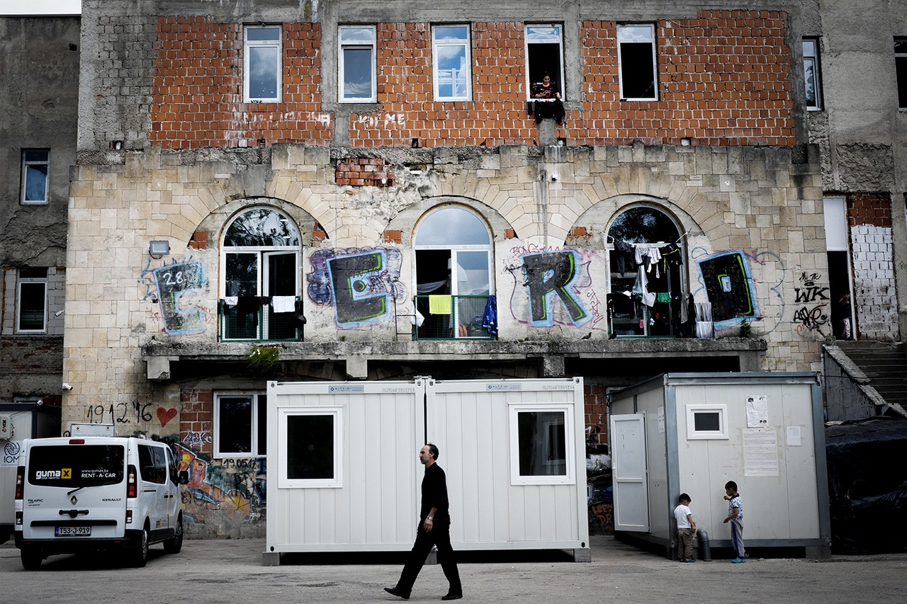

Borići

Successively, IOM restructured it to host families and minors\. At first sight, Borići does not make the same horrifying impression that Bira does\. It is an old three\-floor building\. In the courtyard, kids are playing under the rain, under the careful eyes of their moms\. They smile at us and ask us where we are from\. It’s lunchtime and we meet the migrants in the canteen\. The room is full of kids running around and sliding across the long line of men and women queueing for food\. Chicken and onion soup\. The kids want to play with us\. They understand we come from Italy and in their young and naïve minds, Italy means heaven, and it means all of this will be over\. We talk with families and with unaccompanied minors\. All of them show us the scars and bruises on their bodies, inflicted by the Croatian police\. ‘ _They beat us, they crush our phone and then they push us back\. Now they’ve started to ask for money’\._

While in Bira the sense of dehumanisation is transparent and direct, Borići shows a constant effort to hide and deny it\.

> When we exit the place, the IOM guy addresses us with a fake smile\. _‘I hope you saw some happy stuff’_ , he tells us\. 

Camp Sedra is sited in the woods near the area of Cazin, a few kilometres from Bihać\. It used to be a hotel, which now hosts around 400 migrants, among them many families and minors\. This place is different from both Borići and Bira, as it was actually inhabited before\. Consequently, it presents most of the ‘comforts’ you expect for a place designed to host human beings — there is a real kitchen, rooms for children to play in, and spaces designed for people to socialize\. There is light\. Sedra can be considered the least terrible of the camps in the area, but for as much as it has a ‘golden’ surface, **it remains a cage\.** Entering such a contradictory space is almost surreal\.

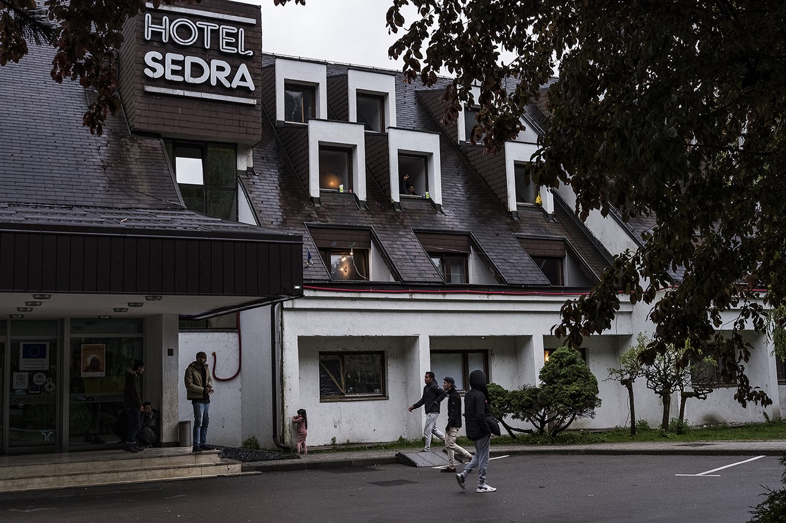

Kimia, 7 years old, is dancing to a YouTube video tutorial\. She is preparing for the dance\-off that will take place in the afternoon\. Mohammed and Arya, 8 and 9 years old, are playing hide and seek\. When Arya finds Mohammed, he starts running around the room screaming _‘you don’t catch me police’\._

Baha, 37 years old, used to be a professional boxer in Iran\. ‘ _I can’t be there, there is no freedom, and now I am here, so close to freedom, but still a prisoner’_ \. Jamila comes from Iraq and she decided to leave to escape an arranged marriage with a violent man\. _‘I have no home, I have no roots\. We are dead until we pass the border\.’_

> Underneath the abandonment of a hotel that used to be set up to generate comfort, the constant displacement of the people that inhabit it is completely dystopian and perfectly reflects the paradox of Europe\. 

The three camps have been opened by IOM as a form of emergency solution\. However, because of the constant pushbacks, people remain stuck here for entire months, sometimes even years\. With the warm seasons, arrivals have dramatically increased\. Two months ago, during one of our visits to Bira, there were dozens of people squatting in the yard outside the factory\.

They immediately surrounded us and asked for help\.

> **_‘They don’t let us in, they don’t give us food\. We are living out of rain water’\._** 

Today, the place looks as if there are fewer people on the move in town\. But this apparent re\-establishing of the urban _status quo_ is nothing but fake\. Following a number of public complaints and some violent incidents, the municipality decided to take drastic measures\. The police in the town started to round up migrants staying outside the camps and taking them to a new ‘camp’ close to the border with Croatia, in the area of Vučjak\. Here, people are supposed to live on the landfill in the middle of the woods, completely isolated from urban centres\.

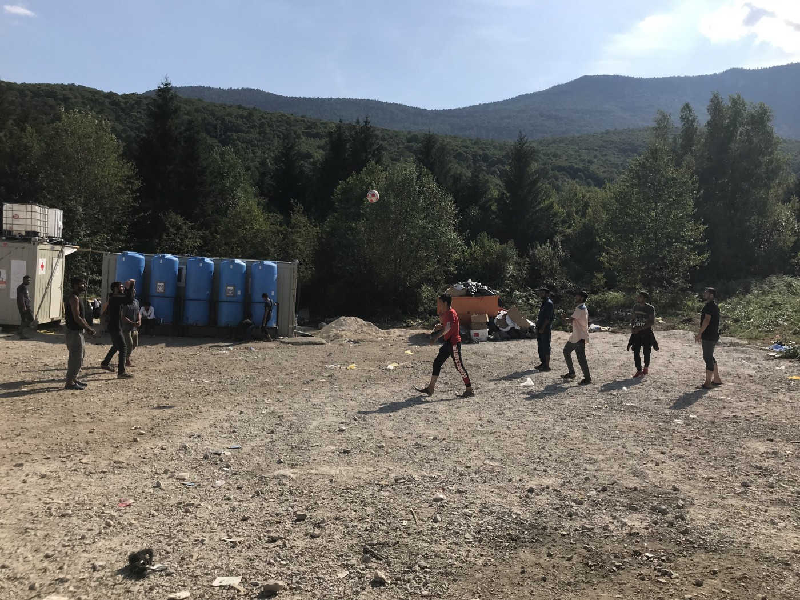

Vučjak

Those who have been deported there started to call it the ‘jungle camp’ and one can easily see why\. The place used to be a garbage dump\. Bihać municipality wanted to turn it into a kennel, but the project did not pass muster because of the unhealthy and polluted condition of the area\. But this didn’t prevent the authorities from transferring these people to the same toxic piece of land\.

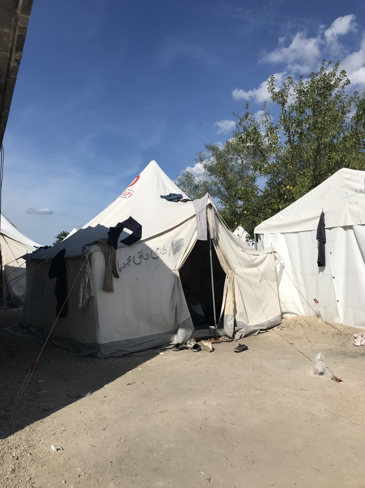

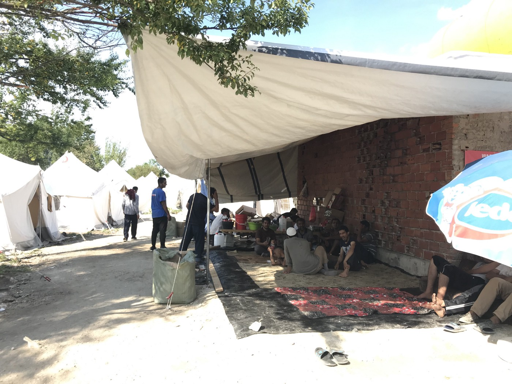

Vučjak

The mechanism is easy: the Bihać police \(quite literally\) catches them in the city and transfers them here, a place designed to host rubbish, not animals, not humans\. The camp is situated close to the the mountains, 15 minutes by car from the town\. It is managed by the city government and run by the police\. Meals and facilities are provided by the local Red Cross and there is no EU funding involved\. This is a sort of a ‘protest camp’ against the federal government who, according to the locals, keeps undermining the situation\. But this protest is once again affecting the life of men, the real “wretched of the earth”, hidden in the polluted forest\. Voiceless, nameless, removed from other people’s sight\.

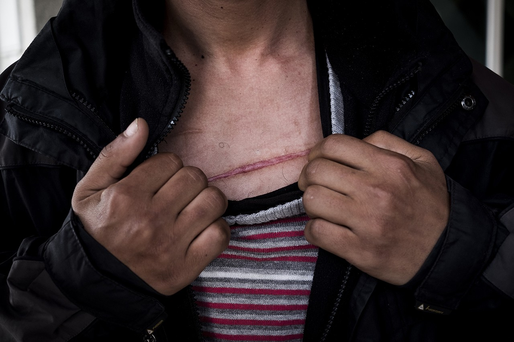

Returned people with wounds as a consequence of the police pushbacks

What we witnessed during our trips in the Una Sana canton is a situation that keeps changing and getting worse\. The result of years of buck passing, bad management and silencing of the refugee crisis, which have, once again, turned this land into a land of despair, violence, and disappointment with the international community\.

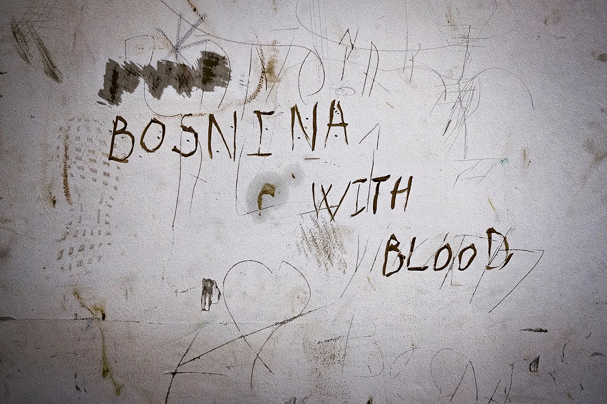

**Written by: Gabriele Proglio and Benedetta Zocchi** 
**Photos: Emanuela Zampa**

July, 2019

_Converted [Medium Post](https://medium.com/are-you-syrious/ays-special-outsiders-perspective-the-bosnian-frontier-58a21c38c799) by [ZMediumToMarkdown](https://github.com/ZhgChgLi/ZMediumToMarkdown)._
